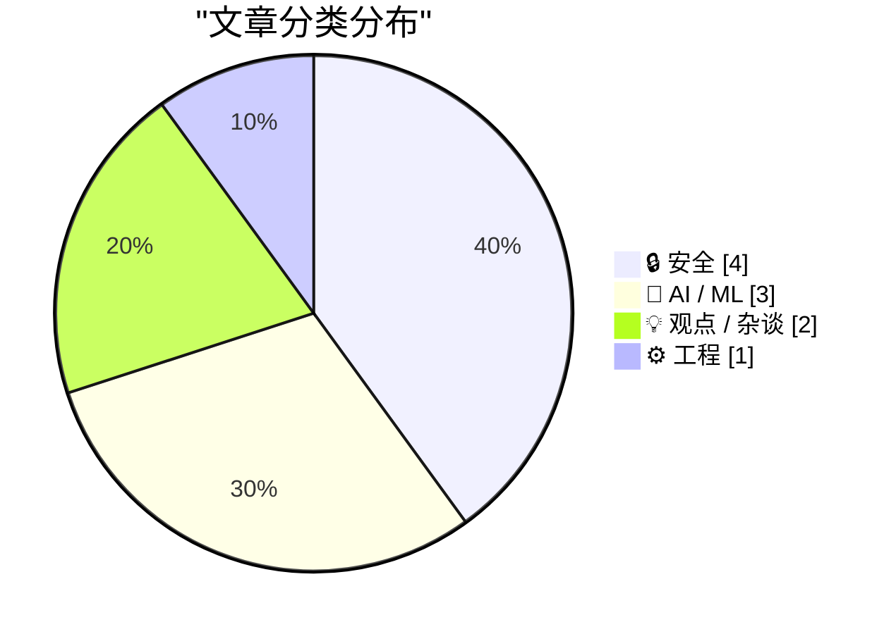
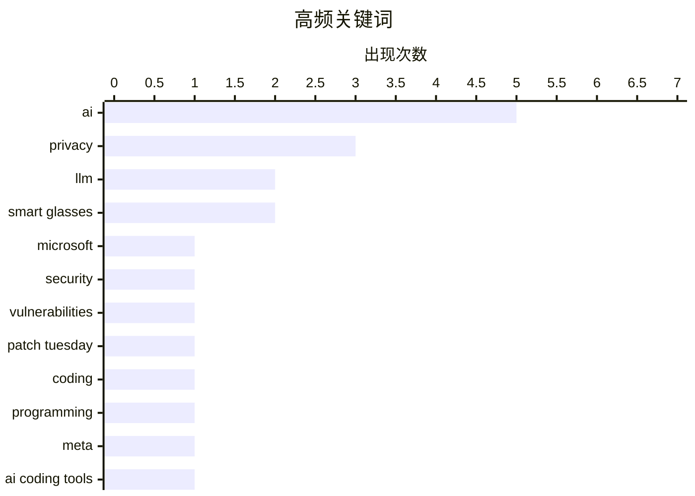

今日安全领域聚焦微软例行补丁更新与Anthropic起诉美国政府事件，反映出AI监管博弈升级；与此同时，AI编码工具引发的宕机事故、LLM幻觉及训练数据隐私争议集中爆发，揭示出当前大模型在可靠性与伦理层面面临严峻挑战；Meta AI眼镜被曝非洲承包商可窥视用户数据，则将科技巨头的隐私安全问题再次推上风口浪尖。

<!--more-->

---

## 🏆 今日必读

🥇 **Microsoft Patch Tuesday, March 2026 Edition**

[Microsoft Patch Tuesday, March 2026 Edition](https://krebsonsecurity.com/2026/03/microsoft-patch-tuesday-march-2026-edition/) — krebsonsecurity.com · 13 小时前 · 🔒 安全

> Microsoft Patch Tuesday, March 2026 Edition

🏷️ Microsoft, security, vulnerabilities, Patch Tuesday

🥈 **AI should help us produce better code**

[AI should help us produce better code](https://simonwillison.net/guides/agentic-engineering-patterns/better-code/#atom-everything) — simonwillison.net · 15 小时前 · ⚙️ 工程

> AI should help us produce better code

🏷️ AI, coding, programming, LLM

🥉 **Low-Wage Contractors in Kenya See What Users See While Using Meta's AI Smart Glasses**

[Low-Wage Contractors in Kenya See What Users See While Using Meta's AI Smart Glasses](https://www.svd.se/a/K8nrV4/metas-ai-smart-glasses-and-data-privacy-concerns-workers-say-we-see-everything) — daringfireball.net · 1 天前 · 🔒 安全

> Low-Wage Contractors in Kenya See What Users See While Using Meta's AI Smart Glasses

🏷️ privacy, Meta, smart glasses, AI

---

## 📊 数据概览

| 扫描源 | 抓取文章 | 时间范围 | 精选 |
|:---:|:---:|:---:|:---:|
| 88/92 | 2486 篇 → 36 篇 | 48h | **10 篇** |

### 分类分布

### 高频关键词

### 🏷️ 话题标签

**ai**(5) · **privacy**(3) · **llm**(2) · smart glasses(2) · microsoft(1) · security(1) · vulnerabilities(1) · patch tuesday(1) · coding(1) · programming(1) · meta(1) · ai coding tools(1) · outages(1) · reliability(1) · anthropic(1) · lawsuit(1) · us government(1) · ai regulation(1) · data breach(1) · hibp(1)

---

## 🔒 安全

### 1. Microsoft Patch Tuesday, March 2026 Edition

[Microsoft Patch Tuesday, March 2026 Edition](https://krebsonsecurity.com/2026/03/microsoft-patch-tuesday-march-2026-edition/) — **krebsonsecurity.com** · 13 小时前 · ⭐ 27/30

> Microsoft Patch Tuesday, March 2026 Edition

🏷️ Microsoft, security, vulnerabilities, Patch Tuesday

---

### 2. Low-Wage Contractors in Kenya See What Users See While Using Meta's AI Smart Glasses

[Low-Wage Contractors in Kenya See What Users See While Using Meta's AI Smart Glasses](https://www.svd.se/a/K8nrV4/metas-ai-smart-glasses-and-data-privacy-concerns-workers-say-we-see-everything) — **daringfireball.net** · 1 天前 · ⭐ 25/30

> Low-Wage Contractors in Kenya See What Users See While Using Meta's AI Smart Glasses

🏷️ privacy, Meta, smart glasses, AI

---

### 3. Anthropic sues US government, with good reason

[Anthropic sues US government, with good reason](https://garymarcus.substack.com/p/anthropic-sues-us-government-with) — **garymarcus.substack.com** · 1 天前 · ⭐ 25/30

> Anthropic sues US government, with good reason

🏷️ Anthropic, lawsuit, US government, AI regulation

---

### 4. Weekly Update 494

[Weekly Update 494](https://www.troyhunt.com/weekly-update-494/) — **troyhunt.com** · 1 天前 · ⭐ 25/30

> Weekly Update 494

🏷️ data breach, HIBP, cybersecurity

---

## 🤖 AI / ML

### 5. "A spate of outages, including incidents tied to the use of AI coding tools", right on schedule

["A spate of outages, including incidents tied to the use of AI coding tools", right on schedule](https://garymarcus.substack.com/p/a-spate-of-outages-including-incidents) — **garymarcus.substack.com** · 22 小时前 · ⭐ 25/30

> "A spate of outages, including incidents tied to the use of AI coding tools", right on schedule

🏷️ AI coding tools, outages, reliability

---

### 6. Where did you think the training data was coming from?

[Where did you think the training data was coming from?](https://idiallo.com/blog/where-did-the-training-data-come-from-meta-ai-rayban-glasses?src=feed) — **idiallo.com** · 1 小时前 · ⭐ 23/30

> Where did you think the training data was coming from?

🏷️ AI, privacy, training data, smart glasses

---

### 7. I'm Not Lying, I'm Hallucinating

[I'm Not Lying, I'm Hallucinating](https://idiallo.com/byte-size/im-not-lying-im-hallucinating?src=feed) — **idiallo.com** · 17 小时前 · ⭐ 23/30

> I'm Not Lying, I'm Hallucinating

🏷️ hallucination, vibe coding, AI, terminology

---

## 💡 观点 / 杂谈

### 8. LLMs are bad at vibing specifications

[LLMs are bad at vibing specifications](https://buttondown.com/hillelwayne/archive/llms-are-bad-at-vibing-specifications/) — **buttondown.com/hillelwayne** · 20 小时前 · ⭐ 24/30

> LLMs are bad at vibing specifications

🏷️ LLM, specifications, testing, AI

---

### 9. Pluralistic: Ad-tech is fascist tech (10 Mar 2026)

[Pluralistic: Ad-tech is fascist tech (10 Mar 2026)](https://pluralistic.net/2026/03/10/ice-tech/) — **pluralistic.net** · 22 小时前 · ⭐ 23/30

> Pluralistic: Ad-tech is fascist tech (10 Mar 2026)

🏷️ ad-tech, surveillance, privacy, fascism

---

## ⚙️ 工程

### 10. AI should help us produce better code

[AI should help us produce better code](https://simonwillison.net/guides/agentic-engineering-patterns/better-code/#atom-everything) — **simonwillison.net** · 15 小时前 · ⭐ 25/30

> AI should help us produce better code

🏷️ AI, coding, programming, LLM

---

*生成于 2026-03-11 13:56 | 扫描 88 源 → 获取 2486 篇 → 精选 10 篇*
*基于 [Hacker News Popularity Contest 2025](https://refactoringenglish.com/tools/hn-popularity/) RSS 源列表，由 [Andrej Karpathy](https://x.com/karpathy) 推荐*
*由「懂点儿AI」制作，欢迎关注同名微信公众号获取更多 AI 实用技巧 💡*
