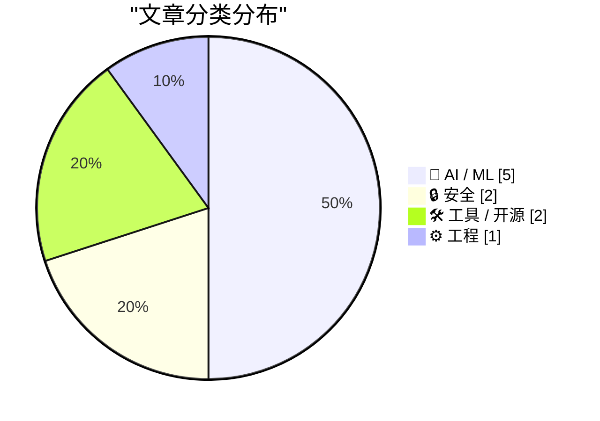
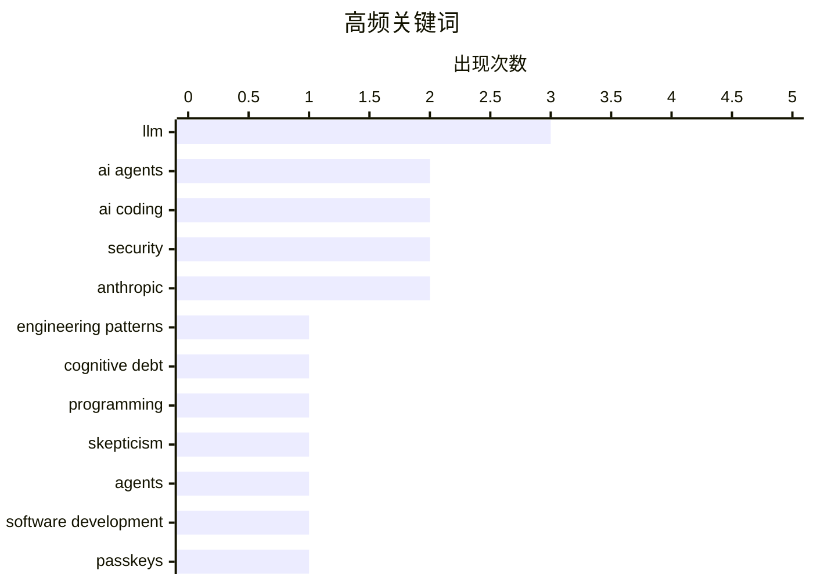

# 📰 AI 博客每日精选 — 2026-03-01

> 来自 Karpathy 推荐的 92 个顶级技术博客，AI 精选 Top 10

## 📝 今日看点

今日AI编码代理成为焦点，圈内出现深度实践与质疑的碰撞；安全领域再敲警钟，passkeys加密数据的隐患引发广泛讨论；主流AI厂商加大开源社区支持力度，Claude Max向大型开源项目维护者免费开放。

---

## 🏆 今日必读

🥇 **Interactive explanations**

[Interactive explanations](https://simonwillison.net/guides/agentic-engineering-patterns/interactive-explanations/#atom-everything) — simonwillison.net · 16 小时前 · 🤖 AI / ML

> Interactive explanations

🏷️ AI agents, engineering patterns, cognitive debt, LLM

🥈 **An AI agent coding skeptic tries AI agent coding, in excessive detail**

[An AI agent coding skeptic tries AI agent coding, in excessive detail](https://simonwillison.net/2026/Feb/27/ai-agent-coding-in-excessive-detail/#atom-everything) — simonwillison.net · 1 天前 · 🤖 AI / ML

> An AI agent coding skeptic tries AI agent coding, in excessive detail

🏷️ AI coding, AI agents, programming, skepticism

🥉 **An AI agent coding skeptic tries AI agent coding, in excessive detail**

[An AI agent coding skeptic tries AI agent coding, in excessive detail](https://minimaxir.com/2026/02/ai-agent-coding/) — minimaxir.com · 1 天前 · 🤖 AI / ML

> An AI agent coding skeptic tries AI agent coding, in excessive detail

🏷️ AI coding, agents, software development, LLM

---

## 📊 数据概览

| 扫描源 | 抓取文章 | 时间范围 | 精选 |
|:---:|:---:|:---:|:---:|
| 80/92 | 2273 篇 → 35 篇 | 48h | **10 篇** |

### 分类分布



### 高频关键词



<details>
<summary>📈 纯文本关键词图（终端友好）</summary>

```
llm                  │ ████████████████████ 3
ai agents            │ █████████████░░░░░░░ 2
ai coding            │ █████████████░░░░░░░ 2
security             │ █████████████░░░░░░░ 2
anthropic            │ █████████████░░░░░░░ 2
engineering patterns │ ███████░░░░░░░░░░░░░ 1
cognitive debt       │ ███████░░░░░░░░░░░░░ 1
programming          │ ███████░░░░░░░░░░░░░ 1
skepticism           │ ███████░░░░░░░░░░░░░ 1
agents               │ ███████░░░░░░░░░░░░░ 1
```

</details>

### 🏷️ 话题标签

**llm**(3) · **ai agents**(2) · **ai coding**(2) · security(2) · anthropic(2) · engineering patterns(1) · cognitive debt(1) · programming(1) · skepticism(1) · agents(1) · software development(1) · passkeys(1) · encryption(1) · data loss(1) · claude max(1) · open source(1) · free(1) · kimwolf(1) · botnet(1) · dort(1)

---

## 🤖 AI / ML

### 1. Interactive explanations

[Interactive explanations](https://simonwillison.net/guides/agentic-engineering-patterns/interactive-explanations/#atom-everything) — **simonwillison.net** · 16 小时前 · ⭐ 25/30

> Interactive explanations

🏷️ AI agents, engineering patterns, cognitive debt, LLM

---

### 2. An AI agent coding skeptic tries AI agent coding, in excessive detail

[An AI agent coding skeptic tries AI agent coding, in excessive detail](https://simonwillison.net/2026/Feb/27/ai-agent-coding-in-excessive-detail/#atom-everything) — **simonwillison.net** · 1 天前 · ⭐ 25/30

> An AI agent coding skeptic tries AI agent coding, in excessive detail

🏷️ AI coding, AI agents, programming, skepticism

---

### 3. An AI agent coding skeptic tries AI agent coding, in excessive detail

[An AI agent coding skeptic tries AI agent coding, in excessive detail](https://minimaxir.com/2026/02/ai-agent-coding/) — **minimaxir.com** · 1 天前 · ⭐ 25/30

> An AI agent coding skeptic tries AI agent coding, in excessive detail

🏷️ AI coding, agents, software development, LLM

---

### 4. A Cookie for Dario? — Anthropic and selling death

[A Cookie for Dario? — Anthropic and selling death](https://anildash.com/2026/02/27/a-cookie-for-dario/) — **anildash.com** · 1 天前 · ⭐ 22/30

> A Cookie for Dario? — Anthropic and selling death

🏷️ Anthropic, AI ethics, LLM, government

---

### 5. Quoting claude.com/import-memory

[Quoting claude.com/import-memory](https://simonwillison.net/2026/Mar/1/claude-import-memory/#atom-everything) — **simonwillison.net** · 4 小时前 · ⭐ 21/30

> Quoting claude.com/import-memory

🏷️ Claude, data export, AI assistant, privacy

---

## 🔒 安全

### 6. Please, please, please stop using passkeys for encrypting user data

[Please, please, please stop using passkeys for encrypting user data](https://simonwillison.net/2026/Feb/27/passkeys/#atom-everything) — **simonwillison.net** · 1 天前 · ⭐ 23/30

> Please, please, please stop using passkeys for encrypting user data

🏷️ passkeys, encryption, data loss, security

---

### 7. Who is the Kimwolf Botmaster “Dort”?

[Who is the Kimwolf Botmaster “Dort”?](https://krebsonsecurity.com/2026/02/who-is-the-kimwolf-botmaster-dort/) — **krebsonsecurity.com** · 1 天前 · ⭐ 22/30

> Who is the Kimwolf Botmaster “Dort”?

🏷️ Kimwolf, botnet, security, Dort

---

## 🛠 工具 / 开源

### 8. Free Claude Max for (large project) open source maintainers

[Free Claude Max for (large project) open source maintainers](https://simonwillison.net/2026/Feb/27/claude-max-oss-six-months/#atom-everything) — **simonwillison.net** · 1 天前 · ⭐ 22/30

> Free Claude Max for (large project) open source maintainers

🏷️ Claude Max, open source, Anthropic, free

---

### 9. Unicode Explorer using binary search over fetch() HTTP range requests

[Unicode Explorer using binary search over fetch() HTTP range requests](https://simonwillison.net/2026/Feb/27/unicode-explorer/#atom-everything) — **simonwillison.net** · 1 天前 · ⭐ 20/30

> Unicode Explorer using binary search over fetch() HTTP range requests

🏷️ Unicode, HTTP range, binary search, web tool

---

## ⚙️ 工程

### 10. Redis patterns for coding

[Redis patterns for coding](http://antirez.com/news/161) — **antirez.com** · 5 小时前 · ⭐ 21/30

> Redis patterns for coding

🏷️ Redis, patterns, documentation

---

*生成于 2026-03-01 15:30 | 扫描 80 源 → 获取 2273 篇 → 精选 10 篇*
*基于 [Hacker News Popularity Contest 2025](https://refactoringenglish.com/tools/hn-popularity/) RSS 源列表，由 [Andrej Karpathy](https://x.com/karpathy) 推荐*
*由「懂点儿AI」制作，欢迎关注同名微信公众号获取更多 AI 实用技巧 💡*
