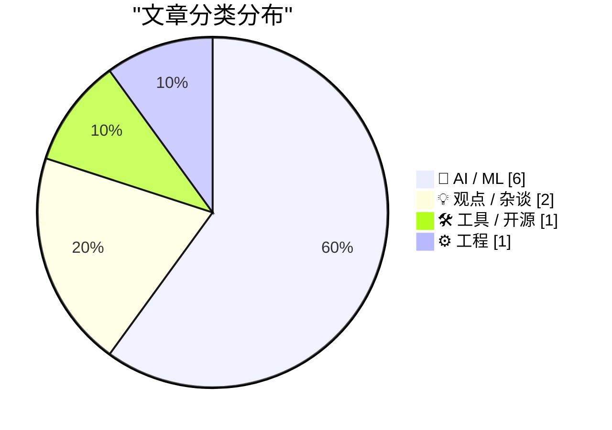
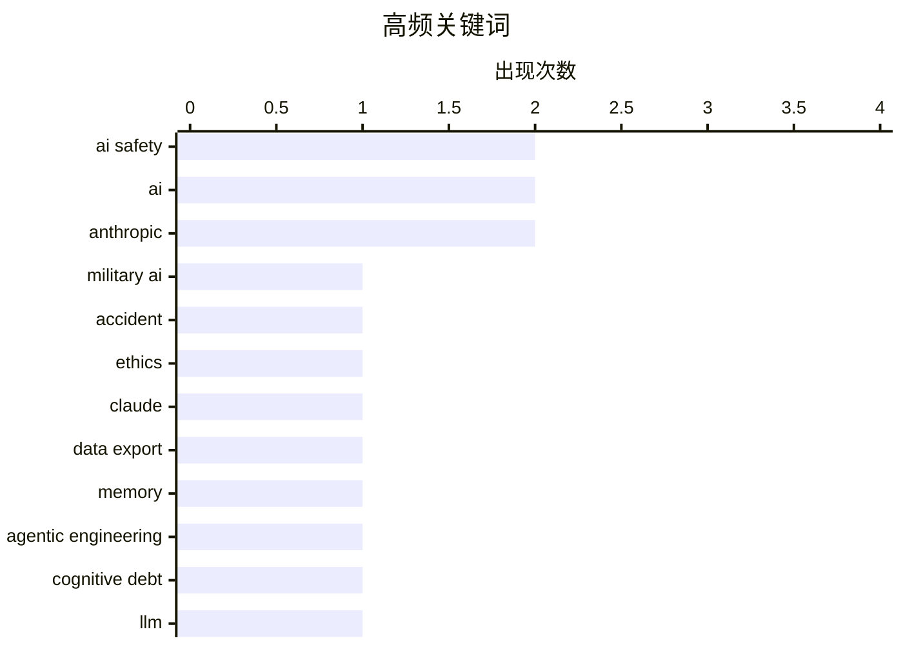

# 📰 AI 博客每日精选 — 2026-03-02

> 来自 Karpathy 推荐的 92 个顶级技术博客，AI 精选 Top 10

## 📝 今日看点

今日技术圈焦点集中在AI伦理与军用的激烈博弈：Anthropic因拒绝军方"所有合法用途"要求而与特朗普政府产生冲突，OpenAI则获得政府青睐；同时，端侧AI智能体面临KV cache和RAM等数学限制，难以匹配云端能力；此外，AI代码产生的"认知债务"问题引发关注，交互式解释工具和Redis等开发文档正成为优化AI开发效率的新方向。

---

## 🏆 今日必读

🥇 **AI是否已经在意外中夺走人类生命？**

[Is AI already killing people by accident?](https://garymarcus.substack.com/p/is-ai-already-killing-people-by-accident) — garymarcus.substack.com · 1 天前 · 🤖 AI / ML

> 本文探讨AI是否可能已经导致人类意外死亡。Tylor Austin Harper向作者发送了一个帖子，讨论伊朗一起疑似AI误判导致的导弹 targeting 失误，该失误造成近150名 school children 死亡。作者认为这是一个值得深思的问题，尽管目前没有确凿证据表明AI直接参与了此次事件，但随着AI系统在军事领域的应用越来越广泛，这类风险正在增加。

💡 **为什么值得读**: 探讨了一个令人不安但重要的前沿问题：AI系统在实际应用中可能造成的意外伤害，尤其在军事领域。

🏷️ AI safety, military AI, accident, ethics

🥈 **引用 claude.com/import-memory**

[Quoting claude.com/import-memory](https://simonwillison.net/2026/Mar/1/claude-import-memory/#atom-everything) — simonwillison.net · 1 天前 · 🤖 AI / ML

> 本文展示了一个用于从Claude导出记忆的提示词模板。用户可以使用这个提示词让AI列出所有保存的关于用户的记忆，包括：给出的指令、个人信息（姓名、地点、工作、家庭、兴趣）、项目与目标、使用的工具和框架、对行为的偏好和修正等。这个功能旨在帮助用户在更换服务时迁移对话上下文。

💡 **为什么值得读**: 提供了一个实用的AI记忆导出方案，对于需要在不同AI服务间迁移数据的用户非常有参考价值。

🏷️ Claude, data export, memory

🥉 **交互式解释**

[Interactive explanations](https://simonwillison.net/guides/agentic-engineering-patterns/interactive-explanations/#atom-everything) — simonwillison.net · 1 天前 · 🤖 AI / ML

> 本文讨论了AI代码产生的「认知债务」（cognitive debt）问题——当开发者不理解AI生成的代码时，就会积累这种债务。认知债务会影响功能规划、降低开发效率。解决方案是构建交互式解释（interactive explanations），通过可视化、实时演示等方式帮助开发者理解代码的工作原理。文章以LICEcap录制的GIF为例进行说明。

💡 **为什么值得读**: 提出了一个对于AI辅助编程时代非常有价值的工程实践方法，帮助开发者应对AI生成代码的理解难题。

🏷️ agentic engineering, cognitive debt, AI

---

## 📊 数据概览

| 扫描源 | 抓取文章 | 时间范围 | 精选 |
|:---:|:---:|:---:|:---:|
| 88/92 | 2500 篇 → 38 篇 | 48h | **10 篇** |

### 分类分布



### 高频关键词



<details>
<summary>📈 纯文本关键词图（终端友好）</summary>

```
ai safety           │ ████████████████████ 2
ai                  │ ████████████████████ 2
anthropic           │ ████████████████████ 2
military ai         │ ██████████░░░░░░░░░░ 1
accident            │ ██████████░░░░░░░░░░ 1
ethics              │ ██████████░░░░░░░░░░ 1
claude              │ ██████████░░░░░░░░░░ 1
data export         │ ██████████░░░░░░░░░░ 1
memory              │ ██████████░░░░░░░░░░ 1
agentic engineering │ ██████████░░░░░░░░░░ 1
```

</details>

### 🏷️ 话题标签

**ai safety**(2) · **ai**(2) · **anthropic**(2) · military ai(1) · accident(1) · ethics(1) · claude(1) · data export(1) · memory(1) · agentic engineering(1) · cognitive debt(1) · llm(1) · expert beginners(1) · ai era(1) · on-device ai(1) · inference(1) · hardware limitations(1) · ai agents(1) · ai alignment(1) · webassembly(1)

---

## 🤖 AI / ML

### 1. AI是否已经在意外中夺走人类生命？

[Is AI already killing people by accident?](https://garymarcus.substack.com/p/is-ai-already-killing-people-by-accident) — **garymarcus.substack.com** · 1 天前 · ⭐ 26/30

> 本文探讨AI是否可能已经导致人类意外死亡。Tylor Austin Harper向作者发送了一个帖子，讨论伊朗一起疑似AI误判导致的导弹 targeting 失误，该失误造成近150名 school children 死亡。作者认为这是一个值得深思的问题，尽管目前没有确凿证据表明AI直接参与了此次事件，但随着AI系统在军事领域的应用越来越广泛，这类风险正在增加。

🏷️ AI safety, military AI, accident, ethics

---

### 2. 引用 claude.com/import-memory

[Quoting claude.com/import-memory](https://simonwillison.net/2026/Mar/1/claude-import-memory/#atom-everything) — **simonwillison.net** · 1 天前 · ⭐ 24/30

> 本文展示了一个用于从Claude导出记忆的提示词模板。用户可以使用这个提示词让AI列出所有保存的关于用户的记忆，包括：给出的指令、个人信息（姓名、地点、工作、家庭、兴趣）、项目与目标、使用的工具和框架、对行为的偏好和修正等。这个功能旨在帮助用户在更换服务时迁移对话上下文。

🏷️ Claude, data export, memory

---

### 3. 交互式解释

[Interactive explanations](https://simonwillison.net/guides/agentic-engineering-patterns/interactive-explanations/#atom-everything) — **simonwillison.net** · 1 天前 · ⭐ 24/30

> 本文讨论了AI代码产生的「认知债务」（cognitive debt）问题——当开发者不理解AI生成的代码时，就会积累这种债务。认知债务会影响功能规划、降低开发效率。解决方案是构建交互式解释（interactive explanations），通过可视化、实时演示等方式帮助开发者理解代码的工作原理。文章以LICEcap录制的GIF为例进行说明。

🏷️ agentic engineering, cognitive debt, AI

---

### 4. 为什么端侧智能体AI无法跟上发展

[Why on-device agentic AI can't keep up](https://martinalderson.com/posts/why-on-device-agentic-ai-cant-keep-up/?utm_source=rss) — **martinalderson.com** · 1 天前 · ⭐ 24/30

> 本文分析了端侧AI智能体的技术瓶颈。从数学上看，KV cache扩展、RAM预算和推理速度等限制使得设备端运行的AI智能体难以与云端服务竞争。作者指出，虽然端侧AI智能体在理论上听起来很美好，但实际的技术参数决定了其能力上限。

🏷️ on-device AI, inference, hardware limitations, AI agents

---

### 5. Anthropic与对齐

['Anthropic and Alignment'](https://stratechery.com/2026/anthropic-and-alignment/) — **daringfireball.net** · 4 小时前 · ⭐ 23/30

> 本文讨论了Anthropic公司与美国军方之间的权力博弈。作者引用Ben Thompson的分析认为，如果AI能力达到核武器的水平，Anthropic正在建立的权力基础可能威胁美国军队的自由行动能力。Anthropic坚持对军事使用设置红线（大规模监控和自主武器），但这与现实政治逻辑存在根本性的错位——国际法本质上是实力的体现。

🏷️ Anthropic, AI alignment, AI safety

---

### 6. WSJ：特朗普政府冷落Anthropic，在Guardrails争议中拥抱OpenAI

[WSJ: 'Trump Administration Shuns Anthropic, Embraces OpenAI in Clash Over Guardrails'](https://www.wsj.com/tech/ai/trump-will-end-government-use-of-anthropics-ai-models-ff3550d9) — **daringfireball.net** · 4 小时前 · ⭐ 22/30

> 本文报道了特朗普政府与Anthropic之间的冲突。五角大楼要求Anthropic允许军方在所有合法用途中使用其模型，Anthropic CEO Dario Amodei以道德考量拒绝，导致政府转而与OpenAI合作。Anthropic的红线是禁止大规模监控和自主武器，而OpenAI接受了军方的使用条款。OpenAI CEO Sam Altman表示公司有技术保障措施确保模型行为合规。

🏷️ AI policy, Anthropic, OpenAI, government

---

## 💡 观点 / 杂谈

### 7. 「专家初学者」和「独狼」将在LLM时代早期占据主导地位

[Expert Beginners and Lone Wolves will dominate this early LLM era](https://www.jeffgeerling.com/blog/2026/expert-beginners-and-lone-wolves-will-dominate-llm-era/) — **jeffgeerling.com** · 1 天前 · ⭐ 24/30

> 本文回顾了作者2009年将博客从静态网站生成器迁移到Drupal的经历，提到迁移过程中所有博客评论都永久丢失了。作者借此反思在LLM时代，早期采用者往往是那些有一定技术背景但不是专家的人（ Expert Beginners），以及喜欢独立工作的开发者（ Lone Wolves），他们可能会在LLM工具的采用上占据优势。

🏷️ LLM, Expert Beginners, AI era

---

### 8. 没有人想读你的AI垃圾内容

[Pluralistic: No one wants to read your AI slop (02 Mar 2026)](https://pluralistic.net/2026/03/02/nonconsensual-slopping/) — **pluralistic.net** · 13 小时前 · ⭐ 22/30

> 本文批评了人们将AI对话内容公开发表的现象。作者认为，就像向他人讲述自己的梦一样无趣，向公众分享自己与AI的对话也是令人厌烦的。作者呼吁如果一定要使用AI生成内容，至少应该私下进行，不要强迫他人阅读这些「AI slop」。文章还讨论了AOL电子邮件税、电子书读者权利法案等科技话题。

🏷️ AI, content quality, publishing, slop

---

## 🛠 工具 / 开源

### 9. 使用WebAssembly和Gifsicle的GIF优化工具

[GIF optimization tool using WebAssembly and Gifsicle](https://simonwillison.net/guides/agentic-engineering-patterns/gif-optimization/#atom-everything) — **simonwillison.net** · 6 小时前 · ⭐ 22/30

> 本文介绍了作者如何使用Gifsicle（一个用C编写的命令行GIF优化工具）构建Web界面的GIF优化工具。Gifsicle通过识别帧间未变化的区域并只存储差异来压缩GIF，还可以减少颜色 palette 或应用有损压缩来进一步减小文件大小。作者通过WebAssembly技术将Gifsicle编译为可在浏览器中运行的版本，并添加了可视化预览和对比功能。

🏷️ WebAssembly, GIF optimization, Gifsicle

---

## ⚙️ 工程

### 10. Redis编码模式

[Redis patterns for coding](http://antirez.com/news/161) — **antirez.com** · 1 天前 · ⭐ 22/30

> 本文是Antirez（Redis作者）发布的Redis文档网站推荐。该网站为LLM和编码智能体提供全面的Redis命令和数据类型文档、常用模式、配置建议以及可使用Redis命令实现的算法。网站还贴心地提供了人类可读的文档。

🏷️ Redis, patterns, documentation, data structures

---

*生成于 2026-03-02 22:45 | 扫描 88 源 → 获取 2500 篇 → 精选 10 篇*
*基于 [Hacker News Popularity Contest 2025](https://refactoringenglish.com/tools/hn-popularity/) RSS 源列表，由 [Andrej Karpathy](https://x.com/karpathy) 推荐*
*由「懂点儿AI」制作，欢迎关注同名微信公众号获取更多 AI 实用技巧 💡*
