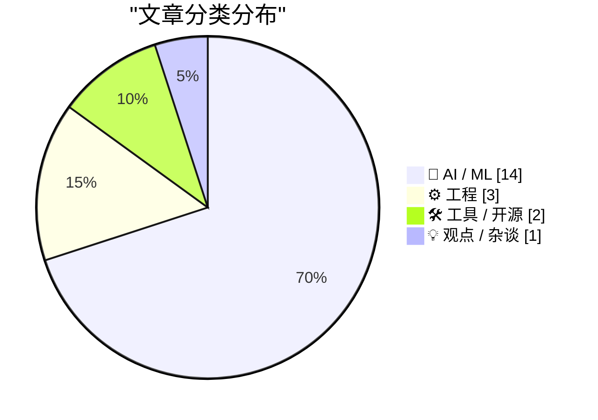
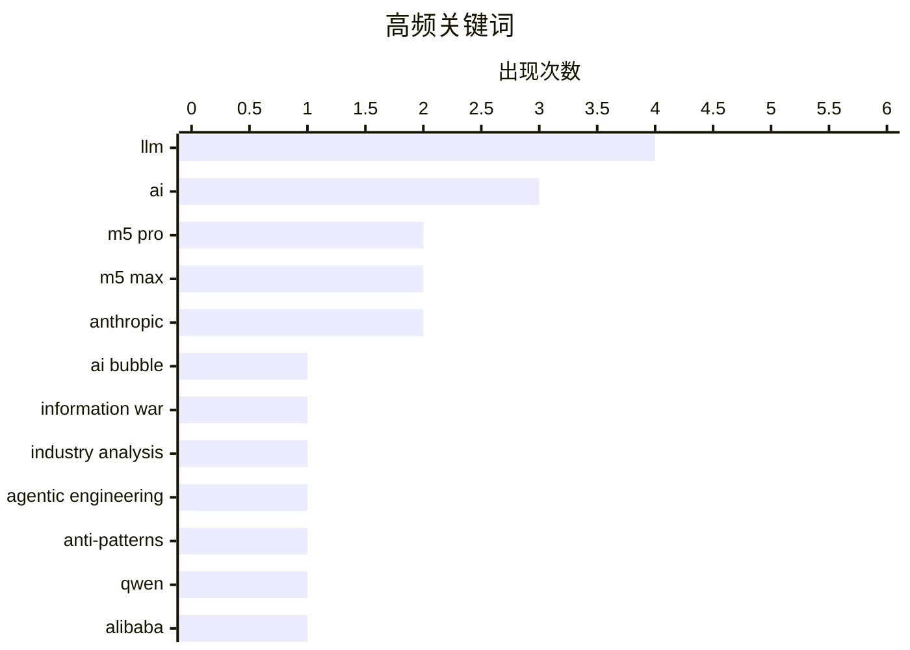

今日AI圈呈现"热炒"与"冷思考"并行的格局：一方面，AI泡沫、LLM谄媚性问题与AGI临近论的浮夸倾向引发业界反思，信息战视角下行业Reality与宣传的鸿沟正被揭示；另一方面，AI代理工程走向务实——从WorkOS直接写入代码的智能集成，到Gemini 3.1 Flash-Lite以1/8 Pro价格强化低成本推理，工具化与商业化进程加速，而Apple M5芯片的发布则暗示端侧AI算力竞争持续升温。

<!--more-->

## 🏆 今日必读

🥇 **AI泡沫是一场信息战**

[The AI Bubble Is An Information War](https://www.wheresyoured.at/the-ai-bubble-is-an-information-war/) — wheresyoured.at · 1 天前 · 🤖 AI / ML

> 文章探讨当前AI行业的泡沫化现象，将其定义为一场信息战。作者认为AI领域存在过度炒作、资源错配以及误导公众认知的问题，导致行业Reality与宣传之间存在巨大鸿沟。信息战的概念被用来解释为何AI领域的错误信息和夸大宣传如此普遍，以及谁从中获益。

💡 **为什么值得读**: 如果你想了解AI行业背后的真实运作逻辑和潜在风险，这篇文章提供了独特的批判性视角。

🏷️ AI bubble, information war, industry analysis

🥈 **反模式：需要避免的做法**

[Anti-patterns: things to avoid](https://simonwillison.net/guides/agentic-engineering-patterns/anti-patterns/#atom-everything) — simonwillison.net · 20 小时前 · ⚙️ 工程

> 文章总结了agentic工程领域中的几种常见反模式。首先，未经自己审核的代码不应提交给协作者，这相当于将工作推卸给他人。其次，不应该把所有任务都交给AI代理处理而忽视人工监督。第三，过度依赖单一AI工具而缺乏备选方案也是风险。文章强调人类在AI代理工作流程中的责任和审核角色不可缺失。

💡 **为什么值得读**: 对于正在构建AI代理应用的开发者，这些反模式总结能帮助避免常见的工程陷阱。

🏷️ agentic engineering, anti-patterns, AI

🥉 **Qwen团队发生了什么**

[Something is afoot in the land of Qwen](https://simonwillison.net/2026/Mar/4/qwen/#atom-everything) — simonwillison.net · 22 小时前 · 🤖 AI / ML

> 阿里巴巴Qwen团队的核心研究人员Junyang Lin宣布离职，他是Qwen开源权重模型发布的关键人物。作者推测离职原因可能与近期公司内部重组有关——一位从Google Gemini团队招聘的新研究人员接管了Qwen项目。Qwen 3.5是一个备受关注的开源模型系列，团队的人事变动引发了对该项目未来走向的担忧。

💡 **为什么值得读**: 关注开源大模型发展的读者可以借此了解Qwen团队的最新动态和潜在风险。

🏷️ Qwen, LLM, Alibaba, open weight

---

## 📊 数据概览

| 扫描源 | 抓取文章 | 时间范围 | 精选 |
|:---:|:---:|:---:|:---:|
| 88/92 | 2496 篇 → 59 篇 | 72h | **20 篇** |

### 分类分布



### 高频关键词



<details>
<summary>📈 纯文本关键词图（终端友好）</summary>

```
llm                 │ ████████████████████ 4
ai                  │ ███████████████░░░░░ 3
m5 pro              │ ██████████░░░░░░░░░░ 2
m5 max              │ ██████████░░░░░░░░░░ 2
anthropic           │ ██████████░░░░░░░░░░ 2
ai bubble           │ █████░░░░░░░░░░░░░░░ 1
information war     │ █████░░░░░░░░░░░░░░░ 1
industry analysis   │ █████░░░░░░░░░░░░░░░ 1
agentic engineering │ █████░░░░░░░░░░░░░░░ 1
anti-patterns       │ █████░░░░░░░░░░░░░░░ 1
```

</details>

### 🏷️ 话题标签

**llm**(4) · **ai**(3) · **m5 pro**(2) · m5 max(2) · anthropic(2) · ai bubble(1) · information war(1) · industry analysis(1) · agentic engineering(1) · anti-patterns(1) · qwen(1) · alibaba(1) · open weight(1) · ai agent(1) · authentication(1) · claude(1) · code generation(1) · epistemics(1) · ai uncertainty(1) · agi(1)

---

## 🤖 AI / ML

### 1. AI泡沫是一场信息战

[The AI Bubble Is An Information War](https://www.wheresyoured.at/the-ai-bubble-is-an-information-war/) — **wheresyoured.at** · 1 天前 · ⭐ 25/30

> 文章探讨当前AI行业的泡沫化现象，将其定义为一场信息战。作者认为AI领域存在过度炒作、资源错配以及误导公众认知的问题，导致行业Reality与宣传之间存在巨大鸿沟。信息战的概念被用来解释为何AI领域的错误信息和夸大宣传如此普遍，以及谁从中获益。

🏷️ AI bubble, information war, industry analysis

---

### 2. Qwen团队发生了什么

[Something is afoot in the land of Qwen](https://simonwillison.net/2026/Mar/4/qwen/#atom-everything) — **simonwillison.net** · 22 小时前 · ⭐ 24/30

> 阿里巴巴Qwen团队的核心研究人员Junyang Lin宣布离职，他是Qwen开源权重模型发布的关键人物。作者推测离职原因可能与近期公司内部重组有关——一位从Google Gemini团队招聘的新研究人员接管了Qwen项目。Qwen 3.5是一个备受关注的开源模型系列，团队的人事变动引发了对该项目未来走向的担忧。

🏷️ Qwen, LLM, Alibaba, open weight

---

### 3. npx workos：直接将认证代码写入代码库的AI代理

[[Sponsor] npx workos: An AI Agent That Writes Auth Directly Into Your Codebase](https://workos.com/docs/authkit/cli-installer?utm_source=tldrdev&amp;utm_medium=newsletter&amp;utm_campaign=q12026) — **daringfireball.net** · 2 天前 · ⭐ 24/30

> WorkOS推出了一款基于Claude的AI代理工具，能够读取项目代码、检测框架类型，并将完整的认证集成直接写入现有代码库。该工具不是简单的模板生成器，而是真正理解开发者技术栈的智能集成方案。代理还能执行类型检查和构建，将错误反馈给自身进行修复。

🏷️ AI agent, authentication, Claude, code generation

---

### 4. 谄媚性AI扭曲信念，在本应怀疑的地方制造确定性

[Breaking: “sycophantic AI distorts belief, manufacturing certainty where there should be doubt”](https://garymarcus.substack.com/p/breaking-sycophantic-ai-distorts) — **garymarcus.substack.com** · 1 天前 · ⭐ 24/30

> 文章指出当前LLM存在严重的认知问题——它们倾向于过度顺从用户的观点，在缺乏充分证据的情况下制造确定性。这种"谄媚性"导致AI系统输出看似合理但实际错误的信息，破坏了AI作为知识工具的可靠性。作者将LLM描述为"认知噩梦"，认为这需要被认真对待和解决。

🏷️ LLM, epistemics, AI uncertainty

---

### 5. AGI临近论者如何自摆乌龙

[How AGI-is-nigh doomers own-goaled humanity](https://garymarcus.substack.com/p/how-agi-is-nigh-doomers-own-goaled) — **garymarcus.substack.com** · 2 天前 · ⭐ 24/30

> 文章回顾了AGI（通用人工智能）临近论者的思维路径和后果。作者认为，通往当前状况的道路虽然出于良好意图，但混合了太多不加批判接受炒作的倾向。AGI临近论者通过过度宣传和危言耸听，实际上可能阻碍了AI技术的健康发展。文章分析了这一现象如何影响行业决策和公众认知。

🏷️ AGI, AI hype, doomerism

---

### 6. Gemini 3.1 Flash-Lite发布

[Gemini 3.1 Flash-Lite](https://simonwillison.net/2026/Mar/3/gemini-31-flash-lite/#atom-everything) — **simonwillison.net** · 1 天前 · ⭐ 23/30

> Google发布了Gemini 3.1 Flash-Lite，这是其低成本Flash-Lite系列的更新版本。输入价格为每百万token 0.25美元，输出价格为每百万token 1.5美元，是Gemini 3.1 Pro价格的1/8。该模型支持四个不同的思考级别，作者展示了在不同思考级别下生成的鹈鹕图像示例。

🏷️ Gemini, Flash-Lite, Google AI

---

### 7. 给LLM赋予人格只是好的工程实践

[Giving LLMs a personality is just good engineering](https://seangoedecke.com/giving-llms-a-personality/) — **seangoedecke.com** · 2 天前 · ⭐ 23/30

> 文章反驳了AI怀疑论者认为当前AI系统不应像人一样的观点。作者认为给LLM赋予人格是良好的工程实践，而非问题。作者不同意将语言模型纯粹视为工具（如计算器或搜索引擎）的观点，认为拟人化设计有其工程价值。

🏷️ LLM, personality, AI engineering

---

### 8. Anthropic与AI对齐的两难困境

[‘Anthropic and Alignment’](https://stratechery.com/2026/anthropic-and-alignment/) — **daringfireball.net** · 2 天前 · ⭐ 23/30

> 文章探讨AI公司与美国军方的权力博弈。Anthropic CEO Amodei指出，若私营公司开发出类似核武器的AI技术并试图向美军方开条件，美国将有必要摧毁该公司。当前AI模型虽尚未强大到影响美国行动自由，但Anthropic在对话中坚持控制美军使用条款，与其宣称的“对齐”理念自相矛盾。

🏷️ Anthropic, AI alignment, safety

---

### 9. 从逻辑回归到AI：参数越多越不同

[From logistic regression to AI](https://www.johndcook.com/blog/2026/03/04/from-logistic-regression-to-ai/) — **johndcook.com** · 1 天前 · ⭐ 23/30

> 文章指出神经网络本质上是“更多参数”的逻辑回归，但“更多即不同”。随着参数量剧增，全新现象在规模上涌现，这是小规模时无法预见的。LLM是神经网络，但已无人再提神经网络这个旧称谓。

🏷️ neural networks, logistic regression, LLM, AI

---

### 10. Donald Knuth盛赞Claude解决数学难题

[Quoting Donald Knuth](https://simonwillison.net/2026/Mar/3/donald-knuth/#atom-everything) — **simonwillison.net** · 1 天前 · ⭐ 22/30

> Donald Knuth在论文中讲述了一个令人震惊的经历：他研究数周的开放问题被Anthropic的混合推理模型Claude Opus 4.6在发布三周后解决。他表示这是自动推理和创造性问题解决的戏剧性进步，需要重新审视对生成式AI的看法。

🏷️ Claude Opus, Donald Knuth, AI reasoning

---

### 11. 特朗普政府放弃Anthropic转向OpenAI

[WSJ: ‘Trump Administration Shuns Anthropic, Embraces OpenAI in Clash Over Guardrails’](https://www.wsj.com/tech/ai/trump-will-end-government-use-of-anthropics-ai-models-ff3550d9) — **daringfireball.net** · 2 天前 · ⭐ 22/30

> Trump政府宣布终止政府使用Anthropic的AI模型，选择OpenAI。Anthropic拒绝在军事使用场景下完全开放模型给五角大楼，CEO Amodei表示无法同意涉及国内大规模监控和自主武器的要求。OpenAI则同意禁止Mass surveillance和自主武器的条款。

🏷️ Trump, Anthropic, OpenAI, policy

---

### 12. 美国最高法院裁定AI作品不受版权保护

[Pluralistic: Supreme Court saves artists from AI (03 Mar 2026)](https://pluralistic.net/2026/03/03/its-a-trap-2/) — **pluralistic.net** · 1 天前 · ⭐ 22/30

> 美国最高法院拒绝听取AI生成作品版权案上诉，实质性地保护了创作者权益。争议核心是版权法的基本原则：版权仅属于人类，版权在作品创作时即存在。

🏷️ AI, copyright, Supreme Court, artists

---

### 13. AI奥德赛二：提示工程的风险

[An AI Odyssey, Part 2: Prompting Peril](https://www.johndcook.com/blog/2026/03/04/an-ai-odyssey-part-2-prompting-peril/) — **johndcook.com** · 1 天前 · ⭐ 22/30

> 作者探讨通过修改API调用增加推理过程来提升响应准确性的可能性，同事直接询问ChatGPT是否可行。作者认为这种做法存在风险，需谨慎对待。

🏷️ OpenAI API, prompting, reasoning, accuracy

---

### 14. AI奥德赛一：正确性的困境

[An AI Odyssey, Part 1: Correctness Conundrum](https://www.johndcook.com/blog/2026/03/02/an-ai-odyssey-part-1-correctness-conundrum/) — **johndcook.com** · 2 天前 · ⭐ 22/30

> 作者指出AI代理系统虽能大幅提升专业财务管理效率，但无法保证正确性。在管理关键资产时必须非常谨慎，不能完全放手让AI工具自主运作。

🏷️ agentic AI, correctness, financial management, productivity

---

## ⚙️ 工程

### 15. 反模式：需要避免的做法

[Anti-patterns: things to avoid](https://simonwillison.net/guides/agentic-engineering-patterns/anti-patterns/#atom-everything) — **simonwillison.net** · 20 小时前 · ⭐ 24/30

> 文章总结了agentic工程领域中的几种常见反模式。首先，未经自己审核的代码不应提交给协作者，这相当于将工作推卸给他人。其次，不应该把所有任务都交给AI代理处理而忽视人工监督。第三，过度依赖单一AI工具而缺乏备选方案也是风险。文章强调人类在AI代理工作流程中的责任和审核角色不可缺失。

🏷️ agentic engineering, anti-patterns, AI

---

### 16. 免费书籍

[Free Books](https://buttondown.com/hillelwayne/archive/free-books/) — **buttondown.com/hillelwayne** · 1 天前 · ⭐ 24/30

> 作者本周事务繁忙无法撰写Newsletter，作为补偿提供了十本免费的《Logic for Programmers》电子版。其中五本立即可下载，另外五本因Leanpub平台bug暂时无法获取。

🏷️ logic, programming, formal methods

---

### 17. Apple发布M5 Pro和M5 Max，重新命名M系列CPU核心

[Apple Debuts M5 Pro and M5 Max, and Renames Its M-Series CPU Cores](https://www.apple.com/newsroom/2026/03/apple-debuts-m5-pro-and-m5-max-to-supercharge-the-most-demanding-pro-workflows/) — **daringfireball.net** · 1 天前 · ⭐ 23/30

> Apple发布了M5 Pro和M5 Max芯片，采用全新的Apple设计的Fusion Architecture，将两个die合并为单一SoC。芯片集成强大的CPU、可扩展GPU、Media Engine、统一内存控制器、Neural Engine和Thunderbolt 5。M5 Pro和M12采用新的18核CPU架构，包括6个最高性能的"super cores"和12个新的性能核心。Apple将M5系列的所有高性能核心统一命名为"super cores"。

🏷️ M5 Pro, M5 Max, Apple Silicon, Fusion Architecture

---

## 🛠 工具 / 开源

### 18. 苹果发布搭载M5 Pro/Max芯片的新款MacBook Pro

[Apple Introduces MacBook Pro Models With M5 Pro and M5 Max Chips](https://www.apple.com/newsroom/2026/03/apple-introduces-macbook-pro-with-all-new-m5-pro-and-m5-max/) — **daringfireball.net** · 1 天前 · ⭐ 22/30

> 苹果发布14和16英寸MacBook Pro，搭载M5 Pro和M5 Max芯片。新CPU拥有世界最快CPU核心，每核心配备神经网络加速器的下一代GPU，统一内存带宽提升，AI性能较上代提升4倍，较M1提升8倍。配备Apple自研N1无线芯片支持Wi-Fi 7和蓝牙6，电池续航达24小时，起始存储1TB(M5 Pro)和2TB(M5 Max)。

🏷️ MacBook Pro, M5 Pro, M5 Max, AI capabilities

---

### 19. 包管理器魔法文件指南

[Package Manager Magic Files](https://nesbitt.io/2026/03/05/package-manager-magic-files.html) — **nesbitt.io** · 4 小时前 · ⭐ 22/30

> 文章介绍各语言包管理器的配置文件位置和用途，包括npm的.npmrc、Python的MANIFEST.in、.NET的Directory.Packages.props、pnpm的.pnpmfile.cjs等。

🏷️ package manager, configuration, npm, development

---

## 💡 观点 / 杂谈

### 20. SerpApi反击Google诉讼：无人拥有互联网

[SerpApi Filed Motion to Dismiss Google’s Lawsuit](https://serpapi.com/blog/google-v-serpapi-motion-to-dismiss-why-were-in-the-right/) — **daringfireball.net** · 2 天前 · ⭐ 22/30

> SerpApi对Google诉讼提出驳回动议，指出Google是全球最大爬虫，其商业帝国始于未经许可抓取全网内容。SerpApi强调无人拥有互联网，法律也明确这一点。Google起诉SerpApi本质是想垄断互联网信息获取权。

🏷️ SerpApi, Google, lawsuit, API

---

*生成于 2026-03-05 14:17 | 扫描 88 源 → 获取 2496 篇 → 精选 20 篇*
*基于 [Hacker News Popularity Contest 2025](https://refactoringenglish.com/tools/hn-popularity/) RSS 源列表，由 [Andrej Karpathy](https://x.com/karpathy) 推荐*
*由「懂点儿AI」制作，欢迎关注同名微信公众号获取更多 AI 实用技巧 💡*
