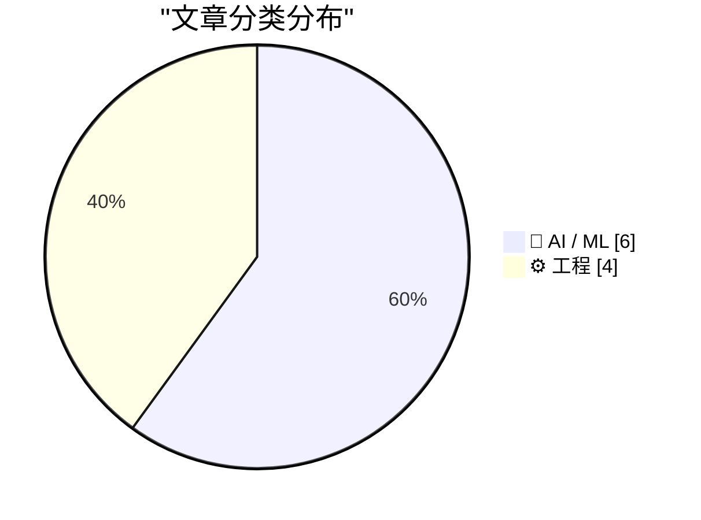
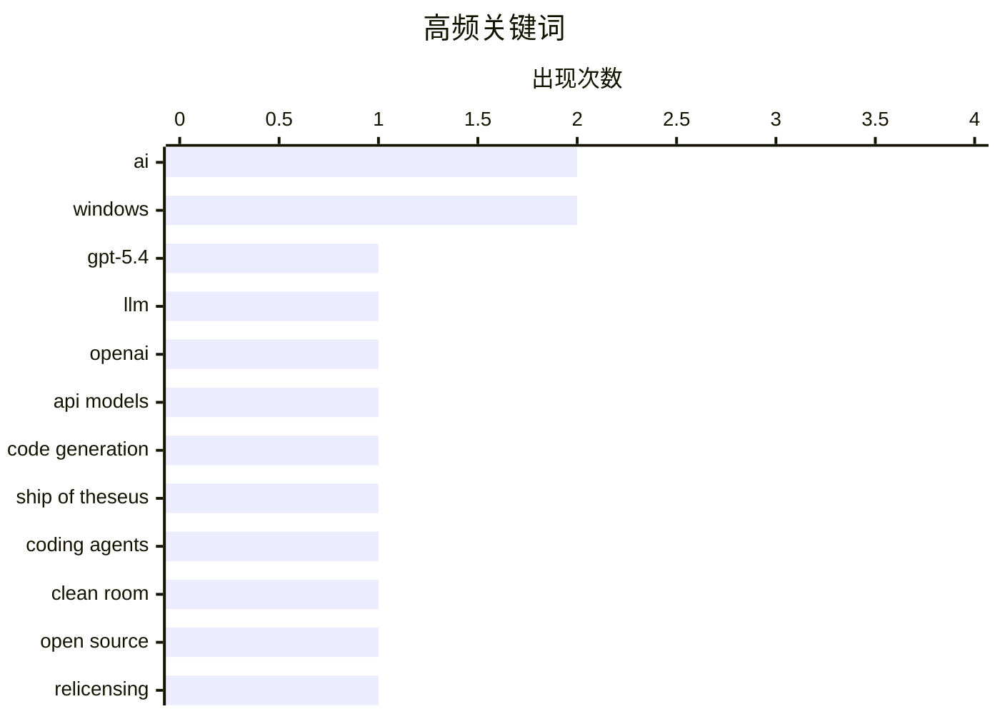

# 📰 AI 博客每日精选 — 2026-03-06

> 来自 Karpathy 推荐的 92 个顶级技术博客，AI 精选 Top 10

## 📝 今日看点

OpenAI发布GPT-5.4系列新模型，支持百万token上下文窗口，AI能力持续迭代；与此同时，AI应用的伦理与风险讨论升温，代码重构许可证争议与生成式AI不适用于税务、医疗等高风险场景的警示并存；工程实践层面，代理工程中的代码审查责任与提示工程的局限性也引发开发者反思。

---

## 🏆 今日必读

🥇 **GPT-5.4发布：OpenAI推出新API模型及ChatGPT集成**

[Introducing GPT‑5.4](https://simonwillison.net/2026/Mar/5/introducing-gpt54/#atom-everything) — simonwillison.net · 1 小时前 · 🤖 AI / ML

> OpenAI发布GPT-5.4和GPT-5.4-pro两款新API模型，知识截止日期为2025年8月31日，支持100万token上下文窗口。定价略高于GPT-5.2系列，超过272,000 tokens时价格上调。GPT-5.4在所有相关基准测试中击败了专注于编码的GPT-5.3-Codex模型。

💡 **为什么值得读**: 对于关注AI模型性能对比和最新大模型发展的开发者而言，这篇提供了GPT-5.4相对于前代编码专用模型的性能优势数据。

🏷️ GPT-5.4, LLM, OpenAI, API models

🥈 **AI与忒修斯之船：代码重构与许可证争议**

[AI And The Ship of Theseus](https://lucumr.pocoo.org/2026/3/5/theseus/) — lucumr.pocoo.org · 1 天前 · 🤖 AI / ML

> 文章讨论了AI重写开源库带来的许可证和身份认同问题。以chardet库为例，新维护者仅通过API和测试套件从零重写了整个库，旨在将许可证从LGPL更换为MIT。原作者Mark Pilgrim认为新实现构成衍生作品而非独立作品。

💡 **为什么值得读**: 这是理解AI辅助代码重写在法律和伦理层面复杂性的重要案例，涉及开源许可证的根本争议。

🏷️ AI, code generation, Ship of Theseus

🥉 **编码代理能否通过"清洁室"实现重新许可开源代码？**

[Can coding agents relicense open source through a “clean room” implementation of code?](https://simonwillison.net/2026/Mar/5/chardet/#atom-everything) — simonwillison.net · 9 小时前 · ⚙️ 工程

> 编码代理可以在数小时内完成过去需要工程师团队数周乃至数月才能完成的"清洁室"代码实现。以Compaq 1982年克隆IBM BIOS为例，这种模式通过一个团队逆向工程创建规范，再由另一团队从零开始实现。当前围绕chardet库的重新许可争议正引发伦理和法律层面的激烈讨论。

💡 **为什么值得读**: 对于关注开源许可法律问题和AI工程实践边界的开发者，这篇提供了关键案例和思考框架。

🏷️ coding agents, clean room, open source, relicensing

---

## 📊 数据概览

| 扫描源 | 抓取文章 | 时间范围 | 精选 |
|:---:|:---:|:---:|:---:|
| 89/92 | 2511 篇 → 24 篇 | 48h | **10 篇** |

### 分类分布



### 高频关键词



<details>
<summary>📈 纯文本关键词图（终端友好）</summary>

```
ai              │ ████████████████████ 2
windows         │ ████████████████████ 2
gpt-5.4         │ ██████████░░░░░░░░░░ 1
llm             │ ██████████░░░░░░░░░░ 1
openai          │ ██████████░░░░░░░░░░ 1
api models      │ ██████████░░░░░░░░░░ 1
code generation │ ██████████░░░░░░░░░░ 1
ship of theseus │ ██████████░░░░░░░░░░ 1
coding agents   │ ██████████░░░░░░░░░░ 1
clean room      │ ██████████░░░░░░░░░░ 1
```

</details>

### 🏷️ 话题标签

**ai**(2) · **windows**(2) · **gpt-5.4**(1) · llm(1) · openai(1) · api models(1) · code generation(1) · ship of theseus(1) · coding agents(1) · clean room(1) · open source(1) · relicensing(1) · generative ai(1) · taxes(1) · reliability(1) · anti-patterns(1) · agentic engineering(1) · best practices(1) · qwen(1) · alibaba(1)

---

## 🤖 AI / ML

### 1. GPT-5.4发布：OpenAI推出新API模型及ChatGPT集成

[Introducing GPT‑5.4](https://simonwillison.net/2026/Mar/5/introducing-gpt54/#atom-everything) — **simonwillison.net** · 1 小时前 · ⭐ 24/30

> OpenAI发布GPT-5.4和GPT-5.4-pro两款新API模型，知识截止日期为2025年8月31日，支持100万token上下文窗口。定价略高于GPT-5.2系列，超过272,000 tokens时价格上调。GPT-5.4在所有相关基准测试中击败了专注于编码的GPT-5.3-Codex模型。

🏷️ GPT-5.4, LLM, OpenAI, API models

---

### 2. AI与忒修斯之船：代码重构与许可证争议

[AI And The Ship of Theseus](https://lucumr.pocoo.org/2026/3/5/theseus/) — **lucumr.pocoo.org** · 1 天前 · ⭐ 23/30

> 文章讨论了AI重写开源库带来的许可证和身份认同问题。以chardet库为例，新维护者仅通过API和测试套件从零重写了整个库，旨在将许可证从LGPL更换为MIT。原作者Mark Pilgrim认为新实现构成衍生作品而非独立作品。

🏷️ AI, code generation, Ship of Theseus

---

### 3. 不要信任生成式AI处理税务和生命相关事务

[Don’t trust Generative AI to do your taxes — and don’t trust it with people’s lives](https://garymarcus.substack.com/p/dont-trust-generative-ai-to-do-your) — **garymarcus.substack.com** · 7 小时前 · ⭐ 22/30

> 文章指出生成式AI聊天机器人在设计上面存在根本性缺陷，不适合处理税务申报或医疗等高风险任务。作者强调AI的随机性和不可预测性使其无法胜任需要精确性和责任明确性的关键领域。

🏷️ Generative AI, taxes, reliability

---

### 4. Qwen团队人事变动引发关注

[Something is afoot in the land of Qwen](https://simonwillison.net/2026/Mar/4/qwen/#atom-everything) — **simonwillison.net** · 1 天前 · ⭐ 20/30

> 阿里Qwen团队核心研究人员Junyang Lin宣布离职，他是发布Qwen开源权重模型的关键人物。近期有报道称团队内部发生重组，一名从Google Gemini团队招聘的新研究员被任命负责Qwen项目。

🏷️ Qwen, Alibaba, open weight models, model development

---

### 5. 从逻辑回归到AI：神经网络本质探析

[From logistic regression to AI](https://www.johndcook.com/blog/2026/03/04/from-logistic-regression-to-ai/) — **johndcook.com** · 1 天前 · ⭐ 20/30

> 文章指出神经网络在某种意义上就是"更多参数"的逻辑回归，但规模带来质变。随参数激增，全新现象涌现——这是线性模型无法预见的。LLM作为神经网络的典型应用，正是在海量参数基础上展现出超越传统方法的智能表现。

🏷️ neural networks, logistic regression, AI

---

### 6. AI奥德赛第二部：提示工程的困境

[An AI Odyssey, Part 2: Prompting Peril](https://www.johndcook.com/blog/2026/03/04/an-ai-odyssey-part-2-prompting-peril/) — **johndcook.com** · 1 天前 · ⭐ 19/30

> 作者与同事探讨了通过增加API调用的推理过程来提升响应准确性的可能性。这一尝试揭示了当前AI应用开发中提示工程面临的深层挑战：如何在有限的API交互中最大化模型推理能力。

🏷️ prompt engineering, OpenAI API, reasoning

---

## ⚙️ 工程

### 7. 编码代理能否通过"清洁室"实现重新许可开源代码？

[Can coding agents relicense open source through a “clean room” implementation of code?](https://simonwillison.net/2026/Mar/5/chardet/#atom-everything) — **simonwillison.net** · 9 小时前 · ⭐ 22/30

> 编码代理可以在数小时内完成过去需要工程师团队数周乃至数月才能完成的"清洁室"代码实现。以Compaq 1982年克隆IBM BIOS为例，这种模式通过一个团队逆向工程创建规范，再由另一团队从零开始实现。当前围绕chardet库的重新许可争议正引发伦理和法律层面的激烈讨论。

🏷️ coding agents, clean room, open source, relicensing

---

### 8. 代理工程反模式：应避免的行为

[Anti-patterns: things to avoid](https://simonwillison.net/guides/agentic-engineering-patterns/anti-patterns/#atom-everything) — **simonwillison.net** · 1 天前 · ⭐ 20/30

> 文章总结了代理工程中的常见反模式，其中首要原则是不要向协作者提交未经自己审查的代码。如果提交由AI生成的数百甚至数千行代码却未亲自验证功能，实际上是将工作推给其他人，这违背了代码审查的基本责任。

🏷️ anti-patterns, agentic engineering, best practices

---

### 9. Posted消息在到达主消息循环前被分发的谜团

[The mystery of the posted message that was dispatched before reaching the main message loop](https://devblogs.microsoft.com/oldnewthing/20260305-00/?p=112114) — **devblogs.microsoft.com/oldnewthing** · 10 小时前 · ⭐ 20/30

> 技术博客探讨了一个Windows消息机制的技术谜题：为何posted消息会在到达主消息循环之前就被分发。答案在于消息被主动dispatch了。

🏷️ Windows, message loop, debugging

---

### 10. QueryPerformanceCounter文档与实际行为的差异

[Aha, I found a counterexample to the documentation that says that Query­Performance­Counter never fails](https://devblogs.microsoft.com/oldnewthing/20260304-00/?p=112110) — **devblogs.microsoft.com/oldnewthing** · 1 天前 · ⭐ 19/30

> 作者发现了一个与官方文档相悖的案例：文档声称QueryPerformanceCounter从不失败，但实际使用中确实存在失败情况，文章通过具体示例证实了这一点。

🏷️ QueryPerformanceCounter, Windows, performance

---

*生成于 2026-03-06 01:52 | 扫描 89 源 → 获取 2511 篇 → 精选 10 篇*
*基于 [Hacker News Popularity Contest 2025](https://refactoringenglish.com/tools/hn-popularity/) RSS 源列表，由 [Andrej Karpathy](https://x.com/karpathy) 推荐*
*由「懂点儿AI」制作，欢迎关注同名微信公众号获取更多 AI 实用技巧 💡*
