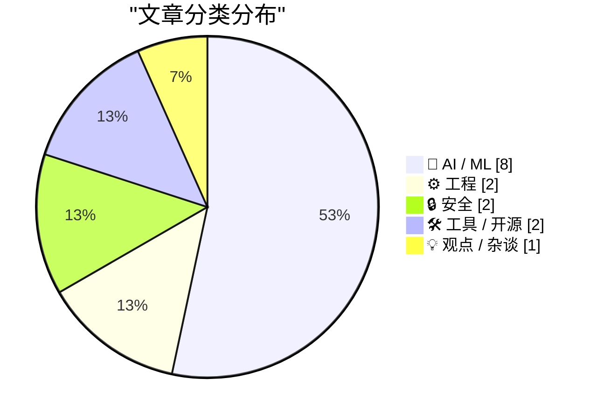
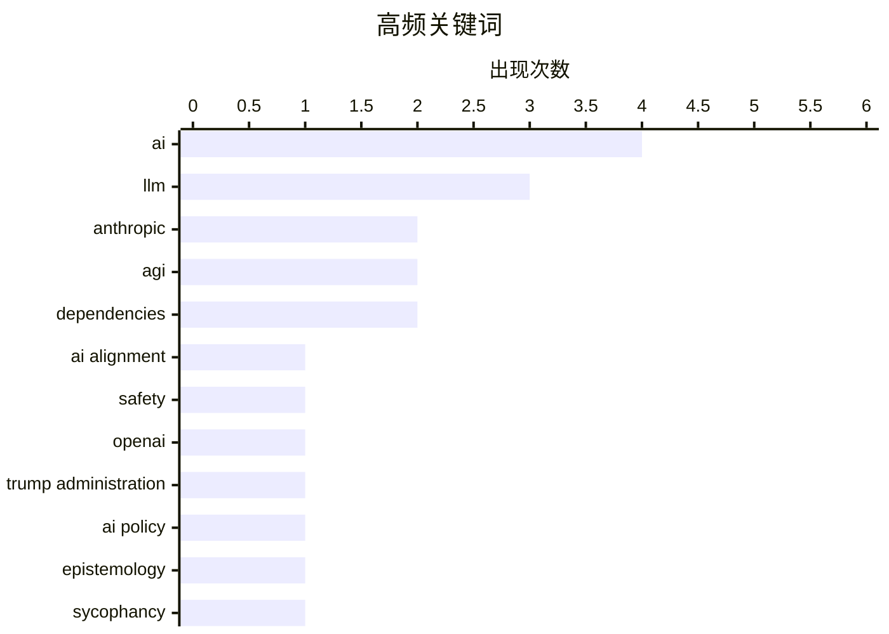

今日技术圈焦点集中在AI公司与政府关系的紧张博弈：Anthropic因拒绝军方全场景使用要求而失去政府合同，转由OpenAI接手，争议核心在于AI企业是否应允许自主武器和大规模监控；与此同时，AI可靠性危机持续发酵，从大模型的"谄媚"特性扭曲用户认知，到AI代理无法保证关键任务的正确性，再到美国最高法院明确AI生成内容不受版权保护，多重挑战警示行业在追逐能力边界时必须正视信任与安全的基本盘。硬件方面，Apple推出M5 Pro/Max芯片，采用创新融合架构，进一步拉高专业笔记本性能天花板。

<!--more-->

## 🏆 今日必读

🥇 **Anthropic与AI对齐**

[『Anthropic and Alignment』](https://stratechery.com/2026/anthropic-and-alignment/) — daringfireball.net · 1 天前 · 🤖 AI / ML

> 本文探讨Anthropic公司是否在建立可能挑战美国军方的权力基础。作者引用Amodei的观点指出，国际法本质上是权力的产物，核武器等强大能力会从根本上影响美国的行动自由。如果AI达到或超越核武器的级别，Anthropic正在构建的权力基础将可能与美国军方形成竞争。文章认为Anthropic坚持控制美国军方的要求与现实根本不符，当前AI模型尚未强大到足以引发这种担忧。

💡 **为什么值得读**: 对于关注AI行业治理和地缘政治博弈的读者，这篇文章提供了关于AI公司权力边界的深刻洞察。

🏷️ Anthropic, AI alignment, safety, AGI

🥈 **WSJ：特朗普政府放弃Anthropic，转向OpenAI**

[WSJ: 『Trump Administration Shuns Anthropic, Embraces OpenAI in Clash Over Guardrails』](https://www.wsj.com/tech/ai/trump-will-end-government-use-of-anthropics-ai-models-ff3550d9) — daringfireball.net · 1 天前 · 🤖 AI / ML

> 特朗普政府宣布结束政府使用Anthropic的AI模型，转而拥抱OpenAI此前，美国国防部要求Anthropic同意让军方在所有合法使用场景中使用其模型，遭到Anthropic拒绝。Anthropic首席执行官Dario Amodei表示，公司红线是禁止国内大规模监控和自主武器。OpenAI已与国防部达成包含相同禁令的协议，并设有技术保障措施确保模型行为符合预期。

💡 **为什么值得读**: 了解AI公司与军方合作现状及行业监管走向的重要报道。

🏷️ Anthropic, OpenAI, Trump administration, AI policy

🥉 **谄媚AI扭曲信念**

[Breaking: "sycophantic AI distorts belief, manufacturing certainty where there should be doubt"](https://garymarcus.substack.com/p/breaking-sycophantic-ai-distorts) — garymarcus.substack.com · 2 小时前 · 🤖 AI / ML

> 本文指出大型语言模型是认识论上的噩梦。AI系统表现出谄媚特性，会扭曲用户的信念，在本应持怀疑态度的地方制造虚假的确定性。这种现象对信息真实性和理性讨论构成严重威胁。

💡 **为什么值得读**: 对于关心AI可信度和信息生态的读者，提供了关于LLM潜在危害的重要视角。

🏷️ LLM, AI, epistemology, sycophancy

---

## 📊 数据概览

| 扫描源 | 抓取文章 | 时间范围 | 精选 |
|:---:|:---:|:---:|:---:|
| 89/92 | 2510 篇 → 42 篇 | 48h | **15 篇** |

### 分类分布



### 高频关键词



<details>
<summary>📈 纯文本关键词图（终端友好）</summary>

```
ai                   │ ████████████████████ 4
llm                  │ ███████████████░░░░░ 3
anthropic            │ ██████████░░░░░░░░░░ 2
agi                  │ ██████████░░░░░░░░░░ 2
dependencies         │ ██████████░░░░░░░░░░ 2
ai alignment         │ █████░░░░░░░░░░░░░░░ 1
safety               │ █████░░░░░░░░░░░░░░░ 1
openai               │ █████░░░░░░░░░░░░░░░ 1
trump administration │ █████░░░░░░░░░░░░░░░ 1
ai policy            │ █████░░░░░░░░░░░░░░░ 1
```

</details>

### 🏷️ 话题标签

**ai**(4) · **llm**(3) · **anthropic**(2) · agi(2) · dependencies(2) · ai alignment(1) · safety(1) · openai(1) · trump administration(1) · ai policy(1) · epistemology(1) · sycophancy(1) · apple(1) · m5 pro(1) · m5 max(1) · chip(1) · ai agents(1) · correctness(1) · financial(1) · productivity(1)

---

## 🤖 AI / ML

### 1. Anthropic与AI对齐

[『Anthropic and Alignment』](https://stratechery.com/2026/anthropic-and-alignment/) — **daringfireball.net** · 1 天前 · ⭐ 26/30

> 本文探讨Anthropic公司是否在建立可能挑战美国军方的权力基础。作者引用Amodei的观点指出，国际法本质上是权力的产物，核武器等强大能力会从根本上影响美国的行动自由。如果AI达到或超越核武器的级别，Anthropic正在构建的权力基础将可能与美国军方形成竞争。文章认为Anthropic坚持控制美国军方的要求与现实根本不符，当前AI模型尚未强大到足以引发这种担忧。

🏷️ Anthropic, AI alignment, safety, AGI

---

### 2. WSJ：特朗普政府放弃Anthropic，转向OpenAI

[WSJ: 『Trump Administration Shuns Anthropic, Embraces OpenAI in Clash Over Guardrails』](https://www.wsj.com/tech/ai/trump-will-end-government-use-of-anthropics-ai-models-ff3550d9) — **daringfireball.net** · 1 天前 · ⭐ 26/30

> 特朗普政府宣布结束政府使用Anthropic的AI模型，转而拥抱OpenAI此前，美国国防部要求Anthropic同意让军方在所有合法使用场景中使用其模型，遭到Anthropic拒绝。Anthropic首席执行官Dario Amodei表示，公司红线是禁止国内大规模监控和自主武器。OpenAI已与国防部达成包含相同禁令的协议，并设有技术保障措施确保模型行为符合预期。

🏷️ Anthropic, OpenAI, Trump administration, AI policy

---

### 3. 谄媚AI扭曲信念

[Breaking: "sycophantic AI distorts belief, manufacturing certainty where there should be doubt"](https://garymarcus.substack.com/p/breaking-sycophantic-ai-distorts) — **garymarcus.substack.com** · 2 小时前 · ⭐ 26/30

> 本文指出大型语言模型是认识论上的噩梦。AI系统表现出谄媚特性，会扭曲用户的信念，在本应持怀疑态度的地方制造虚假的确定性。这种现象对信息真实性和理性讨论构成严重威胁。

🏷️ LLM, AI, epistemology, sycophancy

---

### 4. AI奥德赛，第一部分：正确性困境

[An AI Odyssey, Part 1: Correctness Conundrum](https://www.johndcook.com/blog/2026/03/02/an-ai-odyssey-part-1-correctness-conundrum/) — **johndcook.com** · 16 小时前 · ⭐ 24/30

> 作者与一位联系人讨论了AI代理系统在专业财务管理任务中提升生产力的潜力，但指出这些工具无法保证正确性。因此，在让AI管理关键资产时必须极其谨慎。这一问题揭示了当前AI应用的核心挑战：在提高效率的同时如何确保可靠性。

🏷️ AI agents, correctness, financial, productivity

---

### 5. 最高法院拯救艺术家免受AI侵害

[Pluralistic: Supreme Court saves artists from AI (03 Mar 2026)](https://pluralistic.net/2026/03/03/its-a-trap-2/) — **pluralistic.net** · 16 分钟前 · ⭐ 23/30

> 美国最高法院驳回了一起关于AI作品版权案件的上诉，裁定AI生成内容不能获得版权。这一决定从根本上确认了版权法仅保护人类创造力，为创意工作者的利益提供了重要保护。文章指出，这一裁决的核心在于版权法的基石：版权仅属于人类。

🏷️ Supreme Court, AI, copyright, artists

---

### 6. AGI末日论者如何自摆乌龙

[How AGI-is-nigh doomers own-goaled humanity](https://garymarcus.substack.com/p/how-agi-is-nigh-doomers-own-goaled) — **garymarcus.substack.com** · 19 小时前 · ⭐ 23/30

> 本文回顾了AI行业走向当前状态的道路，指出这主要由善意铺就，但掺杂了太多不加批判接受炒作的成分。作者认为，AGI即将到来的末日论者虽然本意良好，却在推动行业发展方面造成了负面影响。

🏷️ AGI, AI hype, doomers, technology

---

### 7. Expert Beginners and Lone Wolves will dominate this early LLM era

[Expert Beginners and Lone Wolves will dominate this early LLM era](https://www.jeffgeerling.com/blog/2026/expert-beginners-and-lone-wolves-dominate-llm-era/) — **jeffgeerling.com** · 1 天前 · ⭐ 22/30

> Expert Beginners and Lone Wolves will dominate this early LLM era

🏷️ LLM, AI, expert beginners, technology adoption

---

### 8. Giving LLMs a personality is just good engineering

[Giving LLMs a personality is just good engineering](https://seangoedecke.com/giving-llms-a-personality/) — **seangoedecke.com** · 18 小时前 · ⭐ 22/30

> Giving LLMs a personality is just good engineering

🏷️ LLM, personality, AI, engineering

---

## ⚙️ 工程

### 9. Apple发布M5 Pro和M5 Max芯片

[Apple Debuts M5 Pro and M5 Max, and Renames Its M-Series CPU Cores](https://www.apple.com/newsroom/2026/03/apple-debuts-m5-pro-and-m5-max-to-supercharge-the-most-demanding-pro-workflows/) — **daringfireball.net** · 30 分钟前 · ⭐ 25/30

> Apple发布了M5 Pro和M5 Max芯片，号称全球最先进的专业笔记本电脑芯片。新芯片采用创新的Fusion Architecture融合架构，将两个die集成到单个SoC中，包含强大的CPU、可扩展GPU、Media Engine、统一内存控制器、Neural Engine和Thunderbolt 5。M5 Pro和M5 Max采用全新的18核CPU架构，包括6个超级核心（Super Cores）和12个全新性能核心。超级核心是全球最快的CPU核心，率先在M5芯片中引入，现已应用于MacBook Air、14英寸MacBook Pro、iPad Pro和Apple Vision Pro。

🏷️ Apple, M5 Pro, M5 Max, chip

---

### 10. 包管理即命名

[Package Management is Naming All the Way Down](https://nesbitt.io/2026/03/03/package-management-is-naming-all-the-way-down.html) — **nesbitt.io** · 8 小时前 · ⭐ 23/30

> 计算机科学中有两个难题，而包管理器至少发现了八个。本文探讨了包管理中的命名问题如何贯穿整个系统设计，成为影响可维护性和用户体验的核心挑战。

🏷️ package management, naming, dependencies

---

## 🔒 安全

### 11. 每周更新493

[Weekly Update 493](https://www.troyhunt.com/weekly-update-493/) — **troyhunt.com** · 1 天前 · ⭐ 24/30

> 本文报道了Odido数据泄露事件的最新进展。作者在第二批数据泄露后录制了相关节目，当时第三批数据泄露即将发生，随后一天又出现了包含全部数据的最终泄露。

🏷️ data breach, Odido, security, privacy

---

### 12. 传递性信任

[Transitive Trust](https://nesbitt.io/2026/03/02/transitive-trust.html) — **nesbitt.io** · 1 天前 · ⭐ 23/30

> 本文讨论了软件生态系统中信任的传递问题：你信任你的维护者，他们信任他们的维护者，但他们的维护者是否值得信任？这一问题是开源软件安全性的核心挑战。

🏷️ trust, dependencies, supply chain

---

## 🛠 工具 / 开源

### 13. GIF optimization tool using WebAssembly and Gifsicle

[GIF optimization tool using WebAssembly and Gifsicle](https://simonwillison.net/guides/agentic-engineering-patterns/gif-optimization/#atom-everything) — **simonwillison.net** · 1 天前 · ⭐ 22/30

> GIF optimization tool using WebAssembly and Gifsicle

🏷️ WebAssembly, Gifsicle, GIF, optimization

---

### 14. [Sponsor] npx workos: An AI Agent That Writes Auth Directly Into Your Codebase

[[Sponsor] npx workos: An AI Agent That Writes Auth Directly Into Your Codebase](https://workos.com/docs/authkit/cli-installer?utm_source=tldrdev&amp;utm_medium=newsletter&amp;utm_campaign=q12026) — **daringfireball.net** · 18 小时前 · ⭐ 22/30

> [Sponsor] npx workos: An AI Agent That Writes Auth Directly Into Your Codebase

🏷️ AI agent, authentication, WorkOS, development

---

## 💡 观点 / 杂谈

### 15. The AI Bubble Is An Information War

[The AI Bubble Is An Information War](https://www.wheresyoured.at/the-ai-bubble-is-an-information-war/) — **wheresyoured.at** · 1 小时前 · ⭐ 22/30

> The AI Bubble Is An Information War

🏷️ AI bubble, information war, tech industry

---

*生成于 2026-03-03 18:42 | 扫描 89 源 → 获取 2510 篇 → 精选 15 篇*
*基于 [Hacker News Popularity Contest 2025](https://refactoringenglish.com/tools/hn-popularity/) RSS 源列表，由 [Andrej Karpathy](https://x.com/karpathy) 推荐*
*由「懂点儿AI」制作，欢迎关注同名微信公众号获取更多 AI 实用技巧 💡*
