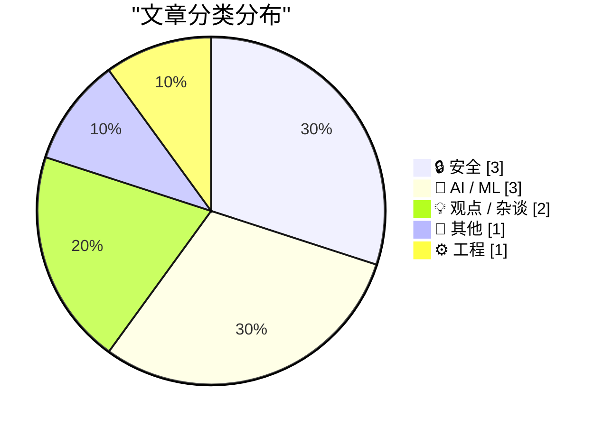
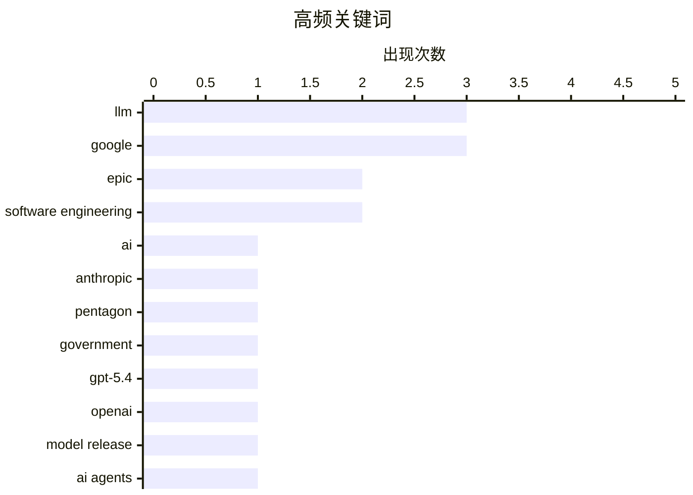

今日AI领域呈现三大趋势：一是模型性能日趋同质化，竞争焦点转向品牌信任与道德定位，Anthropic正借此打造“可信赖AI”差异化战略；二是安全风险持续升级，从iOS漏洞工具Coruna到针对Cline的提示注入攻击，再到Gary Marcus警示AI处理税务等高风险场景的不可靠性，AI安全议题全面升温；三是AI对软件工程职业的冲击加速显现，编码智能体虽提升效率但需手动验证，同时从业者开始担忧AI将逐步取代工程师的核心价值。
---

<!--more-->


> 来自 Karpathy 推荐的 92 个顶级技术博客，AI 精选 Top 10

## 🏆 今日必读

🥇 **Anthropic与五角大楼**

[Anthropic and the Pentagon](https://simonwillison.net/2026/Mar/6/anthropic-and-the-pentagon/#atom-everything) — simonwillison.net · 8 小时前 · 🔒 安全

> 本文讨论了Anthropic与五角大楼的合同争议及AI市场的竞争格局。Bruce Schneier和Nathan E. Sanders指出，当前顶级AI模型性能日益趋同，各厂商之间难以形成明显差异化，Anthropic、OpenAI和Google的模型每隔几个月就会小幅升级互相超越。在这种情况下，品牌定位成为竞争关键，Anthropic及其CEO Dario Amodei正将公司塑造为道德且可信的AI提供商，这对消费者和企业客户都具有市场价值。

💡 **为什么值得读**: 提供了对AI行业竞争本质的深刻洞察，揭示了品牌战略与技术能力并重的市场现实。

🏷️ AI, Anthropic, Pentagon, government

🥈 **GPT-5.4正式发布**

[Introducing GPT‑5.4](https://simonwillison.net/2026/Mar/5/introducing-gpt54/#atom-everything) — simonwillison.net · 1 天前 · 🤖 AI / ML

> OpenAI推出GPT-5.4和GPT-5.4-pro两款API模型，支持100万token上下文窗口，知识截止日期为2025年8月31日。GPT-5.4定价略高于GPT-5.2系列，超过272,000 tokens后价格上调。在所有相关基准测试中，GPT-5.4超越了专门的编程模型GPT-5.3-Codex，显示OpenAI在编码能力上的全面提升。

💡 **为什么值得读**: 对于关注AI模型发展和技术选型的开发者而言，了解最新模型能力边界和定价变化具有实际参考价值。

🏷️ GPT-5.4, OpenAI, LLM, model release

🥉 **智能体手动测试**

[Agentic manual testing](https://simonwillison.net/guides/agentic-engineering-patterns/agentic-manual-testing/#atom-everything) — simonwillison.net · 20 小时前 · 🤖 AI / ML

> 本文阐述了编码智能体（coding agent）的核心特征：能够执行自己编写的代码，这是其比仅输出代码的LLM更有价值的关键所在。作者强调永远不要假设LLM生成的代码能直接工作，必须通过执行来验证；让智能体编写单元测试特别是采用TDD测试优先的方式，是确保代码被充分执行的有效手段，但自动化测试并非唯一验证方式。

💡 **为什么值得读**: 为AI辅助编程实践提供了重要的工程原则，帮助开发者建立正确的代码验证思维。

🏷️ AI agents, coding agents, testing, LLM

---

## 📊 数据概览

| 扫描源 | 抓取文章 | 时间范围 | 精选 |
|:---:|:---:|:---:|:---:|
| 88/92 | 2487 篇 → 35 篇 | 48h | **10 篇** |

### 分类分布



### 高频关键词



<details>
<summary>📈 纯文本关键词图（终端友好）</summary>

```
llm                  │ ████████████████████ 3
google               │ ████████████████████ 3
epic                 │ █████████████░░░░░░░ 2
software engineering │ █████████████░░░░░░░ 2
ai                   │ ███████░░░░░░░░░░░░░ 1
anthropic            │ ███████░░░░░░░░░░░░░ 1
pentagon             │ ███████░░░░░░░░░░░░░ 1
government           │ ███████░░░░░░░░░░░░░ 1
gpt-5.4              │ ███████░░░░░░░░░░░░░ 1
openai               │ ███████░░░░░░░░░░░░░ 1
```

</details>

### 🏷️ 话题标签

**llm**(3) · **google**(3) · **epic**(2) · software engineering(2) · ai(1) · anthropic(1) · pentagon(1) · government(1) · gpt-5.4(1) · openai(1) · model release(1) · ai agents(1) · coding agents(1) · testing(1) · ios(1) · exploit kit(1) · security vulnerability(1) · prompt injection(1) · cline(1) · github(1)

---

## 🔒 安全

### 1. Anthropic与五角大楼

[Anthropic and the Pentagon](https://simonwillison.net/2026/Mar/6/anthropic-and-the-pentagon/#atom-everything) — **simonwillison.net** · 8 小时前 · ⭐ 27/30

> 本文讨论了Anthropic与五角大楼的合同争议及AI市场的竞争格局。Bruce Schneier和Nathan E. Sanders指出，当前顶级AI模型性能日益趋同，各厂商之间难以形成明显差异化，Anthropic、OpenAI和Google的模型每隔几个月就会小幅升级互相超越。在这种情况下，品牌定位成为竞争关键，Anthropic及其CEO Dario Amodei正将公司塑造为道德且可信的AI提供商，这对消费者和企业客户都具有市场价值。

🏷️ AI, Anthropic, Pentagon, government

---

### 2. Google发现神秘iOS漏洞工具Coruna

[Google’s Threat Intelligence Group on Coruna a Powerful iOS Exploit Kit of Mysterious Origin](https://cloud.google.com/blog/topics/threat-intelligence/coruna-powerful-ios-exploit-kit) — **daringfireball.net** · 5 小时前 · ⭐ 26/30

> Google威胁情报团队发现名为Coruna的强力iOS漏洞利用工具包，针对iOS 13.0至17.2.1版本。该工具包包含5个完整的iOS漏洞链和23个漏洞，其中最先进的利用技术采用非公开的漏洞利用方法和缓解绕过技术。2025年，该工具首先被某监控供应商的客户用于高度定向攻击，随后被疑似俄罗斯间谍组织UNC6353用于针对乌克兰用户的水坑攻击。

🏷️ iOS, exploit kit, security vulnerability, Google

---

### 3. Clinejection：利用提示注入攻击攻破Cline生产环境

[Clinejection — Compromising Cline's Production Releases just by Prompting an Issue Triager](https://simonwillison.net/2026/Mar/6/clinejection/#atom-everything) — **simonwillison.net** · 23 小时前 · ⭐ 25/30

> 安全研究员Adnan Khan披露了针对Cline GitHub仓库的攻击链，攻击从在issue标题中植入prompt injection开始。Cline使用anthropics/claude-code-action@v1运行AI驱动的issue分类，当用户创建issue时，Claude Code会读取issue标题执行任务。攻击者通过精心构造的issue标题成功诱使Claude执行任意命令，实现了对生产仓库的入侵。

🏷️ prompt injection, Cline, GitHub, vulnerability

---

## 🤖 AI / ML

### 4. GPT-5.4正式发布

[Introducing GPT‑5.4](https://simonwillison.net/2026/Mar/5/introducing-gpt54/#atom-everything) — **simonwillison.net** · 1 天前 · ⭐ 27/30

> OpenAI推出GPT-5.4和GPT-5.4-pro两款API模型，支持100万token上下文窗口，知识截止日期为2025年8月31日。GPT-5.4定价略高于GPT-5.2系列，超过272,000 tokens后价格上调。在所有相关基准测试中，GPT-5.4超越了专门的编程模型GPT-5.3-Codex，显示OpenAI在编码能力上的全面提升。

🏷️ GPT-5.4, OpenAI, LLM, model release

---

### 5. 智能体手动测试

[Agentic manual testing](https://simonwillison.net/guides/agentic-engineering-patterns/agentic-manual-testing/#atom-everything) — **simonwillison.net** · 20 小时前 · ⭐ 26/30

> 本文阐述了编码智能体（coding agent）的核心特征：能够执行自己编写的代码，这是其比仅输出代码的LLM更有价值的关键所在。作者强调永远不要假设LLM生成的代码能直接工作，必须通过执行来验证；让智能体编写单元测试特别是采用TDD测试优先的方式，是确保代码被充分执行的有效手段，但自动化测试并非唯一验证方式。

🏷️ AI agents, coding agents, testing, LLM

---

### 6. 不要信任生成式AI处理税务和生命安全

[Don’t trust Generative AI to do your taxes — and don’t trust it with people’s lives](https://garymarcus.substack.com/p/dont-trust-generative-ai-to-do-your) — **garymarcus.substack.com** · 1 天前 · ⭐ 23/30

> Gary Marcus撰文指出不应信任生成式AI处理税务申报或涉及人们生命安全的事项。问题的根源在于AI聊天机器人的基本设计方式存在根本性缺陷，这些缺陷导致其在高风险场景下不可靠。

🏷️ Generative AI, taxes, safety, LLM

---

## 💡 观点 / 杂谈

### 7. Tim Sweeney访谈：Epic诉Google案获胜后

[The Verge Interviews Tim Sweeney After Victory in ‘Epic v. Google’](https://www.theverge.com/23996474/epic-tim-sweeney-interview-win-google-antitrust-lawsuit-district-court) — **daringfireball.net** · 8 小时前 · ⭐ 24/30

> Epic CEO Tim Sweeney在接受访谈中对比了Apple和Google的反垄断案差异，认为Apple是"冰"而Google是"火"。他指出Apple的垄断行为主要在公司内部进行，不留书面痕迹；而Google为推广Android向数十家游戏开发商、运营商和OEM支付费用以阻止竞争，这些交易都有书面记录，更容易被调查发现。

🏷️ Epic, Google, antitrust, Tim Sweeney

---

### 8. 我的工作十年后是否还存在

[I don't know if my job will still exist in ten years](https://seangoedecke.com/will-my-job-still-exist/) — **seangoedecke.com** · 1 天前 · ⭐ 23/30

> 作者反思了软件工程行业的前景变化：2021年时认为可以一直从事热爱的编程工作，但到2026年却对行业未来感到担忧。他指出软件工程师的核心价值在于通过代码实现杠杆效应来自动化其他工作，而AI正在逐步取代这一能力。他认为软件工程行业可能无法再存活十年，即使存活也会发生巨变。

🏷️ software engineering, career, AI impact, job security

---

## 📝 其他

### 9. Tim Sweeney签署协议放弃批评Google的权利至2032年

[Tim Sweeney Signed Away His Right to Criticize Google’s Play Store Until 2032](https://www.theverge.com/news/889595/tim-sweeney-signed-away-his-right-to-criticize-google-until-2032) — **daringfireball.net** · 8 小时前 · ⭐ 24/30

> Epic与Google的和解条款要求Tim Sweeney在2032年之前放弃批评Google Play商店政策的权利。根据协议，Sweeney不仅不能对和解范围内的Google行为提起诉讼或发表负面言论，还必须积极认可Google的应用程序分发做法，并在条款范围内为Google辩护。他现在只能将Coalition for App Fairness组织的矛头指向Apple。

🏷️ Epic, Google, settlement, legal

---

## ⚙️ 工程

### 10. 审计Rails代码库的思考

[Quoting Ally Piechowski](https://simonwillison.net/2026/Mar/6/ally-piechowski/#atom-everything) — **simonwillison.net** · 4 小时前 · ⭐ 23/30

> 本文汇总了审计遗留Rails代码库时应向不同角色提出的关键问题：向开发者询问最不敢触碰的代码区域、上次周五部署时间及生产故障原因；向技术负责人询问阻塞超过一年的功能、实时错误可见性及严重低估的功能；向业务干系人询问被悄悄关闭的功能及不再向客户承诺的事项。

🏷️ legacy code, refactoring, codebase audit, software engineering

---

*生成于 2026-03-07 02:10 | 扫描 88 源 → 获取 2487 篇 → 精选 10 篇*
*基于 [Hacker News Popularity Contest 2025](https://refactoringenglish.com/tools/hn-popularity/) RSS 源列表，由 [Andrej Karpathy](https://x.com/karpathy) 推荐*
*由「懂点儿AI」制作，欢迎关注同名微信公众号获取更多 AI 实用技巧 💡*
