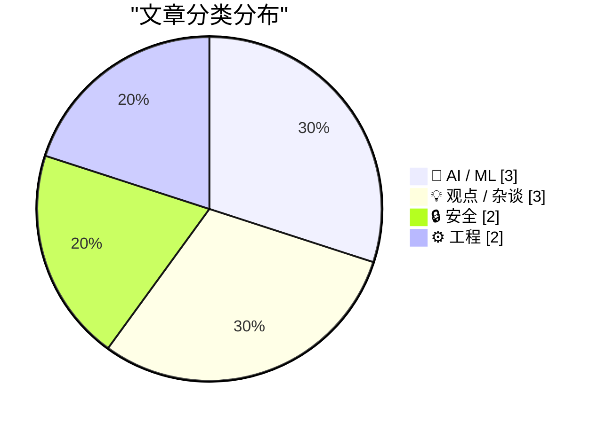
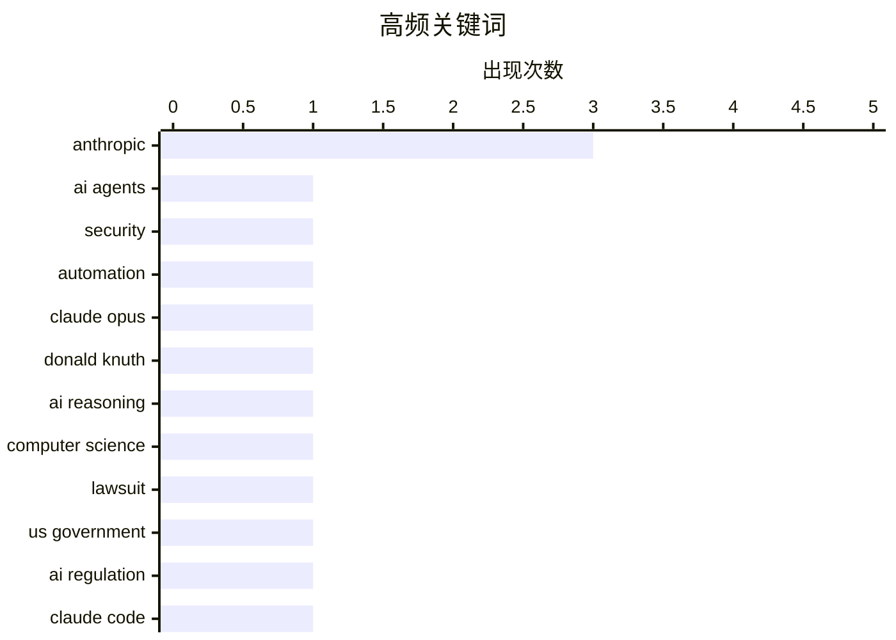

今日技术圈聚焦三大趋势：AI安全风险持续升级，Meta智能眼镜数据标注外包商隐私泄露问题引发关注，AI助手权限扩大正模糊传统安全边界；AI与开源社区的法律及伦理争议加剧，Anthropic起诉政府、chardet库重新许可及GNU历史对比均指向AI代码重写的合法性讨论；技术层面出现突破性进展，Knuth盛赞Claude Opus解决开放数学问题，同时PostgreSQL 18推出统计信息复制功能解决开发环境查询计划优化难题。

<!--more-->


> 来自 Karpathy 推荐的 92 个顶级技术博客，AI 精选 Top 10

## 🏆 今日必读

🥇 **AI助手正在改变安全格局**

[How AI Assistants are Moving the Security Goalposts](https://krebsonsecurity.com/2026/03/how-ai-assistants-are-moving-the-security-goalposts/) — krebsonsecurity.com · 1 天前 · 🔒 安全

> 基于AI的助手或"代理"——即能够访问用户电脑、文件、在线服务并自动化执行任务的自主程序——在开发者和IT工作者中日益普及。这些新型工具权限强大且执行力强，迅速改变了组织的安全优先事项。核心问题在于AI助手模糊了数据与代码、受信任同事与内部威胁、专业黑客与业余程序员的边界。近期多起事件表明，这一技术趋势正在引发广泛的安全争议。

💡 **为什么值得读**: 面向所有关注AI安全趋势的开发者和安全从业者，文章揭示了AI代理带来的新型安全挑战和边界模糊问题

🏷️ AI agents, security, automation

🥈 **Donald Knuth谈Claude Opus解决计算机科学问题**

[Donald Knuth on Claude Opus Solving a Computer Science Problem](https://www-cs-faculty.stanford.edu/~knuth/papers/claude-cycles.pdf) — daringfireball.net · 1 天前 · 🤖 AI / ML

> 计算机科学泰斗Donald Knuth宣布，他研究了数周的一个开放数学问题被Anthropic的混合推理模型Claude Opus 4.6解决，该模型仅在三周前发布。Knuth表示这一事件让他不得不重新审视对"生成式AI"的看法。他盛赞这是自动推理和创造性问题解决领域的重大进展，并感慨既能见证猜想得到优雅解答、又能庆祝这一技术突破实属难得。

💡 **为什么值得读**: 对于关注AI在数学和推理领域进展的读者，展示了当前AI模型在复杂问题解决上的实际能力突破

🏷️ Claude Opus, Donald Knuth, AI reasoning, computer science

🥉 **Anthropic起诉美国政府，事出有因**

[Anthropic sues US government, with good reason](https://garymarcus.substack.com/p/anthropic-sues-us-government-with) — garymarcus.substack.com · 8 小时前 · 🤖 AI / ML

> Gary Marcus撰文支持Anthropic对美国政府的新诉讼。尽管作者认为CEO Dario Amodei并非圣人，但完全支持公司此次针对美国政府的法律行动。文章未详细说明诉讼具体内容，但明确表达了对Anthropic此番举措的支持立场。

💡 **为什么值得读**: 关注AI行业监管与政府关系的读者可了解 Anthropic 与美国政府之间的法律争议背景

🏷️ Anthropic, lawsuit, US government, AI regulation

---

## 📊 数据概览

| 扫描源 | 抓取文章 | 时间范围 | 精选 |
|:---:|:---:|:---:|:---:|
| 88/92 | 2496 篇 → 31 篇 | 48h | **10 篇** |

### 分类分布



### 高频关键词



<details>
<summary>📈 纯文本关键词图（终端友好）</summary>

```
anthropic        │ ████████████████████ 3
ai agents        │ ███████░░░░░░░░░░░░░ 1
security         │ ███████░░░░░░░░░░░░░ 1
automation       │ ███████░░░░░░░░░░░░░ 1
claude opus      │ ███████░░░░░░░░░░░░░ 1
donald knuth     │ ███████░░░░░░░░░░░░░ 1
ai reasoning     │ ███████░░░░░░░░░░░░░ 1
computer science │ ███████░░░░░░░░░░░░░ 1
lawsuit          │ ███████░░░░░░░░░░░░░ 1
us government    │ ███████░░░░░░░░░░░░░ 1
```

</details>

### 🏷️ 话题标签

**anthropic**(3) · **ai agents**(1) · **security**(1) · automation(1) · claude opus(1) · donald knuth(1) · ai reasoning(1) · computer science(1) · lawsuit(1) · us government(1) · ai regulation(1) · claude code(1) · pricing(1) · fact check(1) · postgresql(1) · query plans(1) · database(1) · performance(1) · llm(1) · programming tools(1)

---

## 🤖 AI / ML

### 1. Donald Knuth谈Claude Opus解决计算机科学问题

[Donald Knuth on Claude Opus Solving a Computer Science Problem](https://www-cs-faculty.stanford.edu/~knuth/papers/claude-cycles.pdf) — **daringfireball.net** · 1 天前 · ⭐ 25/30

> 计算机科学泰斗Donald Knuth宣布，他研究了数周的一个开放数学问题被Anthropic的混合推理模型Claude Opus 4.6解决，该模型仅在三周前发布。Knuth表示这一事件让他不得不重新审视对"生成式AI"的看法。他盛赞这是自动推理和创造性问题解决领域的重大进展，并感慨既能见证猜想得到优雅解答、又能庆祝这一技术突破实属难得。

🏷️ Claude Opus, Donald Knuth, AI reasoning, computer science

---

### 2. Anthropic起诉美国政府，事出有因

[Anthropic sues US government, with good reason](https://garymarcus.substack.com/p/anthropic-sues-us-government-with) — **garymarcus.substack.com** · 8 小时前 · ⭐ 25/30

> Gary Marcus撰文支持Anthropic对美国政府的新诉讼。尽管作者认为CEO Dario Amodei并非圣人，但完全支持公司此次针对美国政府的法律行动。文章未详细说明诉讼具体内容，但明确表达了对Anthropic此番举措的支持立场。

🏷️ Anthropic, lawsuit, US government, AI regulation

---

### 3. Anthropic为每个Claude Code用户并未亏损5000美元

[No, it doesn't cost Anthropic $5k per Claude Code user](https://martinalderson.com/posts/no-it-doesnt-cost-anthropic-5k-per-claude-code-user/?utm_source=rss&amp;utm_medium=rss&amp;utm_campaign=feed) — **martinalderson.com** · 1 天前 · ⭐ 25/30

> 针对网络上流传的"Anthropic每个Claude Code订阅用户亏损5000美元"这一病毒式说法，作者进行了详细核算，结论是该说法经不起基本检验。文章通过实际数学计算驳斥了这一亏损数额的估计。

🏷️ Anthropic, Claude Code, pricing, fact check

---

## 💡 观点 / 杂谈

### 4. 或许不再是"无聊技术"了

[Perhaps not Boring Technology after all](https://simonwillison.net/2026/Mar/9/not-so-boring/#atom-everything) — **simonwillison.net** · 11 小时前 · ⭐ 23/30

> 以往担忧LLM会推动技术选型偏向训练数据中表现更好的工具，使新工具难以突破。但作者测试最新模型配合优秀编码代理后发现这一情况可能已改变。通过提示模型先使用"uvx showboat --help / rodley --help / chartroom --help"学习工具文档，新模型的上下文长度足以在开始工作前消耗大量文档。

🏷️ LLM, programming tools, technology trends

---

### 5. GNU项目与AI重新实现

[GNU and the AI reimplementations](http://antirez.com/news/162) — **antirez.com** · 1 天前 · ⭐ 23/30

> 作者借GNU项目历史对比当前AI重新实现软件的争议。90年代许多人支持Richard Stallman领导的GNU项目重新实现UNIX用户空间工具，而今这些人却在抗议AI重写现有项目。作者认为这种双标立场有问题——GNU当年同样是重新实现，且Stallman要求每个工具独特可识别以规避版权问题。历史表明重新实现本身并非问题。

🏷️ AI, GNU, reimplementation, ethics

---

### 6. 商业AI领域没有英雄

[There are no heroes in commercial AI](https://garymarcus.substack.com/p/there-are-no-heroes-in-commercial) — **garymarcus.substack.com** · 1 天前 · ⭐ 20/30

> Gary Marcus发文比较Dario Amodei与Sam Altman，断言商业AI领域不存在真正的"英雄"。文章延续作者此前对Anthropic及CEO的批评立场，认为Amodei与Altman本质上并无区别，都属于商业利益驱动的AI巨头掌门人。

🏷️ AI industry, Anthropic, OpenAI, criticism

---

## 🔒 安全

### 7. AI助手正在改变安全格局

[How AI Assistants are Moving the Security Goalposts](https://krebsonsecurity.com/2026/03/how-ai-assistants-are-moving-the-security-goalposts/) — **krebsonsecurity.com** · 1 天前 · ⭐ 26/30

> 基于AI的助手或"代理"——即能够访问用户电脑、文件、在线服务并自动化执行任务的自主程序——在开发者和IT工作者中日益普及。这些新型工具权限强大且执行力强，迅速改变了组织的安全优先事项。核心问题在于AI助手模糊了数据与代码、受信任同事与内部威胁、专业黑客与业余程序员的边界。近期多起事件表明，这一技术趋势正在引发广泛的安全争议。

🏷️ AI agents, security, automation

---

### 8. 肯尼亚低薪承包商在使用Meta AI智能眼镜时看到用户看到的一切

[Low-Wage Contractors in Kenya See What Users See While Using Meta’s AI Smart Glasses](https://www.svd.se/a/K8nrV4/metas-ai-smart-glasses-and-data-privacy-concerns-workers-say-we-see-everything) — **daringfireball.net** · 10 小时前 · ⭐ 22/30

> 瑞典媒体报道揭露Meta AI智能眼镜数据标注背后的隐私问题。位于肯尼亚的低薪承包商负责审查用户拍摄的眼镜视频内容，他们能看到用户上传的一切——包括有人上厕所、裸体、信用卡画面，甚至观看色情内容。工人描述若这些片段泄露将引发"巨大丑闻"。眼镜摄像头无处不在，敏感内容处理存在严重安全隐患。

🏷️ privacy, Meta, AI glasses, surveillance

---

## ⚙️ 工程

### 9. 无需生产数据即可获取生产环境查询计划

[Production query plans without production data](https://simonwillison.net/2026/Mar/9/production-query-plans-without-production-data/#atom-everything) — **simonwillison.net** · 9 小时前 · ⭐ 24/30

> PostgreSQL 18引入了pg_restore_relation_stats()和pg_restore_attribute_stats()两个新函数，允许用户将生产环境的统计信息复制到开发环境。查询规划器依赖内部统计信息来决定查询执行策略，但生产数据与开发环境往往存在差异，导致生产环境的最优查询计划在开发环境中无法复现。新功能解决了这一痛点。

🏷️ PostgreSQL, query plans, database, performance

---

### 10. 编码代理能否通过"洁净室"实现重新许可开源代码？

[Can Coding Agents Relicense Open Source Through a ‘Clean Room’ Implementation of Code?](https://simonwillison.net/2026/Mar/5/chardet/) — **daringfireball.net** · 1 天前 · ⭐ 23/30

> Python字符编码检测库chardet面临开源许可争议。chardet由Mark Pilgrim于2006年创建，遵循LGPL许可，2011年Pilgrim隐退后由Dan Blanchard接管。自2012年起Blanchard负责所有版本发布，近日他发布chardet 7.0.0，改为MIT许可，声称是彻底重写、性能更准确。Pilgrim随后在GitHubissue#327中反对重新许可。这一争议涉及AI协助代码重写的法律和伦理问题。

🏷️ open source, licensing, chardet, clean room

---

*生成于 2026-03-10 00:59 | 扫描 88 源 → 获取 2496 篇 → 精选 10 篇*
*基于 [Hacker News Popularity Contest 2025](https://refactoringenglish.com/tools/hn-popularity/) RSS 源列表，由 [Andrej Karpathy](https://x.com/karpathy) 推荐*
*由「懂点儿AI」制作，欢迎关注同名微信公众号获取更多 AI 实用技巧 💡*
