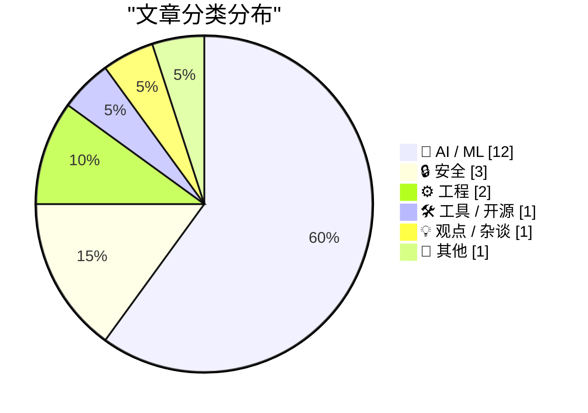
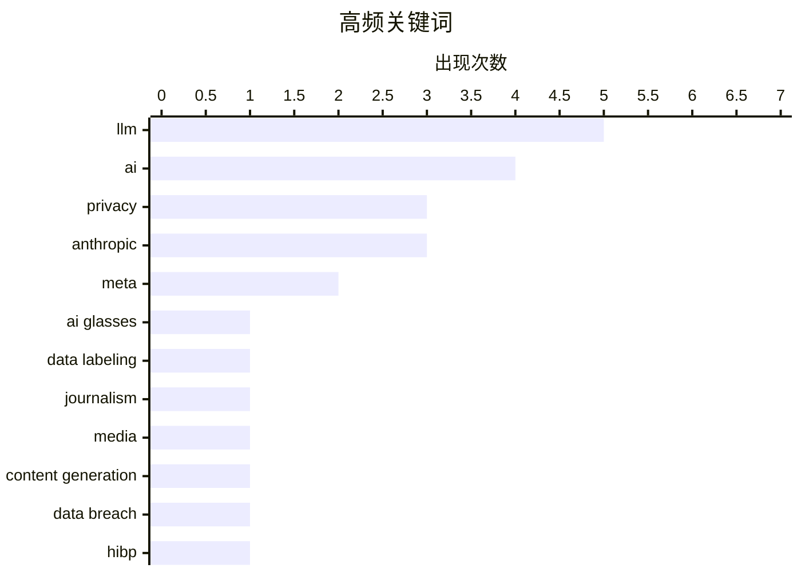

# 📰 AI 博客每日精选 — 2026-03-11

> 来自 Karpathy 推荐的 92 个顶级技术博客，AI 精选 Top 20

## 📝 今日看点

今日技术圈聚焦三大趋势：一是AI隐私与安全风险持续发酵，Meta智能眼镜数据标注漏洞致用户敏感内容外泄，伊朗黑客又对医疗设备巨头发动攻击，数据泄露事件近期激增；二是AI在内容生产领域的争议加剧，媒体用AI替代真人记者引发质量担忧，AI编程工具导致的系统故障“爆炸半径”亦在扩大，如何平衡效率与质量成焦点；三是AI技术边界不断拓展，从排序算法动画演示到形式规范辅助，LLM正逐步克服早期局限，但“幻觉”等固有特性仍需审慎对待。

---

## 🏆 今日必读

🥇 ** Meta AI智能眼镜数据隐私调查：肯尼亚工人可见用户一切内容**

[Low-Wage Contractors in Kenya See What Users See While Using Meta’s AI Smart Glasses](https://www.svd.se/a/K8nrV4/metas-ai-smart-glasses-and-data-privacy-concerns-workers-say-we-see-everything) — daringfireball.net · 2 天前 · 🤖 AI / ML

> 瑞典记者调查发现，Meta AI智能眼镜的数据标注工作外包给肯尼亚工人，这些工人可以实时看到用户拍摄的所有视频内容。工人称看到过用户如厕、换衣、银行卡片、观看色情内容等敏感画面，甚至有性行为影像被拍下。工人警告若这些内容泄露将引发"巨大丑闻"。文章揭示了AI数据标注行业背后不为人知的隐私风险。

💡 **为什么值得读**: 深入揭示了科技巨头AI产品背后被忽视的隐私问题，调查报道角度罕见，值得关注数据安全的所有人阅读。

🏷️ Meta, AI glasses, privacy, data labeling

🥈 ** AI"记者"证明媒体老板不在乎真相**

[Pluralistic: AI "journalists" prove that media bosses don't give a shit (11 Mar 2026)](https://pluralistic.net/2026/03/11/modal-dialog-a-palooza/) — pluralistic.net · 4 小时前 · 🤖 AI / ML

> 评论文章指出AI生成的"记者"内容泛滥成灾，证明了媒体高层根本不在意新闻质量。作者引用Ed Zitron的分析，认为AI泡沫本质是一场信息战，媒体老板们乐于用AI替代真人记者以削减成本，即使内容质量低下也毫不在意。文章还列举了当天多个有趣链接。

💡 **为什么值得读**: 对当前AI内容泛滥现象的尖锐批评，揭示了媒体行业为追求利润而牺牲质量的现状，适合关心新闻业未来的读者。

🏷️ AI, journalism, media, content generation

🥉 ** Troy Hunt每周更新494：数据泄露事件激增**

[Weekly Update 494](https://www.troyhunt.com/weekly-update-494/) — troyhunt.com · 1 天前 · 🔒 安全

> Troy Hunt分享了他运营"Have I Been Pwned"网站十二年来的数据：平均每4.7天加载一起数据泄露事件，至今共收录959起。但上周仅两天内就发生了5起数据泄露，相当于好几周的量。文章还提到其他安全相关新闻。

💡 **为什么值得读**: 来自安全专家的一线数据，揭示了近期数据泄露事件的急剧增长，对关注网络安全的读者有重要参考价值。

🏷️ data breach, HIBP, security, privacy

---

## 📊 数据概览

| 扫描源 | 抓取文章 | 时间范围 | 精选 |
|:---:|:---:|:---:|:---:|
| 89/92 | 2516 篇 → 55 篇 | 72h | **20 篇** |

### 分类分布



### 高频关键词



<details>
<summary>📈 纯文本关键词图（终端友好）</summary>

```
llm                │ ████████████████████ 5
ai                 │ ████████████████░░░░ 4
privacy            │ ████████████░░░░░░░░ 3
anthropic          │ ████████████░░░░░░░░ 3
meta               │ ████████░░░░░░░░░░░░ 2
ai glasses         │ ████░░░░░░░░░░░░░░░░ 1
data labeling      │ ████░░░░░░░░░░░░░░░░ 1
journalism         │ ████░░░░░░░░░░░░░░░░ 1
media              │ ████░░░░░░░░░░░░░░░░ 1
content generation │ ████░░░░░░░░░░░░░░░░ 1
```

</details>

### 🏷️ 话题标签

**llm**(5) · **ai**(4) · **privacy**(3) · anthropic(3) · meta(2) · ai glasses(1) · data labeling(1) · journalism(1) · media(1) · content generation(1) · data breach(1) · hibp(1) · security(1) · sorting algorithms(1) · animation(1) · claude artifacts(1) · visualization(1) · ai coding(1) · code quality(1) · developer productivity(1)

---

## 🤖 AI / ML

### 1.  Meta AI智能眼镜数据隐私调查：肯尼亚工人可见用户一切内容

[Low-Wage Contractors in Kenya See What Users See While Using Meta’s AI Smart Glasses](https://www.svd.se/a/K8nrV4/metas-ai-smart-glasses-and-data-privacy-concerns-workers-say-we-see-everything) — **daringfireball.net** · 2 天前 · ⭐ 25/30

> 瑞典记者调查发现，Meta AI智能眼镜的数据标注工作外包给肯尼亚工人，这些工人可以实时看到用户拍摄的所有视频内容。工人称看到过用户如厕、换衣、银行卡片、观看色情内容等敏感画面，甚至有性行为影像被拍下。工人警告若这些内容泄露将引发"巨大丑闻"。文章揭示了AI数据标注行业背后不为人知的隐私风险。

🏷️ Meta, AI glasses, privacy, data labeling

---

### 2.  AI"记者"证明媒体老板不在乎真相

[Pluralistic: AI "journalists" prove that media bosses don't give a shit (11 Mar 2026)](https://pluralistic.net/2026/03/11/modal-dialog-a-palooza/) — **pluralistic.net** · 4 小时前 · ⭐ 25/30

> 评论文章指出AI生成的"记者"内容泛滥成灾，证明了媒体高层根本不在意新闻质量。作者引用Ed Zitron的分析，认为AI泡沫本质是一场信息战，媒体老板们乐于用AI替代真人记者以削减成本，即使内容质量低下也毫不在意。文章还列举了当天多个有趣链接。

🏷️ AI, journalism, media, content generation

---

### 3.  AI应该帮助我们生产更好的代码

[AI should help us produce better code](https://simonwillison.net/guides/agentic-engineering-patterns/better-code/#atom-everything) — **simonwillison.net** · 1 天前 · ⭐ 24/30

> 文章讨论了开发者担心使用AI工具会导致代码质量下降的担忧。作者认为用AI写出更差的代码是一个"选择"，而非必然结果。文章探讨了如何避免技术债务，指出应该利用AI来改进代码质量而非仅仅追求速度。关键在于直接解决影响输出质量的问题。

🏷️ AI coding, code quality, LLM, developer productivity

---

### 4.  或许不再是"无聊技术"了

[Perhaps not Boring Technology after all](https://simonwillison.net/2026/Mar/9/not-so-boring/#atom-everything) — **simonwillison.net** · 2 天前 · ⭐ 24/30

> 文章讨论了LLM是否会是新技术工具的"杀手"——即LLM可能倾向于推荐训练数据中常见的工具，阻碍新工具发展。作者指出两三年前确实存在这个问题，Python和JavaScript的AI辅助明显更好。但最新的长上下文模型配合好的编码智能体框架，已经可以很好地处理新工具，通过提示让AI先学习工具帮助文档即可。

🏷️ LLM, technology trends, innovation, boring technology

---

### 5.  我没说谎，我只是产生了幻觉

[I'm Not Lying, I'm Hallucinating](https://idiallo.com/byte-size/im-not-lying-im-hallucinating?src=feed) — **idiallo.com** · 1 天前 · ⭐ 24/30

> 文章探讨了AI"幻觉"这一术语的起源和演变。Andrej Karpathy推广了"氛围编程"（vibe coding）概念，而"幻觉"一词虽非他发明，但他将其含义从"预测错误"重新定义为更接近"做梦或幻想"。作者指出将AI错误称为"幻觉"是一种巧妙的话术——把事实扭曲包装成神经系统疾病，每次新模型发布都承诺改进但仍会幻觉。

🏷️ AI, hallucination, LLM, terminology

---

### 6.  AI编码工具导致系统中断，"爆炸半径"巨大

[“A spate of outages, including incidents tied to the use of AI coding tools”, right on schedule](https://garymarcus.substack.com/p/a-spate-of-outages-including-incidents) — **garymarcus.substack.com** · 1 天前 · ⭐ 24/30

> Gary Marcus指出AI编码工具导致的系统故障和中断事件正在增加，而且这些事件具有"高爆炸半径"——影响范围大、后果严重。这呼应了他之前关于AI编程工具安全风险的警告。

🏷️ AI coding tools, outages, reliability

---

### 7.  LLM不擅长处理规范规格

[LLMs are bad at vibing specifications](https://buttondown.com/hillelwayne/archive/llms-are-bad-at-vibing-specifications/) — **buttondown.com/hillelwayne** · 1 天前 · ⭐ 24/30

> 作者一年前曾写文称AI是TLA+（一种形式规范语言）的"规格力量倍增器"，从专家角度分析AI辅助编写形式规范的能力。现在他研究了初学者用AI写规范的情况，发现效果不佳。GitHub上约4%的TLA+规范中包含"Claude"关键词，表明一直有形式规范的需求，只是缺乏技能。AI可以降低形式方法的入门门槛，但对初学者来说仍存在困难。

🏷️ LLM, specifications, testing

---

### 8. I’m glad the Anthropic fight is happening now

[I’m glad the Anthropic fight is happening now](https://www.dwarkesh.com/p/dow-anthropic) — **dwarkesh.com** · 4 小时前 · ⭐ 24/30

> I’m glad the Anthropic fight is happening now

🏷️ Anthropic, AI safety, negotiations

---

### 9. No, it doesn't cost Anthropic $5k per Claude Code user

[No, it doesn't cost Anthropic $5k per Claude Code user](https://martinalderson.com/posts/no-it-doesnt-cost-anthropic-5k-per-claude-code-user/?utm_source=rss&amp;utm_medium=rss&amp;utm_campaign=feed) — **martinalderson.com** · 2 天前 · ⭐ 24/30

> No, it doesn't cost Anthropic $5k per Claude Code user

🏷️ Anthropic, Claude Code, AI economics, business model

---

### 10. Writing an LLM from scratch, part 32e -- Interventions: the learning rate

[Writing an LLM from scratch, part 32e -- Interventions: the learning rate](https://www.gilesthomas.com/2026/03/llm-from-scratch-32e-interventions-learning-rate) — **gilesthomas.com** · 23 小时前 · ⭐ 23/30

> Writing an LLM from scratch, part 32e -- Interventions: the learning rate

🏷️ LLM, GPT-2, learning rate, from scratch

---

### 11. Where did you think the training data was coming from?

[Where did you think the training data was coming from?](https://idiallo.com/blog/where-did-the-training-data-come-from-meta-ai-rayban-glasses?src=feed) — **idiallo.com** · 11 小时前 · ⭐ 22/30

> Where did you think the training data was coming from?

🏷️ AI, training data, privacy, Meta

---

### 12. Anthropic sues US government, with good reason

[Anthropic sues US government, with good reason](https://garymarcus.substack.com/p/anthropic-sues-us-government-with) — **garymarcus.substack.com** · 2 天前 · ⭐ 21/30

> Anthropic sues US government, with good reason

🏷️ Anthropic, lawsuit, US government, AI regulation

---

## 🔒 安全

### 13.  Troy Hunt每周更新494：数据泄露事件激增

[Weekly Update 494](https://www.troyhunt.com/weekly-update-494/) — **troyhunt.com** · 1 天前 · ⭐ 25/30

> Troy Hunt分享了他运营"Have I Been Pwned"网站十二年来的数据：平均每4.7天加载一起数据泄露事件，至今共收录959起。但上周仅两天内就发生了5起数据泄露，相当于好几周的量。文章还提到其他安全相关新闻。

🏷️ data breach, HIBP, security, privacy

---

### 14.  伊朗黑客声称对医疗设备巨头Stryker发起数据擦除攻击

[Iran-Backed Hackers Claim Wiper Attack on Medtech Firm Stryker](https://krebsonsecurity.com/2026/03/iran-backed-hackers-claim-wiper-attack-on-medtech-firm-stryker/) — **krebsonsecurity.com** · 7 小时前 · ⭐ 24/30

> 一个与伊朗情报机构有关的黑客组织声称对医疗器械公司Stryker发动了数据擦除攻击。报道来自爱尔兰（Stryker在美国以外的最大枢纽），该公司让超过5000名工人回家。Stryker美国总部的语音留言显示公司正经历"建筑紧急情况"。这是针对医疗行业的最新网络攻击事件。

🏷️ Iran hackers, medical device, wiper attack, cybersecurity

---

### 15. Microsoft Patch Tuesday, March 2026 Edition

[Microsoft Patch Tuesday, March 2026 Edition](https://krebsonsecurity.com/2026/03/microsoft-patch-tuesday-march-2026-edition/) — **krebsonsecurity.com** · 23 小时前 · ⭐ 22/30

> Microsoft Patch Tuesday, March 2026 Edition

🏷️ Microsoft, security patches, vulnerabilities, Patch Tuesday

---

## ⚙️ 工程

### 16. How do compilers ensure that large stack allocations do not skip over the guard page?

[How do compilers ensure that large stack allocations do not skip over the guard page?](https://devblogs.microsoft.com/oldnewthing/20260311-00/?p=112134) — **devblogs.microsoft.com/oldnewthing** · 9 小时前 · ⭐ 22/30

> How do compilers ensure that large stack allocations do not skip over the guard page?

🏷️ compiler, stack allocation, memory

---

### 17. Just Use Postgres

[Just Use Postgres](https://nesbitt.io/2026/03/10/just-use-postgres.html) — **nesbitt.io** · 1 天前 · ⭐ 21/30

> Just Use Postgres

🏷️ Postgres, git, deployment, database

---

## 🛠 工具 / 开源

### 18.  用Claude构建排序算法动画演示

[Sorting algorithms](https://simonwillison.net/2026/Mar/11/sorting-algorithms/#atom-everything) — **simonwillison.net** · 52 分钟前 · ⭐ 24/30

> Simon Willison展示如何用Claude Artifacts在手机上创建排序算法的交互式动画演示。他依次创建了冒泡排序、选择排序、插入排序、归并排序、快速排序、堆排序的动画，然后让Claude克隆Python CPython仓库添加了Timsort算法。所有演示可同时运行。

🏷️ sorting algorithms, animation, Claude Artifacts, visualization

---

## 💡 观点 / 杂谈

### 19. I don't know if I like working at higher levels of abstraction

[I don't know if I like working at higher levels of abstraction](https://xeiaso.net/blog/2026/ai-abstraction/) — **xeiaso.net** · 23 小时前 · ⭐ 22/30

> I don't know if I like working at higher levels of abstraction

🏷️ abstraction, AI, programming, tools

---

## 📝 其他

### 20. ★ The MacBook Neo

[★ The MacBook Neo](https://daringfireball.net/2026/03/the_macbook_neo) — **daringfireball.net** · 1 天前 · ⭐ 21/30

> ★ The MacBook Neo

🏷️ MacBook, Apple, hardware, laptop

---

*生成于 2026-03-11 23:50 | 扫描 89 源 → 获取 2516 篇 → 精选 20 篇*
*基于 [Hacker News Popularity Contest 2025](https://refactoringenglish.com/tools/hn-popularity/) RSS 源列表，由 [Andrej Karpathy](https://x.com/karpathy) 推荐*
*由「懂点儿AI」制作，欢迎关注同名微信公众号获取更多 AI 实用技巧 💡*
