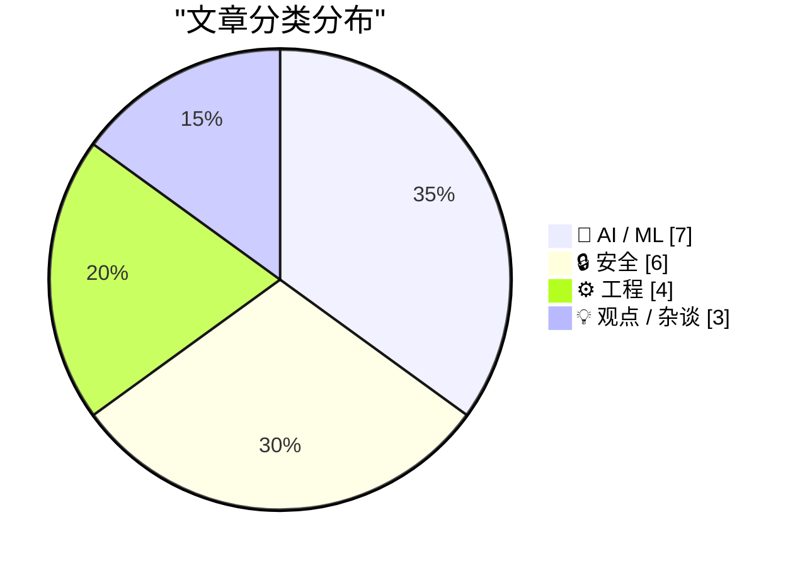

今日技术圈焦点集中在AI编程工具的双刃剑效应：一方面，AI正加速改变软件开发范式，70位大厂开发者的调研显示AI Agent已开始"锚定"代码生产，业界可选择用它产出更高质量的代码；另一方面，AI编程带来的系统宕机事故频发、幻觉问题以及形式化规格处理等局限也被广泛讨论，开发者对抽象层级提升的代价产生反思。同时，网络安全领域也受关注，伊朗黑客对医疗器械公司Stryker发起数据擦除攻击，微软发布3月例行安全更新修复77个漏洞。

<!--more-->

## 🏆 今日必读

🥇 **编程之后：计算机编程的终结**

[Coding After Coders: The End of Computer Programming as We Know It](https://simonwillison.net/2026/Mar/12/coding-after-coders/#atom-everything) — simonwillison.net · 6 小时前 · 🤖 AI / ML

> 本文探讨AI辅助开发对软件行业的深远影响，采访超过70位来自Google、Amazon、Microsoft、Apple等公司的开发者。 Clive Thompson在NYT Magazine的深度报道指出，尽管AI Agent可能产生幻觉，但开发者可以将其"锚定在现实"中，因为代码可以被测试和验证。 文章认为这可能是计算机编程职业的转折点，编程工作性质将发生根本性变化。

💡 **为什么值得读**: 如果你关心AI将如何改变软件开发职业，这篇面向大众读者的深度报道提供了行业全貌和关键洞察。

🏷️ AI coding, programming jobs, future of work

🥈 **MALUS - 无菌室即服务**

[MALUS - Clean Room as a Service](https://simonwillison.net/2026/Mar/12/malus/#atom-everything) — simonwillison.net · 5 小时前 · ⚙️ 工程

> MALUS是一个讽刺性项目，模仿"许可证清洗"（license washing）现象，声称其专有AI机器人可从零独立重建任何开源项目。 该项目宣称生成的是"法律上不同的代码"，无归属要求、无Copyleft约束，被作者评价为"太精准了"。 讽刺背后反映的是开源许可证在实际执行中的困境。

💡 **为什么值得读**: 对开源许可证和AI法律问题感兴趣的开发者能从这个幽默却深刻的讽刺项目中获得启示。

🏷️ open source, licensing, satire, compliance

🥉 **AI应该帮助我们产出更好的代码**

[AI should help us produce better code](https://simonwillison.net/guides/agentic-engineering-patterns/better-code/#atom-everything) — simonwillison.net · 2 天前 · 🤖 AI / ML

> 作者指出开发者担心使用AI工具会导致代码质量下降，但强调"用Agent产出更差的代码是一种选择"。 建议从技术债务角度思考——采用AI时应该修复流程中损害质量的环节，而非顺其自然。 核心观点是：我们完全可以选择用AI产出更好的代码，关键是建立正确的工程实践。

💡 **为什么值得读**: 如果你正在引入AI编程工具并关心代码质量，这篇提供了具体工程指导原则。

🏷️ AI code quality, agentic engineering, software craftsmanship

---

## 📊 数据概览

| 扫描源 | 抓取文章 | 时间范围 | 精选 |
|:---:|:---:|:---:|:---:|
| 88/92 | 2493 篇 → 62 篇 | 72h | **20 篇** |

### 分类分布

### 🏷️ 话题标签

**llm**(3) · **privacy**(3) · **ai coding**(2) · hardware(2) · security(2) · programming jobs(1) · future of work(1) · open source(1) · licensing(1) · satire(1) · compliance(1) · ai code quality(1) · agentic engineering(1) · software craftsmanship(1) · iran hackers(1) · medical devices(1) · wiper attack(1) · cybersecurity(1) · microsoft patch tuesday(1) · vulnerabilities(1)

---

## 🤖 AI / ML

### 1. 编程之后：计算机编程的终结

[Coding After Coders: The End of Computer Programming as We Know It](https://simonwillison.net/2026/Mar/12/coding-after-coders/#atom-everything) — **simonwillison.net** · 6 小时前 · ⭐ 26/30

> 本文探讨AI辅助开发对软件行业的深远影响，采访超过70位来自Google、Amazon、Microsoft、Apple等公司的开发者。 Clive Thompson在NYT Magazine的深度报道指出，尽管AI Agent可能产生幻觉，但开发者可以将其"锚定在现实"中，因为代码可以被测试和验证。 文章认为这可能是计算机编程职业的转折点，编程工作性质将发生根本性变化。

🏷️ AI coding, programming jobs, future of work

---

### 2. AI应该帮助我们产出更好的代码

[AI should help us produce better code](https://simonwillison.net/guides/agentic-engineering-patterns/better-code/#atom-everything) — **simonwillison.net** · 2 天前 · ⭐ 24/30

> 作者指出开发者担心使用AI工具会导致代码质量下降，但强调"用Agent产出更差的代码是一种选择"。 建议从技术债务角度思考——采用AI时应该修复流程中损害质量的环节，而非顺其自然。 核心观点是：我们完全可以选择用AI产出更好的代码，关键是建立正确的工程实践。

🏷️ AI code quality, agentic engineering, software craftsmanship

---

### 3. 一系列宕机事故，包括与AI编码工具相关的事故，正如期而至

[\"A spate of outages, including incidents tied to the use of AI coding tools\", right on schedule](https://garymarcus.substack.com/p/a-spate-of-outages-including-incidents) — **garymarcus.substack.com** · 2 天前 · ⭐ 24/30

> Gary Marcus评论AI编码工具导致的一系列系统宕机事故，指出这些事故具有"高冲击范围"（high blast radius）特点。 这类事故的发生被认为是AI编程工具广泛采用的必然结果，与此前关于AI工具安全性的警告相呼应。

🏷️ AI coding, outages, software reliability

---

### 4. 从零写一个LLM (第32e部分) — 干预：学习率

[Writing an LLM from scratch, part 32e -- Interventions: the learning rate](https://www.gilesthomas.com/2026/03/llm-from-scratch-32e-interventions-learning-rate) — **gilesthomas.com** · 2 天前 · ⭐ 24/30

> 作者继续从零构建GPT-2小规模基础模型的实验，使用Sebastian Raschka的《Build a Large Language Model (from Scratch)》作为训练代码基础。 本次分享了优化器配置细节：使用AdamW优化器，学习率设为0.0004，权重衰减为0.1，旨在改进测试损失。

🏷️ LLM, GPT-2, learning rate, training

---

### 5. LLM不擅长"凭感觉"处理规格说明

[LLMs are bad at vibing specifications](https://buttondown.com/hillelwayne/archive/llms-are-bad-at-vibing-specifications/) — **buttondown.com/hillelwayne** · 2 天前 · ⭐ 24/30

> 作者一年前曾称AI是"规格力量倍增器"，但现在发现当初学者使用AI编写形式化规格（如TLA+）时效果不佳。 GitHub上约4%的TLA+规格中包含"Claude"，说明有兴趣但缺乏技能。 案例研究显示AI在处理形式规格时存在明显局限，无法可靠地"凭感觉"理解规格。

🏷️ LLM, specifications, testing, verification

---

### 6. 我没有在说谎，我是在幻觉

[I'm Not Lying, I'm Hallucinating](https://idiallo.com/byte-size/im-not-lying-im-hallucinating?src=feed) — **idiallo.com** · 2 天前 · ⭐ 23/30

> 文章探讨术语"vibe coding"和"hallucination"的起源与流行。 Andrej Karpathy推广了"vibe coding"概念，描述不真正理解代码的编程体验。 "hallucination"一词虽非Karpathy发明，但他将其含义从"预测错误"重新定义为更接近"梦境或想象"。 文章指出LLM的所有失败都被框架为神经性疾病，值得反思。

🏷️ vibe coding, hallucination, LLM, AI programming

---

### 7. 美军真的怕Claude吗？论Anthropic被标记为供应链风险

[Is the US military actually afraid of Claude? A new theory of why Anthropic was labeled a supply chain risk.](https://garymarcus.substack.com/p/is-the-us-military-actually-afraid) — **garymarcus.substack.com** · 4 小时前 · ⭐ 21/30

> 作者Gary Marcus解读五角大楼将Anthropic标记为"供应链风险"的争议性决策，分析美军对Claude等AI模型的真实顾虑。文章试图解开这一 perplexing argument（令人困惑的论点），探讨背后可能的动机——是真正技术安全考量还是其他因素。

🏷️ Anthropic, Claude, military, supply chain

---

## 🔒 安全

### 8. 伊朗支持的黑客声称对医疗器械公司Stryker发起擦除攻击

[Iran-Backed Hackers Claim Wiper Attack on Medtech Firm Stryker](https://krebsonsecurity.com/2026/03/iran-backed-hackers-claim-wiper-attack-on-medtech-firm-stryker/) — **krebsonsecurity.com** · 1 天前 · ⭐ 24/30

> 与伊朗情报机构有关联的黑客组织声称对全球医疗器械公司Stryker发起数据擦除攻击。 该公司总部位于密歇根州，在爱尔兰（其美国以外最大枢纽）超过5000名员工被送回家。 公司总部语音留言表示正在经历"建筑紧急情况"。 这是针对医疗行业的又一起重大网络攻击事件。

🏷️ Iran hackers, medical devices, wiper attack, cybersecurity

---

### 9. 微软补丁星期二：2026年3月版

[Microsoft Patch Tuesday, March 2026 Edition](https://krebsonsecurity.com/2026/03/microsoft-patch-tuesday-march-2026-edition/) — **krebsonsecurity.com** · 2 天前 · ⭐ 24/30

> 微软本月发布安全更新，修复Windows操作系统及其他软件中至少77个漏洞。 与2月的5个零日漏洞相比，本月无紧急零日缺陷，但部分补丁仍需组织快速响应。 这是2026年3月的常规月度安全更新。

🏷️ Microsoft Patch Tuesday, vulnerabilities, security patches

---

### 10. 审视ENISA的包管理器安全建议

[Reviewing ENISA's Package Manager Advisory](https://nesbitt.io/2026/03/12/reviewing-enisas-package-manager-advisory.html) — **nesbitt.io** · 15 小时前 · ⭐ 22/30

> 本文是作者对ENISA（欧盟网络与信息安全局）发布的关于安全使用包管理器技术 advisory 的笔记与评析。ENISA作为欧盟权威安全机构，其技术建议通常面向成员国政府和关键基础设施运营商。此advisory可能涉及npm、pip等主流包管理器的供应链安全风险、依赖验证、最佳实践等内容，具体建议有待详读原文了解。

🏷️ ENISA, package manager, security

---

### 11. 每周更新494：数据泄露持续增长

[Weekly Update 494](https://www.troyhunt.com/weekly-update-494/) — **troyhunt.com** · 2 天前 · ⭐ 22/30

> Troy Hunt更新了Have I Been Pwned（HIBP）网站的近况：12年来他平均每4.7天加载一个数据泄露事件，至今共收录959个。但上周（截至文章发布）仅两天就新增5个泄露，相当于数周的量级。此文为HIBP运营周报，反映出数据泄露事件仍在加速增长。

🏷️ data breach, HIBP, security, privacy

---

### 12. Apple平台安全指南新增MacBook Neo屏幕摄像头指示灯说明

[Apple's Platform Security Guide Adds a Brief Note on the MacBook Neo's On-Screen Camera Indicator](https://support.apple.com/guide/security/mac-on-screen-camera-indicator-light-sec75a2d237d/1/web/1) — **daringfireball.net** · 1 小时前 · ⭐ 21/30

> Apple在平台安全指南中新增关于MacBook Neo的说明：其将系统软件与A18 Pro专用芯片结合，为摄像头画面提供额外安全防护 architecture，旨在防止任何不受信任的软件——即使拥有macOS root或kernel权限——在未同时点亮屏幕摄像头指示灯的情况下调用摄像头。除传统菜单栏绿色图标外，Neo屏幕右上角还有绿色圆点作为安全指示灯，即使菜单栏隐藏也可见。

🏷️ MacBook Neo, camera security, Apple Silicon, hardware

---

### 13. 训练数据从何而来？

[Where did you think the training data was coming from?](https://idiallo.com/blog/where-did-the-training-data-come-from-meta-ai-rayban-glasses?src=feed) — **idiallo.com** · 1 天前 · ⭐ 21/30

> 作者反思了Meta智能眼镜将数据直接上传Facebook服务器的争议，认为这并非意料之外。他以扎克伯格给笔记本摄像头和麦克风贴黑胶带的往事为例，指出连科技巨头CEO都不信任自己的设备。Windows 7时代用户可假设默认行为不窥探隐私，但Windows 10/11要求绑定在线账户，激励结构已变，用户隐私假设不再成立。

🏷️ privacy, Meta, AI glasses, data collection

---

## ⚙️ 工程

### 14. MALUS - 无菌室即服务

[MALUS - Clean Room as a Service](https://simonwillison.net/2026/Mar/12/malus/#atom-everything) — **simonwillison.net** · 5 小时前 · ⭐ 24/30

> MALUS是一个讽刺性项目，模仿"许可证清洗"（license washing）现象，声称其专有AI机器人可从零独立重建任何开源项目。 该项目宣称生成的是"法律上不同的代码"，无归属要求、无Copyleft约束，被作者评价为"太精准了"。 讽刺背后反映的是开源许可证在实际执行中的困境。

🏷️ open source, licensing, satire, compliance

---

### 15. 软件本体感

[Software Proprioception](https://unsung.aresluna.org/software-proprioception/) — **daringfireball.net** · 9 小时前 · ⭐ 22/30

> 文章探讨了软件应该"感知"自身运行的硬件维度与特性的概念，作者将这种能力比喻为"本体感受"（proprioception）——就像人闭眼时仍能准确触摸鼻尖一样。作者以macOS菜单栏图标定位为例，说明软件可以主动指向（point to）而非仅仅描述（describe）操作方法，从而降低认知负担。这一理念可应用于软硬件深度集成的场景，如利用设备特性创造更直观的用户交互体验。

🏷️ software, hardware, proprioception, UX

---

### 16. Git Checkout、Reset与Restore命令对比

[Git Checkout, Reset and Restore](https://susam.net/git-checkout-reset-restore.html) — **susam.net** · 1 天前 · ⭐ 22/30

> 文章对比了Git 2.23引入的git restore命令与传统的git checkout、git reset用法差异。作者指出虽然这些命令可完成类似任务（如重置工作树、索引），但并非完全等价。git restore在语义上更清晰，专门用于恢复文件状态，而checkout和reset功能更复杂。文章通过示例仓库演示了各命令的具体用法及区别。

🏷️ git, version control, commands

---

### 17. 只用Postgres

[Just Use Postgres](https://nesbitt.io/2026/03/10/just-use-postgres.html) — **nesbitt.io** · 2 天前 · ⭐ 21/30

> 文章将"只用Postgres"的理念推向极致：实现git push即可部署到单个Postgres进程中运行。作者探索了以Postgres作为完整应用运行时和部署目标的可行性，突破传统将Postgres仅视为数据库的用法，探讨其作为轻量应用平台的潜力。

🏷️ Postgres, git push, deployment

---

## 💡 观点 / 杂谈

### 18. 我不确定我是否喜欢在更高抽象层级工作

[I don't know if I like working at higher levels of abstraction](https://xeiaso.net/blog/2026/ai-abstraction/) — **xeiaso.net** · 2 天前 · ⭐ 23/30

> 作者反思AI工具推动编程向更高抽象层级发展的趋势，表达对这种"代价"的疑虑。 AI降低了编程门槛，但可能以牺牲对底层机制的理解为代价。 文章探讨了抽象层级提升对开发者技能和职业发展的潜在影响。

🏷️ abstraction, AI tools, development

---

### 19. AI"记者"证明媒体老板不在乎

[Pluralistic: AI "journalists" prove that media bosses don't give a shit (11 Mar 2026)](https://pluralistic.net/2026/03/11/modal-dialog-a-palooza/) — **pluralistic.net** · 1 天前 · ⭐ 21/30

> 本文是Cory Doctorow对Ed Zitron关于AI公司财务分析文章的评论。Ed Zitron擅长将AI公司资产负债表解读为"信息战"，其分析揭示了AI热潮背后的财务真相。Cory借此批评媒体老板对AI"记者"（实际是AI生成内容）的态度，暗示这反映了资本对内容质量的漠视。

🏷️ AI journalists, media, journalism, copyright

---

### 20. 广告技术即法西斯技术

[Pluralistic: Ad-tech is fascist tech (10 Mar 2026)](https://pluralistic.net/2026/03/10/ice-tech/) — **pluralistic.net** · 2 天前 · ⭐ 21/30

> 文章是Cory Doctorow对"监控资本主义"和"广告技术"的批评。他引用"膨胀化"（enshittification）理论，指出当今数字生活的种种问题源于可预见的政策选择，创造了对最坏想法最有利的环境。以Google从内容广告向监控广告转型为例，论证广告技术本质上就是 surveillance（监控）技术。

🏷️ ad-tech, surveillance, privacy, fascism

---

*生成于 2026-03-13 01:23 | 扫描 88 源 → 获取 2493 篇 → 精选 20 篇*
*基于 [Hacker News Popularity Contest 2025](https://refactoringenglish.com/tools/hn-popularity/) RSS 源列表，由 [Andrej Karpathy](https://x.com/karpathy) 推荐*
*由「懂点儿AI」制作，欢迎关注同名微信公众号获取更多 AI 实用技巧 💡*
