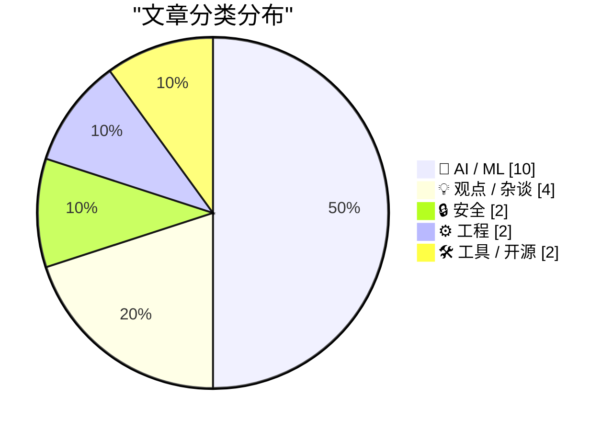
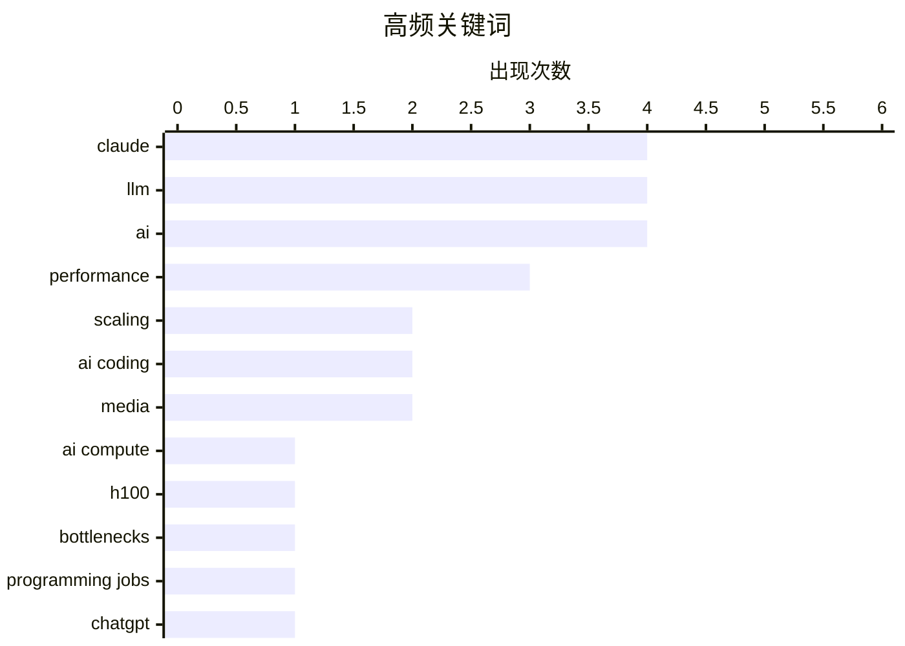

AI 正在重塑软件开发范式，编程工作从手动编码加速转向监督 AI 系统的模式，开发者角色向更高层次的设计与架构方向演进。与此同时，关于大语言模型是否已触及性能天花板的讨论升温，算力瓶颈与基准测试数据收窄的现象引发行业反思。在竞争层面，Anthropic 凭借 100 万上下文窗口的定价优势抢占市场，而 Meta 新模型延迟发布则反映出头部玩家间的分化加剧。

<!--more-->

## 🏆 今日必读

🥇 **深度解析 AI 算力扩展的三大瓶颈**

[Dylan Patel — Deep dive on the 3 big bottlenecks to scaling AI compute](https://www.dwarkesh.com/p/dylan-patel) — dwarkesh.com · 9 小时前 · 🤖 AI / ML

> 本文深入分析了当前限制 AI 算力扩展的三大核心瓶颈问题。Dylan Patel 探讨了硬件层面（如 H100 GPU 等）、软件层面以及系统架构层面的关键挑战。H100 GPU 在当前市场中的价值相比三年前大幅提升，反映出 AI 算力需求的持续增长。文章还讨论了为何某些 GPU 在特定场景下变得更加稀缺和珍贵。

💡 **为什么值得读**: 对于关注 AI 基础设施和算力成本的从业者，这篇文章提供了关于硬件瓶颈的深度洞察，帮助理解当前 AI 发展面临的根本性限制。

🏷️ AI compute, H100, bottlenecks, scaling

🥈 **编程之后：计算机编程的终结**

[Coding After Coders: The End of Computer Programming as We Know It](https://simonwillison.net/2026/Mar/12/coding-after-coders/#atom-everything) — simonwillison.net · 1 天前 · 🤖 AI / ML

> 纽约时报杂志记者 Clive Thompson 采访超过 70 位来自 Google、Amazon、Apple、Microsoft 等公司的软件开发者，探讨 AI 如何改变编程工作。AI 代理现在能够自主生成代码并推送到生产环境，开发者可以通过测试和持续集成来"牵引"AI 确保代码质量。软件工程正在从手动编码转向监督 AI 系统的工作模式。

💡 **为什么值得读**: 这篇文章是对当前 AI 编程革命最全面的行业观察之一，适合任何关心软件工程师职业未来的读者。

🏷️ AI coding, programming jobs, Claude, ChatGPT

🥉 **伊朗支持的黑客声称对医疗器械公司 Stryker 发动擦除攻击**

[Iran-Backed Hackers Claim Wiper Attack on Medtech Firm Stryker](https://krebsonsecurity.com/2026/03/iran-backed-hackers-claim-wiper-attack-on-medtech-firm-stryker/) — krebsonsecurity.com · 2 天前 · 🔒 安全

> 一个与伊朗情报机构有关联的黑客活动组织声称对全球医疗器械公司 Stryker 发动了数据擦除攻击。Stryker 总部位于密歇根州，在爱尔兰（其美国以外最大枢纽）有超过 5000 名员工被通知居家办公。公司总部 voicemail 证实正在经历"建筑紧急情况"。

💡 **为什么值得读**: 这是近期针对关键基础设施的知名网络攻击事件，对关注医疗行业网络安全的读者具有重要参考价值。

🏷️ Iran, hacking, medical device, Stryker

---

## 📊 数据概览

| 扫描源 | 抓取文章 | 时间范围 | 精选 |
|:---:|:---:|:---:|:---:|
| 88/92 | 2510 篇 → 69 篇 | 72h | **20 篇** |

### 分类分布

### 高频关键词

---

## 🤖 AI / ML

### 1. 深度解析 AI 算力扩展的三大瓶颈

[Dylan Patel — Deep dive on the 3 big bottlenecks to scaling AI compute](https://www.dwarkesh.com/p/dylan-patel) — **dwarkesh.com** · 9 小时前 · ⭐ 26/30

> 本文深入分析了当前限制 AI 算力扩展的三大核心瓶颈问题。Dylan Patel 探讨了硬件层面（如 H100 GPU 等）、软件层面以及系统架构层面的关键挑战。H100 GPU 在当前市场中的价值相比三年前大幅提升，反映出 AI 算力需求的持续增长。文章还讨论了为何某些 GPU 在特定场景下变得更加稀缺和珍贵。

🏷️ AI compute, H100, bottlenecks, scaling

---

### 2. 编程之后：计算机编程的终结

[Coding After Coders: The End of Computer Programming as We Know It](https://simonwillison.net/2026/Mar/12/coding-after-coders/#atom-everything) — **simonwillison.net** · 1 天前 · ⭐ 25/30

> 纽约时报杂志记者 Clive Thompson 采访超过 70 位来自 Google、Amazon、Apple、Microsoft 等公司的软件开发者，探讨 AI 如何改变编程工作。AI 代理现在能够自主生成代码并推送到生产环境，开发者可以通过测试和持续集成来"牵引"AI 确保代码质量。软件工程正在从手动编码转向监督 AI 系统的工作模式。

🏷️ AI coding, programming jobs, Claude, ChatGPT

---

### 3. Meta 因性能担忧延迟发布新 AI 模型 Avocado

[NYT: 'Meta Delays Rollout of New AI Model After Performance Concerns'](https://www.nytimes.com/2026/03/12/technology/meta-avocado-ai-model-delayed.html?unlocked_article_code=1.S1A.vI_6.4j717gwtFem0) — **daringfireball.net** · 8 小时前 · ⭐ 25/30

> Meta 代号为"Avocado"的新基础 AI 模型内部测试显示，在推理、编码和写作方面落后于 Google、OpenAI 和 Anthropic 的领先模型。该模型虽优于 Meta 此前的版本和 Google Gemini 2.5，但不及 Gemini 3.0。Meta 已将发布从本月推迟至至少 5 月，并曾讨论临时授权使用 Gemini 来驱动其 AI 产品。

🏷️ Meta, AI model, delay, performance

---

### 4. LLM 是否不再进步？

[Are LLMs not getting better?](https://entropicthoughts.com/no-swe-bench-improvement) — **entropicthoughts.com** · 2 天前 · ⭐ 25/30

> 探讨大型语言模型是否正在达到性能提升瓶颈的问题。文章引用了 SWE-bench 等基准测试数据，讨论近期模型改进幅度是否在收窄，以及这可能意味着什么。

🏷️ LLM, AI, performance, scaling

---

### 5. Opus 4.6 和 Sonnet 4.6 正式推出 100 万上下文

[1M context is now generally available for Opus 4.6 and Sonnet 4.6](https://simonwillison.net/2026/Mar/13/1m-context/#atom-everything) — **simonwillison.net** · 7 小时前 · ⭐ 24/30

> Anthropic 的 Claude Opus 4.6 和 Sonnet 4.6 模型正式支持 100 万上下文窗口，且在完整 100 万窗口范围内采用标准定价，无长上下文额外费用。对比之下，OpenAI 的 GPT-5.4 在超过 272,000 tokens 时额外收费，Google Gemini 3.1 Pro 在超过 200,000 tokens 时加价。

🏷️ Claude, LLM, context window, 1M tokens

---

### 6. 再谈三大 AI 狂热现象

[Pluralistic: Three more AI psychoses (12 Mar 2026)](https://pluralistic.net/2026/03/12/normal-technology/) — **pluralistic.net** · 23 小时前 · ⭐ 24/30

> 作者讨论了"AI psychosis"（AI 狂热症）这一术语的实用性及其面临的争议。文章认为这个术语虽有用，但可能因涉及医学问题而遭到部分人反对。作者认为在术语被替换为冗长晦涩的表述之前，应当继续使用这个生动的比喻。

🏷️ AI, psychosis, media, technology

---

### 7. AI"记者"证明媒体老板不在乎

[Pluralistic: AI "journalists" prove that media bosses don't give a shit (11 Mar 2026)](https://pluralistic.net/2026/03/11/modal-dialog-a-palooza/) — **pluralistic.net** · 2 天前 · ⭐ 24/30

> 作者讨论了 AI 行业记者 Ed Zitron 的调查报道如何揭示 AI 公司的问题。Ed 通过仔细分析 AI 公司财报来揭露行业泡沫，他的文章将财务分析与尖锐批评结合。文中指出媒体老板对 AI 的态度是"不在乎"——他们只关心流量而非真相。

🏷️ AI journalists, media, journalism, automation

---

### 8. 关于 AI 最重要却无人提出的问题

[The most important question nobody's asking about AI](https://www.dwarkesh.com/p/dow-anthropic) — **dwarkesh.com** · 2 天前 · ⭐ 23/30

> 这是关于最高风险谈判的前言，探讨 AI 领域一个关键但常被忽视的问题。文章前缀标题为"历史上最高风险谈判的前言"，暗示讨论的是 AI 发展中的重大抉择或地缘政治考量。

🏷️ AI, negotiations, future, strategy

---

### 9. 使用 Qwen 3.5 进行文档 OCR

[How to use the Qwen 3.5 LLMs to OCR documents](https://martinalderson.com/posts/how-to-use-qwen-3-5-to-ocr-documents/?utm_source=rss&utm_medium=rss&utm_campaign=feed) — **martinalderson.com** · 1 天前 · ⭐ 22/30

> 介绍利用 Qwen 3.5 开源权重模型进行文档 OCR 的两种方式：本地在消费级硬件上运行，或通过 OpenRouter API 以极低成本调用。提供了实际可操作的完整方案。

🏷️ Qwen, OCR, LLM, document processing

---

### 10. 美军真的害怕 Claude 吗？

[Is the US military actually afraid of Claude? A new theory of why Anthropic was labeled a supply chain risk.](https://garymarcus.substack.com/p/is-the-us-military-actually-afraid) — **garymarcus.substack.com** · 1 天前 · ⭐ 21/30

> Gary Marcus 分析 Anthropic 被五角大楼标记为供应链风险的原因，探讨美军是否真的恐惧 Claude，尝试解开这一令人困惑的论断背后的逻辑。

🏷️ Anthropic, Claude, Pentagon, AI safety

---

## 💡 观点 / 杂谈

### 11. AI 之后程序员做什么？

[What do coders do after AI?](https://anildash.com/2026/03/13/coders-after-ai/) — **anildash.com** · 1 天前 · ⭐ 25/30

> 作者 Anil Dash 与纽约时报杂志讨论了 AI 时代程序员的未来。LLM 正在快速演进成为"软件工厂"，从根本上改变软件创建的经济学和权力格局。虽然有些公司确实在用 AI 作为裁员借口，但也有越来越多的程序员以不同方式使用这些工具——从监督 AI 生成代码转向更高层次的设计和架构工作。

🏷️ AI, coders, career, LLM

---

### 12. AI 编码时代开发者分裂

[Quoting Les Orchard](https://simonwillison.net/2026/Mar/12/les-orchard/#atom-everything) — **simonwillison.net** · 1 天前 · ⭐ 22/30

> AI 辅助编程暴露了开发者群体中长期存在的分歧：热爱编程工艺的"匠人"与追求快速交付的"效率派"过去使用相同的工具和工作流程，动机差异不可见。AI 出现后，开发者可以选择让机器写代码或坚持手写代码两条路径，原本隐藏的内在驱动力因此变得可见。

🏷️ AI-assisted coding, developer divide, programming

---

### 13. MALUS - 清洁室即服务

[MALUS - Clean Room as a Service](https://simonwillison.net/2026/Mar/12/malus/#atom-everything) — **simonwillison.net** · 1 天前 · ⭐ 20/30

> MALUS 是对"许可证清洗"现象的尖锐讽刺：声称其专有 AI 机器人能独立从头重建任何开源项目，生成"法律上不同的代码"，规避开源许可证的归属和 copyleft 要求。

🏷️ open source, license, satire

---

### 14. 大科技公司需要大 ego

[Big tech engineers need big egos](https://seangoedecke.com/big-tech-needs-big-egos/) — **seangoedecke.com** · 1 小时前 · ⭐ 20/30

> 作者挑战"软件工程师不应有大 ego"的常见观点，认为在大科技公司生存实际上需要一定的自我认知。文章分析最有效的工程师在某些情境下高 ego，在另一些情境下却出人意料地低 ego。

🏷️ ego, engineering culture, workplace, tech

---

## 🔒 安全

### 15. 伊朗支持的黑客声称对医疗器械公司 Stryker 发动擦除攻击

[Iran-Backed Hackers Claim Wiper Attack on Medtech Firm Stryker](https://krebsonsecurity.com/2026/03/iran-backed-hackers-claim-wiper-attack-on-medtech-firm-stryker/) — **krebsonsecurity.com** · 2 天前 · ⭐ 25/30

> 一个与伊朗情报机构有关联的黑客活动组织声称对全球医疗器械公司 Stryker 发动了数据擦除攻击。Stryker 总部位于密歇根州，在爱尔兰（其美国以外最大枢纽）有超过 5000 名员工被通知居家办公。公司总部 voicemail 证实正在经历"建筑紧急情况"。

🏷️ Iran, hacking, medical device, Stryker

---

### 16. MacBook Neo 屏幕摄像头指示灯安全机制

[Apple's Platform Security Guide Adds a Brief Note on the MacBook Neo's On-Screen Camera Indicator](https://support.apple.com/guide/security/mac-on-screen-camera-indicator-light-sec75a2d237d/1/web/1) — **daringfireball.net** · 1 天前 · ⭐ 21/30

> Apple Platform Security Guide 新增说明：MacBook Neo 结合 A18 Pro 专用硅元素，即使拥有 macOS root 或内核权限的恶意软件也无法在摄像头工作时绕过屏幕上的绿色指示灯。指示灯位于菜单栏右上角，全屏模式下也可见。

🏷️ MacBook Neo, camera, security, Apple

---

## ⚙️ 工程

### 17. 软件本体感觉

[Software Proprioception](https://unsung.aresluna.org/software-proprioception/) — **daringfireball.net** · 1 天前 · ⭐ 22/30

> 作者引入"本体感觉"概念——如闭眼时手指能准确触及鼻尖——来类比软件对硬件维度和特性的感知能力。核心观点是"指向，不要描述"：用箭头直接指示比用文字描述更易处理，能降低认知负荷。

🏷️ software, hardware, proprioception, UX

---

### 18. Shopify Liquid 性能提升 53%

[Shopify/liquid: Performance: 53% faster parse+render, 61% fewer allocations](https://simonwillison.net/2026/Mar/13/liquid/#atom-everything) — **simonwillison.net** · 21 小时前 · ⭐ 20/30

> Shopify CEO Tobias Lütke 使用 Andrej Karpathy 的 autoresearch 系统（AI 编码代理进行数百次半自主实验），为 Liquid 模板引擎发现数十个性能微优化，最终实现解析 + 渲染快 53%、内存分配减少 61% 的显著提升。

🏷️ Liquid, Shopify, performance, Ruby

---

## 🛠 工具 / 开源

### 19. 我用 Claude Code 构建自己的会计软件

['Software Bonkers'](https://craigmod.com/essays/software_bonkers/) — **daringfireball.net** · 10 小时前 · ⭐ 21/30

> Craig Mod 因现有会计软件无法满足需求，用 Claude Code 耗时五天构建了自定义会计系统。该软件完全本地运行、支持多货币、获取历史汇率、能处理各种 CSV、懂美国和日本税务规则、可学习用户分类习惯、还能自动整理 1099、K1 和医疗账单。

🏷️ Claude, accounting, custom software, AI coding

---

### 20. Forge：统一 Git CLI 工具

[Forge](https://nesbitt.io/2026/03/13/forge.html) — **nesbitt.io** · 15 小时前 · ⭐ 21/30

> Forge 是一个统一的命令行工具，同时支持 GitHub、GitLab、Gitea、Forgejo 和 Bitbucket 五个主流 Git 平台，简化跨平台的版本控制操作。

🏷️ CLI, GitHub, GitLab, dev-tools

---

*生成于 2026-03-14 01:39 | 扫描 88 源 → 获取 2510 篇 → 精选 20 篇*
*基于 [Hacker News Popularity Contest 2025](https://refactoringenglish.com/tools/hn-popularity/) RSS 源列表，由 [Andrej Karpathy](https://x.com/karpathy) 推荐*
*由「懂点儿 AI」制作，欢迎关注同名微信公众号获取更多 AI 实用技巧 💡*
