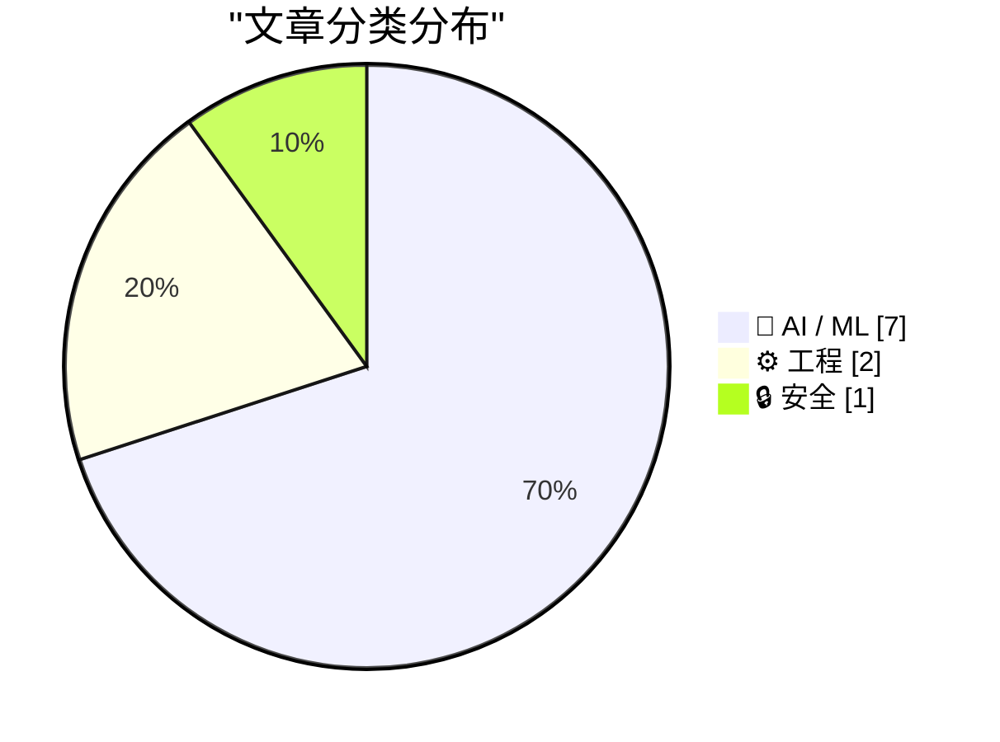
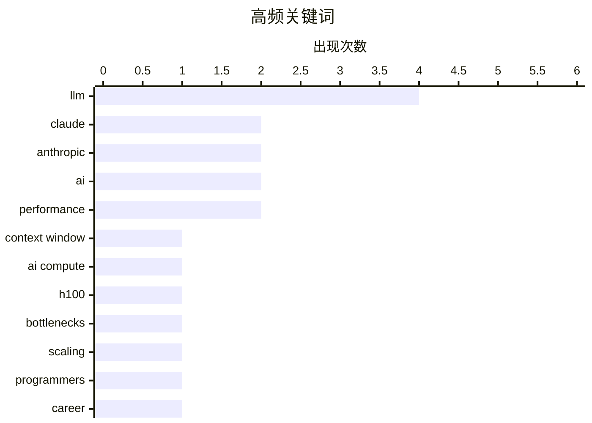

今日技术圈聚焦三大趋势：AI模型竞争格局生变，Anthropic Claude以100万token上下文窗口和标准定价强势出击，而Meta新模型因性能不达预期被迫延期；同时，AI对程序员职业未来的讨论持续升温，业界开始反思编程工作将被重塑的程度；此外，AI算力扩展的硬件瓶颈仍是关键挑战，算力成本与供给成为行业焦点。

<!--more-->


> 来自 Karpathy 推荐的 92 个顶级技术博客，AI 精选 Top 10

## 🏆 今日必读

🥇 **Claude Opus 4.6 和 Sonnet 4.6 正式支持 100 万上下文窗口**

[1M context is now generally available for Opus 4.6 and Sonnet 4.6](https://simonwillison.net/2026/Mar/13/1m-context/#atom-everything) — simonwillison.net · 3 小时前 · 🤖 AI / ML

> Anthropic宣布Claude Opus 4.6和Sonnet 4.6正式支持100万token上下文窗口。更重要的是，标准定价适用于整个100万窗口，不收取长上下文额外费用。相比之下，OpenAI的GPT-5.4在超过272,000 tokens时加收费用，Gemini 3.1 Pro在超过200,000 tokens时也收取更高费用。这使得Claude在处理超长文档、完整代码库分析等场景下具有成本优势。

💡 **为什么值得读**: 如果你需要处理超长文本或代码库，Claude的100万上下文窗口配合标准定价是当前最具性价比的选择。

🏷️ Claude, LLM, context window, Anthropic

🥈 **Dylan Patel — Deep dive on the 3 big bottlenecks to scaling AI compute**

[Dylan Patel — Deep dive on the 3 big bottlenecks to scaling AI compute](https://www.dwarkesh.com/p/dylan-patel) — dwarkesh.com · 6 小时前 · 🤖 AI / ML

> Plus, why an H100 is worth more today than 3 years ago

🏷️ AI compute, H100, bottlenecks, scaling

🥉 **What do coders do after AI?**

[What do coders do after AI?](https://anildash.com/2026/03/13/coders-after-ai/) — anildash.com · 22 小时前 · 🤖 AI / ML

> For the New York Times Magazine this Sunday, I talked to Clive Thompson about one of the conversations that I'm having most often these days: What happens to coders in this current moment of extraordi

🏷️ AI, programmers, career, future of work

---

## 📊 数据概览

| 扫描源 | 抓取文章 | 时间范围 | 精选 |
|:---:|:---:|:---:|:---:|
| 89/92 | 2519 篇 → 54 篇 | 48h | **10 篇** |

### 分类分布



### 高频关键词



<details>
<summary>📈 纯文本关键词图（终端友好）</summary>

```
llm            │ ████████████████████ 4
claude         │ ██████████░░░░░░░░░░ 2
anthropic      │ ██████████░░░░░░░░░░ 2
ai             │ ██████████░░░░░░░░░░ 2
performance    │ ██████████░░░░░░░░░░ 2
context window │ █████░░░░░░░░░░░░░░░ 1
ai compute     │ █████░░░░░░░░░░░░░░░ 1
h100           │ █████░░░░░░░░░░░░░░░ 1
bottlenecks    │ █████░░░░░░░░░░░░░░░ 1
scaling        │ █████░░░░░░░░░░░░░░░ 1
```

</details>

### 🏷️ 话题标签

**llm**(4) · **claude**(2) · **anthropic**(2) · ai(2) · performance(2) · context window(1) · ai compute(1) · h100(1) · bottlenecks(1) · scaling(1) · programmers(1) · career(1) · future of work(1) · ai coding(1) · programming jobs(1) · developer tools(1) · meta ai(1) · model delay(1) · ai competition(1) · military(1)

---

## 🤖 AI / ML

### 1. Claude Opus 4.6 和 Sonnet 4.6 正式支持 100 万上下文窗口

[1M context is now generally available for Opus 4.6 and Sonnet 4.6](https://simonwillison.net/2026/Mar/13/1m-context/#atom-everything) — **simonwillison.net** · 3 小时前 · ⭐ 25/30

> Anthropic宣布Claude Opus 4.6和Sonnet 4.6正式支持100万token上下文窗口。更重要的是，标准定价适用于整个100万窗口，不收取长上下文额外费用。相比之下，OpenAI的GPT-5.4在超过272,000 tokens时加收费用，Gemini 3.1 Pro在超过200,000 tokens时也收取更高费用。这使得Claude在处理超长文档、完整代码库分析等场景下具有成本优势。

🏷️ Claude, LLM, context window, Anthropic

---

### 2. Dylan Patel — Deep dive on the 3 big bottlenecks to scaling AI compute

[Dylan Patel — Deep dive on the 3 big bottlenecks to scaling AI compute](https://www.dwarkesh.com/p/dylan-patel) — **dwarkesh.com** · 6 小时前 · ⭐ 25/30

> Plus, why an H100 is worth more today than 3 years ago

🏷️ AI compute, H100, bottlenecks, scaling

---

### 3. What do coders do after AI?

[What do coders do after AI?](https://anildash.com/2026/03/13/coders-after-ai/) — **anildash.com** · 22 小时前 · ⭐ 25/30

> For the New York Times Magazine this Sunday, I talked to Clive Thompson about one of the conversations that I'm having most often these days: What happens to coders in this current moment of extraordi

🏷️ AI, programmers, career, future of work

---

### 4. Coding After Coders: The End of Computer Programming as We Know It

[Coding After Coders: The End of Computer Programming as We Know It](https://simonwillison.net/2026/Mar/12/coding-after-coders/#atom-everything) — **simonwillison.net** · 1 天前 · ⭐ 24/30

> <p><strong><a href="https://www.nytimes.com/2026/03/12/magazine/ai-coding-programming-jobs-claude-chatgpt.html?unlocked_article_code=1.SlA.DBan.wbQDi-hptjj6">Coding After Coders: The End of Computer P

🏷️ AI coding, programming jobs, LLM, developer tools

---

### 5. NYT: ‘Meta Delays Rollout of New AI Model After Performance Concerns’

[NYT: ‘Meta Delays Rollout of New AI Model After Performance Concerns’](https://www.nytimes.com/2026/03/12/technology/meta-avocado-ai-model-delayed.html?unlocked_article_code=1.S1A.vI_6.4j717gwtFem0) — **daringfireball.net** · 5 小时前 · ⭐ 24/30

> Eli Tan, reporting for The New York Times:


  Meta’s new foundational A.I. model, which the company has been
working on for months, has fallen short of the performance of
leading A.I. models from riv

🏷️ Meta AI, LLM, model delay, AI competition

---

### 6. Is the US military actually afraid of Claude? A new theory of why Anthropic was labeled a supply chain risk.

[Is the US military actually afraid of Claude? A new theory of why Anthropic was labeled a supply chain risk.](https://garymarcus.substack.com/p/is-the-us-military-actually-afraid) — **garymarcus.substack.com** · 1 天前 · ⭐ 24/30

> Unpacking a perplexing argument from the Pentagon

🏷️ AI, Anthropic, Claude, military

---

### 7. Are LLMs not getting better?

[Are LLMs not getting better?](https://entropicthoughts.com/no-swe-bench-improvement) — **entropicthoughts.com** · 1 天前 · ⭐ 24/30

> 

🏷️ LLM, AI scaling, performance, improvements

---

## ⚙️ 工程

### 8. Software Proprioception

[Software Proprioception](https://unsung.aresluna.org/software-proprioception/) — **daringfireball.net** · 1 天前 · ⭐ 23/30

> Marcin Wichary:


  There are fun things you can do in software when it is aware of
the dimensions and features of its hardware. [...]

The rule here would be, perhaps, a version of “show, don’t tell.

🏷️ software, hardware, awareness, user experience

---

### 9. Shopify/liquid: Performance: 53% faster parse+render, 61% fewer allocations

[Shopify/liquid: Performance: 53% faster parse+render, 61% fewer allocations](https://simonwillison.net/2026/Mar/13/liquid/#atom-everything) — **simonwillison.net** · 18 小时前 · ⭐ 21/30

> <p><strong><a href="https://github.com/Shopify/liquid/pull/2056">Shopify/liquid: Performance: 53% faster parse+render, 61% fewer allocations</a></strong></p>
PR from Shopify CEO Tobias Lütke against L

🏷️ Liquid, Shopify, performance, Ruby

---

## 🔒 安全

### 10. Reviewing ENISA’s Package Manager Advisory

[Reviewing ENISA’s Package Manager Advisory](https://nesbitt.io/2026/03/12/reviewing-enisas-package-manager-advisory.html) — **nesbitt.io** · 1 天前 · ⭐ 22/30

> Notes on ENISA's Technical Advisory for Secure Use of Package Managers.

🏷️ ENISA, package manager, security, advisory

---

*生成于 2026-03-13 22:29 | 扫描 89 源 → 获取 2519 篇 → 精选 10 篇*
*基于 [Hacker News Popularity Contest 2025](https://refactoringenglish.com/tools/hn-popularity/) RSS 源列表，由 [Andrej Karpathy](https://x.com/karpathy) 推荐*
*由「懂点儿AI」制作，欢迎关注同名微信公众号获取更多 AI 实用技巧 💡*
