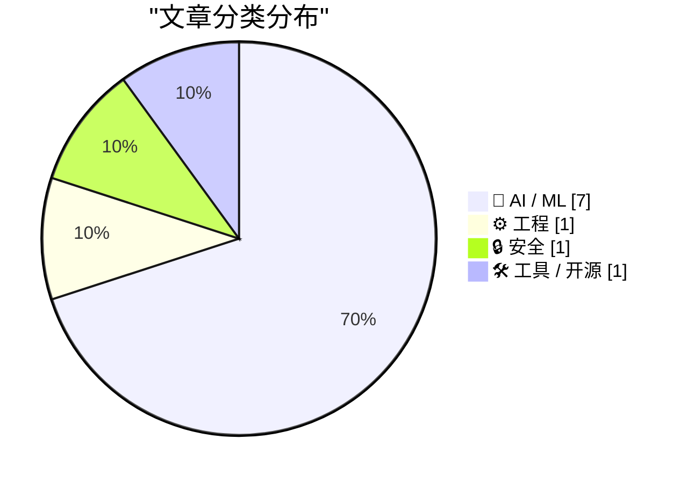

今日技术圈呈现AI应用深化与反思的双重面向：Anthropic推出百万token上下文窗口标志着长上下文AI进入实用化，但同时曝出AI生成垃圾PR导致开源项目Jazzband解散、Ars Technica因AI伪造引用解雇记者等乱象，揭示AI规模化应用带来的质量与安全挑战。大公司策略分化明显，苹果坚持不参与AI军备竞赛（资本支出仅140亿美元），而Meta据报计划因AI成本高企裁员20%，行业正处在了扩张与收缩的十字路口。

<!--more-->

## 🏆 今日必读

🥇 **Pragmatic Summit炉边对话：让编程代理工作的工程实践**

[My fireside chat about agentic engineering at the Pragmatic Summit](https://simonwillison.net/2026/Mar/14/pragmatic-summit/#atom-everything) — simonwillison.net · 1 天前 · 🤖 AI / ML

> Simon Willison在Pragmatic Summit与Eric Lui进行了关于Agentic Engineering的炉边对话，探讨了AI adoption的不同阶段。他分享了让coding agents有效工作的工程实践，包括prompt engineering、tool use和agent架构等核心概念。视频已上传YouTube。

💡 **为什么值得读**: Simon Willison是AI工程领域的知名实践者，这场对话提供了关于如何构建有效AI代理的实战见解，适合想深入了解AI工程实践的开发者。

🏷️ agentic engineering, LLM, AI agents, engineering

🥈 **AI垃圾PR泛滥导致Jazzband项目解散**

[Quoting Jannis Leidel](https://simonwillison.net/2026/Mar/14/jannis-leidel/#atom-everything) — simonwillison.net · 1 天前 · ⚙️ 工程

> GitHub正经历"slopocalypse"——AI生成的垃圾PR和issue泛滥成灾。开源组织Jazzband因此被迫关闭，因为其开放成员资格和共享push访问的模式变得不可持续。数据显示只有1/10的AI生成PR符合项目标准，curl项目因bug bounty确认率降至5%以下而被迫关闭，GitHub甚至推出了禁用pull request的"kill switch"功能。

💡 **为什么值得读**: 这是AI如何实际影响开源生态系统的具体案例，揭示了开源社区面临的新兴挑战和生存危机，对关注开源未来的开发者有重要参考价值。

🏷️ open source, AI spam, GitHub, Jazzband

🥉 **Reuters: 'Meta Planning Sweeping Layoffs as AI Costs Mount'**

[Reuters: 'Meta Planning Sweeping Layoffs as AI Costs Mount'](https://www.reuters.com/business/world-at-work/meta-planning-sweeping-layoffs-ai-costs-mount-2026-03-14/) — daringfireball.net · 6 小时前 · 🤖 AI / ML

> Katie Paul, Jeff Horwitz and Deepa Seetharaman, reporting for Reuters:
> Meta is planning sweeping layoffs that could affect 20% or more of the company, three sources familiar with the matter told Reuters.

🏷️ Meta, layoffs, AI costs, big tech

---

## 📊 数据概览

| 扫描源 | 抓取文章 | 时间范围 | 精选 |
|:---:|:---:|:---:|:---:|
| 87/92 | 2482 篇 → 29 篇 | 48h | **10 篇** |

### 分类分布

### 高频关键词

- **llm**(3) · **big tech**(2) · **apple**(2) · agentic engineering(1) · ai agents(1) · engineering(1) · open source(1) · ai spam(1) · github(1) · jazzband(1) · meta(1) · layoffs(1)

---

## 🤖 AI / ML

### 1. Pragmatic Summit炉边对话：让编程代理工作的工程实践

[My fireside chat about agentic engineering at the Pragmatic Summit](https://simonwillison.net/2026/Mar/14/pragmatic-summit/#atom-everything) — **simonwillison.net** · 1 天前 · ⭐ 26/30

> Simon Willison在Pragmatic Summit与Eric Lui进行了关于Agentic Engineering的炉边对话，探讨了AI adoption的不同阶段。他分享了让coding agents有效工作的工程实践，包括prompt engineering、tool use和agent架构等核心概念。视频已上传YouTube。

🏷️ agentic engineering, LLM, AI agents, engineering

---

### 2. Reuters: 'Meta Planning Sweeping Layoffs as AI Costs Mount'

[Reuters: 'Meta Planning Sweeping Layoffs as AI Costs Mount'](https://www.reuters.com/business/world-at-work/meta-planning-sweeping-layoffs-ai-costs-mount-2026-03-14/) — **daringfireball.net** · 6 小时前 · ⭐ 24/30

> Katie Paul, Jeff Horwitz and Deepa Seetharaman, reporting for Reuters: Meta is planning sweeping layoffs that could affect 20% or more of the company, three sources familiar with the matter told Reuters.

🏷️ Meta, layoffs, AI costs, big tech

---

### 3. Claude 1M上下文长度：真正的突破

[Why Claude's new 1M context length is a big deal](https://martinalderson.com/posts/why-claudes-new-1m-context-length-is-a-big-deal/) — **martinalderson.com** · 22 小时前 · ⭐ 24/30

> Anthropic在Opus 4.6和Sonnet 4.6上推出的100万token上下文窗口是真正的技术突破，且不加价。这一进展使得处理超长文档、代码库分析、多文件任务成为可能，标志着长上下文AI模型进入实用化阶段。

🏷️ Claude, context length, Anthropic, LLM

---

### 4. Ars Technica因AI伪造引用解雇记者

[Ars Technica Fires Reporter Benj Edwards After He Published Story With AI-Fabricated Quotes](https://futurism.com/artificial-intelligence/ars-technica-fires-reporter-ai-quotes) — **daringfireball.net** · 1 天前 · ⭐ 23/30

> Ars Technica解雇了记者Benj Edwards，因其发表的文章包含AI伪造的真实人物引用。事件源于一篇关于AI agent发布针对人类工程师Scott Shambaugh的负面报道，Shambaugh指出文章中的引语并非出自他口。Ars随后撤稿并承认使用了"AI工具生成的伪造引用"。Edwards在Bluesky上承担了全部责任。

🏷️ AI, fake quotes, journalism, Ars Technica

---

### 5. 59%招聘经理承认用AI作为裁员的借口

[Blaming AI for Layoffs: 'It Plays Better'](https://www.resume.org/the-great-turnover-9-in-10-companies-plan-to-hire-in-2026-yet-6-in-10-will-have-layoffs-2/) — **daringfireball.net** · 5 小时前 · ⭐ 22/30

> Resume.org调查了1000名美国招聘经理，发现59%的人承认在解释招聘冻结或裁员时会更强调AI因素，因为他们认为这比提及财务约束更容易被利益相关者接受。该调查揭示了AI在企业沟通中被用作"替罪羊"的现象。

🏷️ AI layoffs, hiring, tech industry, stakeholders

---

### 6. 苹果拒绝AI军备竞赛：最明智的公司策略？

[Horace Dediu on Apple Sitting Out the AI Spending Race](https://asymco.com/2026/03/10/the-most-brilliant-move-in-corporate-history/) — **daringfireball.net** · 6 小时前 · ⭐ 22/30

> 分析师Horace Dediu指出苹果拒绝参与AI基础设施建设热潮。亚马逊今年在AI数据中心投入2000亿美元，谷歌1850亿，微软1140亿，Meta 1350亿，合计6500亿美元。而苹果资本预算仅140亿美元，且坚持将现金流返还给股东而非投入Nvidia的AI硬件。苹果是唯一没有陷入"AI军备竞赛"的科技巨头。

🏷️ Apple, AI investment, capex, big tech

---

### 7. 昂贵的扩展化失败：scaling不是全部

[BREAKING: Expensive new evidence that scaling is not all you need](https://garymarcus.substack.com/p/breaking-expensive-new-evidence-that) — **garymarcus.substack.com** · 1 天前 · ⭐ 22/30

> Gary Marcus报道了另外两个花费巨大的AI扩展实验也宣告失败。这一发现进一步证明了仅靠增加数据和计算资源并不能实现通用人工智能，AI发展需要新的方法论突破。

🏷️ LLM, scaling, AI limitations, GPT

---

## ⚙️ 工程

### 8. AI垃圾PR泛滥导致Jazzband项目解散

[Quoting Jannis Leidel](https://simonwillison.net/2026/Mar/14/jannis-leidel/#atom-everything) — **simonwillison.net** · 1 天前 · ⭐ 24/30

> GitHub正经历"slopocalypse"——AI生成的垃圾PR和issue泛滥成灾。开源组织Jazzband因此被迫关闭，因为其开放成员资格和共享push访问的模式变得不可持续。数据显示只有1/10的AI生成PR符合项目标准，curl项目因bug bounty确认率降至5%以下而被迫关闭，GitHub甚至推出了禁用pull request的"kill switch"功能。

🏷️ open source, AI spam, GitHub, Jazzband

---

## 🔒 安全

### 9. 苹果账户钓鱼诈骗：攻击者利用官方流程的复杂骗局

[Matt Mullenweg Documents a Dastardly Clever Apple Account Phishing Scam](https://ma.tt/2026/03/gone-almost-phishin/) — **daringfireball.net** · 21 小时前 · ⭐ 24/30

> WordPress创始人Matt Mullenweg记录了一起精心设计的苹果账户钓鱼诈骗。攻击者首先 spam 苹果合法的密码重置流程，接着冒充他联系苹果客服开启真实工单，利用苹果官方邮件绕过过滤器。最后"苹果客服"打电话进行社会工程学攻击，即使他开启了Lockdown Mode也未能幸免。

🏷️ phishing, Apple, security, scam

---

## 🛠 工具 / 开源

### 10. iFixit拆解MacBook Neo：14年来最易修复的苹果笔记本

[iFixit's MacBook Neo Teardown](https://www.ifixit.com/News/116152/macbook-neo-is-the-most-repairable-macbook-in-14-years) — **daringfireball.net** · 1 天前 · ⭐ 20/30

> iFixit拆解了苹果最便宜的笔记本MacBook Neo，发现这是14年来最易修复的MacBook。Neo采用螺丝固定的电池托盘、更易修复的键盘设计、良好的第一天维修手册。值得注意的是，可修复性与低价格并存——更容易组装的设计也让拆解更容易。Neo重量1.24kg与M3 Air相同。

🏷️ MacBook Neo, iFixit, teardown, repairability

---

*生成于 2026-03-16 22:25 | 扫描 87 源 → 获取 2482 篇 → 精选 10 篇*
*基于 [Hacker News Popularity Contest 2025](https://refactoringenglish.com/tools/hn-popularity/) RSS 源列表，由 [Andrej Karpathy](https://x.com/karpathy) 推荐*
