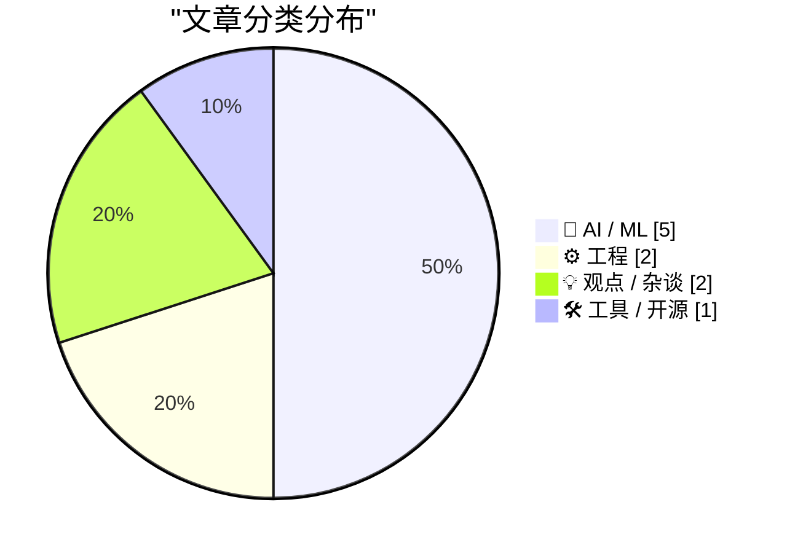
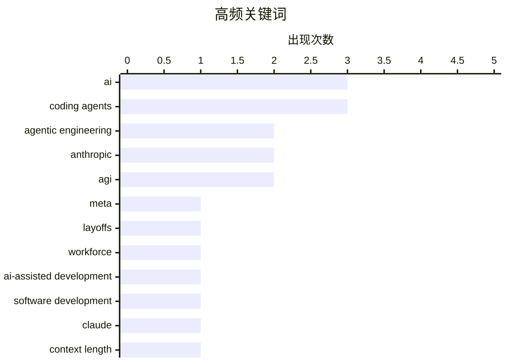

今日AI圈呈现两大核心趋势：一是行业开始反思单纯 scaling 路径的局限性，Sam Altman 罕见承认需重大突破才能实现 AGI，同时 Meta 因 AI 成本飙升计划大规模裁员，苹果则选择退出军备竞赛；二是代理工程（Agentic Engineering）正在崛起，多篇文章探讨编码代理如何工作以及在数据分析中的应用，预示 AI 从工具向自主执行者的转变。此外，Claude 推出百万级上下文窗口也标志着长文本处理能力迈上新台阶。

<!--more-->


> 来自 Karpathy 推荐的 92 个顶级技术博客，AI 精选 Top 10

## 🏆 今日必读

🥇 **Reuters: ‘Meta Planning Sweeping Layoffs as AI Costs Mount’**

[Reuters: ‘Meta Planning Sweeping Layoffs as AI Costs Mount’](https://www.reuters.com/business/world-at-work/meta-planning-sweeping-layoffs-ai-costs-mount-2026-03-14/) — daringfireball.net · 1 天前 · 🤖 AI / ML

> Reuters: ‘Meta Planning Sweeping Layoffs as AI Costs Mount’

🏷️ Meta, layoffs, AI, workforce

🥈 **What is agentic engineering?**

[What is agentic engineering?](https://simonwillison.net/guides/agentic-engineering-patterns/what-is-agentic-engineering/#atom-everything) — simonwillison.net · 23 小时前 · ⚙️ 工程

> What is agentic engineering?

🏷️ agentic engineering, AI-assisted development, coding agents, software development

🥉 **Why Claude's new 1M context length is a big deal**

[Why Claude's new 1M context length is a big deal](https://martinalderson.com/posts/why-claudes-new-1m-context-length-is-a-big-deal/?utm_source=rss&amp;utm_medium=rss&amp;utm_campaign=feed) — martinalderson.com · 1 天前 · 🤖 AI / ML

> Why Claude's new 1M context length is a big deal

🏷️ Claude, context length, Anthropic, LLM

---

## 📊 数据概览

| 扫描源 | 抓取文章 | 时间范围 | 精选 |
|:---:|:---:|:---:|:---:|
| 88/92 | 2493 篇 → 34 篇 | 48h | **10 篇** |

### 分类分布



### 高频关键词



<details>
<summary>📈 纯文本关键词图（终端友好）</summary>

```
ai                      │ ████████████████████ 3
coding agents           │ ████████████████████ 3
agentic engineering     │ █████████████░░░░░░░ 2
anthropic               │ █████████████░░░░░░░ 2
agi                     │ █████████████░░░░░░░ 2
meta                    │ ███████░░░░░░░░░░░░░ 1
layoffs                 │ ███████░░░░░░░░░░░░░ 1
workforce               │ ███████░░░░░░░░░░░░░ 1
ai-assisted development │ ███████░░░░░░░░░░░░░ 1
software development    │ ███████░░░░░░░░░░░░░ 1
```

</details>

### 🏷️ 话题标签

**ai**(3) · **coding agents**(3) · **agentic engineering**(2) · anthropic(2) · agi(2) · meta(1) · layoffs(1) · workforce(1) · ai-assisted development(1) · software development(1) · claude(1) · context length(1) · llm(1) · data analysis(1) · ai tools(1) · data journalism(1) · sam altman(1) · scaling(1) · breakthrough(1) · ai alignment(1)

---

## 🤖 AI / ML

### 1. Reuters: ‘Meta Planning Sweeping Layoffs as AI Costs Mount’

[Reuters: ‘Meta Planning Sweeping Layoffs as AI Costs Mount’](https://www.reuters.com/business/world-at-work/meta-planning-sweeping-layoffs-ai-costs-mount-2026-03-14/) — **daringfireball.net** · 1 天前 · ⭐ 27/30

> Reuters: ‘Meta Planning Sweeping Layoffs as AI Costs Mount’

🏷️ Meta, layoffs, AI, workforce

---

### 2. Why Claude's new 1M context length is a big deal

[Why Claude's new 1M context length is a big deal](https://martinalderson.com/posts/why-claudes-new-1m-context-length-is-a-big-deal/?utm_source=rss&amp;utm_medium=rss&amp;utm_campaign=feed) — **martinalderson.com** · 1 天前 · ⭐ 26/30

> Why Claude's new 1M context length is a big deal

🏷️ Claude, context length, Anthropic, LLM

---

### 3. BREAKING: Sam Altman concedes that we need major breakthroughs beyond mere scaling to get to AGI

[BREAKING: Sam Altman concedes that we need major breakthroughs beyond mere scaling to get to AGI](https://garymarcus.substack.com/p/breaking-sam-altman-concedes-that) — **garymarcus.substack.com** · 20 小时前 · ⭐ 25/30

> BREAKING: Sam Altman concedes that we need major breakthroughs beyond mere scaling to get to AGI

🏷️ AGI, Sam Altman, scaling, breakthrough

---

### 4. Quoting A member of Anthropic’s alignment-science team

[Quoting A member of Anthropic’s alignment-science team](https://simonwillison.net/2026/Mar/16/blackmail/#atom-everything) — **simonwillison.net** · 43 分钟前 · ⭐ 24/30

> Quoting A member of Anthropic’s alignment-science team

🏷️ AI alignment, Anthropic, AI safety, agentic misalignment

---

### 5. F Cancer

[F Cancer](https://garymarcus.substack.com/p/f-cancer) — **garymarcus.substack.com** · 3 小时前 · ⭐ 23/30

> F Cancer

🏷️ AI, testing, reliability, AGI

---

## ⚙️ 工程

### 6. What is agentic engineering?

[What is agentic engineering?](https://simonwillison.net/guides/agentic-engineering-patterns/what-is-agentic-engineering/#atom-everything) — **simonwillison.net** · 23 小时前 · ⭐ 26/30

> What is agentic engineering?

🏷️ agentic engineering, AI-assisted development, coding agents, software development

---

### 7. How coding agents work

[How coding agents work](https://simonwillison.net/guides/agentic-engineering-patterns/how-coding-agents-work/#atom-everything) — **simonwillison.net** · 8 小时前 · ⭐ 24/30

> How coding agents work

🏷️ coding agents, agentic engineering, AI development, software engineering

---

## 💡 观点 / 杂谈

### 8. Pluralistic: Tools vs uses (16 Mar 2026)

[Pluralistic: Tools vs uses (16 Mar 2026)](https://pluralistic.net/2026/03/16/whittle-a-webserver/) — **pluralistic.net** · 8 小时前 · ⭐ 24/30

> Pluralistic: Tools vs uses (16 Mar 2026)

🏷️ tools, Amazon, labor, technology

---

### 9. Horace Dediu on Apple Sitting Out the AI Spending Race

[Horace Dediu on Apple Sitting Out the AI Spending Race](https://asymco.com/2026/03/10/the-most-brilliant-move-in-corporate-history/) — **daringfireball.net** · 1 天前 · ⭐ 23/30

> Horace Dediu on Apple Sitting Out the AI Spending Race

🏷️ Apple, AI, capex, strategy

---

## 🛠 工具 / 开源

### 10. Coding agents for data analysis

[Coding agents for data analysis](https://simonwillison.net/2026/Mar/16/coding-agents-for-data-analysis/#atom-everything) — **simonwillison.net** · 2 小时前 · ⭐ 25/30

> Coding agents for data analysis

🏷️ coding agents, data analysis, AI tools, data journalism

---

*生成于 2026-03-17 22:22 | 扫描 88 源 → 获取 2493 篇 → 精选 10 篇*
*基于 [Hacker News Popularity Contest 2025](https://refactoringenglish.com/tools/hn-popularity/) RSS 源列表，由 [Andrej Karpathy](https://x.com/karpathy) 推荐*
*由「懂点儿AI」制作，欢迎关注同名微信公众号获取更多 AI 实用技巧 💡*
