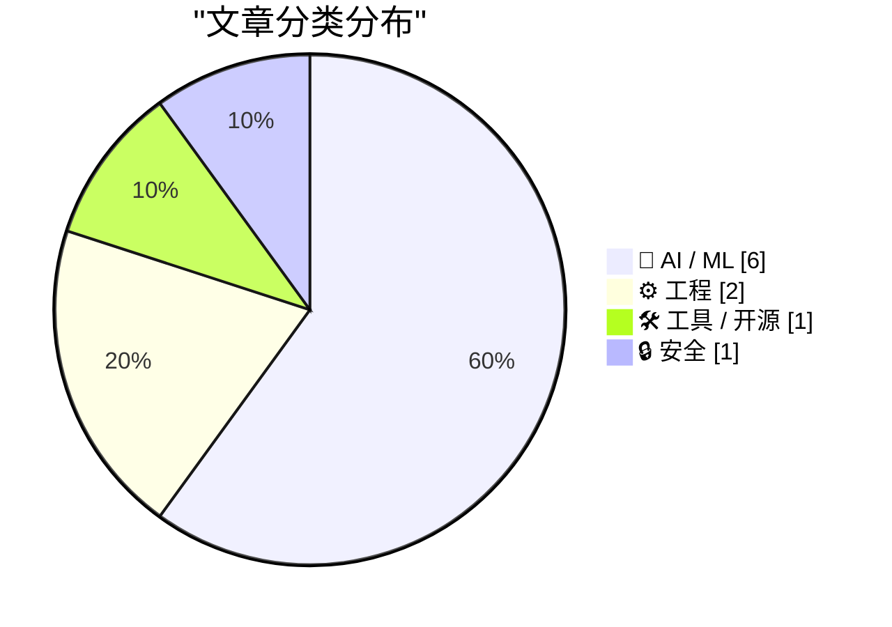
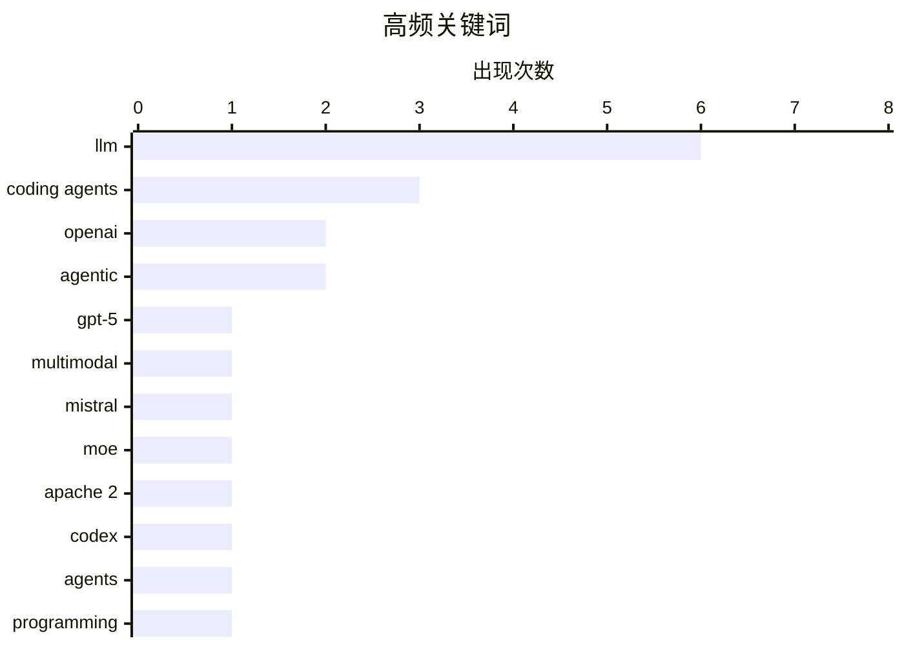

今日技术圈呈现两大核心趋势：一是AI模型持续向轻量化、低成本演进，GPT-5.4 mini/nano以极低价格实现大规模图像理解，Mistral Small 4进一步丰富了小模型生态；二是编码代理（coding agents）技术进入爆发期，从子代理架构到代理工程方法论，AI正在从单纯的内容生成转向自动化任务执行。与此同时，Apple在MacBook Neo上展示的硬件级安全设计引发关注，隐私保护仍是高端设备的重要竞争维度。

<!--more-->

> 来自 Karpathy 推荐的 92 个顶级技术博客，AI 精选 Top 10

## 🏆 今日必读

🥇 **GPT-5.4 mini and GPT-5.4 nano, which can describe 76,000 photos for $52**

[GPT-5.4 mini and GPT-5.4 nano, which can describe 76,000 photos for $52](https://simonwillison.net/2026/Mar/17/mini-and-nano/#atom-everything) — simonwillison.net · 2 小时前 · 🤖 AI / ML

> GPT-5.4 mini and GPT-5.4 nano, which can describe 76,000 photos for $52

🏷️ GPT-5, OpenAI, LLM, multimodal

🥈 **Introducing Mistral Small 4**

[Introducing Mistral Small 4](https://simonwillison.net/2026/Mar/16/mistral-small-4/#atom-everything) — simonwillison.net · 22 小时前 · 🤖 AI / ML

> Introducing Mistral Small 4

🏷️ Mistral, LLM, MoE, Apache 2

🥉 **Use subagents and custom agents in Codex**

[Use subagents and custom agents in Codex](https://simonwillison.net/2026/Mar/16/codex-subagents/#atom-everything) — simonwillison.net · 23 小时前 · 🛠 工具 / 开源

> Use subagents and custom agents in Codex

🏷️ OpenAI, Codex, agents, programming

---

## 📊 数据概览

| 扫描源 | 抓取文章 | 时间范围 | 精选 |
|:---:|:---:|:---:|:---:|
| 80/92 | 2329 篇 → 40 篇 | 48h | **10 篇** |

### 分类分布



### 高频关键词



<details>
<summary>📈 纯文本关键词图（终端友好）</summary>

```
llm           │ ████████████████████ 6
coding agents │ ██████████░░░░░░░░░░ 3
openai        │ ███████░░░░░░░░░░░░░ 2
agentic       │ ███████░░░░░░░░░░░░░ 2
gpt-5         │ ███░░░░░░░░░░░░░░░░░ 1
multimodal    │ ███░░░░░░░░░░░░░░░░░ 1
mistral       │ ███░░░░░░░░░░░░░░░░░ 1
moe           │ ███░░░░░░░░░░░░░░░░░ 1
apache 2      │ ███░░░░░░░░░░░░░░░░░ 1
codex         │ ███░░░░░░░░░░░░░░░░░ 1
```

</details>

### 🏷️ 话题标签

**llm**(6) · **coding agents**(3) · **openai**(2) · agentic(2) · gpt-5(1) · multimodal(1) · mistral(1) · moe(1) · apache 2(1) · codex(1) · agents(1) · programming(1) · subagents(1) · context limit(1) · agentic engineering(1) · ai programming(1) · python(1) · jit(1) · performance(1) · cpython(1)

---

## 🤖 AI / ML

### 1. GPT-5.4 mini and GPT-5.4 nano, which can describe 76,000 photos for $52

[GPT-5.4 mini and GPT-5.4 nano, which can describe 76,000 photos for $52](https://simonwillison.net/2026/Mar/17/mini-and-nano/#atom-everything) — **simonwillison.net** · 2 小时前 · ⭐ 28/30

> GPT-5.4 mini and GPT-5.4 nano, which can describe 76,000 photos for $52

🏷️ GPT-5, OpenAI, LLM, multimodal

---

### 2. Introducing Mistral Small 4

[Introducing Mistral Small 4](https://simonwillison.net/2026/Mar/16/mistral-small-4/#atom-everything) — **simonwillison.net** · 22 小时前 · ⭐ 27/30

> Introducing Mistral Small 4

🏷️ Mistral, LLM, MoE, Apache 2

---

### 3. Subagents

[Subagents](https://simonwillison.net/guides/agentic-engineering-patterns/subagents/#atom-everything) — **simonwillison.net** · 9 小时前 · ⭐ 26/30

> Subagents

🏷️ subagents, LLM, context limit, agentic

---

### 4. What is agentic engineering?

[What is agentic engineering?](https://simonwillison.net/guides/agentic-engineering-patterns/what-is-agentic-engineering/#atom-everything) — **simonwillison.net** · 1 天前 · ⭐ 25/30

> What is agentic engineering?

🏷️ agentic engineering, coding agents, LLM, AI programming

---

### 5. Coding agents for data analysis

[Coding agents for data analysis](https://simonwillison.net/2026/Mar/16/coding-agents-for-data-analysis/#atom-everything) — **simonwillison.net** · 1 天前 · ⭐ 24/30

> Coding agents for data analysis

🏷️ coding agents, data analysis, journalism, LLM

---

### 6. How coding agents work

[How coding agents work](https://simonwillison.net/guides/agentic-engineering-patterns/how-coding-agents-work/#atom-everything) — **simonwillison.net** · 1 天前 · ⭐ 22/30

> How coding agents work

🏷️ coding agents, LLM, agentic, engineering

---

## ⚙️ 工程

### 7. Quoting Ken Jin

[Quoting Ken Jin](https://simonwillison.net/2026/Mar/17/ken-jin/#atom-everything) — **simonwillison.net** · 37 分钟前 · ⭐ 24/30

> Quoting Ken Jin

🏷️ Python, JIT, performance, CPython

---

### 8. Weekly Update 495

[Weekly Update 495](https://www.troyhunt.com/weekly-update-495/) — **troyhunt.com** · 19 小时前 · ⭐ 22/30

> Weekly Update 495

🏷️ HaveIBeenPwned, web-development, serverless, infrastructure

---

## 🛠 工具 / 开源

### 9. Use subagents and custom agents in Codex

[Use subagents and custom agents in Codex](https://simonwillison.net/2026/Mar/16/codex-subagents/#atom-everything) — **simonwillison.net** · 23 小时前 · ⭐ 27/30

> Use subagents and custom agents in Codex

🏷️ OpenAI, Codex, agents, programming

---

## 🔒 安全

### 10. ★ Apple Exclaves and the Secure Design of the MacBook Neo's On-Screen Camera Indicator

[★ Apple Exclaves and the Secure Design of the MacBook Neo's On-Screen Camera Indicator](https://daringfireball.net/2026/03/apple_enclaves_neo_camera_indicator) — **daringfireball.net** · 1 天前 · ⭐ 22/30

> ★ Apple Exclaves and the Secure Design of the MacBook Neo's On-Screen Camera Indicator

🏷️ Apple, security, camera, hardware

---

*生成于 2026-03-18 22:25 | 扫描 80 源 → 获取 2329 篇 → 精选 10 篇*
*基于 [Hacker News Popularity Contest 2025](https://refactoringenglish.com/tools/hn-popularity/) RSS 源列表，由 [Andrej Karpathy](https://x.com/karpathy) 推荐*
*由「懂点儿AI」制作，欢迎关注同名微信公众号获取更多 AI 实用技巧 💡*
