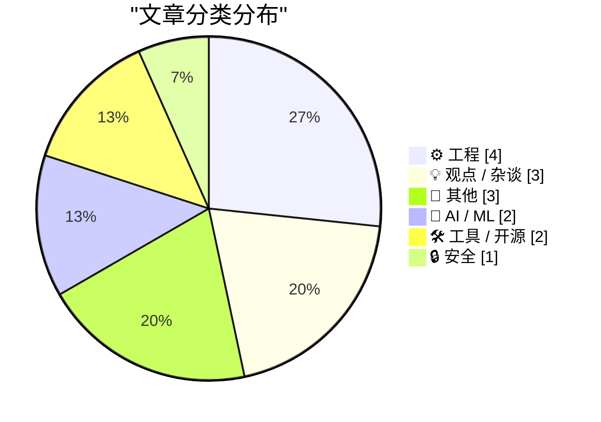
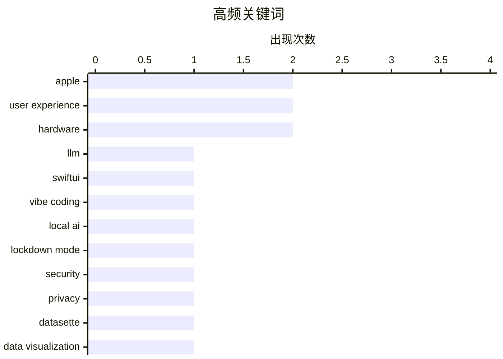

今日看点：苹果宣布停产经典 Mac Pro 并推出 Apple Maps 广告服务，标志着这家科技巨头从模块化硬件向垂直整合生态的战略转型，同时也反映出其对服务业务的新一轮扩张。与此同时，开源社区围绕 chardet 许可问题的争议，凸显了当前开源 relicensing 实践中版权认定的模糊地带，引发关于衍生作品边界标准的讨论。此外，经典设计在数字时代的持续生命力成为热点话题，无论是复古字体的回归还是老式 DV 设备的树莓派方案，都在印证：真正优秀的技术与设计能够跨越时代周期，保持持久的实用价值。

<!--more-->

> 来自 Karpathy 推荐的 92 个顶级技术博客，AI 精选 Top 15

---

## 🏆 今日必读

🥇 **意图升级**

[Vibe coding SwiftUI apps is a lot of fun](https://simonwillison.net/2026/Mar/27/vibe-coding-swiftui/#atom-everything) — simonwillison.net · 12 小时前 · 🤖 AI / ML

> Apple 在 Mac Pro 即将迎来 50 周年之际宣布停产该产品，这一决定被解读为 Apple 对下一个 50 年的战略声明。Mac Pro 曾是专业计算领域的标志性产品，其终结标志着 Apple 从传统模块化工作站向高度集成方向的转型。此举反映出 Apple 对计算未来的重新定义——强调自研芯片的垂直整合能力而非可扩展性。

💡 **为什么值得读**: 对于关注 Apple 产品战略和技术行业历史的人来说，这篇分析提供了关于 Apple 如何通过产品线取舍来传达长期愿景的洞察。

🏷️ LLM, SwiftUI, vibe coding, local AI

🥈 **引用 Richard Fontana 谈 chardet 许可问题**

[Apple Says It's Not Aware of Lockdown Mode Ever Having Been Exploited](https://techcrunch.com/2026/03/27/apple-says-no-one-using-lockdown-mode-has-been-hacked-with-spyware/) — daringfireball.net · 9 小时前 · 🔒 安全

> LGPLv3 合著者 Richard Fontana 就 chardet 库的许可问题发表看法，认为目前没有充分依据要求 chardet 7.0.0 必须以 LGPL 发布。他指出，尚未有人确认 7.0.0 版本中保留了早期版本的可版权表达材料，也没有人提出其他可行的违规理论。这一讨论涉及开源 relicensing 的边界问题，以及如何认定衍生作品中的版权要素。

💡 **为什么值得读**: 对开源许可证和软件许可问题感兴趣的技术人员可以通过这篇引用了解 GPL 家族许可的复杂性和法律边界。

🏷️ Apple, Lockdown Mode, security, privacy

🥉 **放大器的时代**

[datasette-showboat 0.1a2](https://simonwillison.net/2026/Mar/27/datasette-showboat/#atom-everything) — simonwillison.net · 10 小时前 · 🛠 工具 / 开源

> 20 世纪大部分时期，贝尔实验室（AT&T 旗下）一直是美国首屈一指的工业研究实验室，在通信技术、物理学和计算机科学领域做出了开创性贡献。贝尔实验室的建立标志着工业研究与学术研究融合的开端，其发明成果奠定了现代信息社会的基础。

💡 **为什么值得读**: 对科技史和技术产业演变感兴趣的读者可以通过这篇了解塑造当代信息时代的基础研究机构及其影响。

🏷️ datasette, data visualization, markdown, open source

---

## 📊 数据概览

| 扫描源 | 抓取文章 | 时间范围 | 精选 |
|:---:|:---:|:---:|:---:|
| 86/92 | 2472 篇 → 21 篇 | 24h | **15 篇** |

### 分类分布



### 高频关键词



<details>
<summary>📈 纯文本关键词图（终端友好）</summary>

```
apple           │ ████████████████████ 2
user experience │ ████████████████████ 2
hardware        │ ████████████████████ 2
llm             │ ██████████░░░░░░░░░░ 1
swiftui         │ ██████████░░░░░░░░░░ 1
vibe coding     │ ██████████░░░░░░░░░░ 1
local ai        │ ██████████░░░░░░░░░░ 1
lockdown mode   │ ██████████░░░░░░░░░░ 1
security        │ ██████████░░░░░░░░░░ 1
privacy         │ ██████████░░░░░░░░░░ 1
```

</details>

### 🏷️ 话题标签

**apple**(2) · **user experience**(2) · **hardware**(2) · llm(1) · swiftui(1) · vibe coding(1) · local ai(1) · lockdown mode(1) · security(1) · privacy(1) · datasette(1) · data visualization(1) · markdown(1) · open source(1) · ai assistant(1) · e-commerce(1) · shopping(1) · ai bubble(1) · investment(1) · openai(1)

---

## ⚙️ 工程

### 1. 仅用实数函数计算复数参数的三角函数

[Computing sine and cosine of complex arguments with only real functions](https://www.johndcook.com/blog/2026/03/27/complex-argument/) — **johndcook.com** · 22 小时前 · ⭐ 18/30

> 当计算器或数学库只支持实数参数时，如何计算 sin(3+4i) 这类复数三角函数？文章介绍了使用纯实数函数实现复数三角运算的数学方法，可用于没有 NumPy 等库的 Python 环境。

🏷️ complex numbers, trigonometry, math library, Python

---

### 2. 用树莓派 FireWire HAT 复活 MiniDV

[Bring back MiniDV with this Raspberry Pi FireWire HAT](https://www.jeffgeerling.com/blog/2026/minidv-with-raspberry-pi-firewire-hat/) — **jeffgeerling.com** · 19 小时前 · ⭐ 17/30

> 作者展示如何使用新的 FireWire HAT 配合 PiSugar3 Plus 电池模块，制作便携式 MRU（Memory Recording Unit）来替代旧款 DV 摄像机中的磁带。相较于闲鱼上约 300 美元的 Sony HVR-MRC1，这是一个更具性价比的解决方案。

🏷️ Raspberry Pi, FireWire, hardware, MiniDV

---

### 3. 如果对话框想拦截自己的消息循环怎么办？

[What if a dialog wants to intercept its own message loop?](https://devblogs.microsoft.com/oldnewthing/20260327-00/?p=112172) — **devblogs.microsoft.com/oldnewthing** · 19 小时前 · ⭐ 17/30

> 探讨如何让对话框捕获并处理自身的 Windows 消息循环，而非交给所有者窗口处理的技术实现方法。

🏷️ Win32, message loop, dialog, Windows

---

### 4. Quoting Richard Fontana

[Quoting Richard Fontana](https://simonwillison.net/2026/Mar/27/richard-fontana/#atom-everything) — **simonwillison.net** · 12 小时前 · ⭐ 16/30

> <blockquote cite="https://github.com/chardet/chardet/issues/334#issuecomment-4098524555"><p>FWIW, IANDBL, TINLA, etc., I don't currently see any basis for concluding that chardet 7.0.0 is required to 

🏷️ LGPL, open source license, chardet, legal

---

## 💡 观点 / 杂谈

### 5. 「好品味」只是经验

[Premium: How Much Of The AI Bubble Is Real?](https://www.wheresyoured.at/premium-how-much-of-the-ai-bubble-is-real/) — **wheresyoured.at** · 16 小时前 · ⭐ 19/30

> 人们常将「好品味」误解为一种先天的内在特质，但实际上它只是通过大量练习积累的经验。人们常把通过反复实践获得的能力误认为是某种神秘的天赋。这种认知偏差导致对专业技能的盲目崇拜，而忽视了其背后可复制的学习过程。

🏷️ AI bubble, investment, OpenAI, Disney

---

### 6. An Intention Upgrade

[An Intention Upgrade](https://feed.tedium.co/link/15204/17307620/apple-mac-pro-discontinued-anniversary) — **tedium.co** · 17 小时前 · ⭐ 17/30

> By ditching the Mac Pro so close to its 50th anniversary, Apple is making a statement of intent for its next 50 years.

🏷️ Apple, Mac Pro, strategy, hardware

---

### 7. "Good Taste" Is Just Experience

["Good Taste" Is Just Experience](https://terriblesoftware.org/2026/03/27/good-taste-is-just-experience/) — **terriblesoftware.org** · 14 小时前 · ⭐ 15/30

> What people call "good taste" is really just experience earned through reps. Stop making it sound innate.

🏷️ experience, good taste, learning, skill development

---

## 📝 其他

### 8. 苹果宣布将在 Apple Maps 推出广告

[Apple Announces Ads Are Coming to Apple Maps](https://www.apple.com/newsroom/2026/03/introducing-apple-business-a-new-all-in-one-platform-for-businesses-of-all-sizes/) — **daringfireball.net** · 9 小时前 · ⭐ 17/30

> 苹果宣布今年夏季起在美国和加拿大推出 Apple Maps 广告服务，企业可通过 Apple Business 在 Maps 中创建广告，出现在搜索结果顶部和"推荐地点"中。苹果强调广告不会关联用户 Apple 账户，位置数据保留在设备端不收集不上传。

🏷️ Apple Maps, ads, business

---

### 9. The Age of the Amplifier

[The Age of the Amplifier](https://www.construction-physics.com/p/the-age-of-the-amplifier) — **construction-physics.com** · 21 小时前 · ⭐ 16/30

> As we've noted more than a few times before, for most of the 20th century AT&T's Bell Labs was the premier industrial research lab in the US.

🏷️ Bell Labs, amplifier, AT&T, technology history

---

### 10. System shock

[System shock](https://aresluna.org/system-shock) — **aresluna.org** · 18 小时前 · ⭐ 16/30

> A story of a 25-year-old font coming back with a vengeance. (New version of an essay originally posted in October 2015. 1,100 words.)

🏷️ System Shock, font, typography, game design

---

## 🤖 AI / ML

### 11. 意图升级

[Vibe coding SwiftUI apps is a lot of fun](https://simonwillison.net/2026/Mar/27/vibe-coding-swiftui/#atom-everything) — **simonwillison.net** · 12 小时前 · ⭐ 23/30

> Apple 在 Mac Pro 即将迎来 50 周年之际宣布停产该产品，这一决定被解读为 Apple 对下一个 50 年的战略声明。Mac Pro 曾是专业计算领域的标志性产品，其终结标志着 Apple 从传统模块化工作站向高度集成方向的转型。此举反映出 Apple 对计算未来的重新定义——强调自研芯片的垂直整合能力而非可扩展性。

🏷️ LLM, SwiftUI, vibe coding, local AI

---

### 12. 系统冲击

[An AI Odyssey, Part 3: Lost Needle in the Haystack](https://www.johndcook.com/blog/2026/03/27/an-ai-odyssey-part-3-lost-needle-in-the-haystack/) — **johndcook.com** · 17 小时前 · ⭐ 19/30

> 一个诞生 25 年的经典字体在当下强势回归，重新获得设计师和开发者的关注。这篇文章是 2015 年原始文章的更新版本，探讨了该字体如何跨越时代保持设计价值和实用性，以及经典设计在数字时代持续生命力的原因。

🏷️ AI assistant, e-commerce, shopping, user experience

---

## 🛠 工具 / 开源

### 13. 放大器的时代

[datasette-showboat 0.1a2](https://simonwillison.net/2026/Mar/27/datasette-showboat/#atom-everything) — **simonwillison.net** · 10 小时前 · ⭐ 21/30

> 20 世纪大部分时期，贝尔实验室（AT&T 旗下）一直是美国首屈一指的工业研究实验室，在通信技术、物理学和计算机科学领域做出了开创性贡献。贝尔实验室的建立标志着工业研究与学术研究融合的开端，其发明成果奠定了现代信息社会的基础。

🏷️ datasette, data visualization, markdown, open source

---

### 14. 苹果给予与索取

[★ Apple Giveth, Apple Taketh Away](https://daringfireball.net/2026/03/apple_giveth_apple_taketh_away) — **daringfireball.net** · 13 小时前 · ⭐ 18/30

> MacOS 26 Tahoe 系统的 Safari 不再破坏菜单栏图标显示，但之前用来屏蔽 MacOS 15 Sequoia 升级提示的最佳技巧已失效。作者探讨了苹果系统更新中的这一变化。

🏷️ Safari, macOS, user experience, UI

---

## 🔒 安全

### 15. 引用 Richard Fontana 谈 chardet 许可问题

[Apple Says It's Not Aware of Lockdown Mode Ever Having Been Exploited](https://techcrunch.com/2026/03/27/apple-says-no-one-using-lockdown-mode-has-been-hacked-with-spyware/) — **daringfireball.net** · 9 小时前 · ⭐ 23/30

> LGPLv3 合著者 Richard Fontana 就 chardet 库的许可问题发表看法，认为目前没有充分依据要求 chardet 7.0.0 必须以 LGPL 发布。他指出，尚未有人确认 7.0.0 版本中保留了早期版本的可版权表达材料，也没有人提出其他可行的违规理论。这一讨论涉及开源 relicensing 的边界问题，以及如何认定衍生作品中的版权要素。

🏷️ Apple, Lockdown Mode, security, privacy

---

*生成于 2026-03-28 09:48 | 扫描 86 源 → 获取 2472 篇 → 精选 15 篇*
*基于 [Hacker News Popularity Contest 2025](https://refactoringenglish.com/tools/hn-popularity/) RSS 源列表，由 [Andrej Karpathy](https://x.com/karpathy) 推荐*
*由「懂点儿 AI」制作，欢迎关注同名微信公众号获取更多 AI 实用技巧 💡*
