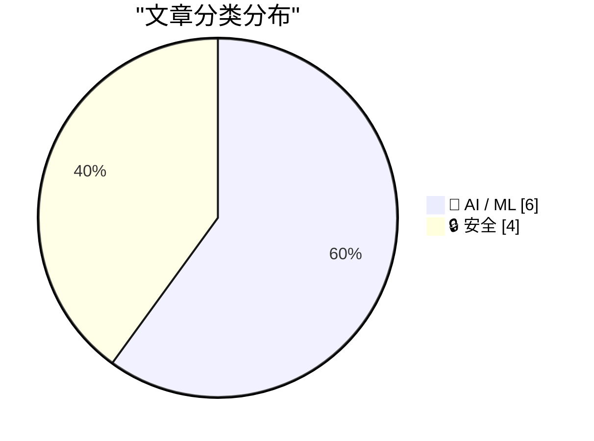
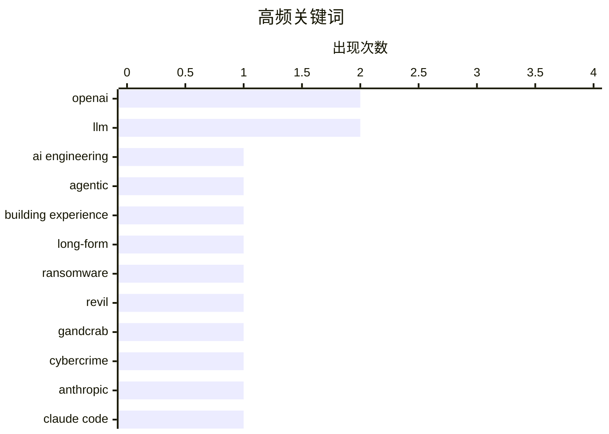

今日AI领域投资热度不减，OpenAI宣布获得1220亿美元承诺资本并规划“超级应用”战略，但其CFO坦言公司尚未准备好IPO，收入能否支撑支出仍是未知数；与此同时，中国AI实验室Z.ai发布7540亿参数的GLM-5.1，展现无提示生成能力，但行业也警告未来18-24个月将面临计算资源短缺危机。安全方面同样不平静，Anthropic因人为失误意外泄露超51万行Claude Code源代码，而德国当局则披露了REvil和GandCrab勒索团伙头目的真实身份。

<!--more-->


> 来自 Karpathy 推荐的 92 个顶级技术博客，AI 精选 Top 10

## 🏆 今日必读

🥇 **八年的向往，三个月的AI构建之旅**

[Eight years of wanting, three months of building with AI](https://simonwillison.net/2026/Apr/5/building-with-ai/#atom-everything) — simonwillison.net · 1 天前 · 🤖 AI / ML

> Lalit Maganti历时八年思考、三个月开发，构建了syntaqlite——一个面向SQLite的高保真开发工具。syntaqlite提供parser、formatter和verifier，适用于语言服务器和其他开发工具，为SQLite查询提供快速、稳健、全面的linting和验证能力。该项目解决了SQLite生态中长期缺失的工具需求，作者Simon此前也曾开发过类似的sqlite-ast项目，但production-ready程度较低。

💡 **为什么值得读**: 展示了如何将一个酝酿多年的想法转化为实际工具的完整过程，对有兴趣构建devtools的开发者很有启发。

🏷️ AI engineering, agentic, building experience, long-form

🥈 **德国曝光“UNKN”身份：俄罗斯勒索团伙REvil和GandCrab头目落网**

[Germany Doxes “UNKN,” Head of RU Ransomware Gangs REvil, GandCrab](https://krebsonsecurity.com/2026/04/germany-doxes-unkn-head-of-ru-ransomware-gangs-revil-gandcrab/) — krebsonsecurity.com · 1 天前 · 🔒 安全

> 德国当局披露了俄乌网络犯罪关键人物的真实身份，确认31岁的俄罗斯公民Daniil Maksimovich Shchukin为REvil和GandCrab两大勒索软件团伙的头目。UNKN的代号曾让调查人员长期无法追踪其真实身份。2019年至2021年间，该犯罪分子针对德国企业实施至少130起网络攻击和勒索行为。

💡 **为什么值得读**: 揭示了暗网背后顶级黑客如何被追踪的技术和执法过程，对网络安全从业者有参考价值。

🏷️ ransomware, REvil, GandCrab, cybercrime

🥉 **Anthropic意外泄露完整Claude Code CLI源代码**

[Anthropic Accidentally Leaked the Entire Claude Code CLI Source Code](https://arstechnica.com/ai/2026/03/entire-claude-code-cli-source-code-leaks-thanks-to-exposed-map-file/) — daringfireball.net · 1 天前 · 🔒 安全

> Anthropic在发布Claude Code npm包v2.1.88时误将source map文件打包，导致近2000个TypeScript文件、超51.2万行源代码完全暴露。安全研究员Chaofan Shou最早发现并在X平台公开，随后源代码被上传至GitHub并被fork数万次。Anthropic随后发声明称这是人为失误导致的发布包装问题，未涉及客户敏感数据或凭证。

💡 **为什么值得读**: 一起典型的源码泄露事件，展示了大型AI公司发布流程中的安全风险。

🏷️ Anthropic, Claude Code, source leak, npm

---

## 📊 数据概览

| 扫描源 | 抓取文章 | 时间范围 | 精选 |
|:---:|:---:|:---:|:---:|
| 81/92 | 2363 篇 → 38 篇 | 48h | **10 篇** |

### 分类分布



### 高频关键词



<details>
<summary>📈 纯文本关键词图（终端友好）</summary>

```
openai              │ ████████████████████ 2
llm                 │ ████████████████████ 2
ai engineering      │ ██████████░░░░░░░░░░ 1
agentic             │ ██████████░░░░░░░░░░ 1
building experience │ ██████████░░░░░░░░░░ 1
long-form           │ ██████████░░░░░░░░░░ 1
ransomware          │ ██████████░░░░░░░░░░ 1
revil               │ ██████████░░░░░░░░░░ 1
gandcrab            │ ██████████░░░░░░░░░░ 1
cybercrime          │ ██████████░░░░░░░░░░ 1
```

</details>

### 🏷️ 话题标签

**openai**(2) · **llm**(2) · **ai engineering**(1) · agentic(1) · building experience(1) · long-form(1) · ransomware(1) · revil(1) · gandcrab(1) · cybercrime(1) · anthropic(1) · claude code(1) · source leak(1) · npm(1) · valuation(1) · funding(1) · superapp(1) · ipo(1) · revenue(1) · finance(1)

---

## 🤖 AI / ML

### 1. 八年的向往，三个月的AI构建之旅

[Eight years of wanting, three months of building with AI](https://simonwillison.net/2026/Apr/5/building-with-ai/#atom-everything) — **simonwillison.net** · 1 天前 · ⭐ 25/30

> Lalit Maganti历时八年思考、三个月开发，构建了syntaqlite——一个面向SQLite的高保真开发工具。syntaqlite提供parser、formatter和verifier，适用于语言服务器和其他开发工具，为SQLite查询提供快速、稳健、全面的linting和验证能力。该项目解决了SQLite生态中长期缺失的工具需求，作者Simon此前也曾开发过类似的sqlite-ast项目，但production-ready程度较低。

🏷️ AI engineering, agentic, building experience, long-form

---

### 2. OpenAI宣布追加1220亿美元承诺资本及“超级应用”计划

[★ OpenAI Announces $122 Billion Additional ‘Committed Capital’, and Announces Their ‘Superapp’ Plan for the Future](https://daringfireball.net/2026/04/openai_future) — **daringfireball.net** · 17 分钟前 · ⭐ 24/30

> OpenAI宣布获得额外1220亿美元承诺资本，并公布其“超级应用”战略规划。文章作者对该估值持怀疑态度，无法理解如何能从现有信息论证这万亿级估值的合理性。

🏷️ OpenAI, valuation, funding, superapp

---

### 3. OpenAI CFO：公司尚未准备好IPO，不确定 revenue 能否支撑支出承诺

[News: OpenAI CFO Doesn't Believe Company Ready For IPO, Unsure Revenue Will Support Commitments](https://www.wheresyoured.at/openai-cfo-news/) — **wheresyoured.at** · 1 天前 · ⭐ 24/30

> OpenAI CFO Sarah Friar表示公司短期内不会上市，部分原因在于其支出承诺带来的风险，以及不确定公司收入增长能否支撑这些支出承诺。

🏷️ OpenAI, IPO, revenue, finance

---

### 4. GLM-5.1：面向长时域任务

[GLM-5.1: Towards Long-Horizon Tasks](https://simonwillison.net/2026/Apr/7/glm-51/#atom-everything) — **simonwillison.net** · 59 分钟前 · ⭐ 23/30

> 中国AI实验室Z.ai发布GLM-5.1，参数达7540亿，已开源并采用MIT许可证。模型能够自主生成包含SVG图像和CSS动画的完整HTML页面，展现了出色的无提示生成能力。

🏷️ GLM-5.1, LLM, Chinese AI, 754B parameters

---

### 5. 从零编写LLM (32i) —— 干预探索：噪声中有什么？

[Writing an LLM from scratch, part 32i -- Interventions: what is in the noise?](https://www.gilesthomas.com/2026/04/llm-from-scratch-32i-interventions-what-is-in-the-noise) — **gilesthomas.com** · 1 小时前 · ⭐ 23/30

> 作者本地训练163M参数的GPT-2风格模型，探索多种干预技术来提升性能。通过实施weight-tying等干预措施，作者将模型loss从3.944降低，逐渐逼近原版GPT-2的3.500水平。

🏷️ LLM, GPT-2, neural network, training

---

### 6. 下一阶段计算危机何去何从？

[What next for the compute crunch?](https://martinalderson.com/posts/what-next-for-the-compute-crunch/?utm_source=rss&amp;utm_medium=rss&amp;utm_campaign=feed) — **martinalderson.com** · 1 天前 · ⭐ 23/30

> AI计算需求呈指数级增长，而供给严重受限。未来18-24个月，计算资源将面临短缺、配给和价格发现的关键时期。

🏷️ AI compute, shortage, infrastructure, supply

---

## 🔒 安全

### 7. 德国曝光“UNKN”身份：俄罗斯勒索团伙REvil和GandCrab头目落网

[Germany Doxes “UNKN,” Head of RU Ransomware Gangs REvil, GandCrab](https://krebsonsecurity.com/2026/04/germany-doxes-unkn-head-of-ru-ransomware-gangs-revil-gandcrab/) — **krebsonsecurity.com** · 1 天前 · ⭐ 25/30

> 德国当局披露了俄乌网络犯罪关键人物的真实身份，确认31岁的俄罗斯公民Daniil Maksimovich Shchukin为REvil和GandCrab两大勒索软件团伙的头目。UNKN的代号曾让调查人员长期无法追踪其真实身份。2019年至2021年间，该犯罪分子针对德国企业实施至少130起网络攻击和勒索行为。

🏷️ ransomware, REvil, GandCrab, cybercrime

---

### 8. Anthropic意外泄露完整Claude Code CLI源代码

[Anthropic Accidentally Leaked the Entire Claude Code CLI Source Code](https://arstechnica.com/ai/2026/03/entire-claude-code-cli-source-code-leaks-thanks-to-exposed-map-file/) — **daringfireball.net** · 1 天前 · ⭐ 25/30

> Anthropic在发布Claude Code npm包v2.1.88时误将source map文件打包，导致近2000个TypeScript文件、超51.2万行源代码完全暴露。安全研究员Chaofan Shou最早发现并在X平台公开，随后源代码被上传至GitHub并被fork数万次。Anthropic随后发声明称这是人为失误导致的发布包装问题，未涉及客户敏感数据或凭证。

🏷️ Anthropic, Claude Code, source leak, npm

---

### 9. scan-for-secrets 0.3 发布

[scan-for-secrets 0.3](https://simonwillison.net/2026/Apr/6/scan-for-secrets/#atom-everything) — **simonwillison.net** · 1 天前 · ⭐ 22/30

> scan-for-secrets发布0.3版本，新增-r/--redact选项，可列出匹配结果、确认后用REDACTED替换所有匹配项，同时考虑转义规则。

🏷️ secret scanning, security, code audit, redaction

---

### 10. 俄罗斯黑客利用旧路由器漏洞窃取Microsoft Office令牌

[Russia Hacked Routers to Steal Microsoft Office Tokens](https://krebsonsecurity.com/2026/04/russia-hacked-routers-to-steal-microsoft-office-tokens/) — **krebsonsecurity.com** · 5 小时前 · ⭐ 22/30

> 俄罗斯军事情报部门支持的黑客利用旧版路由器的已知漏洞，大量窃取Microsoft Office用户的认证令牌。攻击者在超过18000个网络上静默获取令牌，全程未部署任何恶意软件。

🏷️ Russia, router hack, Microsoft Office, authentication

---

*生成于 2026-04-08 22:24 | 扫描 81 源 → 获取 2363 篇 → 精选 10 篇*
*基于 [Hacker News Popularity Contest 2025](https://refactoringenglish.com/tools/hn-popularity/) RSS 源列表，由 [Andrej Karpathy](https://x.com/karpathy) 推荐*
*由「懂点儿AI」制作，欢迎关注同名微信公众号获取更多 AI 实用技巧 💡*
