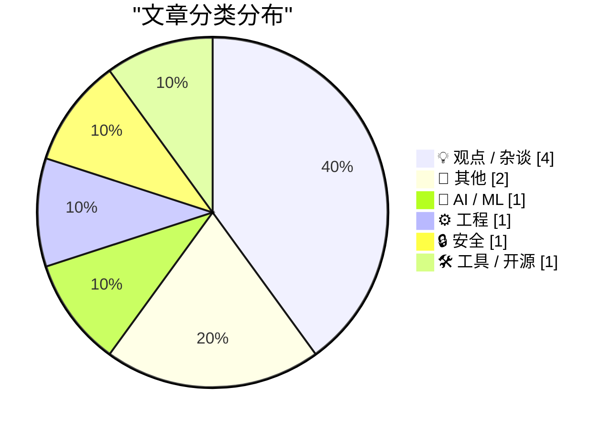
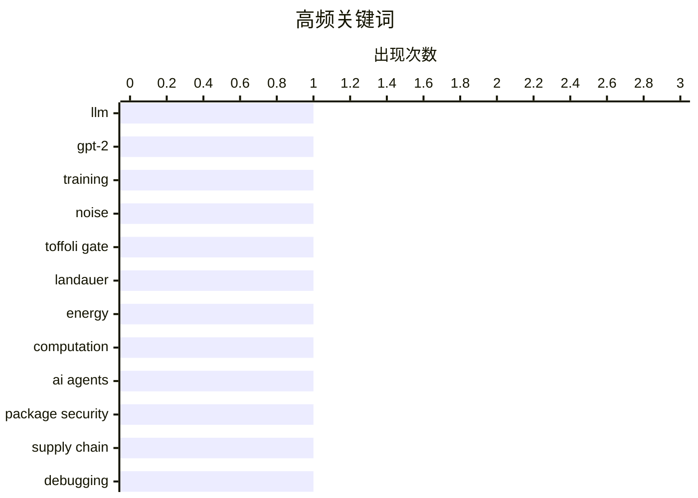

今日技术圈关注三大方向：AI技术层面，从零构建大模型的技术细节与智能体的安全风险成为焦点；量子计算领域Toffoli门引发讨论，暗示计算范式的新探索；与此同时，经济环境的不确定性让技术从业者开始反思职业风险与工作价值，危机意识与躺平心态形成张力。

<!--more-->


> 来自 Karpathy 推荐的 92 个顶级技术博客，AI 精选 Top 10

## 🏆 今日必读

🥇 **Writing an LLM from scratch, part 32i -- Interventions: what is in the noise?**

[Writing an LLM from scratch, part 32i -- Interventions: what is in the noise?](https://www.gilesthomas.com/2026/04/llm-from-scratch-32i-interventions-what-is-in-the-noise) — gilesthomas.com · 1 天前 · 🤖 AI / ML

> Writing an LLM from scratch, part 32i -- Interventions: what is in the noise?

🏷️ LLM, GPT-2, training, noise

🥈 **Toffoli gates are all you need**

[Toffoli gates are all you need](https://www.johndcook.com/blog/2026/04/06/tofolli-gates/) — johndcook.com · 1 天前 · ⚙️ 工程

> Toffoli gates are all you need

🏷️ Toffoli gate, Landauer, energy, computation

🥉 **Package Security Problems for AI Agents**

[Package Security Problems for AI Agents](https://nesbitt.io/2026/04/08/package-security-problems-for-ai-agents.html) — nesbitt.io · 12 小时前 · 🔒 安全

> Package Security Problems for AI Agents

🏷️ AI agents, package security, supply chain

---

## 📊 数据概览

| 扫描源 | 抓取文章 | 时间范围 | 精选 |
|:---:|:---:|:---:|:---:|
| 63/92 | 1895 篇 → 13 篇 | 48h | **10 篇** |

### 分类分布



### 高频关键词



<details>
<summary>📈 纯文本关键词图（终端友好）</summary>

```
llm              │ ████████████████████ 1
gpt-2            │ ████████████████████ 1
training         │ ████████████████████ 1
noise            │ ████████████████████ 1
toffoli gate     │ ████████████████████ 1
landauer         │ ████████████████████ 1
energy           │ ████████████████████ 1
computation      │ ████████████████████ 1
ai agents        │ ████████████████████ 1
package security │ ████████████████████ 1
```

</details>

### 🏷️ 话题标签

**llm**(1) · **gpt-2**(1) · **training**(1) · noise(1) · toffoli gate(1) · landauer(1) · energy(1) · computation(1) · ai agents(1) · package security(1) · supply chain(1) · debugging(1) · dependencies(1) · reverse engineering(1) · work culture(1) · productivity(1) · employees(1) · management(1) · automation(1) · economic impact(1)

---

## 💡 观点 / 杂谈

### 1. Actually, people love to work hard

[Actually, people love to work hard](https://anildash.com/2026/04/06/people-love-to-work-hard/) — **anildash.com** · 1 天前 · ⭐ 19/30

> Actually, people love to work hard

🏷️ work culture, productivity, employees, management

---

### 2. The day you get cut out of the economy

[The day you get cut out of the economy](https://geohot.github.io//blog/jekyll/update/2026/04/08/the-day-you-get-cut-out.html) — **geohot.github.io** · 1 天前 · ⭐ 18/30

> The day you get cut out of the economy

🏷️ automation, economic impact, future

---

### 3. When the crisis comes

[When the crisis comes](https://anildash.com/2026/04/08/when-the-crisis-comes/) — **anildash.com** · 22 小时前 · ⭐ 18/30

> When the crisis comes

🏷️ crisis, decision making, planning, stability

---

### 4. AI Is Really Weird

[AI Is Really Weird](https://www.wheresyoured.at/ai-is-really-weird/) — **wheresyoured.at** · 6 小时前 · ⭐ 17/30

> AI Is Really Weird

🏷️ AI, observation, behavior

---

## 📝 其他

### 5. The Hacker News tarpit

[The Hacker News tarpit](https://www.joanwestenberg.com/the-hacker-news-tarpit/) — **joanwestenberg.com** · 1 天前 · ⭐ 15/30

> The Hacker News tarpit

🏷️ Hacker News, community, platform

---

### 6. Pork & Puppetry

[Pork & Puppetry](https://feed.tedium.co/link/15204/17315642/pork-johnson-gimp-parody-interview) — **tedium.co** · 18 小时前 · ⭐ 14/30

> Pork & Puppetry

🏷️ GIMP, open source, puppeteering

---

## 🤖 AI / ML

### 7. Writing an LLM from scratch, part 32i -- Interventions: what is in the noise?

[Writing an LLM from scratch, part 32i -- Interventions: what is in the noise?](https://www.gilesthomas.com/2026/04/llm-from-scratch-32i-interventions-what-is-in-the-noise) — **gilesthomas.com** · 1 天前 · ⭐ 25/30

> Writing an LLM from scratch, part 32i -- Interventions: what is in the noise?

🏷️ LLM, GPT-2, training, noise

---

## ⚙️ 工程

### 8. Toffoli gates are all you need

[Toffoli gates are all you need](https://www.johndcook.com/blog/2026/04/06/tofolli-gates/) — **johndcook.com** · 1 天前 · ⭐ 24/30

> Toffoli gates are all you need

🏷️ Toffoli gate, Landauer, energy, computation

---

## 🔒 安全

### 9. Package Security Problems for AI Agents

[Package Security Problems for AI Agents](https://nesbitt.io/2026/04/08/package-security-problems-for-ai-agents.html) — **nesbitt.io** · 12 小时前 · ⭐ 24/30

> Package Security Problems for AI Agents

🏷️ AI agents, package security, supply chain

---

## 🛠 工具 / 开源

### 10. Who Built This?

[Who Built This?](https://nesbitt.io/2026/04/07/who-built-this.html) — **nesbitt.io** · 1 天前 · ⭐ 20/30

> Who Built This?

🏷️ debugging, dependencies, reverse engineering

---

*生成于 2026-04-09 22:24 | 扫描 63 源 → 获取 1895 篇 → 精选 10 篇*
*基于 [Hacker News Popularity Contest 2025](https://refactoringenglish.com/tools/hn-popularity/) RSS 源列表，由 [Andrej Karpathy](https://x.com/karpathy) 推荐*
*由「懂点儿AI」制作，欢迎关注同名微信公众号获取更多 AI 实用技巧 💡*
