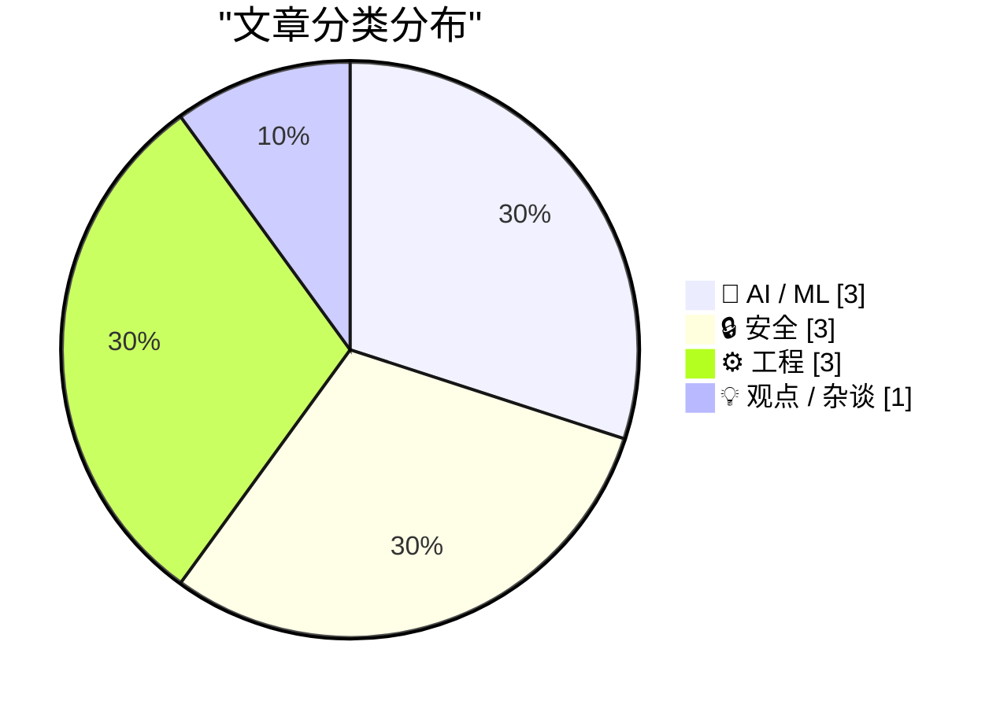
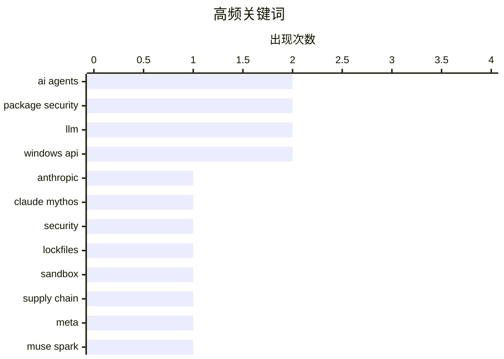

今日技术圈聚焦三大趋势：一是AI安全成焦点，Anthropic因安全风险选择暂不公开Claude Mythos Preview模型，同期AI代理的供应链安全风险引发广泛讨论，Adobe被曝擅自修改系统文件更是加剧了对AI时代软件权限滥用的担忧；二是模型竞争白热化，Meta发布Muse Spark对标顶级闭源模型，AI能力格局正在重塑；三是底层系统问题频出，macOS被爆连续运行49天后因32位整数溢出崩溃，暴露系统级隐患。

<!--more-->


> 来自 Karpathy 推荐的 92 个顶级技术博客，AI 精选 Top 10

## 🏆 今日必读

🥇 **Anthropic 发布 Claude Mythos Preview：网络安全能力太强而不敢公开**

[Anthropic’s New Claude Mythos Is So Good at Finding and Exploiting Vulnerabilities That They’re Not Releasing It to the Public](https://red.anthropic.com/2026/mythos-preview/) — daringfireball.net · 1 天前 · 🤖 AI / ML

> Anthropic 发布了新模型 Claude Mythos Preview，在网络安全任务上表现极其出色，因安全问题选择不公开发布。同期启动 Project Glasswing 项目，利用该模型帮助保护全球关键软件，并推动行业安全实践升级。Anthropic 强调这并非营销噱头，而是基于真实测试结果的安全考量。这标志着 AI 安全领域的一个重要转折点。

💡 **为什么值得读**: 罕见的大模型「自我限制」案例，展示了 AI 在网络安全攻防中的实际能力边界，适合关注 AI 安全和红队技术的读者。

🏷️ Anthropic, Claude Mythos, security

🥈 **AI 代理的包安全防护方案**

[Package Security Defenses for AI Agents](https://nesbitt.io/2026/04/09/package-security-defenses-for-ai-agents.html) — nesbitt.io · 12 小时前 · 🔒 安全

> 文章探讨 AI 代理在包管理环节面临的安全威胁与防御策略。提出三层防护机制：lockfiles 锁定依赖版本防止供应链攻击、sandbox 隔离代理操作环境、cooldown timers 控制请求频率防止滥用。

💡 **为什么值得读**: 针对 AI 代理安全这一新兴领域，提供具体可落地的防御思路，适合 AI 开发者和安全工程师参考。

🏷️ AI agents, package security, lockfiles, sandbox

🥉 **AI 代理的包安全问题**

[Package Security Problems for AI Agents](https://nesbitt.io/2026/04/08/package-security-problems-for-ai-agents.html) — nesbitt.io · 1 天前 · 🔒 安全

> 文章分析 AI 代理系统中包依赖的级联安全风险。指出代理的自主决策能力放大了供应链攻击的破坏力——恶意包可借代理权限执行敏感操作，且问题会在整个系统中层层传导。

💡 **为什么值得读**: 揭示了 AI 代理特有的安全攻击面，是理解代理安全风险的重要补充读物。

🏷️ AI agents, package security, supply chain

---

## 📊 数据概览

| 扫描源 | 抓取文章 | 时间范围 | 精选 |
|:---:|:---:|:---:|:---:|
| 45/92 | 1051 篇 → 26 篇 | 48h | **10 篇** |

### 分类分布



### 高频关键词



<details>
<summary>📈 纯文本关键词图（终端友好）</summary>

```
ai agents        │ ████████████████████ 2
package security │ ████████████████████ 2
llm              │ ████████████████████ 2
windows api      │ ████████████████████ 2
anthropic        │ ██████████░░░░░░░░░░ 1
claude mythos    │ ██████████░░░░░░░░░░ 1
security         │ ██████████░░░░░░░░░░ 1
lockfiles        │ ██████████░░░░░░░░░░ 1
sandbox          │ ██████████░░░░░░░░░░ 1
supply chain     │ ██████████░░░░░░░░░░ 1
```

</details>

### 🏷️ 话题标签

**ai agents**(2) · **package security**(2) · **llm**(2) · windows api(2) · anthropic(1) · claude mythos(1) · security(1) · lockfiles(1) · sandbox(1) · supply chain(1) · meta(1) · muse spark(1) · adobe(1) · privacy(1) · hosts(1) · openai(1) · agi(1) · sam altman(1) · gpt-2(1) · training(1)

---

## 🤖 AI / ML

### 1. Anthropic 发布 Claude Mythos Preview：网络安全能力太强而不敢公开

[Anthropic’s New Claude Mythos Is So Good at Finding and Exploiting Vulnerabilities That They’re Not Releasing It to the Public](https://red.anthropic.com/2026/mythos-preview/) — **daringfireball.net** · 1 天前 · ⭐ 24/30

> Anthropic 发布了新模型 Claude Mythos Preview，在网络安全任务上表现极其出色，因安全问题选择不公开发布。同期启动 Project Glasswing 项目，利用该模型帮助保护全球关键软件，并推动行业安全实践升级。Anthropic 强调这并非营销噱头，而是基于真实测试结果的安全考量。这标志着 AI 安全领域的一个重要转折点。

🏷️ Anthropic, Claude Mythos, security

---

### 2. Meta 发布 Muse Spark 模型，性能对标顶级闭源模型

[Meta's new model is Muse Spark, and meta.ai chat has some interesting tools](https://simonwillison.net/2026/Apr/8/muse-spark/#atom-everything) — **simonwillison.net** · 23 小时前 · ⭐ 23/30

> Meta 推出 Muse Spark，这是自 Llama 4 以来首次发布新模型，采用托管 API 形式（非开源权重），目前仅限部分用户试用，可在 meta.ai 网页体验。Meta 官方基准显示其在多项测试中与 Opus 4.6、Gemini 3.1 Pro、GPT 5.4 持平，但落后于 Terminal-Bench 2.0。模型提供「Instant」和「Thinking」两种模式，未来计划推出「Contemplating」模式支持更长推理时间。

🏷️ Meta, Muse Spark, LLM

---

### 3. 从零训练 LLM 系列（32j）：云端干预实验尝试改进模型

[Writing an LLM from scratch, part 32j -- Interventions: trying to train a better model in the cloud](https://www.gilesthomas.com/2026/04/llm-from-scratch-32j-interventions-trying-to-train-a-better-model-in-the-cloud) — **gilesthomas.com** · 2 小时前 · ⭐ 22/30

> 作者基于 Sebastian Raschka 的书从零训练了一个 163M 参数的 GPT-2 风格模型，测试集损失为 3.944（原始 GPT-2 权重为 3.500）。本文记录了多种训练干预措施的效果，包括调整训练配置和模型结构，尝试缩小与原始 GPT-2 的差距。

🏷️ LLM, GPT-2, training

---

## 🔒 安全

### 4. AI 代理的包安全防护方案

[Package Security Defenses for AI Agents](https://nesbitt.io/2026/04/09/package-security-defenses-for-ai-agents.html) — **nesbitt.io** · 12 小时前 · ⭐ 24/30

> 文章探讨 AI 代理在包管理环节面临的安全威胁与防御策略。提出三层防护机制：lockfiles 锁定依赖版本防止供应链攻击、sandbox 隔离代理操作环境、cooldown timers 控制请求频率防止滥用。

🏷️ AI agents, package security, lockfiles, sandbox

---

### 5. AI 代理的包安全问题

[Package Security Problems for AI Agents](https://nesbitt.io/2026/04/08/package-security-problems-for-ai-agents.html) — **nesbitt.io** · 1 天前 · ⭐ 24/30

> 文章分析 AI 代理系统中包依赖的级联安全风险。指出代理的自主决策能力放大了供应链攻击的破坏力——恶意包可借代理权限执行敏感操作，且问题会在整个系统中层层传导。

🏷️ AI agents, package security, supply chain

---

### 6. Adobe 擅自修改用户 /etc/hosts 文件检测 Creative Cloud 安装状态

[Adobe Diddles With Your /etc/hosts File](https://old.reddit.com/r/webdev/comments/1sb6hzk/adobe_wrote_to_my_hosts_file_ive_never_had_an_app/oe1ap9h/) — **daringfireball.net** · 1 小时前 · ⭐ 22/30

> Adobe 被发现修改用户系统的 /etc/hosts 文件来检测是否已安装 Creative Cloud。具体做法是在访问 adobe.com 时加载一个图片请求，通过 DNS 解析结果判断用户是否有 CCD。由于 Chrome 限制了 Local Network Access，Adobe 从原来的 localhost 方式改为 hosts 文件篡改。这引发了对第三方软件权限滥用的担忧。

🏷️ Adobe, privacy, hosts

---

## ⚙️ 工程

### 7. macOS 在连续运行 49 天后崩溃：32 位整数溢出 Bug

[MacOS Seemingly Crashes After 49 Days of Uptime — a ‘Feature’ Perhaps Exclusive to Tahoe](https://sixcolors.com/link/2026/04/macs-crash-after-49-days-of-uptime/) — **daringfireball.net** · 9 分钟前 · ⭐ 20/30

> 开发者 Photon 发现 macOS 存在一个隐藏的崩溃周期：连续运行 49 天 17 小时 2 分 47 秒后，系统会因 XNU 内核中 32 位无符号整数溢出而冻结。问题出在 TCP 时间戳计时器上，ICMP（ping）仍可工作但其他功能全部失效，唯一的解决办法是重启。该 Bug 似乎仅影响 Tahoe 版本。

🏷️ macOS, bug, uptime

---

### 8. 如何向活动的 WaitForMultipleObjects 添加或移除 handle

[How do you add or remove a handle from an active Wait­For­Multiple­Objects?](https://devblogs.microsoft.com/oldnewthing/20260409-00/?p=112220) — **devblogs.microsoft.com/oldnewthing** · 8 小时前 · ⭐ 20/30

> Windows API 中无法在 WaitForMultipleObjects 等待期间直接添加或移除 handle，需要通过与其他线程协作的方式实现。

🏷️ Windows API, multithreading

---

### 9. 如何向活动的 MsgWaitForMultipleObjects 添加或移除 handle

[How do you add or remove a handle from an active Msg­Wait­For­Multiple­Objects?](https://devblogs.microsoft.com/oldnewthing/20260408-00/?p=112218) — **devblogs.microsoft.com/oldnewthing** · 1 天前 · ⭐ 20/30

> Windows API 中无法在 MsgWaitForMultipleObjects 等待期间直接添加或移除 handle，但可以安排让等待线程自己执行添加或移除操作。

🏷️ Windows API, message loop

---

## 💡 观点 / 杂谈

### 10. Sam Altman 将 AGI 比喻为百年一遇的流行病

[Sam Altman, in a Video Released by OpenAI, Apparently Thinks AGI Is Going to Hit Society Like a Once-a-Century Pandemic](https://x.com/OpenAINewsroom/status/2041618671236469200?s=20) — **daringfireball.net** · 2 天前 · ⭐ 22/30

> OpenAI 发布的视频中，Sam Altman 将 AGI 的社会影响比作「百年一遇的流行病」。作者批评这一比喻令人不安而非安心，并质疑 Altman 关于 OpenAI 员工曾对 COVID 高度敏感的声明与特朗普的先知式谎言类似。

🏷️ OpenAI, AGI, Sam Altman

---

*生成于 2026-04-10 22:23 | 扫描 45 源 → 获取 1051 篇 → 精选 10 篇*
*基于 [Hacker News Popularity Contest 2025](https://refactoringenglish.com/tools/hn-popularity/) RSS 源列表，由 [Andrej Karpathy](https://x.com/karpathy) 推荐*
*由「懂点儿AI」制作，欢迎关注同名微信公众号获取更多 AI 实用技巧 💡*
