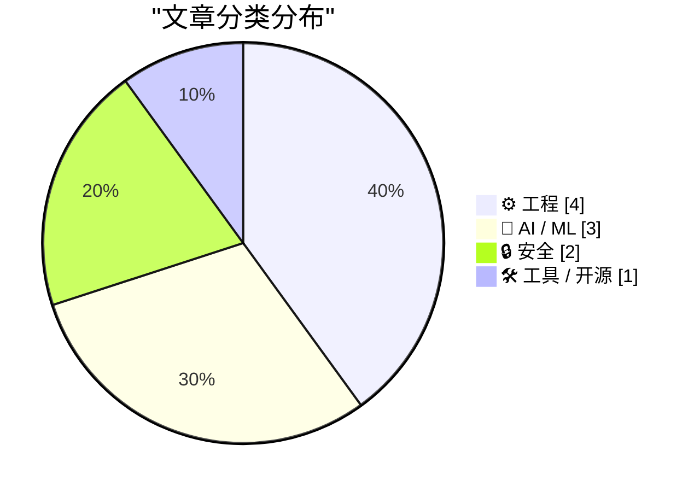
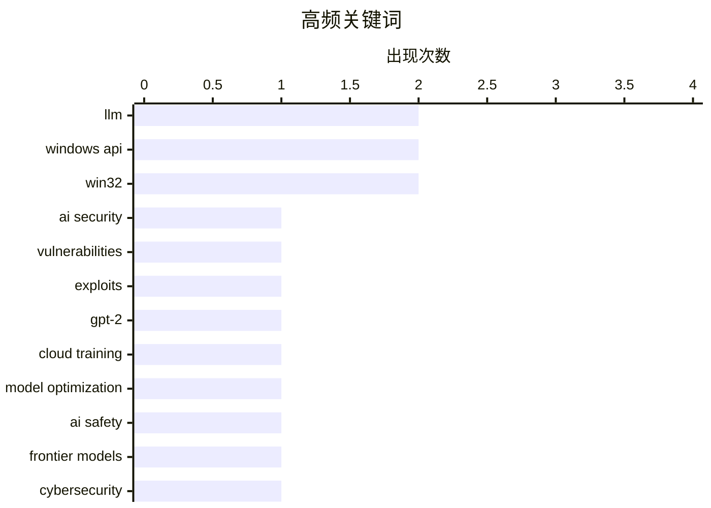

今日技术圈聚焦两大趋势：一是AI安全正在经历"清算时刻"，大语言模型发现漏洞的能力急剧提升，曾经潜伏数十年的代码缺陷被批量挖掘，传统互联网安全协议面临挑战，同时行业也在探索沙箱、锁文件等防御机制；二是AI服务能力分化明显，ChatGPT免费语音模式仍使用知识截止于2024年的旧模型，而付费的高级模型却能独立完成代码库重构等复杂任务，用户在不同层级获取的AI能力存在巨大鸿沟。

<!--more-->

## 🏆 今日必读

🥇 **Y2K 2.0：AI安全清算时刻**

[Y2K 2.0: The AI security reckoning](https://anildash.com/2026/04/10/y2k-2.0-ai-security/) — anildash.com · 1 天前 · 🔒 安全

> 随着大语言模型（LLM）编写代码的能力迅速提升，它们发现安全漏洞的能力也同步增强。新型AI编程代理能够检测常见代码中的缺陷，并自动创建利用这些漏洞的工具，从而几乎毫不费力地获取用户系统或数据的访问权限。这些强大的LLM现在能发现的漏洞数量是之前AI工具的数百倍，并且能够以人类无法想到的方式串联多个不同漏洞。数十年来潜伏在代码中的漏洞正在被逐一发现，安全问题已近乎日常化。

💡 **为什么值得读**: 对于关注AI安全和软件工程的人来说，这篇文章清晰地解释了当前安全漏洞大规模涌现的技术根源，帮助理解AI对网络安全格局的根本性改变。

🏷️ AI security, vulnerabilities, exploits

🥈 **从零开始写大模型（32j）——干预措施：尝试在云端训练更好的模型**

[Writing an LLM from scratch, part 32j -- Interventions: trying to train a better model in the cloud](https://www.gilesthomas.com/2026/04/llm-from-scratch-32j-interventions-trying-to-train-a-better-model-in-the-cloud) — gilesthomas.com · 1 天前 · 🤖 AI / ML

> 作者从2025年12月起在本地RTX 3090上训练了一个163M参数的GPT-2风格模型，使用Sebastian Raschka的代码。原始模型在测试集上的loss为3.944，而原版GPT-2权重在相同数据集上的loss为3.500。为缩小这一差距，作者尝试了多种干预措施来改进训练设置和模型本身。在上一篇文章中作者得出结论，除两个可能的例外外，其他干预措施带来的loss改善似乎不太可能产生实质性帮助。

💡 **为什么值得读**: 对于想深入了解大模型训练细节的开发者来说，这篇文章提供了实际的训练实验数据和干预措施效果分析，具有很强的实践参考价值。

🏷️ LLM, GPT-2, Cloud Training, Model Optimization

🥉 **Mythos是否打破了保护互联网安全的协议？**

[Has Mythos just broken the deal that kept the internet safe?](https://martinalderson.com/posts/has-mythos-just-broken-the-deal-that-kept-the-internet-safe/?utm_source=rss&amp;utm_medium=rss&amp;utm_campaign=feed) — martinalderson.com · 1 天前 · 🤖 AI / ML

> Anthropic的Mythos研究预览揭示了前沿模型的发展轨迹及其带来的网络安全风险。文章探讨了沙箱逃逸（sandbox escape）技术，以及前沿模型可能对互联网安全格局造成的威胁。随着AI模型能力的不断提升，曾经保护互联网安全的基础假设可能正在被颠覆。

💡 **为什么值得读**: 帮助读者理解前沿AI模型对网络安全的潜在影响，对于关注AI安全和风险防控的人来说是一篇重要的前瞻性分析。

🏷️ AI safety, frontier models, cybersecurity

---

## 📊 数据概览

| 扫描源 | 抓取文章 | 时间范围 | 精选 |
|:---:|:---:|:---:|:---:|
| 57/92 | 1646 篇 → 29 篇 | 48h | **10 篇** |

### 分类分布

### 高频关键词

### 🏷️ 话题标签

**llm**(2) · **windows api**(2) · **win32**(2) · ai security(1) · vulnerabilities(1) · exploits(1) · gpt-2(1) · cloud training(1) · model optimization(1) · ai safety(1) · frontier models(1) · cybersecurity(1) · ai agents(1) · package security(1) · sandbox(1) · chatgpt(1) · voice mode(1) · openai(1) · rss(1) · web development(1)

---

## ⚙️ 工程

### 1. 包注册表与分页

[Package Registries and Pagination](https://nesbitt.io/2026/04/10/package-registries-and-pagination.html) — **nesbitt.io** · 17 小时前 · ⭐ 21/30

> 作者发现某个包注册表中包含超过100MB的元数据，对应10,451个版本。分页处理对于管理如此大规模的元数据至关重要，文章探讨了分页策略在包管理场景下的实现和优化。

🏷️ Package Registry, Pagination, Package Manager

---

### 2. SQLAlchemy 2实践——第四章：多对多关系

[SQLAlchemy 2 In Practice - Chapter 4 - Many-To-Many Relationships](https://blog.miguelgrinberg.com/post/sqlalchemy-2-in-practice---chapter-4---many-to-many-relationships) — **miguelgrinberg.com** · 1 天前 · ⭐ 21/30

> 这是《SQLAlchemy 2实践》书籍的第四章，专门讨论多对多关系（many-to-many relationship）的实现。当无法将任意一方识别为"一"的一方时，就是使用多对多关系的场景。

🏷️ SQLAlchemy, ORM, database

---

### 3. 如何向活动的Wait-For-Multiple-Objects添加或移除句柄？（第二部分）

[How do you add or remove a handle from an active Wait­For­Multiple­Objects?, part 2](https://devblogs.microsoft.com/oldnewthing/20260410-00/?p=112223) — **devblogs.microsoft.com/oldnewthing** · 13 小时前 · ⭐ 20/30

> 文章继续探讨如何向活动的Wait-For-Multiple-Objects添加或移除句柄，Part 2部分关注等待线程确认变更的机制。

🏷️ Windows API, WaitForMultipleObjects, Win32

---

### 4. 如何向活动的Wait-For-Multiple-Objects添加或移除句柄？

[How do you add or remove a handle from an active Wait­For­Multiple­Objects?](https://devblogs.microsoft.com/oldnewthing/20260409-00/?p=112220) — **devblogs.microsoft.com/oldnewthing** · 1 天前 · ⭐ 20/30

> 文章讨论了在Windows编程中如何操作活动的Wait-For-Multiple-Objects的句柄集合。答案是无法直接添加或移除，但可以通过与其他线程协作来实现。

🏷️ Windows API, Handle Management, Win32

---

## 🤖 AI / ML

### 5. 从零开始写大模型（32j）——干预措施：尝试在云端训练更好的模型

[Writing an LLM from scratch, part 32j -- Interventions: trying to train a better model in the cloud](https://www.gilesthomas.com/2026/04/llm-from-scratch-32j-interventions-trying-to-train-a-better-model-in-the-cloud) — **gilesthomas.com** · 1 天前 · ⭐ 26/30

> 作者从2025年12月起在本地RTX 3090上训练了一个163M参数的GPT-2风格模型，使用Sebastian Raschka的代码。原始模型在测试集上的loss为3.944，而原版GPT-2权重在相同数据集上的loss为3.500。为缩小这一差距，作者尝试了多种干预措施来改进训练设置和模型本身。在上一篇文章中作者得出结论，除两个可能的例外外，其他干预措施带来的loss改善似乎不太可能产生实质性帮助。

🏷️ LLM, GPT-2, Cloud Training, Model Optimization

---

### 6. Mythos是否打破了保护互联网安全的协议？

[Has Mythos just broken the deal that kept the internet safe?](https://martinalderson.com/posts/has-mythos-just-broken-the-deal-that-kept-the-internet-safe/?utm_source=rss&amp;utm_medium=rss&amp;utm_campaign=feed) — **martinalderson.com** · 1 天前 · ⭐ 26/30

> Anthropic的Mythos研究预览揭示了前沿模型的发展轨迹及其带来的网络安全风险。文章探讨了沙箱逃逸（sandbox escape）技术，以及前沿模型可能对互联网安全格局造成的威胁。随着AI模型能力的不断提升，曾经保护互联网安全的基础假设可能正在被颠覆。

🏷️ AI safety, frontier models, cybersecurity

---

### 7. ChatGPT语音模式是一个更弱的模型

[ChatGPT voice mode is a weaker model](https://simonwillison.net/2026/Apr/10/voice-mode-is-weaker/#atom-everything) — **simonwillison.net** · 12 小时前 · ⭐ 22/30

> OpenAI的语音模式运行在一个更老、更弱的模型上，这对很多用户来说并不明显。语音模式透露其知识截止日期是2024年4月——属于GPT-4o时代的模型。与此同时，付费的高级Codex模型能够花费1小时有连贯地重构整个代码库，或发现并利用计算机系统中的漏洞。用户在免费和高价服务之间获得的AI能力存在巨大差距。

🏷️ ChatGPT, voice mode, OpenAI, LLM

---

## 🔒 安全

### 8. Y2K 2.0：AI安全清算时刻

[Y2K 2.0: The AI security reckoning](https://anildash.com/2026/04/10/y2k-2.0-ai-security/) — **anildash.com** · 1 天前 · ⭐ 27/30

> 随着大语言模型（LLM）编写代码的能力迅速提升，它们发现安全漏洞的能力也同步增强。新型AI编程代理能够检测常见代码中的缺陷，并自动创建利用这些漏洞的工具，从而几乎毫不费力地获取用户系统或数据的访问权限。这些强大的LLM现在能发现的漏洞数量是之前AI工具的数百倍，并且能够以人类无法想到的方式串联多个不同漏洞。数十年来潜伏在代码中的漏洞正在被逐一发现，安全问题已近乎日常化。

🏷️ AI security, vulnerabilities, exploits

---

### 9. AI代理的包安全防御机制

[Package Security Defenses for AI Agents](https://nesbitt.io/2026/04/09/package-security-defenses-for-ai-agents.html) — **nesbitt.io** · 1 天前 · ⭐ 24/30

> 文章讨论了保护AI代理免受恶意包攻击的几种防御策略，包括：锁文件（lockfiles）用于确保依赖版本一致性、沙箱（sandboxes）限制代码执行环境、以及冷却定时器（cooldown timers）防止高频请求攻击。这些防御措施共同构成了AI代理系统的安全防线。

🏷️ AI agents, package security, sandbox

---

## 🛠 工具 / 开源

### 10. 你完全可以拥有一个依赖RSS的网站（2026年）

[You can absolutely have an RSS dependent website in 2026](https://matduggan.com/you-can-absolutely-have-an-rss-dependent-website-in-2026/) — **matduggan.com** · 1 天前 · ⭐ 22/30

> 作者早期做了一个决定：不提供电子邮件Newsletter。作为替代方案，作者建立了一个完全依赖RSS的网站。RSS作为内容分发机制，允许用户通过自己选择的阅读器获取内容，避免了邮件订阅的打扰和平台算法的干预。

🏷️ RSS, web development, indie web

---

*生成于 2026-04-11 03:59 | 扫描 57 源 → 获取 1646 篇 → 精选 10 篇*
*基于 [Hacker News Popularity Contest 2025](https://refactoringenglish.com/tools/hn-popularity/) RSS 源列表，由 [Andrej Karpathy](https://x.com/karpathy) 推荐*
*由「懂点儿AI」制作，欢迎关注同名微信公众号获取更多 AI 实用技巧 💡*