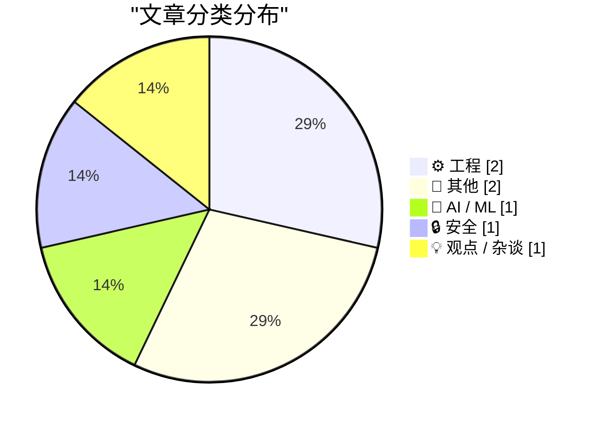
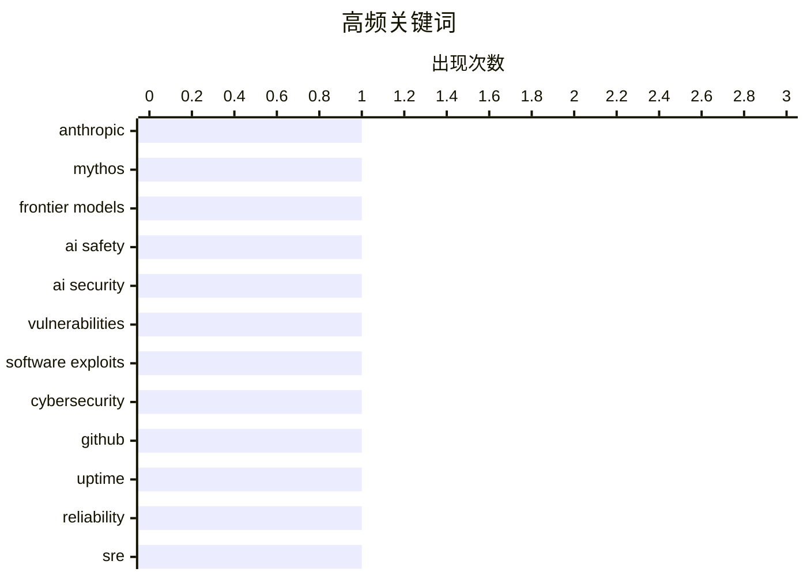

AI前沿模型正在冲击互联网安全既有防线——随着大模型代码生成与漏洞挖掘能力跃升，安全风险急剧放大，传统的防御协议面临系统性挑战；与此同时，GitHub可用性争议引发行业反思，四九标准在高复杂度SaaS场景下的适用性受到质疑，技术实践的精细化讨论成为工程领域的另一关注点。

<!--more-->


> 来自 Karpathy 推荐的 92 个顶级技术博客，AI 精选 Top 7

## 🏆 今日必读

🥇 **Mythos是否打破了保障互联网安全的协议？**

[Has Mythos just broken the deal that kept the internet safe?](https://martinalderson.com/posts/has-mythos-just-broken-the-deal-that-kept-the-internet-safe/?utm_source=rss&amp;utm_medium=rss&amp;utm_campaign=feed) — martinalderson.com · 1 天前 · 🤖 AI / ML

> 文章探讨Anthropic最新发布的Mythos前沿模型预览对互联网安全格局的影响。随着AI模型能力的提升，沙盒逃逸风险日益严峻，传统安全边界面临挑战。作者警告，前沿模型的发展轨迹可能正在打破过去二十年维系互联网安全的既有协议，导致网络安全风险急剧上升。

💡 **为什么值得读**: 面向关注AI安全和网络防御的技术从业者，文章提供了对前沿模型安全风险的深度分析，有助于理解AI竞赛对数字安全生态的潜在冲击。

🏷️ Anthropic, Mythos, frontier models, AI safety

🥈 **Y2K 2.0：AI安全清算时刻**

[Y2K 2.0: The AI security reckoning](https://anildash.com/2026/04/10/y2k-2.0-ai-security/) — anildash.com · 1 天前 · 🔒 安全

> 近期软件安全漏洞频发，每个漏洞若在以往都将是年度最大漏洞，如今却近乎常态化。根本原因在于LLM生成代码的能力快速提升，同时也增强了其分析代码安全弱点的能力。这些更智能的编码代理能发现比上一代AI工具多数百倍的漏洞，并能以人类难以想到的方式串联多个漏洞进行攻击。LLM已在代码库中发现了潜伏数十年的漏洞。

💡 **为什么值得读**: 文章清晰阐述了AI对软件安全格局的根本性重塑，对于关注应用安全、云原生安全的开发者具有重要的警醒意义。

🏷️ AI security, vulnerabilities, software exploits, cybersecurity

🥉 **为GitHub的低可用性辩护**

[In defense of GitHub's poor uptime](https://evanhahn.com/in-defense-of-githubs-poor-uptime/) — evanhahn.com · 1 天前 · ⚙️ 工程

> GitHub的宕机确实糟糕，但99.99%四九可用性的行业标准可能具有误导性。GitHub未达到四九标准，每周约1分钟宕机，但实际表现更接近D而非F。传统 uptime 计算未考虑计划的维护窗口和区域性故障，且GitHub服务复杂度远超大多数 SaaS 产品。

💡 **为什么值得读**: 为开发者提供了评估SaaS服务可用性的更理性视角，适合所有依赖GitHub进行协作的工程团队阅读。

🏷️ GitHub, uptime, reliability, SRE

---

## 📊 数据概览

| 扫描源 | 抓取文章 | 时间范围 | 精选 |
|:---:|:---:|:---:|:---:|
| 43/92 | 1252 篇 → 7 篇 | 48h | **7 篇** |

### 分类分布



### 高频关键词



<details>
<summary>📈 纯文本关键词图（终端友好）</summary>

```
anthropic         │ ████████████████████ 1
mythos            │ ████████████████████ 1
frontier models   │ ████████████████████ 1
ai safety         │ ████████████████████ 1
ai security       │ ████████████████████ 1
vulnerabilities   │ ████████████████████ 1
software exploits │ ████████████████████ 1
cybersecurity     │ ████████████████████ 1
github            │ ████████████████████ 1
uptime            │ ████████████████████ 1
```

</details>

### 🏷️ 话题标签

**anthropic**(1) · **mythos**(1) · **frontier models**(1) · ai safety(1) · ai security(1) · vulnerabilities(1) · software exploits(1) · cybersecurity(1) · github(1) · uptime(1) · reliability(1) · sre(1) · package registry(1) · npm(1) · metadata(1) · pagination(1) · solitaire(1) · game(1) · variations(1) · history(1)

---

## ⚙️ 工程

### 1. 为GitHub的低可用性辩护

[In defense of GitHub's poor uptime](https://evanhahn.com/in-defense-of-githubs-poor-uptime/) — **evanhahn.com** · 1 天前 · ⭐ 22/30

> GitHub的宕机确实糟糕，但99.99%四九可用性的行业标准可能具有误导性。GitHub未达到四九标准，每周约1分钟宕机，但实际表现更接近D而非F。传统 uptime 计算未考虑计划的维护窗口和区域性故障，且GitHub服务复杂度远超大多数 SaaS 产品。

🏷️ GitHub, uptime, reliability, SRE

---

### 2. 包注册表与分页

[Package Registries and Pagination](https://nesbitt.io/2026/04/10/package-registries-and-pagination.html) — **nesbitt.io** · 1 天前 · ⭐ 20/30

> 作者分析了包注册表的元数据规模问题，以实际数据为例：一个包竟产生100MB元数据，包含10,451个版本。文章探讨了分页策略在处理大量版本时的性能影响，指出不当的分页设计可能导致服务端和客户端的性能瓶颈。

🏷️ package registry, npm, metadata, pagination

---

## 📝 其他

### 3. 纸牌接龙洗牌史

[The Solitaire Shuffle](https://feed.tedium.co/link/15204/17316812/solitaire-card-game-types-history) — **tedium.co** · 1 天前 · ⭐ 13/30

> 文章回顾了Solitaire（纸牌接龙）游戏的丰富变体历史，从Windows 3.1时代到现代，演变出远超人们想象的数十种玩法。作者探讨了不同变体的规则差异、文化背景和设计哲学，揭示这款看似简单的单人纸牌游戏背后蕴藏的深度与复杂性。

🏷️ Solitaire, game, variations, history

---

### 4. 阅读清单 2026年4月11日

[Reading List 04/11/2026](https://www.construction-physics.com/p/reading-list-04112026) — **construction-physics.com** · 10 小时前 · ⭐ 12/30

> 本周阅读清单涵盖多元主题：霍尔木兹海峡开放状态、建筑规范成本效益分析、Intel加入Terafab联盟、海绵城市概念等。内容横跨地缘政治、建筑工程、芯片产业和城市规划等领域。

🏷️ reading list, construction, Intel

---

## 🤖 AI / ML

### 5. Mythos是否打破了保障互联网安全的协议？

[Has Mythos just broken the deal that kept the internet safe?](https://martinalderson.com/posts/has-mythos-just-broken-the-deal-that-kept-the-internet-safe/?utm_source=rss&amp;utm_medium=rss&amp;utm_campaign=feed) — **martinalderson.com** · 1 天前 · ⭐ 26/30

> 文章探讨Anthropic最新发布的Mythos前沿模型预览对互联网安全格局的影响。随着AI模型能力的提升，沙盒逃逸风险日益严峻，传统安全边界面临挑战。作者警告，前沿模型的发展轨迹可能正在打破过去二十年维系互联网安全的既有协议，导致网络安全风险急剧上升。

🏷️ Anthropic, Mythos, frontier models, AI safety

---

## 🔒 安全

### 6. Y2K 2.0：AI安全清算时刻

[Y2K 2.0: The AI security reckoning](https://anildash.com/2026/04/10/y2k-2.0-ai-security/) — **anildash.com** · 1 天前 · ⭐ 26/30

> 近期软件安全漏洞频发，每个漏洞若在以往都将是年度最大漏洞，如今却近乎常态化。根本原因在于LLM生成代码的能力快速提升，同时也增强了其分析代码安全弱点的能力。这些更智能的编码代理能发现比上一代AI工具多数百倍的漏洞，并能以人类难以想到的方式串联多个漏洞进行攻击。LLM已在代码库中发现了潜伏数十年的漏洞。

🏷️ AI security, vulnerabilities, software exploits, cybersecurity

---

## 💡 观点 / 杂谈

### 7. 我为何退出「The Strive」

[Why I quit "The Strive"](https://www.joanwestenberg.com/why-i-quit-the-strive/) — **joanwestenberg.com** · 1 天前 · ⭐ 12/30

> 作者解释退出自己创办的 newsletter「The Strive」的原因，涉及商业模式的可持续性、内容创作压力与个人生活平衡的冲突。文章反思了订阅制媒体在追求增长与保持质量之间的张力，以及创作者面临的身份认同困境。

🏷️ newsletter, personal, career

---

*生成于 2026-04-12 22:27 | 扫描 43 源 → 获取 1252 篇 → 精选 7 篇*
*基于 [Hacker News Popularity Contest 2025](https://refactoringenglish.com/tools/hn-popularity/) RSS 源列表，由 [Andrej Karpathy](https://x.com/karpathy) 推荐*
*由「懂点儿AI」制作，欢迎关注同名微信公众号获取更多 AI 实用技巧 💡*
