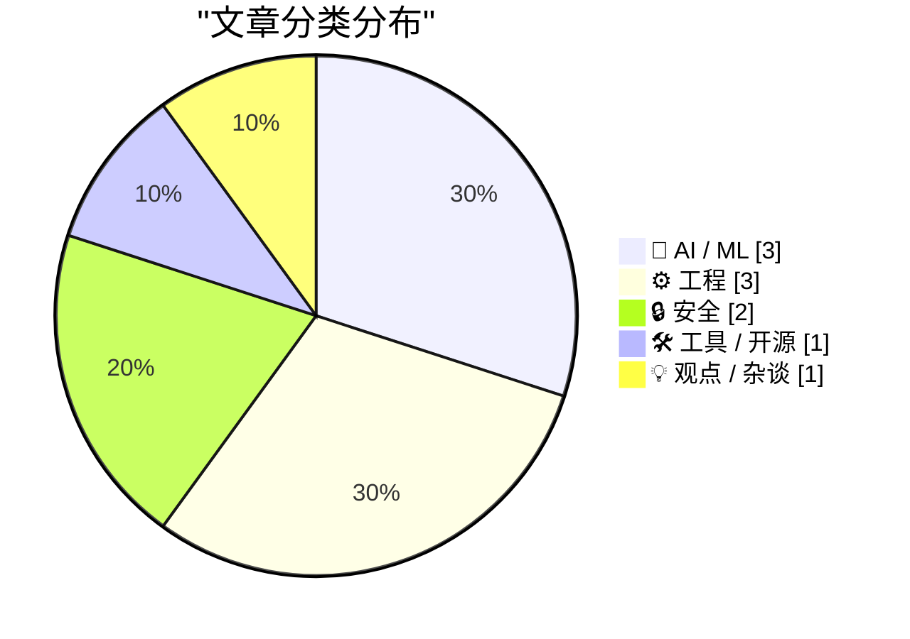
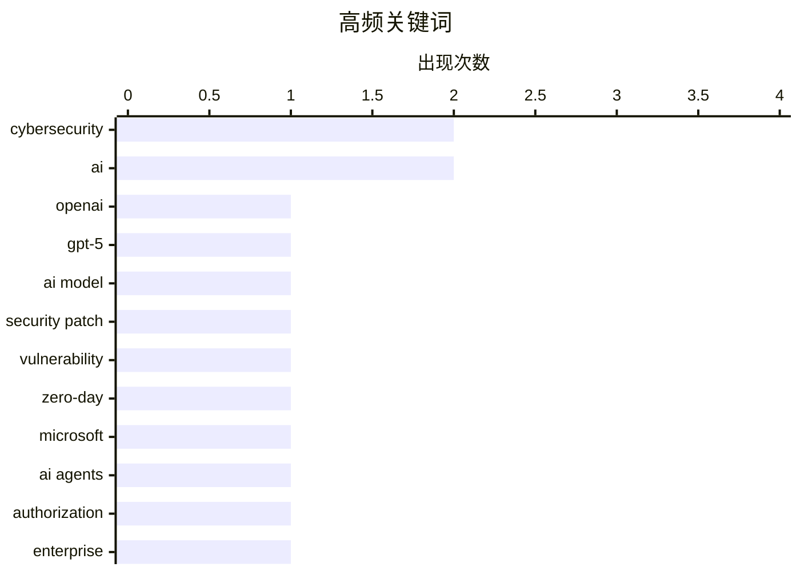

今日AI安全领域动作密集：OpenAI推出专为网络防御训练的GPT-5.4-Cyber变体，WorkOS发布针对AI代理的细粒度授权方案，而AISI的最新评估显示安全审查正沦为“资金竞赛”，投入越多漏洞发现越多。与此同时，Meta将创始人形象AI化用于内部沟通，折射出企业AI落地的差异化竞争已从模型能力转向可信度与授权管理。浏览器与Web生态亦有监管动向，Google明确将后退按钮劫持列为恶意行为将于6月处罚。

<!--more-->


> 来自 Karpathy 推荐的 92 个顶级技术博客，AI 精选 Top 10

## 🏆 今日必读

🥇 **下一代网络防御的可信访问**

[Trusted access for the next era of cyber defense](https://simonwillison.net/2026/Apr/14/trusted-access-openai/#atom-everything) — simonwillison.net · 1 小时前 · 🤖 AI / ML

> OpenAI推出专为网络安全防御设计的GPT-5.4-Cyber模型，该变体经过训练以支持网络防御用例。用户可通过政府签发的身份证在Persona平台上验证身份，获得减少摩擦的模型访问权限。Trusted Access for Cyber项目于今年2月启动，旨在为安全研究人员提供更便捷的AI工具访问。作为Claude Mythos的竞争对手，该项目反映了AI公司在网络安全领域的战略布局。

💡 **为什么值得读**: 这是了解AI大厂如何切入网络安全防御赛道的关键信息，GPT-5.4-Cyber和可信访问计划代表了行业新趋势。

🏷️ OpenAI, GPT-5, cybersecurity, AI model

🥈 **2026年4月补丁星期二**

[Patch Tuesday, April 2026 Edition](https://krebsonsecurity.com/2026/04/patch-tuesday-april-2026-edition/) — krebsonsecurity.com · 36 分钟前 · 🔒 安全

> 微软发布月度安全更新，共修复167个安全漏洞，覆盖Windows操作系统及相关软件。关键漏洞包括SharePoint Server零日漏洞和Windows Defender的BlueHammer公开漏洞（已公开披露）。谷歌Chrome浏览器修复了2026年第4个零日漏洞。Adobe Reader紧急更新修复了一个可导致远程代码执行的在利用漏洞。

💡 **为什么值得读**: 这份补丁汇总直接告诉你本月最关键的系统安全威胁，167个漏洞的规模值得安全从业者重点关注。

🏷️ security patch, vulnerability, zero-day, Microsoft

🥉 **WorkOS FGA：AI代理的授权层**

[[Sponsor] WorkOS FGA: The Authorization Layer for AI Agents](https://workos.com/blog/agents-need-authorization-not-just-authentication?utm_source=daringfireball&amp;utm_medium=newsletter&amp;utm_campaign=q22026) — daringfireball.net · 1 天前 · 🤖 AI / ML

> 企业AI代理部署的最大障碍不是模型质量或延迟，而是授权问题。WorkOS FGA（细粒度授权）提供资源级权限控制，定义AI代理的“爆炸半径”。Authentication证明代理身份，Authorization控制其可执行的操作范围。在企业AI竞争中，可信度将成为核心差异化因素。这是一种针对AI代理场景专门设计的授权方案。

💡 **为什么值得读**: 如果你在做企业级AI代理产品，这篇文章直接点出了最容易忽视但最致命的问题——授权架构设计。

🏷️ AI agents, authorization, enterprise, WorkOS

---

## 📊 数据概览

| 扫描源 | 抓取文章 | 时间范围 | 精选 |
|:---:|:---:|:---:|:---:|
| 78/92 | 2332 篇 → 42 篇 | 48h | **10 篇** |

### 分类分布



### 高频关键词



<details>
<summary>📈 纯文本关键词图（终端友好）</summary>

```
cybersecurity  │ ████████████████████ 2
ai             │ ████████████████████ 2
openai         │ ██████████░░░░░░░░░░ 1
gpt-5          │ ██████████░░░░░░░░░░ 1
ai model       │ ██████████░░░░░░░░░░ 1
security patch │ ██████████░░░░░░░░░░ 1
vulnerability  │ ██████████░░░░░░░░░░ 1
zero-day       │ ██████████░░░░░░░░░░ 1
microsoft      │ ██████████░░░░░░░░░░ 1
ai agents      │ ██████████░░░░░░░░░░ 1
```

</details>

### 🏷️ 话题标签

**cybersecurity**(2) · **ai**(2) · **openai**(1) · gpt-5(1) · ai model(1) · security patch(1) · vulnerability(1) · zero-day(1) · microsoft(1) · ai agents(1) · authorization(1) · enterprise(1) · workos(1) · meta(1) · zuckerberg(1) · chatbot(1) · proof of work(1) · ai safety(1) · claude(1) · servo(1)

---

## 🤖 AI / ML

### 1. 下一代网络防御的可信访问

[Trusted access for the next era of cyber defense](https://simonwillison.net/2026/Apr/14/trusted-access-openai/#atom-everything) — **simonwillison.net** · 1 小时前 · ⭐ 24/30

> OpenAI推出专为网络安全防御设计的GPT-5.4-Cyber模型，该变体经过训练以支持网络防御用例。用户可通过政府签发的身份证在Persona平台上验证身份，获得减少摩擦的模型访问权限。Trusted Access for Cyber项目于今年2月启动，旨在为安全研究人员提供更便捷的AI工具访问。作为Claude Mythos的竞争对手，该项目反映了AI公司在网络安全领域的战略布局。

🏷️ OpenAI, GPT-5, cybersecurity, AI model

---

### 2. WorkOS FGA：AI代理的授权层

[[Sponsor] WorkOS FGA: The Authorization Layer for AI Agents](https://workos.com/blog/agents-need-authorization-not-just-authentication?utm_source=daringfireball&amp;utm_medium=newsletter&amp;utm_campaign=q22026) — **daringfireball.net** · 1 天前 · ⭐ 24/30

> 企业AI代理部署的最大障碍不是模型质量或延迟，而是授权问题。WorkOS FGA（细粒度授权）提供资源级权限控制，定义AI代理的“爆炸半径”。Authentication证明代理身份，Authorization控制其可执行的操作范围。在企业AI竞争中，可信度将成为核心差异化因素。这是一种针对AI代理场景专门设计的授权方案。

🏷️ AI agents, authorization, enterprise, WorkOS

---

### 3. Meta打造AI版Mark Zuckerberg与员工互动

[FT: ‘Meta Builds AI Version of Mark Zuckerberg to Interact With Staff’](https://www.ft.com/content/02107c23-6c7a-4c19-b8e2-b45f4bb9ce5f) — **daringfireball.net** · 1 天前 · ⭐ 24/30

> Meta正在开发一个以Mark Zuckerberg为原型的AI角色，用于与内部员工进行对话和反馈。该AI角色基于Zuckerberg的说话方式、语气、公开声明以及他对公司战略的最新思考进行训练。根据三位知情人士透露，Zuckerberg本人亲自参与了这个AI角色的训练和测试。这一举措旨在让员工通过与AI交互感受到与创始人的连接。

🏷️ Meta, AI, Zuckerberg, Chatbot

---

## ⚙️ 工程

### 4. 探索新servo板条箱

[Exploring the new `servo` crate](https://simonwillison.net/2026/Apr/13/servo-crate-exploration/#atom-everything) — **simonwillison.net** · 1 天前 · ⭐ 23/30

> Servo浏览器引擎已作为可嵌入库发布到crates.io，版本号为0.1.0。作者使用Claude Code构建了一个名为servo-shot的CLI工具，可通过命令行对任意URL进行截图。构建过程成功，生成的截图准确渲染了目标网页。该工具演示了Servo作为Rust库在WebAssembly编译方面的潜力。

🏷️ Servo, Rust, browser engine, crates.io

---

### 5. Android现在阻止你分享照片位置

[Android now stops you sharing your location in photos](https://shkspr.mobi/blog/2026/04/android-now-stops-you-sharing-your-location-in-photos/) — **shkspr.mobi** · 1 天前 · ⭐ 23/30

> 谷歌Android最近的更新改变了照片位置元数据的处理方式，导致用户无法通过网页表单上传带地理位置的照片。OpenBenches是一个展示纪念长凳照片和位置的网站，之前依赖照片中的地理坐标在地图上定位。Android的行为变更使得这种基于元数据的地理位置分享方式失效。

🏷️ Android, location, privacy, metadata

---

### 6. Google将于6月开始惩罚后退按钮劫持

[Google Will Finally Begin Punishing Sites for Back-Button Hijacking in June](https://developers.google.com/search/blog/2026/04/back-button-hijacking) — **daringfireball.net** · 1 小时前 · ⭐ 22/30

> Google在搜索中心博客宣布，后退按钮劫持将被明确列为搜索政策中的“恶意行为”违规，从2026年6月开始执行惩罚。后退按钮劫持是指网站干预用户浏览器导航，阻止用户正常使用后退按钮返回上一页面，迫使用户跳转到未访问过的页面或展示广告。该行为违反了用户对浏览器基本功能的合理预期。

🏷️ Google, SEO, back button hijacking

---

## 🔒 安全

### 7. 2026年4月补丁星期二

[Patch Tuesday, April 2026 Edition](https://krebsonsecurity.com/2026/04/patch-tuesday-april-2026-edition/) — **krebsonsecurity.com** · 36 分钟前 · ⭐ 24/30

> 微软发布月度安全更新，共修复167个安全漏洞，覆盖Windows操作系统及相关软件。关键漏洞包括SharePoint Server零日漏洞和Windows Defender的BlueHammer公开漏洞（已公开披露）。谷歌Chrome浏览器修复了2026年第4个零日漏洞。Adobe Reader紧急更新修复了一个可导致远程代码执行的在利用漏洞。

🏷️ security patch, vulnerability, zero-day, Microsoft

---

### 8. 网络安全现在像工作量证明

[Cybersecurity Looks Like Proof of Work Now](https://simonwillison.net/2026/Apr/14/cybersecurity-proof-of-work/#atom-everything) — **simonwillison.net** · 2 小时前 · ⭐ 23/30

> 英国AI安全研究所（AISI）发布了对Claude Mythos网络能力的独立评估，验证了该模型在识别安全漏洞方面的卓越表现。AISI报告显示，在安全审查上投入的token和资金越多，发现的漏洞越多。这意味着安全本质被简化为一个残酷的经济公式：要强化系统安全，必须持续投入更多资金。网络安全正在变成一场“谁花钱更多”的竞赛。

🏷️ cybersecurity, proof of work, AI safety, Claude

---

## 🛠 工具 / 开源

### 9. Gemma 4音频与MLX

[Gemma 4 audio with MLX](https://simonwillison.net/2026/Apr/12/mlx-audio/#atom-everything) — **simonwillison.net** · 1 天前 · ⭐ 23/30

> 通过MLX框架和10.28GB的Gemma 4 E2B模型，可在macOS上实现本地音频转录。使用uv run命令配置MLX、torchvision和gradio环境，通过mlx_vlm.generate工具指定音频文件和转录提示即可生成文本。实测14秒音频文件的转录结果表明该方案可用，但具体准确率未提及。

🏷️ Gemma 4, MLX, audio transcription, macOS

---

## 💡 观点 / 杂谈

### 10. 引用Bryan Cantrill

[Quoting Bryan Cantrill](https://simonwillison.net/2026/Apr/13/bryan-cantrill/#atom-everything) — **simonwillison.net** · 1 天前 · ⭐ 22/30

> Bryan Cantrill指出大型语言模型天然缺乏“懒惰”这个美德。对LLM来说工作没有任何成本，不会为优化未来时间而自发减少输出。人类正是因为懒惰才会被迫开发简洁的抽象，避免在笨重的设计上浪费时间。如果不加控制，LLM会让系统越来越大而非越来越好，代价是真正重要的东西。

🏷️ LLM, lazy, AI, optimization

---

*生成于 2026-04-15 22:24 | 扫描 78 源 → 获取 2332 篇 → 精选 10 篇*
*基于 [Hacker News Popularity Contest 2025](https://refactoringenglish.com/tools/hn-popularity/) RSS 源列表，由 [Andrej Karpathy](https://x.com/karpathy) 推荐*
*由「懂点儿AI」制作，欢迎关注同名微信公众号获取更多 AI 实用技巧 💡*
