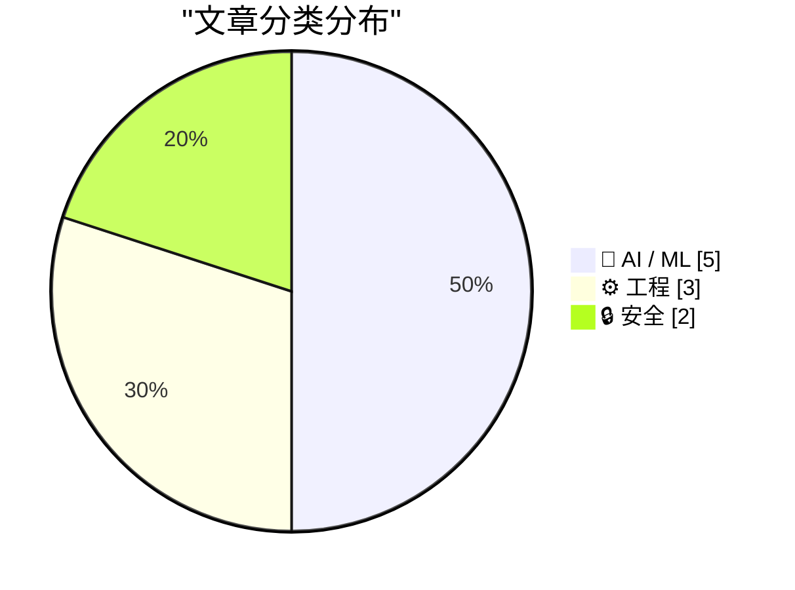
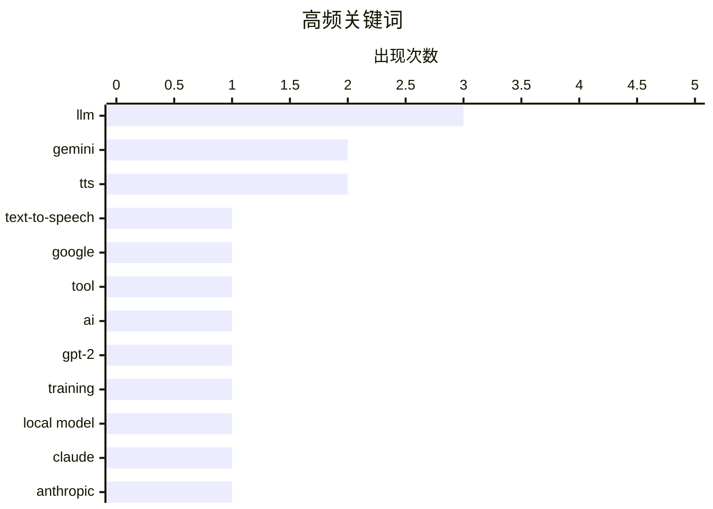

今日技术圈聚焦三大趋势：本地大模型部署取得突破，Qwen3.6-35B可在普通笔记本运行并超越Claude表现；同时Google发布Gemini 3.1 Flash TTS，进一步推动边缘AI应用。工程领域迎来更新周期，Zig 0.16.0发布，SQLAlchemy 2深耕高级关系模型，Simdutf实现与C++标准库解耦。安全方面，AI网络安全讨论升温，datasette项目以Sec-Fetch-Site头部替代传统CSRF token机制。

<!--more-->


> 来自 Karpathy 推荐的 92 个顶级技术博客，AI 精选 Top 10

## 🏆 今日必读

🥇 **Gemini 3.1 Flash TTS**

[Gemini 3.1 Flash TTS](https://simonwillison.net/2026/Apr/15/gemini-31-flash-tts/#atom-everything) — simonwillison.net · 1 天前 · 🤖 AI / ML

> Gemini 3.1 Flash TTS

🏷️ Gemini, TTS, text-to-speech, Google

🥈 **Gemini 3.1 Flash TTS**

[Gemini 3.1 Flash TTS](https://simonwillison.net/2026/Apr/15/gemini-flash-tts/#atom-everything) — simonwillison.net · 1 天前 · 🤖 AI / ML

> Gemini 3.1 Flash TTS

🏷️ Gemini, TTS, tool, AI

🥉 **Writing an LLM from scratch, part 32k -- Interventions: training a better model locally with gradient accumulation**

[Writing an LLM from scratch, part 32k -- Interventions: training a better model locally with gradient accumulation](https://www.gilesthomas.com/2026/04/llm-from-scratch-32k-interventions-training-our-best-model-locally-gradient-accumulation) — gilesthomas.com · 1 天前 · 🤖 AI / ML

> Writing an LLM from scratch, part 32k -- Interventions: training a better model locally with gradient accumulation

🏷️ LLM, GPT-2, training, local model

---

## 📊 数据概览

| 扫描源 | 抓取文章 | 时间范围 | 精选 |
|:---:|:---:|:---:|:---:|
| 79/92 | 2368 篇 → 42 篇 | 48h | **10 篇** |

### 分类分布



### 高频关键词



<details>
<summary>📈 纯文本关键词图（终端友好）</summary>

```
llm            │ ████████████████████ 3
gemini         │ █████████████░░░░░░░ 2
tts            │ █████████████░░░░░░░ 2
text-to-speech │ ███████░░░░░░░░░░░░░ 1
google         │ ███████░░░░░░░░░░░░░ 1
tool           │ ███████░░░░░░░░░░░░░ 1
ai             │ ███████░░░░░░░░░░░░░ 1
gpt-2          │ ███████░░░░░░░░░░░░░ 1
training       │ ███████░░░░░░░░░░░░░ 1
local model    │ ███████░░░░░░░░░░░░░ 1
```

</details>

### 🏷️ 话题标签

**llm**(3) · **gemini**(2) · **tts**(2) · text-to-speech(1) · google(1) · tool(1) · ai(1) · gpt-2(1) · training(1) · local model(1) · claude(1) · anthropic(1) · plugin(1) · sqlalchemy(1) · orm(1) · python(1) · database(1) · ai security(1) · proof of work(1) · cybersecurity(1)

---

## 🤖 AI / ML

### 1. Gemini 3.1 Flash TTS

[Gemini 3.1 Flash TTS](https://simonwillison.net/2026/Apr/15/gemini-31-flash-tts/#atom-everything) — **simonwillison.net** · 1 天前 · ⭐ 26/30

> Gemini 3.1 Flash TTS

🏷️ Gemini, TTS, text-to-speech, Google

---

### 2. Gemini 3.1 Flash TTS

[Gemini 3.1 Flash TTS](https://simonwillison.net/2026/Apr/15/gemini-flash-tts/#atom-everything) — **simonwillison.net** · 1 天前 · ⭐ 25/30

> Gemini 3.1 Flash TTS

🏷️ Gemini, TTS, tool, AI

---

### 3. Writing an LLM from scratch, part 32k -- Interventions: training a better model locally with gradient accumulation

[Writing an LLM from scratch, part 32k -- Interventions: training a better model locally with gradient accumulation](https://www.gilesthomas.com/2026/04/llm-from-scratch-32k-interventions-training-our-best-model-locally-gradient-accumulation) — **gilesthomas.com** · 1 天前 · ⭐ 25/30

> Writing an LLM from scratch, part 32k -- Interventions: training a better model locally with gradient accumulation

🏷️ LLM, GPT-2, training, local model

---

### 4. llm-anthropic 0.25

[llm-anthropic 0.25](https://simonwillison.net/2026/Apr/16/llm-anthropic/#atom-everything) — **simonwillison.net** · 1 小时前 · ⭐ 24/30

> llm-anthropic 0.25

🏷️ LLM, Claude, anthropic, plugin

---

### 5. Qwen3.6-35B-A3B on my laptop drew me a better pelican than Claude Opus 4.7

[Qwen3.6-35B-A3B on my laptop drew me a better pelican than Claude Opus 4.7](https://simonwillison.net/2026/Apr/16/qwen-beats-opus/#atom-everything) — **simonwillison.net** · 5 小时前 · ⭐ 21/30

> Qwen3.6-35B-A3B on my laptop drew me a better pelican than Claude Opus 4.7

🏷️ Qwen, LLM, image generation, benchmark

---

## ⚙️ 工程

### 6. SQLAlchemy 2 In Practice - Chapter 5 - Advanced Many-To-Many Relationships

[SQLAlchemy 2 In Practice - Chapter 5 - Advanced Many-To-Many Relationships](https://blog.miguelgrinberg.com/post/sqlalchemy-2-in-practice---chapter-5---advanced-many-to-many-relationships) — **miguelgrinberg.com** · 10 小时前 · ⭐ 24/30

> SQLAlchemy 2 In Practice - Chapter 5 - Advanced Many-To-Many Relationships

🏷️ SQLAlchemy, ORM, Python, database

---

### 7. Simdutf Can Now Be Used Without libc++ or libc++abi

[Simdutf Can Now Be Used Without libc++ or libc++abi](https://mitchellh.com/writing/simdutf-no-libcxx) — **mitchellh.com** · 1 天前 · ⭐ 23/30

> Simdutf Can Now Be Used Without libc++ or libc++abi

🏷️ simdutf, libc++, performance

---

### 8. Zig 0.16.0 release notes: "Juicy Main"

[Zig 0.16.0 release notes: "Juicy Main"](https://simonwillison.net/2026/Apr/15/juicy-main/#atom-everything) — **simonwillison.net** · 1 天前 · ⭐ 22/30

> Zig 0.16.0 release notes: "Juicy Main"

🏷️ Zig, programming language, systems programming, release notes

---

## 🔒 安全

### 9. AI cybersecurity is not proof of work

[AI cybersecurity is not proof of work](http://antirez.com/news/163) — **antirez.com** · 11 小时前 · ⭐ 23/30

> AI cybersecurity is not proof of work

🏷️ AI security, proof of work, cybersecurity

---

### 10. datasette PR #2689: Replace token-based CSRF with Sec-Fetch-Site header protection

[datasette PR #2689: Replace token-based CSRF with Sec-Fetch-Site header protection](https://simonwillison.net/2026/Apr/14/replace-token-based-csrf/#atom-everything) — **simonwillison.net** · 1 天前 · ⭐ 20/30

> datasette PR #2689: Replace token-based CSRF with Sec-Fetch-Site header protection

🏷️ CSRF, security, web security, datasette

---

*生成于 2026-04-17 22:25 | 扫描 79 源 → 获取 2368 篇 → 精选 10 篇*
*基于 [Hacker News Popularity Contest 2025](https://refactoringenglish.com/tools/hn-popularity/) RSS 源列表，由 [Andrej Karpathy](https://x.com/karpathy) 推荐*
*由「懂点儿AI」制作，欢迎关注同名微信公众号获取更多 AI 实用技巧 💡*
