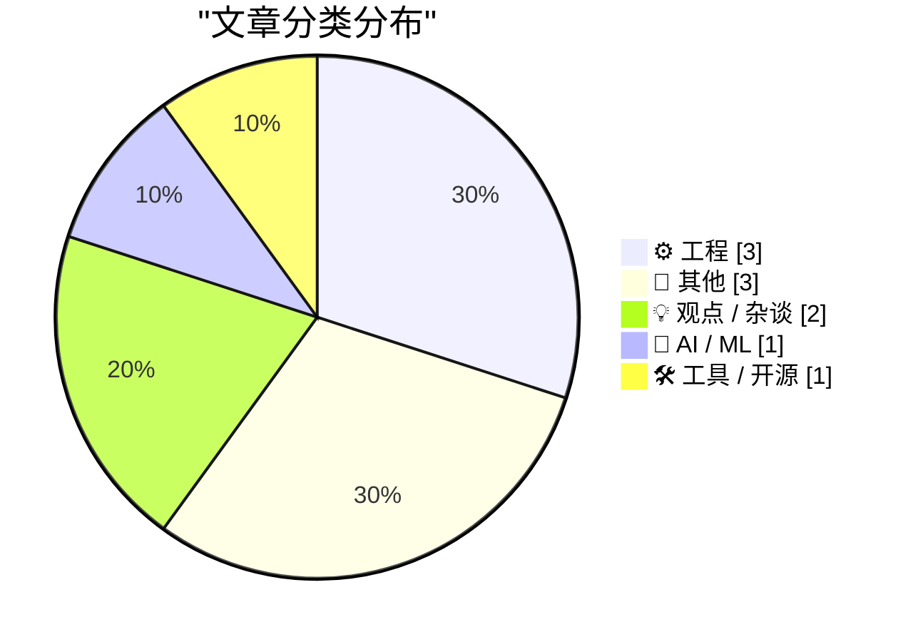
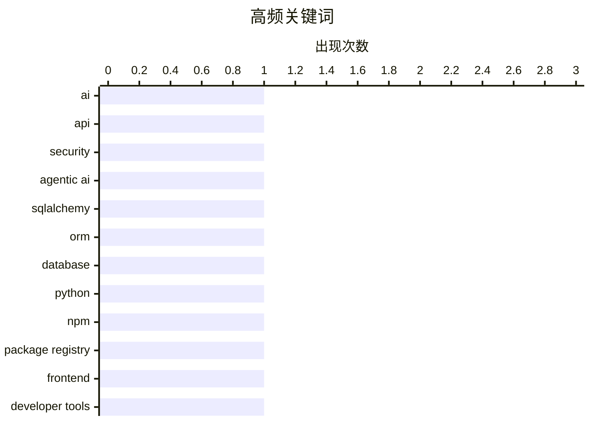

今日技术圈呈现三大趋势：一是AI代理能力正在突破边界，Agentic AI已能自主调用安全API进行数据泄露检测，但这类技术被滥用的风险也引发关注；二是开发者工具持续深耕用户体验优化，从SQLAlchemy高级特性到npmx的包管理创新，细节体验成为竞争焦点；三是科技怀旧引发讨论，MP3专利过期与Apple II发布47周年，提示业界在追逐前沿的同时也回望技术发展的脉络。

<!--more-->

> 来自 Karpathy 推荐的 92 个顶级技术博客，AI 精选 Top 10

## 🏆 今日必读

🥇 **Agentic AI 如何利用 Have I Been Pwned 的 API**

[Here's What Agentic AI Can Do With Have I Been Pwned's APIs](https://www.troyhunt.com/heres-what-agentic-ai-can-do-with-have-i-been-pwneds-apis/) — troyhunt.com · 23 小时前 · 🤖 AI / ML

> 安全专家Troy Hunt演示了Agentic AI如何调用Have I Been Pwned（HIBP）的API进行密码泄露检查。他展示了AI代理能够自主识别数据泄露、批量查询账号信息并生成安全报告的能力，同时也指出了这类技术被滥用的风险。

💡 **为什么值得读**: 对于关注AI安全应用和API安全的人来说，这篇文章提供了真实案例，展示了AI代理的实际能力和潜在风险。

🏷️ AI, API, security, Agentic AI

🥈 **SQLAlchemy 2 实践 - 第五章：高级多对多关系**

[SQLAlchemy 2 In Practice - Chapter 5 - Advanced Many-To-Many Relationships](https://blog.miguelgrinberg.com/post/sqlalchemy-2-in-practice---chapter-5---advanced-many-to-many-relationships) — miguelgrinberg.com · 1 天前 · ⚙️ 工程

> 本书第五章深入探讨SQLAlchemy中的高级多对多关系模式，包括关联表的自定义字段、反向关系配置以及如何处理复杂的数据关系。作者通过实际代码示例演示了如何在真实项目中实现这些高级特性。

💡 **为什么值得读**: 适合正在学习或使用SQLAlchemy的开发者，特别是需要处理复杂数据库关系的后端工程师。

🏷️ SQLAlchemy, ORM, database, Python

🥉 **每个人都应该从 npmx 偷学的功能**

[Features everyone should steal from npmx](https://nesbitt.io/2026/04/16/features-everyone-should-steal-from-npmx.html) — nesbitt.io · 1 天前 · 🛠 工具 / 开源

> 文章探讨了npmx（一个npm包管理器的增强工具）的用户体验设计，分析了用户自定义包注册表前端的创新特性。这些功能展示了包管理器在提升开发者体验方面的创新方向。

💡 **为什么值得读**: 对前端工具链和开发者体验感兴趣的技术人员可以从中获得启发，了解现代包管理器的设计趋势。

🏷️ npm, package registry, frontend, developer tools

---

## 📊 数据概览

| 扫描源 | 抓取文章 | 时间范围 | 精选 |
|:---:|:---:|:---:|:---:|
| 63/92 | 1899 篇 → 10 篇 | 48h | **10 篇** |

### 分类分布



### 高频关键词



<details>
<summary>📈 纯文本关键词图（终端友好）</summary>

```
ai               │ ████████████████████ 1
api              │ ████████████████████ 1
security         │ ████████████████████ 1
agentic ai       │ ████████████████████ 1
sqlalchemy       │ ████████████████████ 1
orm              │ ████████████████████ 1
database         │ ████████████████████ 1
python           │ ████████████████████ 1
npm              │ ████████████████████ 1
package registry │ ████████████████████ 1
frontend         │ ████████████████████ 1
developer tools  │ ████████████████████ 1
```

</details>

### 🏷️ 话题标签

**ai**(1) · **api**(1) · **security**(1) · agentic ai(1) · sqlalchemy(1) · orm(1) · database(1) · python(1) · npm(1) · package registry(1) · frontend(1) · developer tools(1) · mp3(1) · patent(1) · audio(1) · technology history(1) · polynomial(1) · geometry(1) · newton(1) · mathematics(1)

---

## ⚙️ 工程

### 1. SQLAlchemy 2 实践 - 第五章：高级多对多关系

[SQLAlchemy 2 In Practice - Chapter 5 - Advanced Many-To-Many Relationships](https://blog.miguelgrinberg.com/post/sqlalchemy-2-in-practice---chapter-5---advanced-many-to-many-relationships) — **miguelgrinberg.com** · 1 天前 · ⭐ 24/30

> 本书第五章深入探讨SQLAlchemy中的高级多对多关系模式，包括关联表的自定义字段、反向关系配置以及如何处理复杂的数据关系。作者通过实际代码示例演示了如何在真实项目中实现这些高级特性。

🏷️ SQLAlchemy, ORM, database, Python

---

### 2. 最后的 MP3 专利

[The last MP3 patent](https://dfarq.homeip.net/mp3-is-dead-long-live-mp3-oh-wait-its-just-the-patent/?utm_source=rss&#038;utm_medium=rss&#038;utm_campaign=mp3-is-dead-long-live-mp3-oh-wait-its-just-the-patent) — **dfarq.homeip.net** · 11 小时前 · ⭐ 19/30

> 文章回顾了MP3音频格式专利的历史，从1990年代Fraunhofer研究所的研发，到专利过期对整个音频产业的影响。文章解释了专利如何塑造了数字音乐产业的格局，以及专利过期后对音乐格式选择的改变。

🏷️ MP3, patent, audio, technology history

---

### 3. 牛顿直径

[Newton diameters](https://www.johndcook.com/blog/2026/04/16/newton-diameters/) — **johndcook.com** · 1 天前 · ⭐ 17/30

> 文章介绍了一个数学概念：牛顿直径。对于n次多项式f(x,y)=0的零点集，任意穿过该零点集n次的直线称为牛顿直径。以单位圆为例，所有穿过圆心的直线都是牛顿直径。文章探讨了这一几何概念的定义和应用。

🏷️ polynomial, geometry, Newton, mathematics

---

## 📝 其他

### 4. Apple II 于1977年4月16日发布

[Apple II announced April 16, 1977](https://dfarq.homeip.net/apple-ii-announced-april-16-1977/?utm_source=rss&#038;utm_medium=rss&#038;utm_campaign=apple-ii-announced-april-16-1977) — **dfarq.homeip.net** · 1 天前 · ⭐ 17/30

> 1977年4月16日，苹果公司发布了Apple II，这是一款面向消费者的预组装台式电脑，虽然实际发货要等到当年6月。Apple II最终售出约600万台，对个人电脑革命产生了深远影响，成为早期家用电脑的标杆产品。

🏷️ Apple II, computer history, vintage computing, retro

---

### 5. Premium: 私人信贷反对者指南

[Premium: The Hater's Guide to Private Credit](https://www.wheresyoured.at/hatersguide-privatecredit/) — **wheresyoured.at** · 5 小时前 · ⭐ 14/30

> 作者讲述了自己申请商业贷款后收到的海量推销信息，每天收到多达三条的信贷offer，金额从15万美元到数十万美元不等。文章以此为切入点，分析私人信贷行业的问题和争议。

🏷️ finance, credit, banking, personal finance

---

### 6. 雷恩圣殿之谜 第四部：非虚构与虚构的交汇

[The Mystery of Rennes-le-Château, Part 4: Non-Fiction Meets Fiction](https://www.filfre.net/2026/04/the-mystery-of-rennes-le-chateau-part-4-non-fiction-meets-fiction/) — **filfre.net** · 6 小时前 · ⭐ 13/30

> 这是关于《Gabriel Knight 3：圣血与恶魔》游戏背后真实历史的系列文章第四部。文章追溯了1982年《圣血与圣杯》书籍的出版历程，以及围绕雷恩圣殿的各种历史谜团如何被改编成游戏剧情。

🏷️ game, history, Gabriel Knight, mystery

---

## 💡 观点 / 杂谈

### 7. 我真的很讨厌大多数人的垃圾内容

[I truly hate mostpeopleslop](https://www.joanwestenberg.com/i-truly-hate-mostpeopleslop/) — **joanwestenberg.com** · 1 天前 · ⭐ 17/30

> 作者引用了2006年《Adweek文案手册》中的观点，批评社交媒体内容质量的退化。文章分析了社交媒体如何从内容平台变成注意力争夺战，以及低质量内容泛滥对用户体验的影响。作者表达了对当前社交媒体内容生态的不满。

🏷️ social media, content, copywriting, marketing

---

### 8. 可能性的力量

[The Power of Possibility](https://anildash.com/2026/04/16/girls-club-gala/) — **anildash.com** · 1 天前 · ⭐ 16/30

> 作者作为Lower Eastside Girls Club董事会的成员，介绍这个社区组织30年来的成就。文章呼吁读者支持该组织，方式是直接捐款或参加2026年5月7日在纽约Webster Hall举办的30周年庆典。作者强调了这个组织在帮助女孩成长方面的有效模式。

🏷️ community, social impact, nonprofit, philanthropy

---

## 🤖 AI / ML

### 9. Agentic AI 如何利用 Have I Been Pwned 的 API

[Here's What Agentic AI Can Do With Have I Been Pwned's APIs](https://www.troyhunt.com/heres-what-agentic-ai-can-do-with-have-i-been-pwneds-apis/) — **troyhunt.com** · 23 小时前 · ⭐ 25/30

> 安全专家Troy Hunt演示了Agentic AI如何调用Have I Been Pwned（HIBP）的API进行密码泄露检查。他展示了AI代理能够自主识别数据泄露、批量查询账号信息并生成安全报告的能力，同时也指出了这类技术被滥用的风险。

🏷️ AI, API, security, Agentic AI

---

## 🛠 工具 / 开源

### 10. 每个人都应该从 npmx 偷学的功能

[Features everyone should steal from npmx](https://nesbitt.io/2026/04/16/features-everyone-should-steal-from-npmx.html) — **nesbitt.io** · 1 天前 · ⭐ 22/30

> 文章探讨了npmx（一个npm包管理器的增强工具）的用户体验设计，分析了用户自定义包注册表前端的创新特性。这些功能展示了包管理器在提升开发者体验方面的创新方向。

🏷️ npm, package registry, frontend, developer tools

---

*生成于 2026-04-18 22:36 | 扫描 63 源 → 获取 1899 篇 → 精选 10 篇*
*基于 [Hacker News Popularity Contest 2025](https://refactoringenglish.com/tools/hn-popularity/) RSS 源列表，由 [Andrej Karpathy](https://x.com/karpathy) 推荐*
*由「懂点儿AI」制作，欢迎关注同名微信公众号获取更多 AI 实用技巧 💡*
