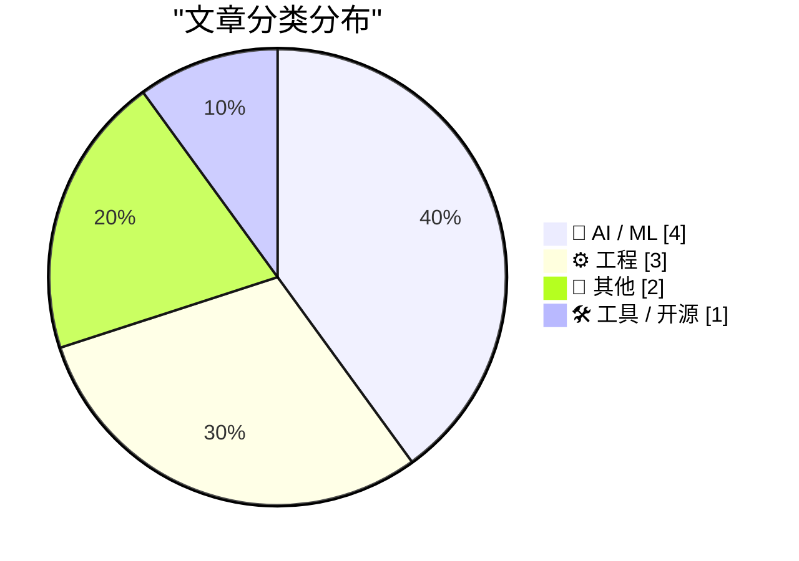
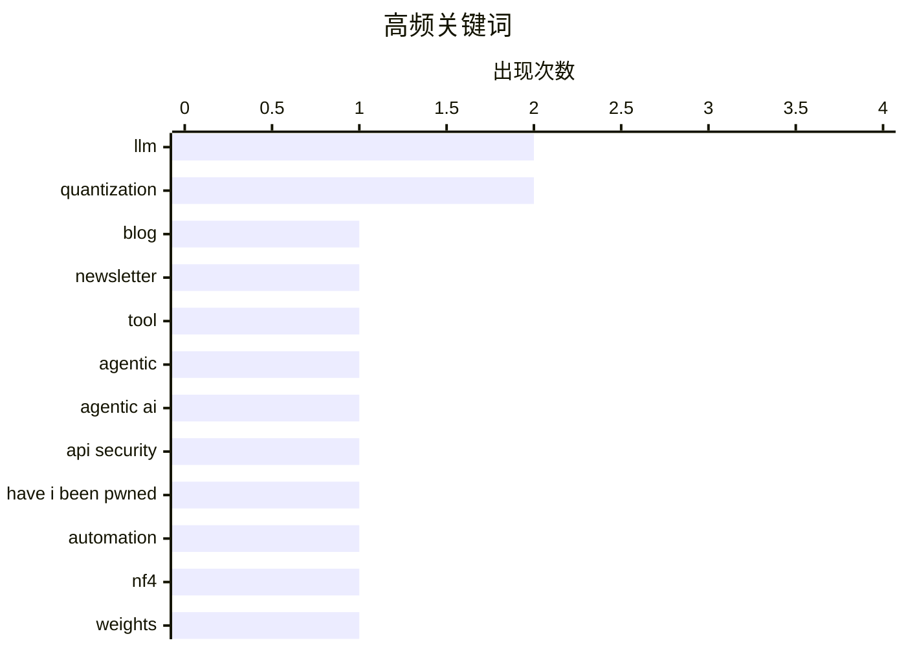

今日技术圈呈现AI与工程并进的态势：Agentic AI应用、低精度量化（FP4）、LLM训练优化等技术持续推进，反映出大模型落地与效率提升仍是核心方向；PyCon US 2026新增AI与安全Track，佐治亚投票系统争议则折射出技术在实际场景中的复杂挑战。

<!--more-->


> 来自 Karpathy 推荐的 92 个顶级技术博客，AI 精选 Top 10

## 🏆 今日必读

🥇 **Adding a new content type to my blog-to-newsletter tool**

[Adding a new content type to my blog-to-newsletter tool](https://simonwillison.net/guides/agentic-engineering-patterns/adding-a-new-content-type/#atom-everything) — simonwillison.net · 19 小时前 · ⚙️ 工程

> Adding a new content type to my blog-to-newsletter tool

🏷️ blog, newsletter, tool, agentic

🥈 **Here's What Agentic AI Can Do With Have I Been Pwned's APIs**

[Here's What Agentic AI Can Do With Have I Been Pwned's APIs](https://www.troyhunt.com/heres-what-agentic-ai-can-do-with-have-i-been-pwneds-apis/) — troyhunt.com · 1 天前 · 🤖 AI / ML

> Here's What Agentic AI Can Do With Have I Been Pwned's APIs

🏷️ agentic AI, API security, Have I Been Pwned, automation

🥉 **Gaussian distributed weights for LLMs**

[Gaussian distributed weights for LLMs](https://www.johndcook.com/blog/2026/04/18/qlora/) — johndcook.com · 7 小时前 · 🤖 AI / ML

> Gaussian distributed weights for LLMs

🏷️ LLM, quantization, NF4, weights

---

## 📊 数据概览

| 扫描源 | 抓取文章 | 时间范围 | 精选 |
|:---:|:---:|:---:|:---:|
| 62/92 | 1796 篇 → 23 篇 | 48h | **10 篇** |

### 分类分布



### 高频关键词



<details>
<summary>📈 纯文本关键词图（终端友好）</summary>

```
llm               │ ████████████████████ 2
quantization      │ ████████████████████ 2
blog              │ ██████████░░░░░░░░░░ 1
newsletter        │ ██████████░░░░░░░░░░ 1
tool              │ ██████████░░░░░░░░░░ 1
agentic           │ ██████████░░░░░░░░░░ 1
agentic ai        │ ██████████░░░░░░░░░░ 1
api security      │ ██████████░░░░░░░░░░ 1
have i been pwned │ ██████████░░░░░░░░░░ 1
automation        │ ██████████░░░░░░░░░░ 1
```

</details>

### 🏷️ 话题标签

**llm**(2) · **quantization**(2) · **blog**(1) · newsletter(1) · tool(1) · agentic(1) · agentic ai(1) · api security(1) · have i been pwned(1) · automation(1) · nf4(1) · weights(1) · pycon(1) · python(1) · conference(1) · 2026(1) · datasette(1) · sqlite(1) · open source(1) · release(1)

---

## 🤖 AI / ML

### 1. Here's What Agentic AI Can Do With Have I Been Pwned's APIs

[Here's What Agentic AI Can Do With Have I Been Pwned's APIs](https://www.troyhunt.com/heres-what-agentic-ai-can-do-with-have-i-been-pwneds-apis/) — **troyhunt.com** · 1 天前 · ⭐ 24/30

> Here's What Agentic AI Can Do With Have I Been Pwned's APIs

🏷️ agentic AI, API security, Have I Been Pwned, automation

---

### 2. Gaussian distributed weights for LLMs

[Gaussian distributed weights for LLMs](https://www.johndcook.com/blog/2026/04/18/qlora/) — **johndcook.com** · 7 小时前 · ⭐ 22/30

> Gaussian distributed weights for LLMs

🏷️ LLM, quantization, NF4, weights

---

### 3. 4-bit floating point FP4

[4-bit floating point FP4](https://www.johndcook.com/blog/2026/04/17/fp4/) — **johndcook.com** · 21 小时前 · ⭐ 21/30

> 4-bit floating point FP4

🏷️ floating point, FP4, quantization

---

### 4. How an LLM becomes more coherent as we train it

[How an LLM becomes more coherent as we train it](https://www.gilesthomas.com/2026/04/how-an-llm-becomes-more-coherent-over-training) — **gilesthomas.com** · 22 小时前 · ⭐ 19/30

> How an LLM becomes more coherent as we train it

🏷️ LLM, training, coherence, RNN

---

## ⚙️ 工程

### 5. Adding a new content type to my blog-to-newsletter tool

[Adding a new content type to my blog-to-newsletter tool](https://simonwillison.net/guides/agentic-engineering-patterns/adding-a-new-content-type/#atom-everything) — **simonwillison.net** · 19 小时前 · ⭐ 24/30

> Adding a new content type to my blog-to-newsletter tool

🏷️ blog, newsletter, tool, agentic

---

### 6. Reading List 04/18/2026

[Reading List 04/18/2026](https://www.construction-physics.com/p/reading-list-04182026) — **construction-physics.com** · 10 小时前 · ⭐ 19/30

> Reading List 04/18/2026

🏷️ quadruped robot, China tech, transformer startups, space satellites

---

### 7. Forgotten message from the past: LB_INIT­STORAGE

[Forgotten message from the past: LB_INIT­STORAGE](https://devblogs.microsoft.com/oldnewthing/20260417-00/?p=112243) — **devblogs.microsoft.com/oldnewthing** · 1 天前 · ⭐ 18/30

> Forgotten message from the past: LB_INIT­STORAGE

🏷️ Windows API, memory, optimization

---

## 📝 其他

### 8. Join us at PyCon US 2026 in Long Beach - we have new AI and security tracks this year

[Join us at PyCon US 2026 in Long Beach - we have new AI and security tracks this year](https://simonwillison.net/2026/Apr/17/pycon-us-2026/#atom-everything) — **simonwillison.net** · 22 小时前 · ⭐ 21/30

> Join us at PyCon US 2026 in Long Beach - we have new AI and security tracks this year

🏷️ PyCon, Python, conference, 2026

---

### 9. Pluralistic: Georgia's voting technology blunder (18 Apr 2026)

[Pluralistic: Georgia's voting technology blunder (18 Apr 2026)](https://pluralistic.net/2026/04/18/dominion-sucks-actually/) — **pluralistic.net** · 9 小时前 · ⭐ 17/30

> Pluralistic: Georgia's voting technology blunder (18 Apr 2026)

🏷️ voting technology, Georgia, election

---

## 🛠 工具 / 开源

### 10. datasette 1.0a28

[datasette 1.0a28](https://simonwillison.net/2026/Apr/17/datasette/#atom-everything) — **simonwillison.net** · 1 天前 · ⭐ 21/30

> datasette 1.0a28

🏷️ Datasette, SQLite, open source, release

---

*生成于 2026-04-19 22:23 | 扫描 62 源 → 获取 1796 篇 → 精选 10 篇*
*基于 [Hacker News Popularity Contest 2025](https://refactoringenglish.com/tools/hn-popularity/) RSS 源列表，由 [Andrej Karpathy](https://x.com/karpathy) 推荐*
*由「懂点儿AI」制作，欢迎关注同名微信公众号获取更多 AI 实用技巧 💡*
