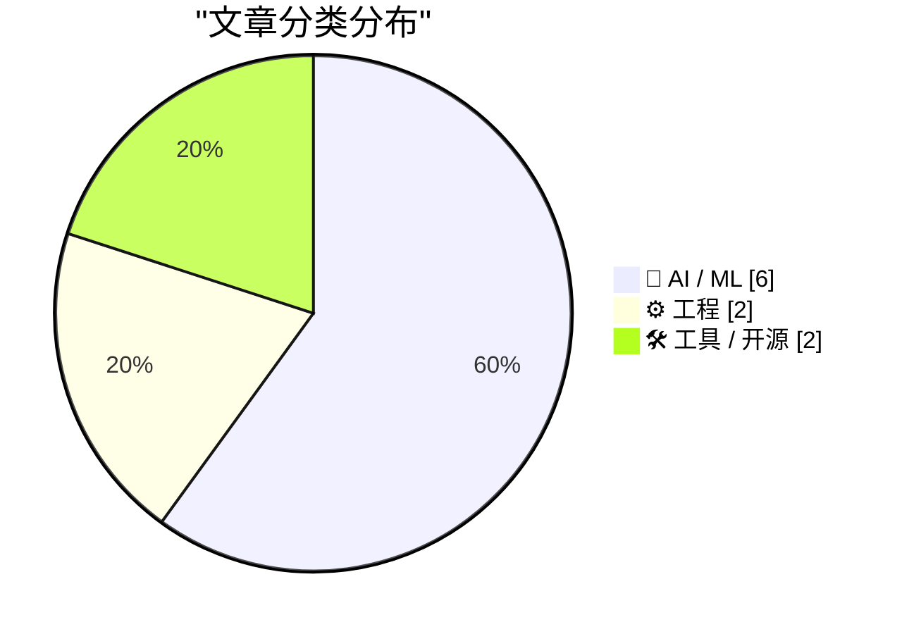
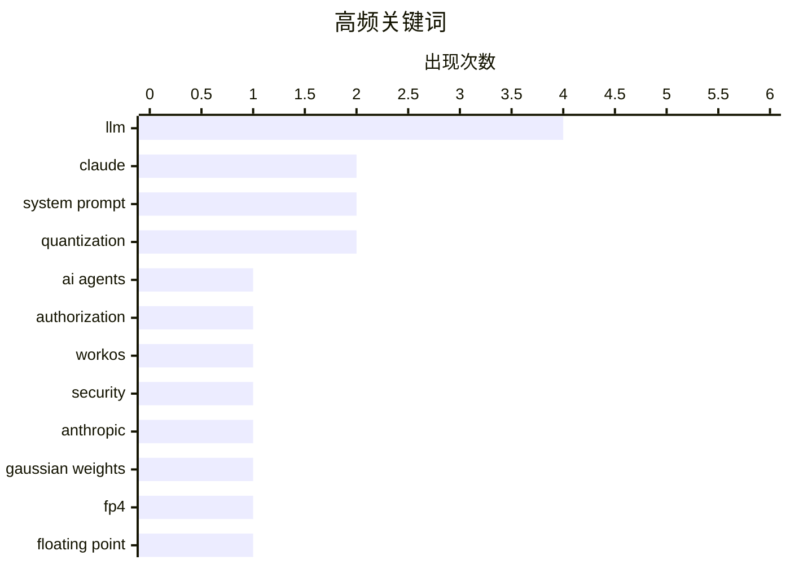

企业级AI正在从模型能力竞争转向信任与安全竞争，授权机制成为新的核心战场——WorkOS FGA等工具通过资源级权限控制限定AI的“爆炸半径”。LLM底层技术持续演进，4位量化格式FP4与NF4的应用、以及系统提示词的透明化趋势，都指向推理效率与模型可控性的双重需求。与此同时，AI原生工具正在重塑传统软件格局，Figma因Claude Design面临挑战，“无头化”AI服务模式则可能颠覆按人头收费的SaaS范式。

<!--more-->


> 来自 Karpathy 推荐的 92 个顶级技术博客，AI 精选 Top 10

## 🏆 今日必读

🥇 **WorkOS FGA：AI 智能体的授权层**

[WorkOS FGA: The Authorization Layer for AI Agents](https://workos.com/blog/agents-need-authorization-not-just-authentication?utm_source=daringfireball&amp;utm_medium=newsletter&amp;utm_campaign=q22026) — daringfireball.net · 4 小时前 · ⚙️ 工程

> 企业 AI 部署的核心瓶颈不是模型质量或延迟，而是授权机制。Authentication 证明智能体的身份，而 Authorization 定义其「爆炸半径」——即权限范围。WorkOS FGA 通过资源级权限控制来限定这个爆炸半径，支持细粒度的访问控制。文章指出，企业级 AI 的赢家不会是功能最多的公司，而是最值得信任的公司。

💡 **为什么值得读**: 如果你在构建企业级 AI 应用或智能体，必须理解授权与认证的区别，这篇文章直接点出了企业 AI 落地的关键挑战。

🏷️ AI agents, authorization, WorkOS, security

🥈 **Claude Opus 4.6 与 4.7 系统提示词的变化**

[Changes in the system prompt between Claude Opus 4.6 and 4.7](https://simonwillison.net/2026/Apr/18/opus-system-prompt/#atom-everything) — simonwillison.net · 22 小时前 · 🤖 AI / ML

> Anthropic 是唯一公开其聊天系统系统提示词的主流 AI 实验室，系统提示词档案已追溯到 2024 年 7 月的 Claude 3。Opus 4.7 于 2026 年 4 月 16 日发布，相比 2 月 5 日的 Opus 4.6 更新了系统提示词。作者用 Claude Code 将 Markdown 版本的提示词按模型拆分，并构建了带假提交日期的 Git 历史，便于通过 GitHub 查看变更。

💡 **为什么值得读**: 对 Anthropic 系统提示词演化感兴趣的开发者，可以通过这个 Git 时间线直观看到 Claude 模型的指令调优方向。

🏷️ Claude, system prompt, Anthropic, LLM

🥉 **LLM 的高斯分布权重**

[Gaussian distributed weights for LLMs](https://www.johndcook.com/blog/2026/04/18/qlora/) — johndcook.com · 1 天前 · 🤖 AI / ML

> 前文探讨了 FP4（4 位浮点数格式），本文介绍另一种 4 位格式 NF4 及其高精度对应版本。NF4 和 FP4 都是 bitsandbytes 常用的 4 位数据类型。从 Hugging Face 下载的量化 LLM 权重可能采用 NF4 或 FP4 格式存储。NF4 采用正态分布设计，相比 FP4 在某些场景下能更好地保持权重精度。

💡 **为什么值得读**: 如果你在量化部署 LLM，需要理解 NF4 与 FP4 的区别以及它们对模型精度的影响，这篇给出了技术细节。

🏷️ LLM, Gaussian weights, quantization

---

## 📊 数据概览

| 扫描源 | 抓取文章 | 时间范围 | 精选 |
|:---:|:---:|:---:|:---:|
| 89/92 | 2544 篇 → 27 篇 | 48h | **10 篇** |

### 分类分布



### 高频关键词



<details>
<summary>📈 纯文本关键词图（终端友好）</summary>

```
llm              │ ████████████████████ 4
claude           │ ██████████░░░░░░░░░░ 2
system prompt    │ ██████████░░░░░░░░░░ 2
quantization     │ ██████████░░░░░░░░░░ 2
ai agents        │ █████░░░░░░░░░░░░░░░ 1
authorization    │ █████░░░░░░░░░░░░░░░ 1
workos           │ █████░░░░░░░░░░░░░░░ 1
security         │ █████░░░░░░░░░░░░░░░ 1
anthropic        │ █████░░░░░░░░░░░░░░░ 1
gaussian weights │ █████░░░░░░░░░░░░░░░ 1
```

</details>

### 🏷️ 话题标签

**llm**(4) · **claude**(2) · **system prompt**(2) · quantization(2) · ai agents(1) · authorization(1) · workos(1) · security(1) · anthropic(1) · gaussian weights(1) · fp4(1) · floating point(1) · figma(1) · claude design(1) · ai tools(1) · design software(1) · headless(1) · personal ai(1) · architecture(1) · pixel font(1)

---

## 🤖 AI / ML

### 1. Claude Opus 4.6 与 4.7 系统提示词的变化

[Changes in the system prompt between Claude Opus 4.6 and 4.7](https://simonwillison.net/2026/Apr/18/opus-system-prompt/#atom-everything) — **simonwillison.net** · 22 小时前 · ⭐ 24/30

> Anthropic 是唯一公开其聊天系统系统提示词的主流 AI 实验室，系统提示词档案已追溯到 2024 年 7 月的 Claude 3。Opus 4.7 于 2026 年 4 月 16 日发布，相比 2 月 5 日的 Opus 4.6 更新了系统提示词。作者用 Claude Code 将 Markdown 版本的提示词按模型拆分，并构建了带假提交日期的 Git 历史，便于通过 GitHub 查看变更。

🏷️ Claude, system prompt, Anthropic, LLM

---

### 2. LLM 的高斯分布权重

[Gaussian distributed weights for LLMs](https://www.johndcook.com/blog/2026/04/18/qlora/) — **johndcook.com** · 1 天前 · ⭐ 24/30

> 前文探讨了 FP4（4 位浮点数格式），本文介绍另一种 4 位格式 NF4 及其高精度对应版本。NF4 和 FP4 都是 bitsandbytes 常用的 4 位数据类型。从 Hugging Face 下载的量化 LLM 权重可能采用 NF4 或 FP4 格式存储。NF4 采用正态分布设计，相比 FP4 在某些场景下能更好地保持权重精度。

🏷️ LLM, Gaussian weights, quantization

---

### 3. 4 位浮点数 FP4

[4-bit floating point FP4](https://www.johndcook.com/blog/2026/04/17/fp4/) — **johndcook.com** · 1 天前 · ⭐ 24/30

> 历史上浮点数从 32 位演进到 64 位成为标准，C 语言中 float 代表 32 位，double 代表 64 位。FP4 是一种 4 位浮点数格式，相比更高精度格式能大幅减少存储和计算开销，但在数值范围和精度上有所取舍。本文介绍了 FP4 的编码方式和数学特性。

🏷️ FP4, floating point, quantization

---

### 4. Figma 的困境因 Claude Design 加剧

[Figma's woes compound with Claude Design](https://martinalderson.com/posts/figmas-woes-compound-with-claude-design/?utm_source=rss&amp;utm_medium=rss&amp;utm_campaign=feed) — **martinalderson.com** · 22 小时前 · ⭐ 24/30

> Figma 高度依赖非设计师席位（non-designer seats），这使其在 AI 时代面临独特风险。Claude Design 的推出进一步加深了这个问题——AI 设计工具可以直接完成过去需要设计师操作的工作，Figma 的协作平台价值被削弱。

🏷️ Figma, Claude Design, AI tools, design software

---

### 5. 个人 AI 的无头化趋势

[Headless everything for personal AI](https://simonwillison.net/2026/Apr/19/headless-everything/#atom-everything) — **simonwillison.net** · 34 分钟前 · ⭐ 23/30

> Matt Webb 认为「无头」（headless）服务即将变得普及，因为个人 AI 直接调用 API 比通过 GUI 点击操作更快更可靠。Marc Benioff 也持相同观点，推出了 Salesforce Headless 360——API 即 UI，全部平台通过 API、MCP 和 CLI 暴露。如果这种模式普及，将对按人头收费的 SaaS 模式造成冲击。

🏷️ headless, personal AI, LLM, architecture

---

### 6. LLM 训练过程中输出是如何变得更连贯的

[How an LLM becomes more coherent as we train it](https://www.gilesthomas.com/2026/04/how-an-llm-becomes-more-coherent-over-training) — **gilesthomas.com** · 1 天前 · ⭐ 22/30

> 作者训练了一个 GPT-2-small 风格的 LLM（1.63 亿参数），在约 32 亿 tokens（12.8 GiB 文本）上训练，保存了 57 个检查点。每隔一段时间让模型生成「Every effort moves you」的补全，可以看到从最初的随机乱码到逐渐出现单词、形成句子、最后产出连贯段落的过程，直观展示了模型能力随训练的演化。

🏷️ LLM, coherence, training

---

## ⚙️ 工程

### 7. WorkOS FGA：AI 智能体的授权层

[WorkOS FGA: The Authorization Layer for AI Agents](https://workos.com/blog/agents-need-authorization-not-just-authentication?utm_source=daringfireball&amp;utm_medium=newsletter&amp;utm_campaign=q22026) — **daringfireball.net** · 4 小时前 · ⭐ 26/30

> 企业 AI 部署的核心瓶颈不是模型质量或延迟，而是授权机制。Authentication 证明智能体的身份，而 Authorization 定义其「爆炸半径」——即权限范围。WorkOS FGA 通过资源级权限控制来限定这个爆炸半径，支持细粒度的访问控制。文章指出，企业级 AI 的赢家不会是功能最多的公司，而是最值得信任的公司。

🏷️ AI agents, authorization, WorkOS, security

---

### 8. tiny screens 的 5x5 像素字体

[5x5 Pixel font for tiny screens](https://maurycyz.com/projects/mcufont/) — **maurycyz.com** · 1 天前 · ⭐ 23/30

> MCUFONT 是一个 5x5 像素字体，所有字符落在 5x6 网格内，绘制时安全使用 6x6 网格。设计基于 lcamtuf 的 5x6 font-inline.h，灵感来自 ZX Spectrum 的 8x8 字体。5x5 是保证可读性的最小尺寸——2x2 只能表示 16 种符号，3x3 不可读，4x4 无法正确绘制 E/M/W。

🏷️ pixel font, embedded, tiny screens

---

## 🛠 工具 / 开源

### 9. Wander Console 0.5.0

[Wander Console 0.5.0](https://susam.net/code/news/wander/0.5.0.html) — **susam.net** · 22 小时前 · ⭐ 23/30

> Wander Console 0.5.0 是第 5 个版本，一个去中心化、自托管的网页控制台，让访客探索其他独立网站所有者推荐的网站和页面。新增内置控制台网络爬虫，执行 BFS（广度优先搜索）遍历 Wander 网络，在单个页面列出所有发现的控制台和页面推荐。

🏷️ Wander Console, decentralized, self-hosted

---

### 10. Claude 系统提示词的 Git 时间线

[Claude system prompts as a git timeline](https://simonwillison.net/2026/Apr/18/extract-system-prompts/#atom-everything) — **simonwillison.net** · 1 天前 · ⭐ 21/30

> Anthropic 公开 Claude 聊天系统的系统提示词，并提供 Markdown 格式的完整页面。作者用 Claude Code 将该页面拆分为按模型和模型系列分别的文件，并用假的 git 提交日期标记，便于通过 GitHub 的提交视图浏览这些变化。他还用这种方法写了自己对 Opus 4.6 与 4.7 差异的详细笔记。

🏷️ Claude, system prompt, git, visualization

---

*生成于 2026-04-20 22:21 | 扫描 89 源 → 获取 2544 篇 → 精选 10 篇*
*基于 [Hacker News Popularity Contest 2025](https://refactoringenglish.com/tools/hn-popularity/) RSS 源列表，由 [Andrej Karpathy](https://x.com/karpathy) 推荐*
*由「懂点儿AI」制作，欢迎关注同名微信公众号获取更多 AI 实用技巧 💡*
