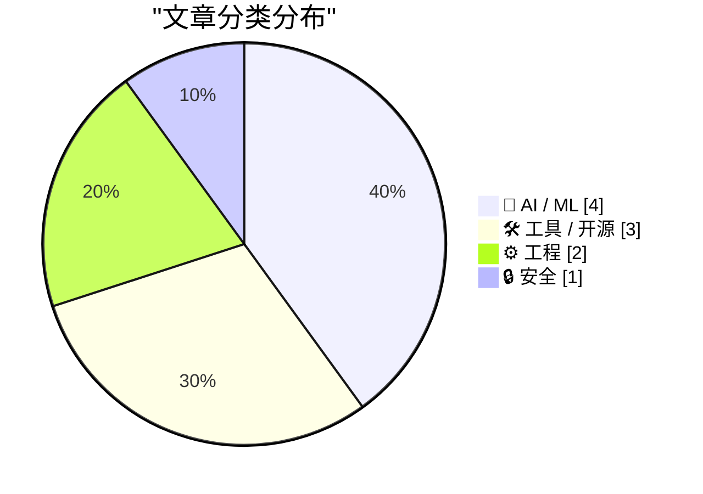
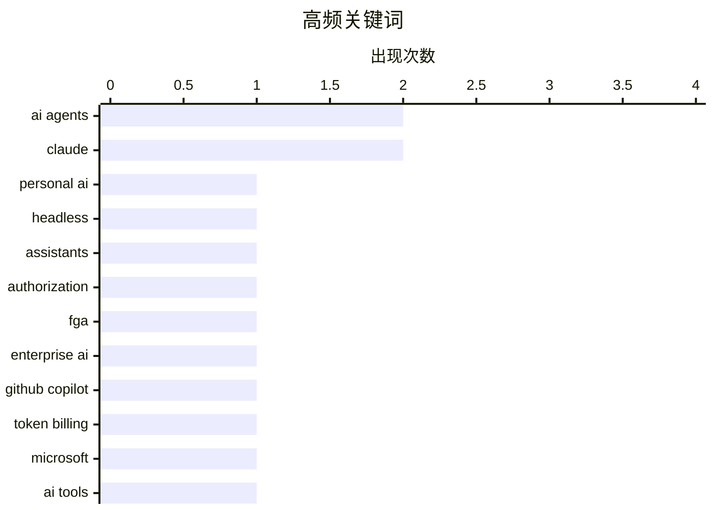

今日技术圈聚焦三大趋势：AI Agent生态加速成熟，WorkOS推出专门针对AI代理的授权层，同时个人AI助手正向“无头化”架构演进；大模型工具商业化步伐加快，Microsoft将GitHub Copilot转向token计费模式，预示AI编程助手将进入精细化收费阶段；传统工具与AI的融合也在加速，Figma深度整合Claude Design，Google Sheets新增SQL查询能力，AI正成为各类效率工具的标准配置。

<!--more-->


> 来自 Karpathy 推荐的 92 个顶级技术博客，AI 精选 Top 10

## 🏆 今日必读

🥇 **Headless everything for personal AI**

[Headless everything for personal AI](https://simonwillison.net/2026/Apr/19/headless-everything/#atom-everything) — simonwillison.net · 1 天前 · 🤖 AI / ML

> Headless everything for personal AI

🏷️ personal AI, headless, AI agents,  assistants

🥈 **WorkOS FGA: The Authorization Layer for AI Agents**

[WorkOS FGA: The Authorization Layer for AI Agents](https://workos.com/blog/agents-need-authorization-not-just-authentication?utm_source=daringfireball&amp;utm_medium=newsletter&amp;utm_campaign=q22026) — daringfireball.net · 1 天前 · ⚙️ 工程

> WorkOS FGA: The Authorization Layer for AI Agents

🏷️ AI agents, authorization, FGA, enterprise AI

🥉 **Exclusive: Microsoft To Shift GitHub Copilot Users To Token-Based Billing, Tighten Rate Limits**

[Exclusive: Microsoft To Shift GitHub Copilot Users To Token-Based Billing, Tighten Rate Limits](https://www.wheresyoured.at/news-microsoft-to-shift-github-copilot-users-to-token-based-billing-reduce-rate-limits-2/) — wheresyoured.at · 5 小时前 · 🤖 AI / ML

> Exclusive: Microsoft To Shift GitHub Copilot Users To Token-Based Billing, Tighten Rate Limits

🏷️ GitHub Copilot, token billing, Microsoft, AI tools

---

## 📊 数据概览

| 扫描源 | 抓取文章 | 时间范围 | 精选 |
|:---:|:---:|:---:|:---:|
| 88/92 | 2534 篇 → 27 篇 | 48h | **10 篇** |

### 分类分布



### 高频关键词



<details>
<summary>📈 纯文本关键词图（终端友好）</summary>

```
ai agents      │ ████████████████████ 2
claude         │ ████████████████████ 2
personal ai    │ ██████████░░░░░░░░░░ 1
headless       │ ██████████░░░░░░░░░░ 1
 assistants    │ ██████████░░░░░░░░░░ 1
authorization  │ ██████████░░░░░░░░░░ 1
fga            │ ██████████░░░░░░░░░░ 1
enterprise ai  │ ██████████░░░░░░░░░░ 1
github copilot │ ██████████░░░░░░░░░░ 1
token billing  │ ██████████░░░░░░░░░░ 1
```

</details>

### 🏷️ 话题标签

**ai agents**(2) · **claude**(2) · **personal ai**(1) · headless(1) ·  assistants(1) · authorization(1) · fga(1) · enterprise ai(1) · github copilot(1) · token billing(1) · microsoft(1) · ai tools(1) · system prompts(1) · prompt engineering(1) · model behavior(1) · datasette(1) · google sheets(1) · sql(1) · data(1) · token counter(1)

---

## 🤖 AI / ML

### 1. Headless everything for personal AI

[Headless everything for personal AI](https://simonwillison.net/2026/Apr/19/headless-everything/#atom-everything) — **simonwillison.net** · 1 天前 · ⭐ 26/30

> Headless everything for personal AI

🏷️ personal AI, headless, AI agents,  assistants

---

### 2. Exclusive: Microsoft To Shift GitHub Copilot Users To Token-Based Billing, Tighten Rate Limits

[Exclusive: Microsoft To Shift GitHub Copilot Users To Token-Based Billing, Tighten Rate Limits](https://www.wheresyoured.at/news-microsoft-to-shift-github-copilot-users-to-token-based-billing-reduce-rate-limits-2/) — **wheresyoured.at** · 5 小时前 · ⭐ 26/30

> Exclusive: Microsoft To Shift GitHub Copilot Users To Token-Based Billing, Tighten Rate Limits

🏷️ GitHub Copilot, token billing, Microsoft, AI tools

---

### 3. Changes in the system prompt between Claude Opus 4.6 and 4.7

[Changes in the system prompt between Claude Opus 4.6 and 4.7](https://simonwillison.net/2026/Apr/18/opus-system-prompt/#atom-everything) — **simonwillison.net** · 1 天前 · ⭐ 25/30

> Changes in the system prompt between Claude Opus 4.6 and 4.7

🏷️ Claude, system prompts, prompt engineering, model behavior

---

### 4. Figma's woes compound with Claude Design

[Figma's woes compound with Claude Design](https://martinalderson.com/posts/figmas-woes-compound-with-claude-design/?utm_source=rss&amp;utm_medium=rss&amp;utm_campaign=feed) — **martinalderson.com** · 1 天前 · ⭐ 21/30

> Figma's woes compound with Claude Design

🏷️ Figma, AI, Claude Design, design tools

---

## 🛠 工具 / 开源

### 5. SQL functions in Google Sheets to fetch data from Datasette

[SQL functions in Google Sheets to fetch data from Datasette](https://simonwillison.net/2026/Apr/20/datasette-sql/#atom-everything) — **simonwillison.net** · 19 小时前 · ⭐ 24/30

> SQL functions in Google Sheets to fetch data from Datasette

🏷️ Datasette, Google Sheets, SQL, data

---

### 6. Claude Token Counter, now with model comparisons

[Claude Token Counter, now with model comparisons](https://simonwillison.net/2026/Apr/20/claude-token-counts/#atom-everything) — **simonwillison.net** · 21 小时前 · ⭐ 24/30

> Claude Token Counter, now with model comparisons

🏷️ Claude, token counter, LLM, model comparison

---

### 7. Wander Console 0.5.0

[Wander Console 0.5.0](https://susam.net/code/news/wander/0.5.0.html) — **susam.net** · 1 天前 · ⭐ 21/30

> Wander Console 0.5.0

🏷️ Wander Console, release, web console, decentralized

---

## ⚙️ 工程

### 8. WorkOS FGA: The Authorization Layer for AI Agents

[WorkOS FGA: The Authorization Layer for AI Agents](https://workos.com/blog/agents-need-authorization-not-just-authentication?utm_source=daringfireball&amp;utm_medium=newsletter&amp;utm_campaign=q22026) — **daringfireball.net** · 1 天前 · ⭐ 26/30

> WorkOS FGA: The Authorization Layer for AI Agents

🏷️ AI agents, authorization, FGA, enterprise AI

---

### 9. 256 Lines or Less: Test Case Minimization

[256 Lines or Less: Test Case Minimization](https://matklad.github.io/2026/04/20/test-case-minimization.html) — **matklad.github.io** · 22 小时前 · ⭐ 23/30

> 256 Lines or Less: Test Case Minimization

🏷️ testing, property-based testing, fuzzing, minimization

---

## 🔒 安全

### 10. Big tech clouds worden niet veiliger met stapels papier

[Big tech clouds worden niet veiliger met stapels papier](https://berthub.eu/articles/posts/big-tech-clouds-niet-veiliger-met-papier/) — **berthub.eu** · 1 天前 · ⭐ 21/30

> Big tech clouds worden niet veiliger met stapels papier

🏷️ cloud, data sovereignty, privacy, US law

---

*生成于 2026-04-21 22:28 | 扫描 88 源 → 获取 2534 篇 → 精选 10 篇*
*基于 [Hacker News Popularity Contest 2025](https://refactoringenglish.com/tools/hn-popularity/) RSS 源列表，由 [Andrej Karpathy](https://x.com/karpathy) 推荐*
*由「懂点儿AI」制作，欢迎关注同名微信公众号获取更多 AI 实用技巧 💡*
