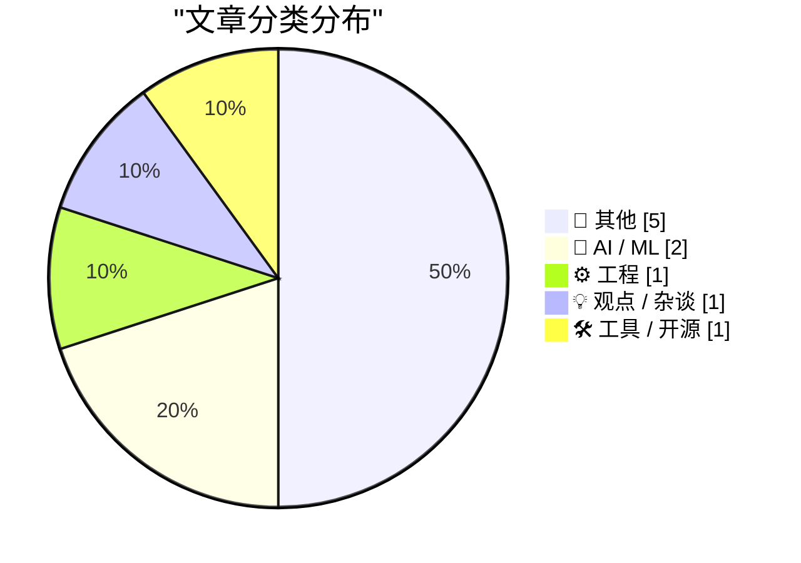
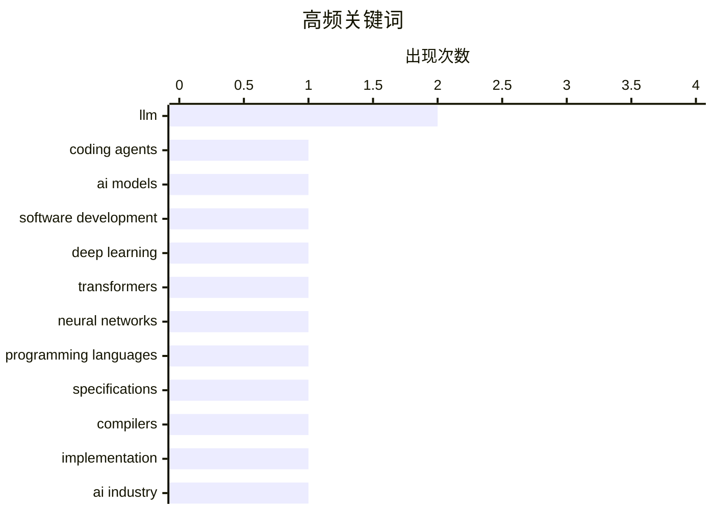

今日技术圈聚焦三大趋势：AI编码代理（Coding Agents）进入实战探索阶段，开发者正尝试用AI智能体替代传统编程流程；同时，LLM从零构建的技术细节持续深入，干预机制的研究趋于系统化；此外，关于AI风险的讨论升温，"AI末日"论调引发业界反思语言模型对开发范式的深层影响。

<!--more-->

---

## 🏆 今日必读

🥇 **An AI Odyssey, Part 4: Astounding Coding Agents**

[An AI Odyssey, Part 4: Astounding Coding Agents](https://www.johndcook.com/blog/2026/04/21/an-ai-odyssey-part-4-astounding-coding-agents/) — johndcook.com · 2 小时前 · 🤖 AI / ML

> An AI Odyssey, Part 4: Astounding Coding Agents

🏷️ LLM, coding agents, AI models, software development

🥈 **Writing an LLM from scratch, part 32m -- Interventions: conclusion**

[Writing an LLM from scratch, part 32m -- Interventions: conclusion](https://www.gilesthomas.com/2026/04/llm-from-scratch-32m-interventions-conclusion) — gilesthomas.com · 2 小时前 · 🤖 AI / ML

> Writing an LLM from scratch, part 32m -- Interventions: conclusion

🏷️ LLM, deep learning, transformers, neural networks

🥉 **People get confused when language implementations break language guarantees**

[People get confused when language implementations break language guarantees](https://buttondown.com/hillelwayne/archive/people-get-confused-when-language-implementations/) — buttondown.com/hillelwayne · 4 小时前 · ⚙️ 工程

> People get confused when language implementations break language guarantees

🏷️ programming languages, specifications, compilers, implementation

---

## 📊 数据概览

| 扫描源 | 抓取文章 | 时间范围 | 精选 |
|:---:|:---:|:---:|:---:|
| 88/92 | 2532 篇 → 16 篇 | 24h | **10 篇** |

### 分类分布



### 高频关键词



<details>
<summary>📈 纯文本关键词图（终端友好）</summary>

```
llm                   │ ████████████████████ 2
coding agents         │ ██████████░░░░░░░░░░ 1
ai models             │ ██████████░░░░░░░░░░ 1
software development  │ ██████████░░░░░░░░░░ 1
deep learning         │ ██████████░░░░░░░░░░ 1
transformers          │ ██████████░░░░░░░░░░ 1
neural networks       │ ██████████░░░░░░░░░░ 1
programming languages │ ██████████░░░░░░░░░░ 1
specifications        │ ██████████░░░░░░░░░░ 1
compilers             │ ██████████░░░░░░░░░░ 1
```

</details>

### 🏷️ 话题标签

**llm**(2) · **coding agents**(1) · **ai models**(1) · software development(1) · deep learning(1) · transformers(1) · neural networks(1) · programming languages(1) · specifications(1) · compilers(1) · implementation(1) · ai industry(1) · nvidia(1) · anthropic(1) · openai(1) · cli(1) · knowledge base(1) · conventions(1) · project(1)

---

## 📝 其他

### 1. Where's the raccoon with the ham radio? (ChatGPT Images 2.0)

[Where's the raccoon with the ham radio? (ChatGPT Images 2.0)](https://simonwillison.net/2026/Apr/21/gpt-image-2/#atom-everything) — **simonwillison.net** · 2 小时前 · ⭐ 15/30

> Where's the raccoon with the ham radio? (ChatGPT Images 2.0)

---

### 2. Quoting Andreas Påhlsson-Notini

[Quoting Andreas Påhlsson-Notini](https://simonwillison.net/2026/Apr/21/andreas-pahlsson-notini/#atom-everything) — **simonwillison.net** · 5 小时前 · ⭐ 15/30

> Quoting Andreas Påhlsson-Notini

---

### 3. scosman/pelicans_riding_bicycles

[scosman/pelicans_riding_bicycles](https://simonwillison.net/2026/Apr/21/scosman/#atom-everything) — **simonwillison.net** · 6 小时前 · ⭐ 15/30

> scosman/pelicans_riding_bicycles

---

### 4. 'Scattered Spider' Member 'Tylerb' Pleads Guilty

['Scattered Spider' Member 'Tylerb' Pleads Guilty](https://krebsonsecurity.com/2026/04/scattered-spider-member-tylerb-pleads-guilty/) — **krebsonsecurity.com** · 7 小时前 · ⭐ 15/30

> 'Scattered Spider' Member 'Tylerb' Pleads Guilty

---

### 5. Trump on Tim Apple

[Trump on Tim Apple](https://truthsocial.com/@realDonaldTrump/posts/116442276577696798) — **daringfireball.net** · 3 小时前 · ⭐ 15/30

> Trump on Tim Apple

---

## 🤖 AI / ML

### 6. An AI Odyssey, Part 4: Astounding Coding Agents

[An AI Odyssey, Part 4: Astounding Coding Agents](https://www.johndcook.com/blog/2026/04/21/an-ai-odyssey-part-4-astounding-coding-agents/) — **johndcook.com** · 2 小时前 · ⭐ 25/30

> An AI Odyssey, Part 4: Astounding Coding Agents

🏷️ LLM, coding agents, AI models, software development

---

### 7. Writing an LLM from scratch, part 32m -- Interventions: conclusion

[Writing an LLM from scratch, part 32m -- Interventions: conclusion](https://www.gilesthomas.com/2026/04/llm-from-scratch-32m-interventions-conclusion) — **gilesthomas.com** · 2 小时前 · ⭐ 24/30

> Writing an LLM from scratch, part 32m -- Interventions: conclusion

🏷️ LLM, deep learning, transformers, neural networks

---

## ⚙️ 工程

### 8. People get confused when language implementations break language guarantees

[People get confused when language implementations break language guarantees](https://buttondown.com/hillelwayne/archive/people-get-confused-when-language-implementations/) — **buttondown.com/hillelwayne** · 4 小时前 · ⭐ 22/30

> People get confused when language implementations break language guarantees

🏷️ programming languages, specifications, compilers, implementation

---

## 💡 观点 / 杂谈

### 9. Four Horsemen of the AIpocalypse

[Four Horsemen of the AIpocalypse](https://www.wheresyoured.at/four-horsemen-of-the-aipocalypse/) — **wheresyoured.at** · 6 小时前 · ⭐ 22/30

> Four Horsemen of the AIpocalypse

🏷️ AI industry, NVIDIA, Anthropic, OpenAI

---

## 🛠 工具 / 开源

### 10. brief

[brief](https://nesbitt.io/2026/04/21/brief.html) — **nesbitt.io** · 12 小时前 · ⭐ 19/30

> brief

🏷️ CLI, knowledge base, conventions, project

---

*生成于 2026-04-22 06:33 | 扫描 88 源 → 获取 2532 篇 → 精选 10 篇*
*基于 [Hacker News Popularity Contest 2025](https://refactoringenglish.com/tools/hn-popularity/) RSS 源列表，由 [Andrej Karpathy](https://x.com/karpathy) 推荐*
*由「懂点儿AI」制作，欢迎关注同名微信公众号获取更多 AI 实用技巧 💡*
