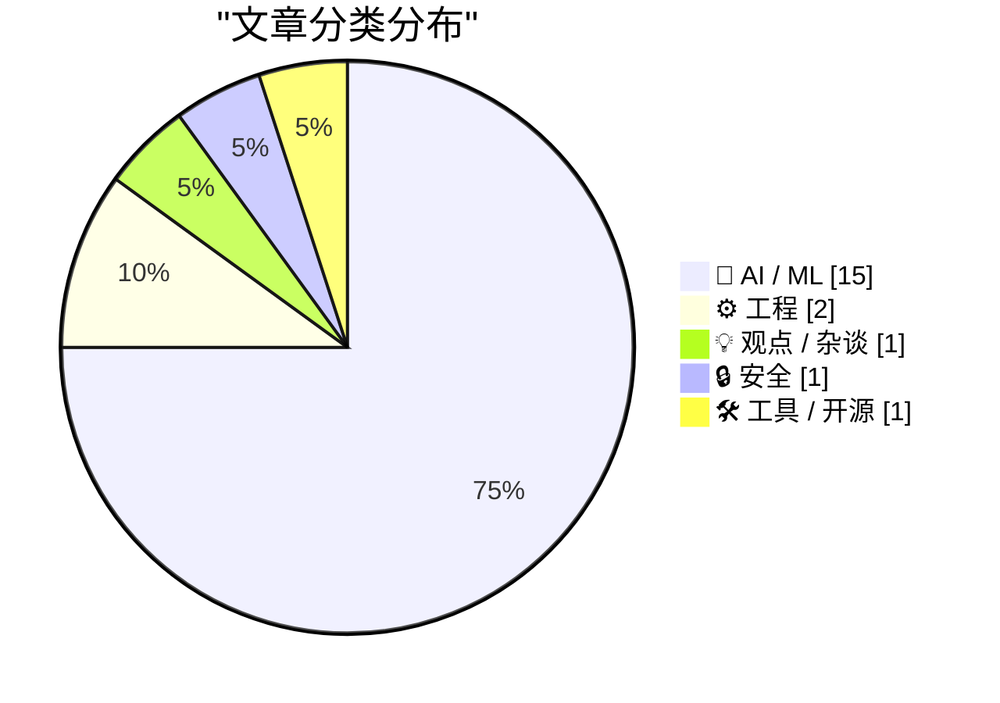
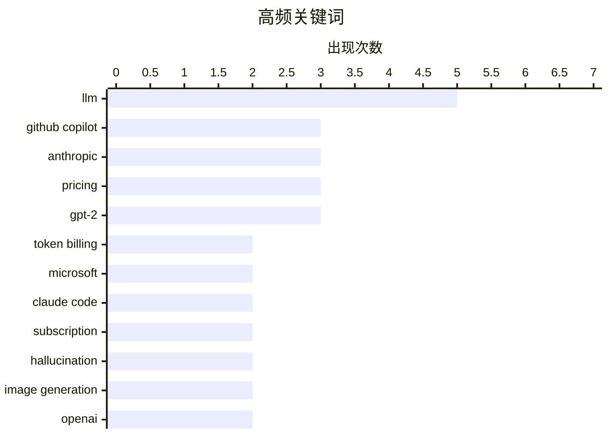

# 📰 AI 博客每日精选 — 2026-04-23

> 来自 Karpathy 推荐的 92 个顶级技术博客，AI 精选 Top 20

## 📝 今日看点

今日AI领域呈现商业化加速与技术突破并行的态势：微软Copilot全面转向Token计费，Anthropic调整Claude Code权限，显示AI编码工具正从免费扩张转向精细化变现；与此同时，Qwen3.6-27B以27B参数实现旗舰级编程性能，ChatGPT Images 2.0图像生成能力大幅提升，表明小模型蒸馏与多模态生成技术持续突破。苹果公司宣布Tim Cook将于2026年9月转任执行董事长，硬件工程高级副总裁John Ternus接任CEO，成为苹果50年历史上第八任领导者。

---

## 🏆 今日必读

🥇 **微软宣布六月起对所有GitHub Copilot用户实行基于Token的计费模式**

[Exclusive: Microsoft Moving All GitHub Copilot Subscribers To Token-Based Billing In June](https://www.wheresyoured.at/exclusive-microsoft-moving-all-github-copilot-subscribers-to-token-based-billing-in-june/) — wheresyoured.at · 8 小时前 · 🤖 AI / ML

> Microsoft计划于今年6月起对所有GitHub Copilot客户推出基于Token的计费模式。Copilot Business用户费用为每人每月19美元，可获得30美元的AI积分池；Copilot Enterprise用户费用为每人每月39美元，可获得70美元的AI积分池。此举基于内部文档，属于独家报道。

💡 **为什么值得读**: 面向所有Copilot用户（尤其是企业用户）的计费重大变更，开发者需提前了解成本变化。

🏷️ GitHub Copilot, token billing, Microsoft, AI pricing

🥈 **Anthropic暂时从"Pro"订阅计划中移除Claude Code访问权限**

[[UPDATED] News: Anthropic (Briefly) Removes Claude Code From $20-A-Month "Pro" Subscription Plan For New Users](https://www.wheresyoured.at/news-anthropic-removes-pro-cc/) — wheresyoured.at · 1 天前 · 🤖 AI / ML

> 2026年4月21日下午，Anthropic从各定价页面移除了20美元/月的Pro计划中Claude Code的访问权限。该调整持续时间较短。当前Pro用户仍可通过Claude网页应用使用Claude Code。

💡 **为什么值得读**: Pro订阅权益的重大调整，现有意向用户需确认条款后再订阅。

🏷️ Anthropic, Claude Code, subscription, pricing

🥉 **微软将Copilot用户转向Token计费并收紧速率限制**

[Exclusive: Microsoft To Shift GitHub Copilot Users To Token-Based Billing, Tighten Rate Limits](https://www.wheresyoured.at/news-microsoft-to-shift-github-copilot-users-to-token-based-billing-reduce-rate-limits-2/) — wheresyoured.at · 2 天前 · 🤖 AI / ML

> Microsoft计划临时暂停GitHub Copilot的个人账户注册，转向基于Token的计费模式。内部文档显示，自今年年初以来，Copilot周运营成本翻倍。公司同时将收紧API速率限制。

💡 **为什么值得读**: Copilot产品策略重大调整，涉及成本上升和API限制收紧，直接影响现有用户使用体验。

🏷️ GitHub Copilot, rate limits, Microsoft, token billing

---

## 📊 数据概览

| 扫描源 | 抓取文章 | 时间范围 | 精选 |
|:---:|:---:|:---:|:---:|
| 88/92 | 2532 篇 → 55 篇 | 72h | **20 篇** |

### 分类分布



### 高频关键词



<details>
<summary>📈 纯文本关键词图（终端友好）</summary>

```
llm            │ ████████████████████ 5
github copilot │ ████████████░░░░░░░░ 3
anthropic      │ ████████████░░░░░░░░ 3
pricing        │ ████████████░░░░░░░░ 3
gpt-2          │ ████████████░░░░░░░░ 3
token billing  │ ████████░░░░░░░░░░░░ 2
microsoft      │ ████████░░░░░░░░░░░░ 2
claude code    │ ████████░░░░░░░░░░░░ 2
subscription   │ ████████░░░░░░░░░░░░ 2
hallucination  │ ████████░░░░░░░░░░░░ 2
```

</details>

### 🏷️ 话题标签

**llm**(5) · **github copilot**(3) · **anthropic**(3) · pricing(3) · gpt-2(3) · token billing(2) · microsoft(2) · claude code(2) · subscription(2) · hallucination(2) · image generation(2) · openai(2) · ai(2) · multimodal(2) · transformer(2) · ai pricing(1) · rate limits(1) · coding agents(1) · ai development(1) · autonomous coding(1)

---

## 🤖 AI / ML

### 1. 微软宣布六月起对所有GitHub Copilot用户实行基于Token的计费模式

[Exclusive: Microsoft Moving All GitHub Copilot Subscribers To Token-Based Billing In June](https://www.wheresyoured.at/exclusive-microsoft-moving-all-github-copilot-subscribers-to-token-based-billing-in-june/) — **wheresyoured.at** · 8 小时前 · ⭐ 27/30

> Microsoft计划于今年6月起对所有GitHub Copilot客户推出基于Token的计费模式。Copilot Business用户费用为每人每月19美元，可获得30美元的AI积分池；Copilot Enterprise用户费用为每人每月39美元，可获得70美元的AI积分池。此举基于内部文档，属于独家报道。

🏷️ GitHub Copilot, token billing, Microsoft, AI pricing

---

### 2. Anthropic暂时从"Pro"订阅计划中移除Claude Code访问权限

[[UPDATED] News: Anthropic (Briefly) Removes Claude Code From $20-A-Month "Pro" Subscription Plan For New Users](https://www.wheresyoured.at/news-anthropic-removes-pro-cc/) — **wheresyoured.at** · 1 天前 · ⭐ 27/30

> 2026年4月21日下午，Anthropic从各定价页面移除了20美元/月的Pro计划中Claude Code的访问权限。该调整持续时间较短。当前Pro用户仍可通过Claude网页应用使用Claude Code。

🏷️ Anthropic, Claude Code, subscription, pricing

---

### 3. 微软将Copilot用户转向Token计费并收紧速率限制

[Exclusive: Microsoft To Shift GitHub Copilot Users To Token-Based Billing, Tighten Rate Limits](https://www.wheresyoured.at/news-microsoft-to-shift-github-copilot-users-to-token-based-billing-reduce-rate-limits-2/) — **wheresyoured.at** · 2 天前 · ⭐ 27/30

> Microsoft计划临时暂停GitHub Copilot的个人账户注册，转向基于Token的计费模式。内部文档显示，自今年年初以来，Copilot周运营成本翻倍。公司同时将收紧API速率限制。

🏷️ GitHub Copilot, rate limits, Microsoft, token billing

---

### 4. AI编码代理的惊人进步

[An AI Odyssey, Part 4: Astounding Coding Agents](https://www.johndcook.com/blog/2026/04/21/an-ai-odyssey-part-4-astounding-coding-agents/) — **johndcook.com** · 1 天前 · ⭐ 26/30

> AI编码代理在过去夏季和12月至1月期间显著进化。模型在主观感受上更智能，能够完成更广泛的任务。代理对代码库和用户意图有更全面深入的理解。

🏷️ coding agents, LLM, AI development, autonomous coding

---

### 5. 请勿信任聊天机器人提供的医疗建议

[Please don’t trust your chatbot for medical advice](https://garymarcus.substack.com/p/please-dont-trust-your-chatbot-for) — **garymarcus.substack.com** · 1 天前 · ⭐ 25/30

> Gary Marcus指出四项独立研究均指向同一结论：聊天机器人不应被信任提供医疗建议。AI模型在医疗领域存在风险，建议用户谨慎对待。

🏷️ AI safety, medical AI, hallucination, healthcare

---

### 6. Qwen3.6-27B：27B参数dense模型达到旗舰级编程性能

[Qwen3.6-27B: Flagship-Level Coding in a 27B Dense Model](https://simonwillison.net/2026/Apr/22/qwen36-27b/#atom-everything) — **simonwillison.net** · 9 小时前 · ⭐ 24/30

> 阿里发布Qwen3.6-27B dense模型，声称在所有主要编程基准测试中超越前代Qwen3.5-397B-A17B（397B总参数/17B活跃的MoE架构）。该模型参数量仅27B，HuggingFace大小55.6GB，远小于前代的807GB。作者通过llama.cpp进行了评测。

🏷️ Qwen3.6, open weight model, coding, LLM

---

### 7. ChatGPT Images 2.0图像生成能力实测

[Where's the raccoon with the ham radio? (ChatGPT Images 2.0)](https://simonwillison.net/2026/Apr/21/gpt-image-2/#atom-everything) — **simonwillison.net** · 1 天前 · ⭐ 24/30

> OpenAI发布ChatGPT Images 2.0，Sam Altman称其进步相当于GPT-3到GPT-5的跨越。作者测试"寻 Waldo风格图，找拿无线电的浣熊"，测试结果展示了图像生成能力的显著提升。

🏷️ ChatGPT Images, image generation, OpenAI

---

### 8. Claude Code 是否要收每月 100 美元？可能不会——但整个定价混乱不堪

[Is Claude Code going to cost $100/month? Probably not - it's all very confusing](https://simonwillison.net/2026/Apr/22/claude-code-confusion/#atom-everything) — **simonwillison.net** · 23 小时前 · ⭐ 23/30

> Anthropic 在 claude.com/pricing 页面悄然更新，显示 Claude Code 可能从 Max 计划扩展到 Pro 计划，引发是否会收取每月 100 美元费用的猜测。文章指出，定价页面与帮助中心的「选择 Claude 计划」页面信息不一致，随后该改动已被回滚。作者认为这种混乱源于 Anthropic 缺乏清晰的定价沟通。

🏷️ Claude Code, pricing, Anthropic

---

### 9. ChatGPT 分不清搅拌碗和手肘

[ChatGPT doesn’t know its whisk from its elbow](https://garymarcus.substack.com/p/chatgpt-doesnt-know-its-whisk-from) — **garymarcus.substack.com** · 9 小时前 · ⭐ 23/30

> 文章探讨 ChatGPT 在物理常识方面的严重缺陷。Gary Marcus 指出，ChatGPT 无法真正理解「whisk」（搅拌碗）和「elbow」（手肘）的区别，因为它缺乏对物理世界的实际体验和理解。医学插图师可以暂时放心，因为 AI 尚无法准确描绘人体解剖细节。

🏷️ multimodal, vision, GPT, hallucination

---

### 10. ChatGPT 的「强大新图像引擎」

[ChatGPT's “powerful new image engine”](https://garymarcus.substack.com/p/chatgpts-powerful-new-image-engine) — **garymarcus.substack.com** · 11 小时前 · ⭐ 23/30

> 文章讨论 ChatGPT 新图像生成能力与真正理解之间的区别。作者认为，尽管模型能「 regurgitating 」（ regurgitating 指反刍、重复）图像，但这不等于真正的理解。AI 可以生成图像但无法理解图像所代表的物理现实和语义内涵。

🏷️ image generation, multimodal, understanding, ChatGPT

---

### 11. AI 启示录的四骑士

[Four Horsemen of the AIpocalypse](https://www.wheresyoured.at/four-horsemen-of-the-aipocalypse/) — **wheresyoured.at** · 1 天前 · ⭐ 23/30

> 这是一篇 Premium 订阅文章，探讨 AI 带来的四大风险或挑战。作者提到将分析 NVIDIA、Anthropic 和 OpenAI 等公司。每周 newsletter 篇幅通常在 5000 到 18000 词，包含深入详尽的分析。订阅费用为每年 70 美元或每月 7 美元。

🏷️ AI industry, NVIDIA, Anthropic, OpenAI

---

### 12. 从零开始写 LLM (32l) — 干预措施：指令微调结果更新

[Writing an LLM from scratch, part 32l -- Interventions: updated instruction fine-tuning results](https://www.gilesthomas.com/2026/04/llm-from-scratch-32l-interventions-instruction-fine-tuning-tests) — **gilesthomas.com** · 2 天前 · ⭐ 22/30

> 作者基于 Sebastian Raschka 的《Build a Large Language Model (from Scratch)》一书训练 GPT-2-small 风格的 LLM，旨在接近原始 GPT-2-small 在测试集上的 loss 表现。上篇文章中模型已接近目标水平。本文继续尝试干预措施，包括指令微调测试，使用 Stanford Alpaca 数据集等进行微调评估。

🏷️ LLM, GPT-2, fine-tuning, transformer

---

### 13. 从零开始写 LLM (32m) — 干预措施：结论

[Writing an LLM from scratch, part 32m -- Interventions: conclusion](https://www.gilesthomas.com/2026/04/llm-from-scratch-32m-interventions-conclusion) — **gilesthomas.com** · 1 天前 · ⭐ 22/30

> 作者完成了训练 GPT-2-small 风格模型的挑战，模型性能接近但未能完全达到原始 GPT-2-small 水平。模型在作者本地机器上训练 44 小时完成。作者首次训练的模型在 loss 和指令遵循能力上都不如原始 GPT-2，作者原本归因于训练时长不足，但发现还有其他因素影响模型表现。

🏷️ LLM, GPT-2, model training, transformer

---

### 14. 从零开始写 LLM (33) — 从附录中学到的经验

[Writing an LLM from scratch, part 33 -- what I learned from finally getting round to the appendices](https://www.gilesthomas.com/2026/04/llm-from-scratch-33-what-i-learned-from-the-appendices) — **gilesthomas.com** · 8 小时前 · ⭐ 22/30

> 文章关于作者阅读《Build a Large Language Model (from Scratch)》一书附录的心得。TL;DR：附录中有些内容本可节省作者在「支线任务」探索中的时间，但作者认为自己动手解决这些问题反而学得更深入。附录 A 介绍了 PyTorch 基础。

🏷️ LLM, GPT-2, training data, tokenizer

---

### 15. AI 与教学——勇敢新世界

[AI and Teaching – The Brave New World](https://steveblank.com/2026/04/22/ai-and-teaching-the-brave-new-world/) — **steveblank.com** · 10 小时前 · ⭐ 22/30

> 这是作者在 Entrepreneur & Innovation Exchange (EIX) 发布的第 16 年 Stanford Lean LaunchPad 课程教学文章。从第一堂课开始，团队展现了非凡的变化——一个新时代的结束和开始。

🏷️ AI, education, Stanford, teaching

---

## ⚙️ 工程

### 16. Tim Cook将转任执行董事长，John Ternus将于9月接任苹果CEO

[Apple: ‘Tim Cook to Become Apple Executive Chairman; John Ternus to Become Apple CEO’](https://www.apple.com/newsroom/2026/04/tim-cook-to-become-apple-executive-chairman-john-ternus-to-become-apple-ceo/) — **daringfireball.net** · 2 天前 · ⭐ 24/30

> Apple宣布Tim Cook将于2026年9月1日转任执行董事长，硬件工程高级副总裁John Ternus将接任CEO，成为苹果50年历史上第八任CEO。Ternus现年50多岁，将领导公司进入新时代。

🏷️ Tim Cook, Apple, John Ternus, CEO transition

---

### 17. 通过页表映射页表：所谓"分形页表映射"

[Mapping the page tables into memory via the page tables](https://devblogs.microsoft.com/oldnewthing/20260422-00/?p=112255) — **devblogs.microsoft.com/oldnewthing** · 11 小时前 · ⭐ 24/30

> 讲解Windows系统中通过页表实现页表映射的技术，探讨"分形页表映射"的概念。这是关于操作系统底层内存管理的深度技术文章。

🏷️ page tables, operating system, memory management, x86

---

## 💡 观点 / 杂谈

### 18. AI没有护城河

[AI has no moat](https://geohot.github.io//blog/jekyll/update/2026/04/22/ai-has-no-moat.html) — **geohot.github.io** · 1 天前 · ⭐ 24/30

> geohot评论SpaceX以600亿美元收购Cursor，认为这令人悲哀，就像Twitter的440亿美元一样。称其为自己不理解的一个局，并指出身边没人再用Cursor。

🏷️ AI, Cursor, competition, industry analysis

---

## 🔒 安全

### 19. 「Scattered Spider」成员「Tylerb」认罪

[‘Scattered Spider’ Member ‘Tylerb’ Pleads Guilty](https://krebsonsecurity.com/2026/04/scattered-spider-member-tylerb-pleads-guilty/) — **krebsonsecurity.com** · 1 天前 · ⭐ 22/30

> 24 岁的英国公民 Tyler Robert Buchanan 是网络犯罪集团「Scattered Spider」的高级成员，对串谋电信欺诈和严重身份盗窃罪名认罪。他承认参与了 2022 年夏天的短信钓鱼攻击，该攻击导致团伙入侵了至少十几家大型科技公司，从投资者手中窃取了价值数千万美元的加密货币。

🏷️ Scattered Spider, cybersecurity, phishing, fraud

---

## 🛠 工具 / 开源

### 20. GitHub Copilot Individual 计划变更

[Changes to GitHub Copilot Individual plans](https://simonwillison.net/2026/Apr/22/changes-to-github-copilot/#atom-everything) — **simonwillison.net** · 22 小时前 · ⭐ 21/30

> GitHub 宣布收紧 Copilot Individual 计划使用限额，暂停新用户注册个人计划，将 Claude Opus 4.7 限制在更昂贵的 39 美元/月「Pro+」计划，并下架原有的 Opus 模型。官方解释称「代理工作流从根本上改变了 Copilot 的计算需求」，长时间并行运行的会话消耗远超原计划结构设计的资源。

🏷️ GitHub Copilot, pricing, subscription

---

*生成于 2026-04-23 01:48 | 扫描 88 源 → 获取 2532 篇 → 精选 20 篇*
*基于 [Hacker News Popularity Contest 2025](https://refactoringenglish.com/tools/hn-popularity/) RSS 源列表，由 [Andrej Karpathy](https://x.com/karpathy) 推荐*
*由「懂点儿AI」制作，欢迎关注同名微信公众号获取更多 AI 实用技巧 💡*
