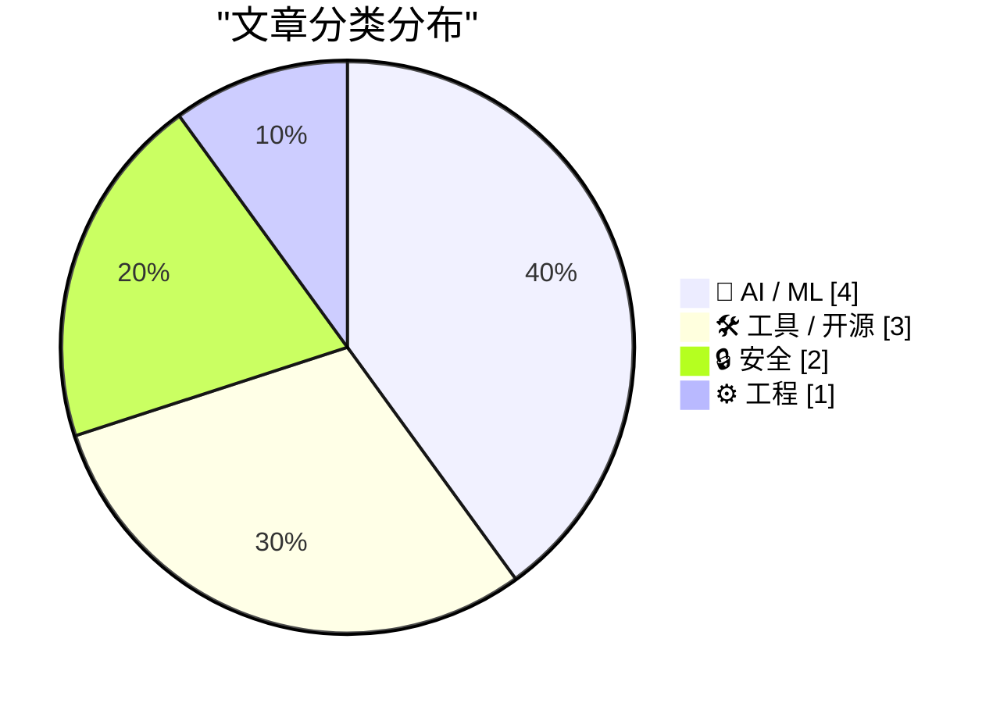
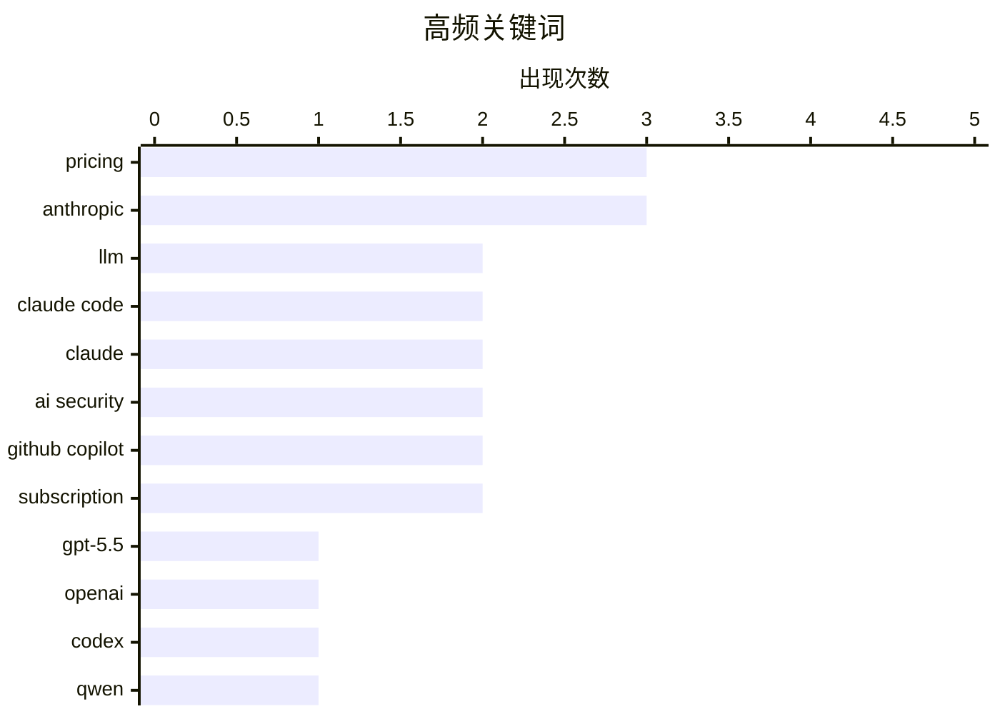

今日 AI 技术圈呈现三大趋势：一是大模型轻量化提速，GPT-5.5 与 Qwen3.6-27B 等小参数高性能模型密集发布，API 开放加速推动 AI 编程能力边界持续扩展；二是 AI 编程工具商业化动荡加剧，GitHub Copilot 转向 token 计费、Claude Code 定价反复、Individual 计划收紧，折射出行业在商业模型上的探索焦虑；三是 AI 安全治理成为焦点，Anthropic Mythos 模型出现未授权访问漏洞，而 Mozilla 与其合作修复 Firefox 高危漏洞形成对比，安全管控能力建设已迫在眉睫。

<!--more-->


> 来自 Karpathy 推荐的 92 个顶级技术博客，AI 精选 Top 10

## 🏆 今日必读

🥇 **通过半官方 Codex 后门 API 使用 GPT-5.5**

[A pelican for GPT-5.5 via the semi-official Codex backdoor API](https://simonwillison.net/2026/Apr/23/gpt-5-5/#atom-everything) — simonwillison.net · 2 小时前 · 🤖 AI / ML

> GPT-5.5 已发布，目前可通过 OpenAI Codex 和付费 ChatGPT 访问，但公共 API 尚未开放。作者通过 Codex 后门 API 进行测试，发现该模型响应快速且能力强大，用于构建项目时能精准满足需求。API 需要不同的安全防护措施，官方表示将很快推出 GPT-5.5 的 API 服务。作者倾向于使用 API 进行基准测试，以避免 ChatGPT 或其他智能体框架中的隐藏系统提示影响结果。

💡 **为什么值得读**: 如果你想立即体验 GPT-5.5，这篇文章提供了通过 Codex 后门 API 访问的具体方法。

🏷️ GPT-5.5, OpenAI, Codex, LLM

🥈 **Qwen3.6-27B：27B dense 模型实现旗舰级编程性能**

[Qwen3.6-27B: Flagship-Level Coding in a 27B Dense Model](https://simonwillison.net/2026/Apr/22/qwen36-27b/#atom-everything) — simonwillison.net · 1 天前 · 🤖 AI / ML

> 阿里发布 Qwen3.6-27B，这是一个 27B 参数的 dense 模型，官方声称在所有主要编程基准测试中超越了前代开源旗舰 Qwen3.5-397B-A17B（MoE 模型，总参数 397B_active 17B）。模型大小为 55.6GB，相比 807GB 的 Qwen3.5 大幅缩小。作者使用 Unsloth 的 Q4_K_M 量化版本（16.8GB）和 llama-server 进行本地测试，表现令人印象深刻。

💡 **为什么值得读**: 这是目前最强大的小型编程开源模型，适合在本地或消费级 GPU 上运行，推荐关注。

🏷️ Qwen, open-weight, LLM, coding

🥉 **LiteParse Web：浏览器端 PDF 文本提取工具**

[Extract PDF text in your browser with LiteParse for the web](https://simonwillison.net/2026/Apr/23/liteparse-for-the-web/#atom-everything) — simonwillison.net · 27 分钟前 · 🛠 工具 / 开源

> LiteParse 是 LlamaIndex 开源的 PDF 文本提取 CLI 工具，现已可在浏览器中完全运行。它不使用 AI 模型，而是采用传统的 PDF 解析技术，对于图片型 PDF 会回退到 Tesseract OCR。该项目的核心攻克点是「空间文本解析」——通过智能启发式算法处理多列布局等复杂的 PDF 结构，按合理顺序提取文本。

💡 **为什么值得读**: 如果需要从 PDF 批量提取文本，这是纯本地的技术方案，无需上传文件到云端，保护隐私。

🏷️ PDF, browser, LiteParse, JavaScript

---

## 📊 数据概览

| 扫描源 | 抓取文章 | 时间范围 | 精选 |
|:---:|:---:|:---:|:---:|
| 87/92 | 2507 篇 → 42 篇 | 48h | **10 篇** |

### 分类分布



### 高频关键词



<details>
<summary>📈 纯文本关键词图（终端友好）</summary>

```
pricing        │ ████████████████████ 3
anthropic      │ ████████████████████ 3
llm            │ █████████████░░░░░░░ 2
claude code    │ █████████████░░░░░░░ 2
claude         │ █████████████░░░░░░░ 2
ai security    │ █████████████░░░░░░░ 2
github copilot │ █████████████░░░░░░░ 2
subscription   │ █████████████░░░░░░░ 2
gpt-5.5        │ ███████░░░░░░░░░░░░░ 1
openai         │ ███████░░░░░░░░░░░░░ 1
```

</details>

### 🏷️ 话题标签

**pricing**(3) · **anthropic**(3) · **llm**(2) · claude code(2) · claude(2) · ai security(2) · github copilot(2) · subscription(2) · gpt-5.5(1) · openai(1) · codex(1) · qwen(1) · open-weight(1) · coding(1) · pdf(1) · browser(1) · liteparse(1) · javascript(1) · data breach(1) · token billing(1)

---

## 🤖 AI / ML

### 1. 通过半官方 Codex 后门 API 使用 GPT-5.5

[A pelican for GPT-5.5 via the semi-official Codex backdoor API](https://simonwillison.net/2026/Apr/23/gpt-5-5/#atom-everything) — **simonwillison.net** · 2 小时前 · ⭐ 26/30

> GPT-5.5 已发布，目前可通过 OpenAI Codex 和付费 ChatGPT 访问，但公共 API 尚未开放。作者通过 Codex 后门 API 进行测试，发现该模型响应快速且能力强大，用于构建项目时能精准满足需求。API 需要不同的安全防护措施，官方表示将很快推出 GPT-5.5 的 API 服务。作者倾向于使用 API 进行基准测试，以避免 ChatGPT 或其他智能体框架中的隐藏系统提示影响结果。

🏷️ GPT-5.5, OpenAI, Codex, LLM

---

### 2. Qwen3.6-27B：27B dense 模型实现旗舰级编程性能

[Qwen3.6-27B: Flagship-Level Coding in a 27B Dense Model](https://simonwillison.net/2026/Apr/22/qwen36-27b/#atom-everything) — **simonwillison.net** · 1 天前 · ⭐ 26/30

> 阿里发布 Qwen3.6-27B，这是一个 27B 参数的 dense 模型，官方声称在所有主要编程基准测试中超越了前代开源旗舰 Qwen3.5-397B-A17B（MoE 模型，总参数 397B_active 17B）。模型大小为 55.6GB，相比 807GB 的 Qwen3.5 大幅缩小。作者使用 Unsloth 的 Q4_K_M 量化版本（16.8GB）和 llama-server 进行本地测试，表现令人印象深刻。

🏷️ Qwen, open-weight, LLM, coding

---

### 3. Claude Code 定价之谜：$100/月可能性及混乱

[Is Claude Code going to cost $100/month? Probably not - it's all very confusing](https://simonwillison.net/2026/Apr/22/claude-code-confusion/#atom-everything) — **simonwillison.net** · 1 天前 · ⭐ 24/30

> Anthropic 于 2026年4月22日悄然更新 claude.com/pricing 页面，在价格表中将 Claude Code 从仅 Max 计划扩展到 Pro 计划（$20/月），引发是否会涨至 $100/月的讨论。该页面很快被回滚。真正的 $100/月报价来源仍不明确，可能是对现有 Pro+ 计划的功能调整。此事件反映出 AI 编程工具定价的混乱状态。

🏷️ Claude Code, pricing, Anthropic

---

### 4. Anthropic 短暂从 Pro 计划移除 Claude Code

[[UPDATED] News: Anthropic (Briefly) Removes Claude Code From $20-A-Month "Pro" Subscription Plan For New Users](https://www.wheresyoured.at/news-anthropic-removes-pro-cc/) — **wheresyoured.at** · 1 天前 · ⭐ 24/30

> 2026 年 4 月 21 日下午，Anthropic 从 $20/月的 Pro 计划中移除了 Claude Code 访问权限，但现有 Pro 用户仍可通过网页端使用。该变动仅持续数小时后即被恢复。Anthropic 当时未发布任何官方声明，引发用户对订阅稳定性的担忧。

🏷️ Claude Code, Anthropic, subscription

---

## 🛠 工具 / 开源

### 5. LiteParse Web：浏览器端 PDF 文本提取工具

[Extract PDF text in your browser with LiteParse for the web](https://simonwillison.net/2026/Apr/23/liteparse-for-the-web/#atom-everything) — **simonwillison.net** · 27 分钟前 · ⭐ 24/30

> LiteParse 是 LlamaIndex 开源的 PDF 文本提取 CLI 工具，现已可在浏览器中完全运行。它不使用 AI 模型，而是采用传统的 PDF 解析技术，对于图片型 PDF 会回退到 Tesseract OCR。该项目的核心攻克点是「空间文本解析」——通过智能启发式算法处理多列布局等复杂的 PDF 结构，按合理顺序提取文本。

🏷️ PDF, browser, LiteParse, JavaScript

---

### 6. 微软 GitHub Copilot 将于 6 月全面转向 token 计费

[[Updated] Exclusive: Microsoft Moving All GitHub Copilot Subscribers To Token-Based Billing In June](https://www.wheresyoured.at/exclusive-microsoft-moving-all-github-copilot-subscribers-to-token-based-billing-in-june/) — **wheresyoured.at** · 1 天前 · ⭐ 24/30

> 微软计划于 2026 年 6 月向所有 GitHub Copilot 客户推出 token 计费模式。Copilot Business 用户初期促销价为 $19/人/月，获 $30 AI 额度池；Copilot Enterprise 客户同样享受促销。与现有的固定月费模式相比，token 计费对高强度使用者可能更划算，但对企业预算规划带来不确定性。

🏷️ GitHub Copilot, token billing, pricing

---

### 7. GitHub Copilot Individual 计划变更

[Changes to GitHub Copilot Individual plans](https://simonwillison.net/2026/Apr/22/changes-to-github-copilot/#atom-everything) — **simonwillison.net** · 1 天前 · ⭐ 22/30

> GitHub 宣布收紧 Copilot Individual 计划：暂停新用户注册、限制使用量、并将 Claude Opus 4.7 仅保留给 $39/月的 Pro+ 计划，下架所有旧版 Opus 模型。官方解释称「智能体工作流根本性改变了 Copilot 的计算需求」，长时间并行会话消耗远超原计划设计的资源。现有用户需关注续费后的计划变动。

🏷️ GitHub Copilot, pricing, subscription

---

## 🔒 安全

### 8. 未授权用户数周访问 Anthropic 危险模型 Mythos

[Unauthorized Users in Discord Group Had Weekslong Access to Anthropic’s Supposedly-Super-Dangerous Claude Mythos Model](https://www.bloomberg.com/news/articles/2026-04-21/anthropic-s-mythos-model-is-being-accessed-by-unauthorized-users) — **daringfireball.net** · 4 小时前 · ⭐ 24/30

> Anthropic 声称其 Mythos AI 模型极度强大，可被用于发动危险网络攻击。但据彭博社报道，一小群未授权用户在 4 月 7 日（Anthropic 宣布限量测试的同一天）获得了该模型的访问权限，并持续使用数周。这些用户在私人论坛中 regular 使用该模型，尽管未用于网络攻击目的。此事暴露了 AI 模型安全管控的严重漏洞。

🏷️ Anthropic, Claude, AI security, data breach

---

### 9. Mozilla 用 Claude Mythos 修复 Firefox 271 个漏洞

[Quoting Bobby Holley](https://simonwillison.net/2026/Apr/22/bobby-holley/#atom-everything) — **simonwillison.net** · 1 天前 · ⭐ 23/30

> Mozilla 与 Anthropic 合作，将 Claude Mythos 预览版应用于 Firefox 安全评估。本周发布的 Firefox 150 包含了在评估中发现的 271 个漏洞修复。Mozilla 表示「防御者终于有机会决定性地获胜」，尽管工作尚未完成，但他们认为已迎来转折点。该合作展示了 AI 在大规模安全漏洞发现中的潜力。

🏷️ Firefox, Claude, AI security, vulnerability

---

## ⚙️ 工程

### 10. SQLAlchemy 2 实践第 6 章：页面分析解决方案

[SQLAlchemy 2 In Practice - Chapter 6: A Page Analytics Solution](https://blog.miguelgrinberg.com/post/sqlalchemy-2-in-practice---chapter-6-a-page-analytics-solution) — **miguelgrinberg.com** · 9 小时前 · ⭐ 23/30

> 这是《SQLAlchemy 2 in Practice》书籍的第 6 章，主题是构建网页流量分析解决方案。该章节综合运用前几章的概念，设计更复杂的数据库结构，作为强化训练和实际案例演示。读者需购买书籍支持作者工作。

🏷️ SQLAlchemy, Python, ORM, analytics

---

*生成于 2026-04-24 22:22 | 扫描 87 源 → 获取 2507 篇 → 精选 10 篇*
*基于 [Hacker News Popularity Contest 2025](https://refactoringenglish.com/tools/hn-popularity/) RSS 源列表，由 [Andrej Karpathy](https://x.com/karpathy) 推荐*
*由「懂点儿AI」制作，欢迎关注同名微信公众号获取更多 AI 实用技巧 💡*
