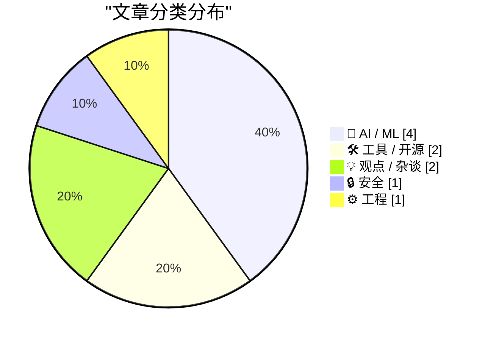
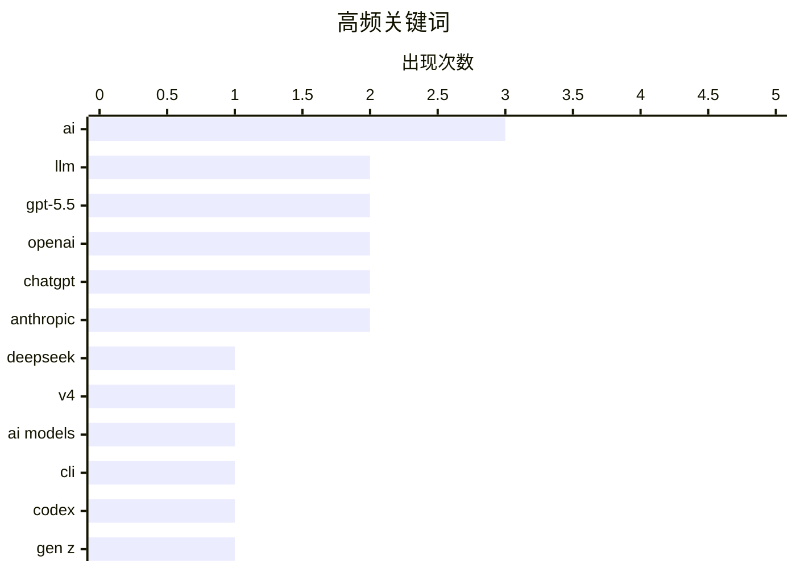

今日技术圈呈现三大趋势：一是中国AI模型持续追赶前沿，DeepSeek发布V4系列开源大模型，参数规模超越海外竞品；二是AI公众形象危机加深，最新民调显示美国超半数民众认为AI弊大于利，Z世代对AI最悲观，反映出“软件脑”思维与普通用户的深层脱节；三是AI工具安全与质量问题频发，Anthropic Claude Code因工具链bug导致用户体验翻车，其危险模型Mythos则在发布当日就出现未授权访问，警示行业在快速迭代中需平衡创新与安全。

<!--more-->


> 来自 Karpathy 推荐的 92 个顶级技术博客，AI 精选 Top 10

## 🏆 今日必读

🥇 **DeepSeek V4：逼近前沿，费用仅为零头**

[DeepSeek V4 - almost on the frontier, a fraction of the price](https://simonwillison.net/2026/Apr/24/deepseek-v4/#atom-everything) — simonwillison.net · 20 小时前 · 🤖 AI / ML

> 中国AI实验室DeepSeek发布了V4系列预览模型，包括DeepSeek-V4-Pro和DeepSeek-V4-Flash，两款均为100万 token 上下文的混合专家模型。Pro版本总参数1.6T、活跃参数49B，Flash版本总参数284B、活跃参数13B，采用MIT开源许可证。DeepSeek-V4-Pro成为目前最大的开源权重模型，超越Kimi K2.6（1.1T）和GLM-5.1（754B），Pro模型大小865GB、Flash为160GB。经过轻量量化后有望在128GB M5 MacBook Pro上运行。

💡 **为什么值得读**: 对于关注大模型发展趋势和希望在本地运行开源模型的技术人员，这是了解当前开源模型规模极限的重要参考。

🏷️ DeepSeek, V4, LLM, AI models

🥈 **llm 0.31 版本发布**

[llm 0.31](https://simonwillison.net/2026/Apr/24/llm/#atom-everything) — simonwillison.net · 3 小时前 · 🛠 工具 / 开源

> llm 0.31正式发布，带来多项更新：新增GPT-5.5模型支持（llm -m gpt-5.5），支持为GPT-5+模型设置文本详细程度参数（-o verbosity low/medium/high），以及为图像附件设置图像详细级别（-o image_detail low/high/auto，GPT-5.4/5.5还支持original）。此外，extra-openai-models.yaml中配置的模型现在也会注册为异步模式。

💡 **为什么值得读**: 对于使用llm CLI工具与OpenAI模型交互的开发者，GPT-5.5的支持和新的参数选项是值得了解的功能更新。

🏷️ LLM, CLI, GPT-5.5, OpenAI

🥉 **通过 Codex 后门 API 使用 GPT-5.5 运行 pelican 基准测试**

[A pelican for GPT-5.5 via the semi-official Codex backdoor API](https://simonwillison.net/2026/Apr/23/gpt-5-5/#atom-everything) — simonwillison.net · 1 天前 · 🤖 AI / ML

> GPT-5.5已发布，可在OpenAI Codex和付费ChatGPT中使用，但API暂未开放（官方称需要不同安全措施）。作者通过非官方的OpenClaw后门API成功调用GPT-5.5运行pelican基准测试，发现该模型快速、有效且能力出色，能够准确构建所要求的内容。

💡 **为什么值得读**: 对于需要在API中测试GPT-5.5但官方API尚未开放的开发者提供了可行绕过方案。

🏷️ GPT-5.5, OpenAI, Codex, ChatGPT

---

## 📊 数据概览

| 扫描源 | 抓取文章 | 时间范围 | 精选 |
|:---:|:---:|:---:|:---:|
| 88/92 | 2532 篇 → 44 篇 | 48h | **10 篇** |

### 分类分布



### 高频关键词



<details>
<summary>📈 纯文本关键词图（终端友好）</summary>

```
ai        │ ████████████████████ 3
llm       │ █████████████░░░░░░░ 2
gpt-5.5   │ █████████████░░░░░░░ 2
openai    │ █████████████░░░░░░░ 2
chatgpt   │ █████████████░░░░░░░ 2
anthropic │ █████████████░░░░░░░ 2
deepseek  │ ███████░░░░░░░░░░░░░ 1
v4        │ ███████░░░░░░░░░░░░░ 1
ai models │ ███████░░░░░░░░░░░░░ 1
cli       │ ███████░░░░░░░░░░░░░ 1
```

</details>

### 🏷️ 话题标签

**ai**(3) · **llm**(2) · **gpt-5.5**(2) · openai(2) · chatgpt(2) · anthropic(2) · deepseek(1) · v4(1) · ai models(1) · cli(1) · codex(1) · gen z(1) · public opinion(1) · artificial intelligence(1) · claude code(1) · quality(1) · postmortem(1) · career(1) · software engineering(1) · job market(1)

---

## 🤖 AI / ML

### 1. DeepSeek V4：逼近前沿，费用仅为零头

[DeepSeek V4 - almost on the frontier, a fraction of the price](https://simonwillison.net/2026/Apr/24/deepseek-v4/#atom-everything) — **simonwillison.net** · 20 小时前 · ⭐ 25/30

> 中国AI实验室DeepSeek发布了V4系列预览模型，包括DeepSeek-V4-Pro和DeepSeek-V4-Flash，两款均为100万 token 上下文的混合专家模型。Pro版本总参数1.6T、活跃参数49B，Flash版本总参数284B、活跃参数13B，采用MIT开源许可证。DeepSeek-V4-Pro成为目前最大的开源权重模型，超越Kimi K2.6（1.1T）和GLM-5.1（754B），Pro模型大小865GB、Flash为160GB。经过轻量量化后有望在128GB M5 MacBook Pro上运行。

🏷️ DeepSeek, V4, LLM, AI models

---

### 2. 通过 Codex 后门 API 使用 GPT-5.5 运行 pelican 基准测试

[A pelican for GPT-5.5 via the semi-official Codex backdoor API](https://simonwillison.net/2026/Apr/23/gpt-5-5/#atom-everything) — **simonwillison.net** · 1 天前 · ⭐ 24/30

> GPT-5.5已发布，可在OpenAI Codex和付费ChatGPT中使用，但API暂未开放（官方称需要不同安全措施）。作者通过非官方的OpenClaw后门API成功调用GPT-5.5运行pelican基准测试，发现该模型快速、有效且能力出色，能够准确构建所要求的内容。

🏷️ GPT-5.5, OpenAI, Codex, ChatGPT

---

### 3. Nilay Patel：警惕「软件脑」

[Nilay Patel: ‘Beware Software Brain’](https://www.theverge.com/podcast/917029/software-brain-ai-backlash-databases-automation) — **daringfireball.net** · 1 天前 · ⭐ 24/30

> The Verge编辑Nilay Patel探讨AI为何在普通民众中越来越不受欢迎，尽管ChatGPT使用量持续飙升。民调显示AI形象甚至不如ICE，仅略高于伊朗战争和民主党；超过半数美国人认为AI弊大于利；仅有35%对AI感到兴奋。Z世代对AI最悲观，仅18%对未来抱有希望（较去年的27%下降），却有31%感到愤怒。

🏷️ AI, Gen Z, public opinion, artificial intelligence

---

### 4. Claude Code 质量问题更新：Anthropic 事后分析

[An update on recent Claude Code quality reports](https://simonwillison.net/2026/Apr/24/recent-claude-code-quality-reports/#atom-everything) — **simonwillison.net** · 1 天前 · ⭐ 23/30

> Anthropic发布Claude Code质量下降问题的调查报告，确认用户投诉属实，但问题不在模型本身，而是Claude Code工具链的三个独立bug。其中一个关键bug是：3月26日的一项修改本意是在会话空闲超1小时后清除旧思考以降低延迟，但bug导致每次对话都会清除，使得Claude看起来健忘且重复。

🏷️ Claude Code, quality, Anthropic, postmortem

---

## 🛠 工具 / 开源

### 5. llm 0.31 版本发布

[llm 0.31](https://simonwillison.net/2026/Apr/24/llm/#atom-everything) — **simonwillison.net** · 3 小时前 · ⭐ 24/30

> llm 0.31正式发布，带来多项更新：新增GPT-5.5模型支持（llm -m gpt-5.5），支持为GPT-5+模型设置文本详细程度参数（-o verbosity low/medium/high），以及为图像附件设置图像详细级别（-o image_detail low/high/auto，GPT-5.4/5.5还支持original）。此外，extra-openai-models.yaml中配置的模型现在也会注册为异步模式。

🏷️ LLM, CLI, GPT-5.5, OpenAI

---

### 6. 在浏览器中提取 PDF 文本：LiteParse for the web

[Extract PDF text in your browser with LiteParse for the web](https://simonwillison.net/2026/Apr/23/liteparse-for-the-web/#atom-everything) — **simonwillison.net** · 1 天前 · ⭐ 22/30

> LlamaIndex的LiteParse是一个开源Node.js CLI工具，用于从PDF提取文本。作者将其移植到浏览器中运行。LiteParse不使用AI模型，而是传统PDF解析结合Tesseract OCR（可插拔），核心创新是「空间文本解析」——用启发式算法检测多列布局等复杂排版，按合理顺序返回文本。

🏷️ LiteParse, PDF, browser, WebAssembly

---

## 💡 观点 / 杂谈

### 7. 软件工程可能不再是终身职业

[Software engineering may no longer be a lifetime career](https://seangoedecke.com/software-engineering-may-no-longer-be-a-lifetime-career/) — **seangoedecke.com** · 1 天前 · ⭐ 23/30

> 作者反驳「使用AI会让工程师技能退化」的论点，指出从汇编到C的转变同样减少了程序员对底层知识的掌握，但并没有人主张放弃高级语言。即使承认AI会导致技能退化，反对使用AI仍是糟糕的论点——因为禁止使用工具来弥补个人弱点的做法在其他领域并不成立。

🏷️ career, AI, software engineering, job market

---

### 8. 人们并不渴望自动化

[The people do not yearn for automation](https://simonwillison.net/2026/Apr/24/the-people-do-not-yearn-for-automation/#atom-everything) — **simonwillison.net** · 3 小时前 · ⭐ 22/30

> Nilay Patel的文中指出，AI使用量飙升的同时公众对AI日益反感，根源在于「软件脑」人群——那些将世界视为可自动化对象、试图用信息流和数据建模一切的人——与其他人的脱节。AI只是让更多人更容易制作软件，企业可以自动化更多流程，广告营销等领域全面自动化，但普通人并不买账。

🏷️ AI, automation, public perception, ChatGPT

---

## 🔒 安全

### 9. Discord 群组未经授权用户数周可访问 Anthropic 危险模型 Mythos

[Unauthorized Users in Discord Group Had Weekslong Access to Anthropic’s Supposedly-Super-Dangerous Claude Mythos Model](https://www.bloomberg.com/news/articles/2026-04-21/anthropic-s-mythos-model-is-being-accessed-by-unauthorized-users) — **daringfireball.net** · 1 天前 · ⭐ 23/30

> Anthropic声称其Mythos模型极其危险、可发动网络攻击，但据Bloomberg报道，4月7日该模型发布当天，一个私人在线论坛的少数用户就已获得访问权限，并在此后数周regularly使用该模型（虽非用于网络攻击目的）。Anthropic对此拒绝置评。

🏷️ Anthropic, Mythos AI, security breach, unauthorized access

---

## ⚙️ 工程

### 10. russellromney/honker：SQLite 的 Postgres NOTIFY/LISTEN 语义

[russellromney/honker](https://simonwillison.net/2026/Apr/24/honker/#atom-everything) — **simonwillison.net** · 1 天前 · ⭐ 22/30

> honker是一个Rust SQLite扩展，实现了Postgres的NOTIFY/LISTEN发布/订阅语义，并提供多语言绑定。开发者可以用类似队列的API编写代码，通过enqueue添加消息，在worker进程中用async for消费消息，底层通过SQLite的NOTIFY机制实现异步通知。

🏷️ SQLite, PostgreSQL, Rust, NOTIFY

---

*生成于 2026-04-25 02:38 | 扫描 88 源 → 获取 2532 篇 → 精选 10 篇*
*基于 [Hacker News Popularity Contest 2025](https://refactoringenglish.com/tools/hn-popularity/) RSS 源列表，由 [Andrej Karpathy](https://x.com/karpathy) 推荐*
*由「懂点儿AI」制作，欢迎关注同名微信公众号获取更多 AI 实用技巧 💡*
