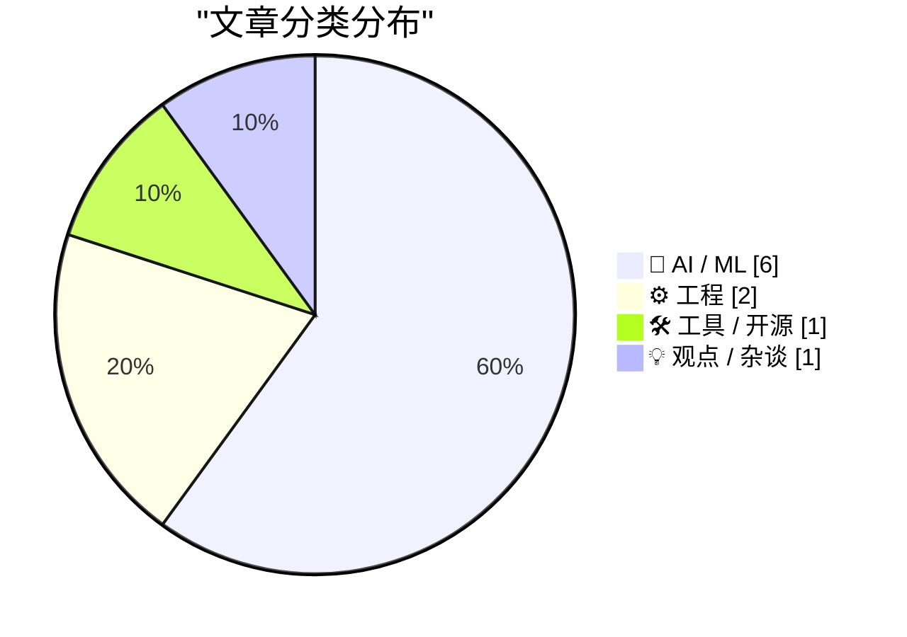
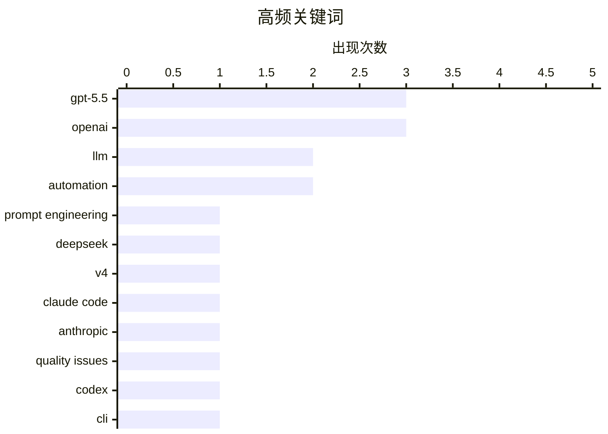

今日技术圈呈现两大大模型阵营角力：OpenAI发布GPT-5.5并与Codex系统统一，强化agentic coding能力；同时DeepSeek推出V4系列，以百万token上下文和1.6T参数规模主打高性价比开源路线。Anthropic则澄清了Claude Code近期质量下降原因，系harness中定时清除思考过程的bug导致“健忘”。技术圈同时在反思AI学习顺序与进化的悖论，以及AI在大众中受欢迎程度下降的深层原因。

<!--more-->


> 来自 Karpathy 推荐的 92 个顶级技术博客，AI 精选 Top 10

## 🏆 今日必读

🥇 **GPT-5.5 提示工程指南**

[GPT-5.5 prompting guide](https://simonwillison.net/2026/Apr/25/gpt-5-5-prompting-guide/#atom-everything) — simonwillison.net · 18 小时前 · 🤖 AI / ML

> GPT-5.5已在API中可用，OpenAI官方发布了详细的提示优化技巧。对于需要多步思考再返回用户可见响应的应用，建议在调用工具前发送一句简短的确认更新，说明当前进行的第一步，能有效减少用户等待时的焦虑感。OpenAI还推荐使用Codex应用中的`openai-docs` skill来迁移现有代码到GPT-5.5平台，命令为`$openai-docs migrate this project to gpt-5.5`。

💡 **为什么值得读**: 这是OpenAI官方发布的GPT-5.5使用指南，包含直接来自官方的最佳实践建议，对开发者有重要参考价值。

🏷️ GPT-5.5, prompt engineering, OpenAI

🥈 **DeepSeek V4 - 接近前沿模型，价格仅零头**

[DeepSeek V4 - almost on the frontier, a fraction of the price](https://simonwillison.net/2026/Apr/24/deepseek-v4/#atom-everything) — simonwillison.net · 1 天前 · 🤖 AI / ML

> DeepSeek发布了V4系列的首批预览模型DeepSeek-V4-Pro和DeepSeek-V4-Flash，两者均支持100万token上下文。Pro版本总参数1.6T、活跃参数49B，Flash版本总参数284B、活跃参数13B，采用MIT开源许可证。Pro模型拥有865GB参数文件，体积超过Kimi K2.6（1.1T）和GLM-5.1（754B），成为新的最大开源权重模型。

💡 **为什么值得读**: 这是目前最大的开源权重模型之一，性能接近前沿水平但价格仅为零头，适合追求高性价比的开发者和技术研究者。

🏷️ DeepSeek, V4, LLM

🥉 **Claude Code 质量问题更新报告**

[An update on recent Claude Code quality reports](https://simonwillison.net/2026/Apr/24/recent-claude-code-quality-reports/#atom-everything) — simonwillison.net · 1 天前 · 🤖 AI / ML

> 过去两个月用户大量抱怨Claude Code输出质量下降，Anthropic经调查确认问题确实存在，但并非模型本身的原因。问题源于Claude Code harness中的三个独立issue，其中一个关键bug发生在3月26日的修改：为减少用户恢复会话时的延迟，原计划在会话空闲超1小时后清除旧的思考过程，但bug导致这一定时清除在每个对话轮次重复执行，使Claude显得“健忘”且重复回答。

💡 **为什么值得读**: 深入了解Claude Code质量问题根源的官方postmortem，对Anthropic产品用户和关注AI工具可靠性者有重要参考价值。

🏷️ Claude Code, Anthropic, quality issues

---

## 📊 数据概览

| 扫描源 | 抓取文章 | 时间范围 | 精选 |
|:---:|:---:|:---:|:---:|
| 88/92 | 2532 篇 → 37 篇 | 48h | **10 篇** |

### 分类分布



### 高频关键词



<details>
<summary>📈 纯文本关键词图（终端友好）</summary>

```
gpt-5.5            │ ████████████████████ 3
openai             │ ████████████████████ 3
llm                │ █████████████░░░░░░░ 2
automation         │ █████████████░░░░░░░ 2
prompt engineering │ ███████░░░░░░░░░░░░░ 1
deepseek           │ ███████░░░░░░░░░░░░░ 1
v4                 │ ███████░░░░░░░░░░░░░ 1
claude code        │ ███████░░░░░░░░░░░░░ 1
anthropic          │ ███████░░░░░░░░░░░░░ 1
quality issues     │ ███████░░░░░░░░░░░░░ 1
```

</details>

### 🏷️ 话题标签

**gpt-5.5**(3) · **openai**(3) · **llm**(2) · automation(2) · prompt engineering(1) · deepseek(1) · v4(1) · claude code(1) · anthropic(1) · quality issues(1) · codex(1) · cli(1) · ai(1) · public perception(1) · postgresql(1) · sqlite(1) · rust(1) · benchmark(1) · twitter(1) · testing(1)

---

## 🤖 AI / ML

### 1. GPT-5.5 提示工程指南

[GPT-5.5 prompting guide](https://simonwillison.net/2026/Apr/25/gpt-5-5-prompting-guide/#atom-everything) — **simonwillison.net** · 18 小时前 · ⭐ 30/30

> GPT-5.5已在API中可用，OpenAI官方发布了详细的提示优化技巧。对于需要多步思考再返回用户可见响应的应用，建议在调用工具前发送一句简短的确认更新，说明当前进行的第一步，能有效减少用户等待时的焦虑感。OpenAI还推荐使用Codex应用中的`openai-docs` skill来迁移现有代码到GPT-5.5平台，命令为`$openai-docs migrate this project to gpt-5.5`。

🏷️ GPT-5.5, prompt engineering, OpenAI

---

### 2. DeepSeek V4 - 接近前沿模型，价格仅零头

[DeepSeek V4 - almost on the frontier, a fraction of the price](https://simonwillison.net/2026/Apr/24/deepseek-v4/#atom-everything) — **simonwillison.net** · 1 天前 · ⭐ 29/30

> DeepSeek发布了V4系列的首批预览模型DeepSeek-V4-Pro和DeepSeek-V4-Flash，两者均支持100万token上下文。Pro版本总参数1.6T、活跃参数49B，Flash版本总参数284B、活跃参数13B，采用MIT开源许可证。Pro模型拥有865GB参数文件，体积超过Kimi K2.6（1.1T）和GLM-5.1（754B），成为新的最大开源权重模型。

🏷️ DeepSeek, V4, LLM

---

### 3. Claude Code 质量问题更新报告

[An update on recent Claude Code quality reports](https://simonwillison.net/2026/Apr/24/recent-claude-code-quality-reports/#atom-everything) — **simonwillison.net** · 1 天前 · ⭐ 29/30

> 过去两个月用户大量抱怨Claude Code输出质量下降，Anthropic经调查确认问题确实存在，但并非模型本身的原因。问题源于Claude Code harness中的三个独立issue，其中一个关键bug发生在3月26日的修改：为减少用户恢复会话时的延迟，原计划在会话空闲超1小时后清除旧的思考过程，但bug导致这一定时清除在每个对话轮次重复执行，使Claude显得“健忘”且重复回答。

🏷️ Claude Code, Anthropic, quality issues

---

### 4. Romain Huet 谈 GPT-5.5 与 Codex 统一

[Quoting Romain Huet](https://simonwillison.net/2026/Apr/25/romain-huet/#atom-everything) — **simonwillison.net** · 10 小时前 · ⭐ 26/30

> OpenAI员工Romain Huet确认从GPT-5.4起已将Codex与主模型统一为单一系统，不再有独立的Codex产品线。GPT-5.5在此基础上进一步强化了agentic coding、computer use和任何计算机任务的能力。这意味着不会再有GPT-5.5-Codex独立版本，编码能力已完全整合进主模型。

🏷️ GPT-5.5, Codex, OpenAI

---

### 5. 付费文章：OpenAI 如何终结 Oracle

[Premium: How OpenAI Kills Oracle](https://www.wheresyoured.at/how-openai-kills-oracle/) — **wheresyoured.at** · 1 天前 · ⭐ 24/30

> 文章探讨OpenAI与Oracle之间的竞争关系和未来走向，涉及Larry Ellison相关的背景故事和商业博弈分析。

🏷️ OpenAI, Oracle, Larry Ellison, business competition

---

### 6. 变异的 AI 驱动病毒

[A Mutating AI Powered Virus](https://geohot.github.io//blog/jekyll/update/2026/04/25/a-mutating-virus.html) — **geohot.github.io** · 1 天前 · ⭐ 24/30

> 文章探讨Moravec's paradox在AI发展中的体现：计算机以与人类相反的顺序学习任务——先学会计算和棋类，然后学会写作和对话，现在正学会移动。与动物进化的顺序恰恰相反。

🏷️ Moravec's paradox, AI development, machine learning, automation

---

## ⚙️ 工程

### 7. honker: SQLite 的 Postgres NOTIFY/LISTEN 语义实现

[russellromney/honker](https://simonwillison.net/2026/Apr/24/honker/#atom-everything) — **simonwillison.net** · 1 天前 · ⭐ 26/30

> honker是一个将Postgres的NOTIFY/LISTEN发布/订阅语义移植到SQLite的项目，实现为Rust SQLite扩展并提供多语言绑定。项目设计允许用熟悉的队列API编写异步工作进程，例如Python中可调用`db.queue("emails")`创建队列并用async for消费，甚至支持多进程共享队列的原子操作。

🏷️ PostgreSQL, SQLite, Rust

---

### 8. WHY ARE YOU LIKE THIS

[WHY ARE YOU LIKE THIS](https://simonwillison.net/2026/Apr/25/why-are-you-like-this/#atom-everything) — **simonwillison.net** · 6 小时前 · ⭐ 24/30

> Twitter用户@scottjla对Simon Willison的“pelican riding a bicycle”AI图像基准测试的回复，生成了ChatGPT Images 2.0的新作：一辆自行车上惊恐的 Pelican，后面有警车追赶，Pelican身上骑着宇航员，宇航员身上骑着马，背景路牌写着"WHY ARE YOU LIKE THIS"。经确认这是模型自行添加的创意元素，非人工预设。

🏷️ benchmark, Twitter, testing

---

## 🛠 工具 / 开源

### 9. llm 0.31 版本发布

[llm 0.31](https://simonwillison.net/2026/Apr/24/llm/#atom-everything) — **simonwillison.net** · 23 小时前 · ⭐ 26/30

> Simon Willison的llm命令行工具发布0.31版本，新增对GPT-5.5的支持（使用`llm -m gpt-5.5`）。同时为GPT-5+模型新增verbosity参数（可设low/medium/high控制输出详细程度）和image detail参数（控制图像处理的详细等级，支持low/high/auto，GPT-5.4/5.5还支持original）。此外，在extra-openai-models.yaml中注册的模型现在也支持异步调用。

🏷️ llm, GPT-5.5, CLI

---

## 💡 观点 / 杂谈

### 10. 人们并不渴望自动化

[The people do not yearn for automation](https://simonwillison.net/2026/Apr/24/the-people-do-not-yearn-for-automation/#atom-everything) — **simonwillison.net** · 1 天前 · ⭐ 26/30

> The Verge主编Nilay Patel撰写的长文/视频文章探讨为何AI在大众中不受欢迎，尽管ChatGPT用户数持续飙升。核心观点是患有“软件脑”（将世界视为可自动化对象、用信息流和数据建模一切）的人正与普通人渐行渐远。AI只是让更多人能更简单地创建软件来自动化各种业务，这种“软件脑”主导的商业世界已无处不在。

🏷️ AI, automation, public perception

---

*生成于 2026-04-26 22:55 | 扫描 88 源 → 获取 2532 篇 → 精选 10 篇*
*基于 [Hacker News Popularity Contest 2025](https://refactoringenglish.com/tools/hn-popularity/) RSS 源列表，由 [Andrej Karpathy](https://x.com/karpathy) 推荐*
*由「懂点儿AI」制作，欢迎关注同名微信公众号获取更多 AI 实用技巧 💡*
