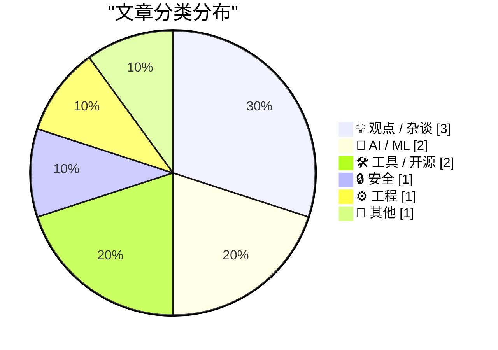
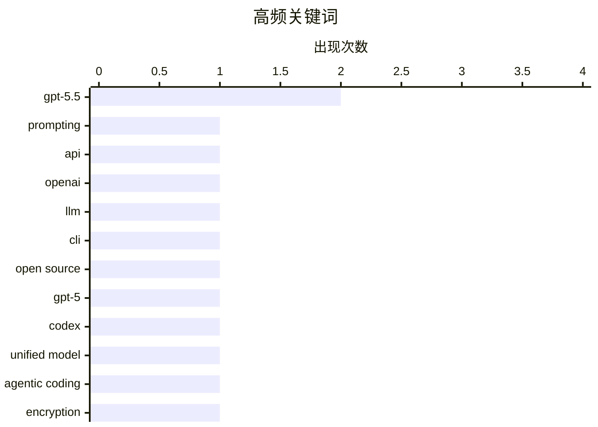

今日技术圈聚焦三大趋势：AI领域继续迭代，GPT-5.5 prompting guide和llm 0.31相继发布，提示工程和模型工具仍是开发者关注焦点；安全领域Bitwarden详解加密机制，引发对密码管理可靠性的讨论；同时C/C++依赖管理迎来突破性进展。三星移动部门可能被RAM crisis击垮，首次出现年度亏损，行业格局再添变数。技术社区对自动化价值的反思也在持续发酵。

<!--more-->


> 来自 Karpathy 推荐的 92 个顶级技术博客，AI 精选 Top 10

## 🏆 今日必读

🥇 **GPT-5.5 prompting guide**

[GPT-5.5 prompting guide](https://simonwillison.net/2026/Apr/25/gpt-5-5-prompting-guide/#atom-everything) — simonwillison.net · 1 天前 · 🤖 AI / ML

> GPT-5.5 prompting guide

🏷️ GPT-5.5, prompting, API, OpenAI

🥈 **llm 0.31**

[llm 0.31](https://simonwillison.net/2026/Apr/24/llm/#atom-everything) — simonwillison.net · 1 天前 · 🛠 工具 / 开源

> llm 0.31

🏷️ llm, GPT-5.5, CLI, open source

🥉 **Quoting Romain Huet**

[Quoting Romain Huet](https://simonwillison.net/2026/Apr/25/romain-huet/#atom-everything) — simonwillison.net · 1 天前 · 🤖 AI / ML

> Quoting Romain Huet

🏷️ GPT-5, Codex, unified model, agentic coding

---

## 📊 数据概览

| 扫描源 | 抓取文章 | 时间范围 | 精选 |
|:---:|:---:|:---:|:---:|
| 88/92 | 2532 篇 → 20 篇 | 48h | **10 篇** |

### 分类分布



### 高频关键词



<details>
<summary>📈 纯文本关键词图（终端友好）</summary>

```
gpt-5.5       │ ████████████████████ 2
prompting     │ ██████████░░░░░░░░░░ 1
api           │ ██████████░░░░░░░░░░ 1
openai        │ ██████████░░░░░░░░░░ 1
llm           │ ██████████░░░░░░░░░░ 1
cli           │ ██████████░░░░░░░░░░ 1
open source   │ ██████████░░░░░░░░░░ 1
gpt-5         │ ██████████░░░░░░░░░░ 1
codex         │ ██████████░░░░░░░░░░ 1
unified model │ ██████████░░░░░░░░░░ 1
```

</details>

### 🏷️ 话题标签

**gpt-5.5**(2) · **prompting**(1) · **api**(1) · openai(1) · llm(1) · cli(1) · open source(1) · gpt-5(1) · codex(1) · unified model(1) · agentic coding(1) · encryption(1) · bitwarden(1) · password manager(1) · security(1) · ai(1) · automation(1) · public perception(1) · chatgpt(1) · c++(1)

---

## 💡 观点 / 杂谈

### 1. The people do not yearn for automation

[The people do not yearn for automation](https://simonwillison.net/2026/Apr/24/the-people-do-not-yearn-for-automation/#atom-everything) — **simonwillison.net** · 1 天前 · ⭐ 22/30

> The people do not yearn for automation

🏷️ AI, automation, public perception, ChatGPT

---

### 2. ★ Time to Serve Some Delicious Claim Chowder Regarding the Cook-Ternus CEO Transition

[★ Time to Serve Some Delicious Claim Chowder Regarding the Cook-Ternus CEO Transition](https://daringfireball.net/2026/04/delicious_claim_chowder_regarding_the_cook-ternus_ceo_transition) — **daringfireball.net** · 1 天前 · ⭐ 19/30

> ★ Time to Serve Some Delicious Claim Chowder Regarding the Cook-Ternus CEO Transition

🏷️ Apple, CEO, Tim Cook, journalism

---

### 3. DF Paraphernalia: Last Call for This Round of T-Shirts and Hoodies

[DF Paraphernalia: Last Call for This Round of T-Shirts and Hoodies](https://store.daringfireball.net/) — **daringfireball.net** · 2 小时前 · ⭐ 17/30

> DF Paraphernalia: Last Call for This Round of T-Shirts and Hoodies

🏷️ Daring Fireball, blogging, tech media, anniversary

---

## 🤖 AI / ML

### 4. GPT-5.5 prompting guide

[GPT-5.5 prompting guide](https://simonwillison.net/2026/Apr/25/gpt-5-5-prompting-guide/#atom-everything) — **simonwillison.net** · 1 天前 · ⭐ 27/30

> GPT-5.5 prompting guide

🏷️ GPT-5.5, prompting, API, OpenAI

---

### 5. Quoting Romain Huet

[Quoting Romain Huet](https://simonwillison.net/2026/Apr/25/romain-huet/#atom-everything) — **simonwillison.net** · 1 天前 · ⭐ 26/30

> Quoting Romain Huet

🏷️ GPT-5, Codex, unified model, agentic coding

---

## 🛠 工具 / 开源

### 6. llm 0.31

[llm 0.31](https://simonwillison.net/2026/Apr/24/llm/#atom-everything) — **simonwillison.net** · 1 天前 · ⭐ 27/30

> llm 0.31

🏷️ llm, GPT-5.5, CLI, open source

---

### 7. A breakthrough in C/C++ dependency management

[A breakthrough in C/C++ dependency management](https://lcamtuf.substack.com/p/a-breakthrough-in-cc-dependency-management) — **lcamtuf.substack.com** · 22 小时前 · ⭐ 22/30

> A breakthrough in C/C++ dependency management

🏷️ C++, dependency management, package manager

---

## 🔒 安全

### 8. How Bitwarden Encrypts and Decrypts Secrets

[How Bitwarden Encrypts and Decrypts Secrets](https://blog.miguelgrinberg.com/post/how-bitwarden-encrypts-and-decrypts-secrets) — **miguelgrinberg.com** · 8 小时前 · ⭐ 23/30

> How Bitwarden Encrypts and Decrypts Secrets

🏷️ encryption, Bitwarden, password manager, security

---

## ⚙️ 工程

### 9. WHY ARE YOU LIKE THIS

[WHY ARE YOU LIKE THIS](https://simonwillison.net/2026/Apr/25/why-are-you-like-this/#atom-everything) — **simonwillison.net** · 1 天前 · ⭐ 20/30

> WHY ARE YOU LIKE THIS

🏷️ benchmark, performance, programming languages

---

## 📝 其他

### 10. Report Claims Samsung Might Post Its First-Ever Mobile Division Loss This Year, Blaming RAM Crisis

[Report Claims Samsung Might Post Its First-Ever Mobile Division Loss This Year, Blaming RAM Crisis](https://9to5google.com/2026/04/22/samsung-is-increasingly-worried-about-first-ever-mobile-division-loss-in-ram-crisis-report/) — **daringfireball.net** · 4 小时前 · ⭐ 18/30

> Report Claims Samsung Might Post Its First-Ever Mobile Division Loss This Year, Blaming RAM Crisis

🏷️ Samsung, mobile division, RAM, business

---

*生成于 2026-04-27 22:22 | 扫描 88 源 → 获取 2532 篇 → 精选 10 篇*
*基于 [Hacker News Popularity Contest 2025](https://refactoringenglish.com/tools/hn-popularity/) RSS 源列表，由 [Andrej Karpathy](https://x.com/karpathy) 推荐*
*由「懂点儿AI」制作，欢迎关注同名微信公众号获取更多 AI 实用技巧 💡*
