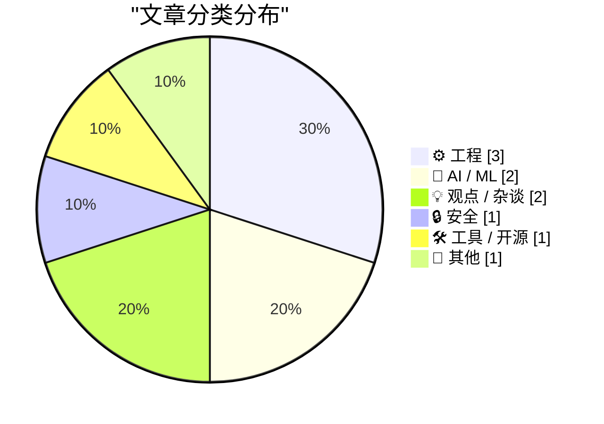
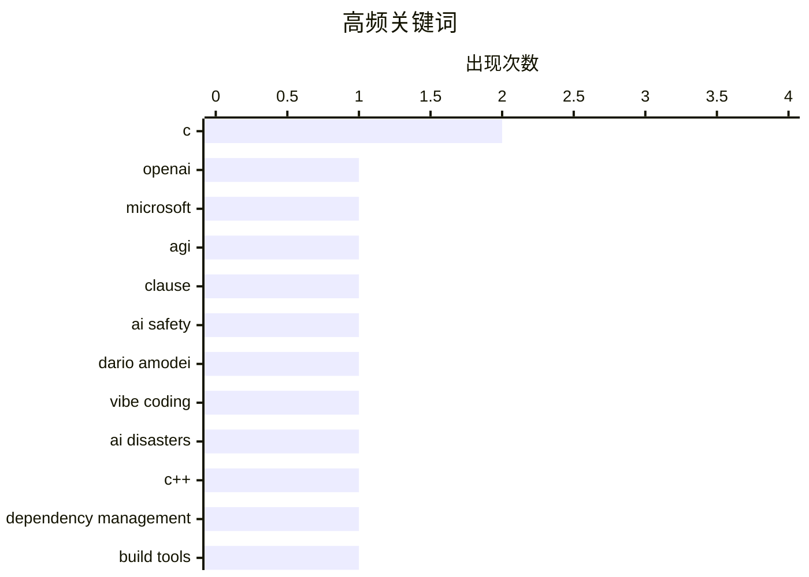

今日AI安全与治理议题升温，OpenAI与微软的AGI条款终止以及行业对AI炒作与安全隐患的反思形成呼应；同时C/C++依赖管理迎来突破性进展，长期困扰开发者的包管理难题有望缓解；密码管理器Bitwarden的加密机制分析及供应链攻击事件则再次敲响安全警钟。

<!--more-->


> 来自 Karpathy 推荐的 92 个顶级技术博客，AI 精选 Top 10

## 🏆 今日必读

🥇 **追踪现已失效的OpenAI-微软AGI条款历史**

[Tracking the history of the now-deceased OpenAI Microsoft AGI clause](https://simonwillison.net/2026/Apr/27/now-deceased-agi-clause/#atom-everything) — simonwillison.net · 3 小时前 · 🤖 AI / ML

> 微软与OpenAI的合作曾包含一项特殊条款：若实现AGI，微软的商业知识产权将归零失效。该条款可追溯至2019年7月OpenAI获得微软投资时，协议中提及微软将成为其pre-AGI技术的商业化首选伙伴，但未明确界定何为AGI。作者通过多年追踪openai.com上的相关表述，揭示该条款已于近日正式终止。

💡 **为什么值得读**: 对于关注AI治理和AGI定义边界的读者，了解这条曾限制微软与OpenAI关系的关键条款如何消失，具有重要的行业参考价值。

🏷️ OpenAI, Microsoft, AGI, clause

🥈 **Dario Amodei、炒作、AI安全与vibe-coded AI灾难的爆发**

[Dario Amodei, hype, AI safety, and the explosion of vibe-coded AI disasters](https://garymarcus.substack.com/p/dario-amodei-hype-ai-safety-and-the) — garymarcus.substack.com · 6 小时前 · 🤖 AI / ML

> AI行业存在系统性报喜不报忧的问题，表现为过度宣传AI能力而忽视安全隐患。Dario Amodei作为Anthropic CEO，其言论与实际AI安全挑战之间存在张力。vibe-coded AI（凭感觉开发的AI应用）的泛滥导致大量技术灾难，根源在于开发者盲目追逐潮流而忽视基础工程实践。

💡 **为什么值得读**: 本文揭示了AI行业过度炒作的危害，对AI安全感兴趣的读者能从中获得对当前AI发展趋势的批判性视角。

🏷️ AI safety, Dario Amodei, vibe coding, AI disasters

🥉 **C/C++依赖管理的突破**

[A breakthrough in C/C++ dependency management](https://lcamtuf.substack.com/p/a-breakthrough-in-cc-dependency-management) — lcamtuf.substack.com · 1 天前 · ⚙️ 工程

> 文章介绍了C/C++语言依赖管理领域的最新进展，为长期困扰开发者的包管理难题提供了解决方案。对于C/C++程序员而言，依赖管理一直是痛点，最新的工具或框架可能在简化构建流程、提高代码复用性方面取得突破。

💡 **为什么值得读**: 如果你是C/C++开发者，这篇文章可能介绍了一种能显著改善你工作流的工具，值得关注。

🏷️ C, C++, dependency management, build tools

---

## 📊 数据概览

| 扫描源 | 抓取文章 | 时间范围 | 精选 |
|:---:|:---:|:---:|:---:|
| 88/92 | 2532 篇 → 17 篇 | 48h | **10 篇** |

### 分类分布



### 高频关键词



<details>
<summary>📈 纯文本关键词图（终端友好）</summary>

```
c            │ ████████████████████ 2
openai       │ ██████████░░░░░░░░░░ 1
microsoft    │ ██████████░░░░░░░░░░ 1
agi          │ ██████████░░░░░░░░░░ 1
clause       │ ██████████░░░░░░░░░░ 1
ai safety    │ ██████████░░░░░░░░░░ 1
dario amodei │ ██████████░░░░░░░░░░ 1
vibe coding  │ ██████████░░░░░░░░░░ 1
ai disasters │ ██████████░░░░░░░░░░ 1
c++          │ ██████████░░░░░░░░░░ 1
```

</details>

### 🏷️ 话题标签

**c**(2) · **openai**(1) · **microsoft**(1) · agi(1) · clause(1) · ai safety(1) · dario amodei(1) · vibe coding(1) · ai disasters(1) · c++(1) · dependency management(1) · build tools(1) · encryption(1) · bitwarden(1) · vaultwarden(1) · password manager(1) · registers(1) · architecture(1) · itanium(1) · ai speed(1)

---

## ⚙️ 工程

### 1. C/C++依赖管理的突破

[A breakthrough in C/C++ dependency management](https://lcamtuf.substack.com/p/a-breakthrough-in-cc-dependency-management) — **lcamtuf.substack.com** · 1 天前 · ⭐ 23/30

> 文章介绍了C/C++语言依赖管理领域的最新进展，为长期困扰开发者的包管理难题提供了解决方案。对于C/C++程序员而言，依赖管理一直是痛点，最新的工具或框架可能在简化构建流程、提高代码复用性方面取得突破。

🏷️ C, C++, dependency management, build tools

---

### 2. 向C函数传递过少寄存器参数在不同架构上的后果

[Looking at consequences of passing too few register parameters to a C function on various architectures](https://devblogs.microsoft.com/oldnewthing/20260427-00/?p=112271) — **devblogs.microsoft.com/oldnewthing** · 8 小时前 · ⭐ 22/30

> 文章分析了向C函数传递参数数量不足时在不同CPU架构上的影响。无论采用何种调用约定，参数不足都会导致问题，而Itanium C++ ABI在此基础上更为严苛。作者通过具体例子说明这一跨平台兼容性陷阱。

🏷️ C, registers, architecture, Itanium

---

### 3. 施乐如何发明图形用户界面又失去它

[How Xerox invented the GUI and lost it](https://dfarq.homeip.net/how-xerox-invented-the-gui-and-lost-it/?utm_source=rss&#038;utm_medium=rss&#038;utm_campaign=how-xerox-invented-the-gui-and-lost-it) — **dfarq.homeip.net** · 11 小时前 · ⭐ 19/30

> 施乐在1960年代曾是科技行业的领导者，拥有类似苹果后来的市场地位。施乐PARC实验室发明了图形用户界面（GUI）、鼠标和以太网等关键技术，但公司未能将这些创新商业化，最终被苹果和微软借鉴发扬。作者探讨了这一历史教训。

🏷️ Xerox, GUI, innovation, Apple

---

## 🤖 AI / ML

### 4. 追踪现已失效的OpenAI-微软AGI条款历史

[Tracking the history of the now-deceased OpenAI Microsoft AGI clause](https://simonwillison.net/2026/Apr/27/now-deceased-agi-clause/#atom-everything) — **simonwillison.net** · 3 小时前 · ⭐ 24/30

> 微软与OpenAI的合作曾包含一项特殊条款：若实现AGI，微软的商业知识产权将归零失效。该条款可追溯至2019年7月OpenAI获得微软投资时，协议中提及微软将成为其pre-AGI技术的商业化首选伙伴，但未明确界定何为AGI。作者通过多年追踪openai.com上的相关表述，揭示该条款已于近日正式终止。

🏷️ OpenAI, Microsoft, AGI, clause

---

### 5. Dario Amodei、炒作、AI安全与vibe-coded AI灾难的爆发

[Dario Amodei, hype, AI safety, and the explosion of vibe-coded AI disasters](https://garymarcus.substack.com/p/dario-amodei-hype-ai-safety-and-the) — **garymarcus.substack.com** · 6 小时前 · ⭐ 24/30

> AI行业存在系统性报喜不报忧的问题，表现为过度宣传AI能力而忽视安全隐患。Dario Amodei作为Anthropic CEO，其言论与实际AI安全挑战之间存在张力。vibe-coded AI（凭感觉开发的AI应用）的泛滥导致大量技术灾难，根源在于开发者盲目追逐潮流而忽视基础工程实践。

🏷️ AI safety, Dario Amodei, vibe coding, AI disasters

---

## 💡 观点 / 杂谈

### 6. 团队速度不是个人速度的简单相加

[Collective Speed Is Not the Summation of Individual Speed](https://blog.jim-nielsen.com/2026/collective-speed-isnt-the-sum-of individual-speed/) — **blog.jim-nielsen.com** · 1 天前 · ⭐ 22/30

> 作者以4×100米接力赛为喻，探讨团队效率的本质问题。找到四个跑得最快的选手不等于能赢得比赛，接力棒的交接才是关键。类似地，AI提升个人编码速度10倍，并不意味着软件质量能同步提升。这反映了组织效能与个人能力的非线性关系。

🏷️ AI speed, wisdom, collective speed, AI alignment

---

### 7. 「腐化」多元宇宙

[Pluralistic: The enshittification multiverse (27 Apr 2026)](https://pluralistic.net/2026/04/27/analogs-and-analogies/) — **pluralistic.net** · 13 小时前 · ⭐ 21/30

> 作者讨论了「enshittification」（平台腐化）概念的延伸应用，赞同将其扩展到数字平台之外的其他领域。这一术语描述的是平台从服务于用户逐渐堕落为只追求自身利益的过程，语义漂移实际上有助于概念更广泛地传播。

🏷️ enshittification, platforms, tech industry

---

## 🔒 安全

### 8. Bitwarden如何加密和解密密钥

[How Bitwarden Encrypts and Decrypts Secrets](https://blog.miguelgrinberg.com/post/how-bitwarden-encrypts-and-decrypts-secrets) — **miguelgrinberg.com** · 1 天前 · ⭐ 23/30

> 作者研究自托管密码管理器Vaultwarden时，深入分析了Bitwarden的加密机制。所有密钥以加密形式存储在SQLite数据库中，理解其加密/解密流程对自托管用户至关重要。文中提及Bitwarden CLI曾遭受供应链攻击，凸显了密码管理器的安全性挑战。

🏷️ encryption, Bitwarden, Vaultwarden, password manager

---

## 🛠 工具 / 开源

### 9. Google Meet语音翻译现已向移动设备推出

[Speech translation in Google Meet is now rolling out to mobile devices](https://simonwillison.net/2026/Apr/27/speech-translation-in-google-meet-is-now-rolling-out-to-mobile-d/#atom-everything) — **simonwillison.net** · 4 小时前 · ⭐ 21/30

> Google Meet的实时语音翻译功能正在向移动设备推广，目前支持英语、西班牙语、法语、德语、葡萄牙语和意大利语。该功能可在对话中实时翻译并用原说话人的声音模拟进行反馈，但目前仍处于alpha阶段，跨设备稳定性有待提升。

🏷️ Google Meet, speech translation, mobile

---

## 📝 其他

### 10. 报告称三星今年可能首次出现移动部门亏损

[Report Claims Samsung Might Post Its First-Ever Mobile Division Loss This Year, Blaming RAM Crisis](https://9to5google.com/2026/04/22/samsung-is-increasingly-worried-about-first-ever-mobile-division-loss-in-ram-crisis-report/) — **daringfireball.net** · 1 天前 · ⭐ 19/30

> 据报道，三星移动业务（MX）可能首次出现年度运营亏损，主要原因是存储芯片危机导致的RAM价格下跌。2013年业界分析曾显示苹果占手机行业利润70%，三星占30%。三星移动部门负责人TM Roh已表达对可能赤字的担忧。

🏷️ Samsung, mobile division, RAM, loss

---

*生成于 2026-04-28 22:18 | 扫描 88 源 → 获取 2532 篇 → 精选 10 篇*
*基于 [Hacker News Popularity Contest 2025](https://refactoringenglish.com/tools/hn-popularity/) RSS 源列表，由 [Andrej Karpathy](https://x.com/karpathy) 推荐*
*由「懂点儿AI」制作，欢迎关注同名微信公众号获取更多 AI 实用技巧 💡*
