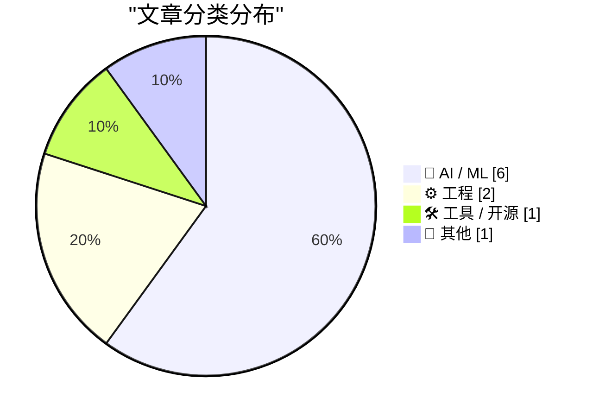
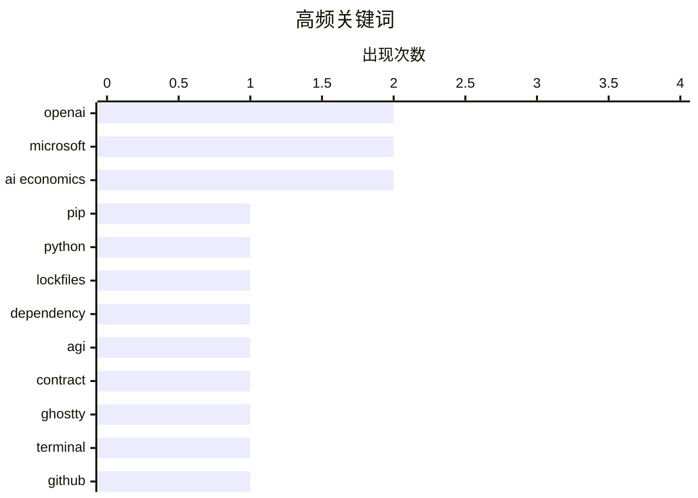

今日AI圈焦点集中：OpenAI与Microsoft的AGI特殊授权条款于4月底正式终止，同时Musk起诉OpenAI案同日开庭，两家公司关系走向引发行业关注；AI经济模式可持续性问题持续发酵，行业开始反思定价与价值创造逻辑，多篇讨论文章指出当前AI工具隐藏成本风险。开发者工具领域，pip 26.1版本推出依赖锁定功能解决团队协作痛点，Microsoft开源VibeVoice语音识别模型补足多说话者分离能力，而Ghostty终端项目宣布离开GitHub平台，具体迁移方向待公布。

<!--more-->


> 来自 Karpathy 推荐的 92 个顶级技术博客，AI 精选 Top 10

## 🏆 今日必读

🥇 **pip 26.1 新功能：锁文件和依赖冷却时间**

[What's new in pip 26.1 - lockfiles and dependency cooldowns!](https://simonwillison.net/2026/Apr/28/pip-261/#atom-everything) — simonwillison.net · 1 天前 · 🛠 工具 / 开源

> pip 26.1 于2026年4月发布，放弃了Python 3.9支持（2025年10月已停止维护）。最大亮点是新增 `pip lock` 命令，可生成 `pylock.toml` 文件锁定整个依赖树，包括直接依赖和所有传递依赖，避免重复解析。文章演示了用该命令锁定 Datasette 和 LLM，生成519行的锁文件。该功能解决了依赖管理的核心痛点，开发者可在团队中共享一致的依赖环境。

💡 **为什么值得读**: Python 开发者必读，lockfiles 功能将显著改善团队协作中的依赖一致性，值得升级体验。

🏷️ pip, Python, lockfiles, dependency

🥈 **追踪已终止的 OpenAI Microsoft AGI 条款历史**

[Tracking the history of the now-deceased OpenAI Microsoft AGI clause](https://simonwillison.net/2026/Apr/27/now-deceased-agi-clause/#atom-everything) — simonwillison.net · 1 天前 · 🤖 AI / ML

> 本文追踪了 Microsoft 和 OpenAI 之间一项特殊条款的历史——若AGI（通用人工智能）实现，Microsoft 对 OpenAI 技术的商业授权IP权利将失效。该条款可追溯至2019年7月OpenAI接受Microsoft投资时的公告，其中提到"一些AGI前技术"的许可，但未明确界定何为AGI。该条款于2026年4月28日终止失效，标志着两家公司关系的重大变化。

💡 **为什么值得读**: 理解科技巨头AI合作关系演变的关键历史记录，对关注AI行业走向的读者有重要参考价值。

🏷️ OpenAI, Microsoft, AGI, contract

🥉 **Ghostty 正在离开 GitHub**

[Ghostty Is Leaving GitHub](https://mitchellh.com/writing/ghostty-leaving-github) — mitchellh.com · 1 天前 · ⚙️ 工程

> Ghostty 终端模拟器的作者宣布该项目将离开 GitHub 平台，具体原因和迁移目的地未在摘要内容中透露。

💡 **为什么值得读**: 关注开源终端工具发展的用户可留意后续动态。

🏷️ Ghostty, terminal, GitHub, open source

---

## 📊 数据概览

| 扫描源 | 抓取文章 | 时间范围 | 精选 |
|:---:|:---:|:---:|:---:|
| 81/92 | 1975 篇 → 39 篇 | 48h | **10 篇** |

### 分类分布



### 高频关键词



<details>
<summary>📈 纯文本关键词图（终端友好）</summary>

```
openai       │ ████████████████████ 2
microsoft    │ ████████████████████ 2
ai economics │ ████████████████████ 2
pip          │ ██████████░░░░░░░░░░ 1
python       │ ██████████░░░░░░░░░░ 1
lockfiles    │ ██████████░░░░░░░░░░ 1
dependency   │ ██████████░░░░░░░░░░ 1
agi          │ ██████████░░░░░░░░░░ 1
contract     │ ██████████░░░░░░░░░░ 1
ghostty      │ ██████████░░░░░░░░░░ 1
```

</details>

### 🏷️ 话题标签

**openai**(2) · **microsoft**(2) · **ai economics**(2) · pip(1) · python(1) · lockfiles(1) · dependency(1) · agi(1) · contract(1) · ghostty(1) · terminal(1) · github(1) · open source(1) · ai safety(1) · ai hype(1) · vibe coding(1) · dario amodei(1) · nvidia(1) · anthropic(1) · business model(1)

---

## 🤖 AI / ML

### 1. 追踪已终止的 OpenAI Microsoft AGI 条款历史

[Tracking the history of the now-deceased OpenAI Microsoft AGI clause](https://simonwillison.net/2026/Apr/27/now-deceased-agi-clause/#atom-everything) — **simonwillison.net** · 1 天前 · ⭐ 25/30

> 本文追踪了 Microsoft 和 OpenAI 之间一项特殊条款的历史——若AGI（通用人工智能）实现，Microsoft 对 OpenAI 技术的商业授权IP权利将失效。该条款可追溯至2019年7月OpenAI接受Microsoft投资时的公告，其中提到"一些AGI前技术"的许可，但未明确界定何为AGI。该条款于2026年4月28日终止失效，标志着两家公司关系的重大变化。

🏷️ OpenAI, Microsoft, AGI, contract

---

### 2. Dario Amodei、炒作、AI 安全，以及 vibes 代码 AI 灾难的爆发

[Dario Amodei, hype, AI safety, and the explosion of vibe-coded AI disasters](https://garymarcus.substack.com/p/dario-amodei-hype-ai-safety-and-the) — **garymarcus.substack.com** · 1 天前 · ⭐ 25/30

> 本文批评了AI行业当前的过度炒作现象，探讨了Dario Amodei（Anthropic CEO）关于AI安全的观点，以及所谓"vibe-coded"AI产品带来的实际问题和潜在风险。

🏷️ AI safety, AI hype, vibe coding, Dario Amodei

---

### 3. AI 的经济模式不合理

[AI's Economics Don't Make Sense](https://www.wheresyoured.at/ais-economics-dont-make-sense/) — **wheresyoured.at** · 23 小时前 · ⭐ 25/30

> 文章分析了AI行业当前的经济模式问题，指出多数AI产品和公司的商业模式难以持续，需要重新思考定价和价值创造方式。

🏷️ AI economics, NVIDIA, Anthropic

---

### 4. AI 的经济模式不合理 [无广告版]

[AI's Economics Don't Make Sense [Ad Free]](https://www.wheresyoured.at/ais-economics-dont-make-sense-ad-free/) — **wheresyoured.at** · 23 小时前 · ⭐ 25/30

> 同Index 4，为无广告版本。

🏷️ AI economics, business model

---

### 5. Microsoft VibeVoice 语音识别模型

[microsoft/VibeVoice](https://simonwillison.net/2026/Apr/27/vibevoice/#atom-everything) — **simonwillison.net** · 1 天前 · ⭐ 24/30

> VibeVoice 是 Microsoft 推出的 Whisper 风格开源语音识别模型，于2026年1月21日发布，采用MIT许可证。支持说话者分离（speaker diarization）功能，可同时识别多人并标注说话者。提供17.3GB的完整版 VibeVoice-ASR 和5.71GB的4位量化版 mlx-community/VibeVoice-ASR-4bit。通过 mlx-audio 工具可一键运行，支持macOS平台。

🏷️ VibeVoice, Microsoft, speech-to-text, Whisper

---

### 6. 账单来临时

[When The Bill Comes Due](https://feed.tedium.co/link/15204/17327554/openai-anthropic-ai-tools-expensive-alternatives) — **tedium.co** · 12 小时前 · ⭐ 24/30

> 文章警告用户警惕 Anthropic 和 OpenAI 推出的新型AI工具隐藏成本，这些工具虽然初期吸引用户，但最终会产生高额费用。作者指出市场上存在更便宜的替代方案，提醒用户在选择AI服务时需考虑长期成本。

🏷️ AI-tools, cost, pricing, LLM

---

## ⚙️ 工程

### 7. Ghostty 正在离开 GitHub

[Ghostty Is Leaving GitHub](https://mitchellh.com/writing/ghostty-leaving-github) — **mitchellh.com** · 1 天前 · ⭐ 25/30

> Ghostty 终端模拟器的作者宣布该项目将离开 GitHub 平台，具体原因和迁移目的地未在摘要内容中透露。

🏷️ Ghostty, terminal, GitHub, open source

---

### 8. 开发有限读者的跨进程读写锁，第一部分：信号量

[Developing a cross-process reader/writer lock with limited readers, part 1: A semaphore](https://devblogs.microsoft.com/oldnewthing/20260428-00/?p=112278) — **devblogs.microsoft.com/oldnewthing** · 1 天前 · ⭐ 24/30

> 技术博客文章，探讨如何实现跨进程 reader/writer lock（读写锁），限制并发读者数量。第一部分聚焦于使用 semaphore（信号量）机制来实现该功能，属于Windows系统底层开发的高级主题。

🏷️ reader/writer lock, semaphore, Windows, systems programming

---

## 🛠 工具 / 开源

### 9. pip 26.1 新功能：锁文件和依赖冷却时间

[What's new in pip 26.1 - lockfiles and dependency cooldowns!](https://simonwillison.net/2026/Apr/28/pip-261/#atom-everything) — **simonwillison.net** · 1 天前 · ⭐ 25/30

> pip 26.1 于2026年4月发布，放弃了Python 3.9支持（2025年10月已停止维护）。最大亮点是新增 `pip lock` 命令，可生成 `pylock.toml` 文件锁定整个依赖树，包括直接依赖和所有传递依赖，避免重复解析。文章演示了用该命令锁定 Datasette 和 LLM，生成519行的锁文件。该功能解决了依赖管理的核心痛点，开发者可在团队中共享一致的依赖环境。

🏷️ pip, Python, lockfiles, dependency

---

## 📝 其他

### 10. OpenAI 审判开始：公司早期历史的两种截然叙事

[OpenAI Trial Starts With Two Very Different Tales of a Company’s Early Years](https://www.nytimes.com/2026/04/28/technology/openai-trial-elon-musk-sam-altman.html?unlocked_article_code=1.elA.u75G.-STmUe_pILOO) — **daringfireball.net** · 1 小时前 · ⭐ 24/30

> 2026年4月28日，Elon Musk 起诉 OpenAI 的审判在加州奥克兰法院开庭。Musk 声称 Altman 将非营利的 OpenAI "偷走"，背离了最初的公益承诺。OpenAI 则反驳称是 Musk 试图将实验室商业化而被其他创始人拒绝后愤而离开。Musk 在证词中表示"偷走慈善机构是不对的"。这是科技行业关于AI发展方向和公司治理的重要审判。

🏷️ OpenAI, Musk, Altman, trial

---

*生成于 2026-04-29 15:44 | 扫描 81 源 → 获取 1975 篇 → 精选 10 篇*
*基于 [Hacker News Popularity Contest 2025](https://refactoringenglish.com/tools/hn-popularity/) RSS 源列表，由 [Andrej Karpathy](https://x.com/karpathy) 推荐*
*由「懂点儿AI」制作，欢迎关注同名微信公众号获取更多 AI 实用技巧 💡*
