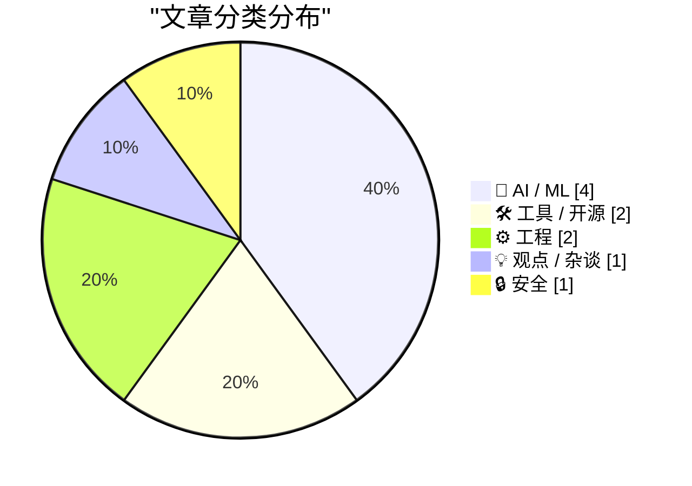
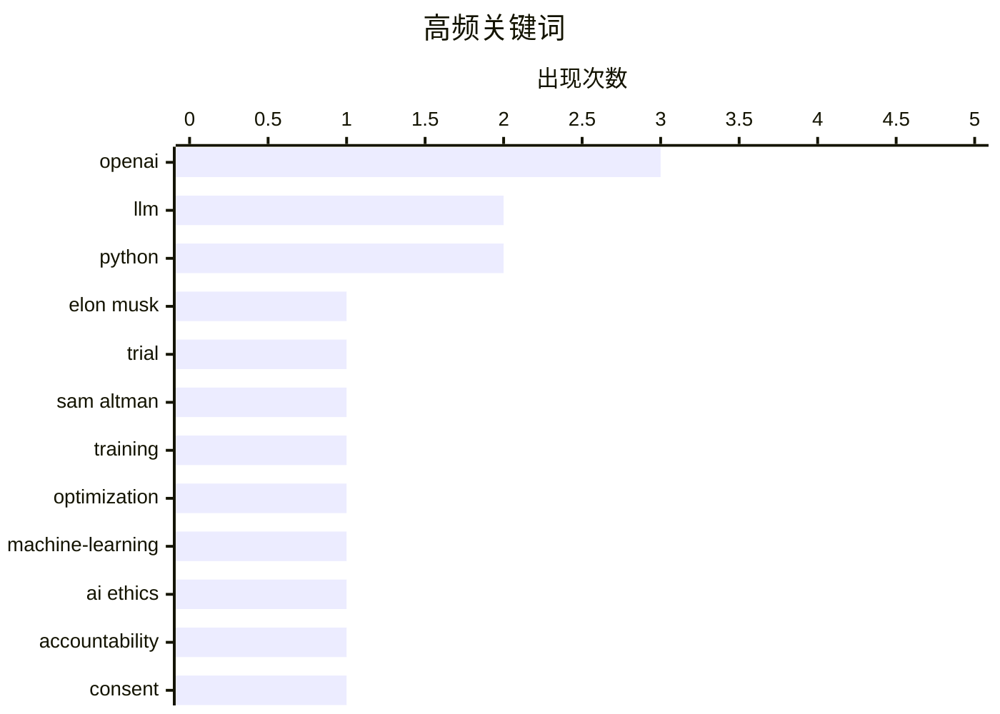

今日技术圈焦点集中于AI行业格局的深度博弈：马斯克起诉OpenAI案在联邦法院开审，双方围绕公司使命与开源闭源策略展开激辩，可能重塑AI权力版图；与此同时，开发者社区继续推进工程实践，Python包管理工具pip 26.1引入锁定文件功能，LLM库完成重大架构重构，微软也开源了Whisper风格的语音识别模型；批评声浪同样高涨，量子计算对现有加密体系的威胁临近，而关于AI成本与伦理的反思正引发更广泛讨论。

<!--more-->


> 来自 Karpathy 推荐的 92 个顶级技术博客，AI 精选 Top 10

## 🏆 今日必读

🥇 **OpenAI审判首日：马斯克与 Altman 法庭交锋**

[OpenAI Trial Starts With Two Very Different Tales of a Company’s Early Years](https://www.nytimes.com/2026/04/28/technology/openai-trial-elon-musk-sam-altman.html?unlocked_article_code=1.elA.u75G.-STmUe_pILOO) — daringfireball.net · 7 小时前 · 🤖 AI / ML

> 马斯克诉 OpenAI 案在加州奥克兰联邦法院开审，首日证词呈现两种截然不同的公司起源叙事。马斯克指控 Altman 将非营利机构从慈善使命中剥离，是“史上最大盗窃”之一；而 OpenAI 方面则称马斯克才是贪婪的资本家，在其他创始人拒绝其计划后愤而离去。马斯克在证词席上表示：“这场诉讼很简单：盗窃慈善机构是不可接受的。”如果 Altman 和 OpenAI 继续经营，可能将改变 AI 行业的权力格局。

💡 **为什么值得读**: 深入了解 OpenAI 内部争议的第一手报道，揭示马斯克与 Altman 决裂的真实原因。

🏷️ OpenAI, Elon Musk, trial, Sam Altman

🥈 **LLM 训练与服务背后的数学原理**

[Reiner Pope – The math behind how LLMs are trained and served](https://www.dwarkesh.com/p/reiner-pope) — dwarkesh.com · 5 小时前 · 🤖 AI / ML

> 文章探讨如何仅用少量公式和一块黑板就能推断出 AI 实验室正在做的事情。作者认为，通过分析 LLM 训练和服务过程的数学基础，可以获取关于模型架构、训练数据、计算资源等关键信息。这种方法揭示了大型语言模型训练过程中一些不为人知的技术细节。

💡 **为什么值得读**: 适合想深入理解 LLM 内部机制的技术读者，从数学角度解密 AI 训练过程。

🏷️ LLM, training, optimization, machine-learning

🥉 **一个好的 AI 已在此**

[(One) Good AI Is Here](https://anildash.com/2026/04/28/one-good-ai-is-here/) — anildash.com · 1 天前 · 💡 观点 / 杂谈

> 过去几年 AI 文化战沿可预测的阵线分裂，批评者正确指出大型 AI 平台未经同意训练内容、忽视环境影响、设计不负责任的系统；但 AI 狂热者 dismissing 这些批评的同时，还声称AI拥有超越现实的能力并制造恐慌。作者认为，存在一种可能的“好的 AI”——对 LLM 技术好奇但对大型 AI 公司持批判态度的人群在思考这个问题。

💡 **为什么值得读**: 为对 AI 持矛盾态度的读者提供新视角，探讨如何构建真正负责任的 AI 系统。

🏷️ AI ethics, accountability, consent, environmental impact

---

## 📊 数据概览

| 扫描源 | 抓取文章 | 时间范围 | 精选 |
|:---:|:---:|:---:|:---:|
| 87/92 | 2517 篇 → 43 篇 | 48h | **10 篇** |

### 分类分布



### 高频关键词



<details>
<summary>📈 纯文本关键词图（终端友好）</summary>

```
openai           │ ████████████████████ 3
llm              │ █████████████░░░░░░░ 2
python           │ █████████████░░░░░░░ 2
elon musk        │ ███████░░░░░░░░░░░░░ 1
trial            │ ███████░░░░░░░░░░░░░ 1
sam altman       │ ███████░░░░░░░░░░░░░ 1
training         │ ███████░░░░░░░░░░░░░ 1
optimization     │ ███████░░░░░░░░░░░░░ 1
machine-learning │ ███████░░░░░░░░░░░░░ 1
ai ethics        │ ███████░░░░░░░░░░░░░ 1
```

</details>

### 🏷️ 话题标签

**openai**(3) · **llm**(2) · **python**(2) · elon musk(1) · trial(1) · sam altman(1) · training(1) · optimization(1) · machine-learning(1) · ai ethics(1) · accountability(1) · consent(1) · environmental impact(1) · pip(1) · lockfile(1) · quantum-computing(1) · cryptography(1) · cybersecurity(1) · shor-algorithm(1) · cli(1)

---

## 🤖 AI / ML

### 1. OpenAI审判首日：马斯克与 Altman 法庭交锋

[OpenAI Trial Starts With Two Very Different Tales of a Company’s Early Years](https://www.nytimes.com/2026/04/28/technology/openai-trial-elon-musk-sam-altman.html?unlocked_article_code=1.elA.u75G.-STmUe_pILOO) — **daringfireball.net** · 7 小时前 · ⭐ 26/30

> 马斯克诉 OpenAI 案在加州奥克兰联邦法院开审，首日证词呈现两种截然不同的公司起源叙事。马斯克指控 Altman 将非营利机构从慈善使命中剥离，是“史上最大盗窃”之一；而 OpenAI 方面则称马斯克才是贪婪的资本家，在其他创始人拒绝其计划后愤而离去。马斯克在证词席上表示：“这场诉讼很简单：盗窃慈善机构是不可接受的。”如果 Altman 和 OpenAI 继续经营，可能将改变 AI 行业的权力格局。

🏷️ OpenAI, Elon Musk, trial, Sam Altman

---

### 2. LLM 训练与服务背后的数学原理

[Reiner Pope – The math behind how LLMs are trained and served](https://www.dwarkesh.com/p/reiner-pope) — **dwarkesh.com** · 5 小时前 · ⭐ 26/30

> 文章探讨如何仅用少量公式和一块黑板就能推断出 AI 实验室正在做的事情。作者认为，通过分析 LLM 训练和服务过程的数学基础，可以获取关于模型架构、训练数据、计算资源等关键信息。这种方法揭示了大型语言模型训练过程中一些不为人知的技术细节。

🏷️ LLM, training, optimization, machine-learning

---

### 3. 关于马斯克诉 OpenAI 案的三点思考

[Three thoughts on the Musk-OpenAI lawsuit](https://garymarcus.substack.com/p/three-thoughts-on-the-musk-openai) — **garymarcus.substack.com** · 5 小时前 · ⭐ 22/30

> 文章分析了马斯克起诉 OpenAI 的三个关键点：尽管双方都不值得完全支持，但马斯克的诉讼可能有一定道理。核心争议在于 OpenAI 是否违反了其非营利使命，以及 GPT-4 等技术是否应该开源或保持闭源。

🏷️ Musk, OpenAI, lawsuit, AI industry

---

### 4. 账单到期时

[When The Bill Comes Due](https://feed.tedium.co/link/15204/17327554/openai-anthropic-ai-tools-expensive-alternatives) — **tedium.co** · 18 小时前 · ⭐ 22/30

> 文章警告用户警惕 Anthropic 和 OpenAI 推出的酷炫新 AI 工具——因为最终你可能需要支付高额费用。作者提示存在更便宜的替代方案，提醒用户在选择 AI 服务时考虑成本因素。

🏷️ AI cost, Anthropic, OpenAI, LLM pricing

---

## 🛠 工具 / 开源

### 5. pip 26.1 新特性：锁定文件与依赖冷却

[What's new in pip 26.1 - lockfiles and dependency cooldowns!](https://simonwillison.net/2026/Apr/28/pip-261/#atom-everything) — **simonwillison.net** · 1 天前 · ⭐ 25/30

> pip 26.1 是 Python 包管理工具的重大更新，取消了 Python 3.9 支持（因已于去年10月停止维护）。新版本引入“锁定文件”功能，可通过 `pip lock datasette llm` 命令安装依赖并生成完整的 pylock.toml 文件（测试生成519行文件），实现依赖树的完整记录和可复现安装。

🏷️ pip, Python, lockfile

---

### 6. 微软 VibeVoice 语音识别模型

[microsoft/VibeVoice](https://simonwillison.net/2026/Apr/27/vibevoice/#atom-everything) — **simonwillison.net** · 1 天前 · ⭐ 22/30

> VibeVoice 是微软推出的 Whisper 风格语音转文本模型，MIT 许可证开源，支持内置说话人分离功能。模型原始大小 17.3GB，也有 5.71GB 的 MLX 4bit 量化版本可用。作者在 Mac 上使用 uv + mlx-audio 工具成功运行了该模型进行语音识别测试。

🏷️ VibeVoice, speech-to-text, Microsoft

---

## ⚙️ 工程

### 7. LLM 0.32a0：重大向后兼容重构

[LLM 0.32a0  is a major backwards-compatible refactor](https://simonwillison.net/2026/Apr/29/llm/#atom-everything) — **simonwillison.net** · 3 小时前 · ⭐ 24/30

> LLM 0.32a0 是 Python LLM 库的 alpha 版本，带来重大架构重构。之前版本将世界建模为“提示词→响应”，新版本将输入输出泛化为更灵活的“加载器”概念，支持插件化加载不同类型的模型和工具。文章以 GPT-5.5 为例展示新 API：先获取模型，再发送给定的输入内容。

🏷️ LLM, Python, CLI

---

### 8. 非法状态与不想要的状态

[Illegal vs Unwanted States](https://buttondown.com/hillelwayne/archive/illegal-vs-unwanted-states/) — **buttondown.com/hillelwayne** · 1 天前 · ⭐ 22/30

> 文章区分两种系统状态概念：非法状态是系统永远不应进入的状态，不想要的状态是不希望长期停留的状态。以日历软件为例，一个人同时参加两个时间冲突的活动被视为不想要的状态（用户可能稍后决定参加哪个），而非非法状态——允许这种状态存在更符合实际业务需求。其他不想要的状态如果没有及时退出可能导致无效状态。

🏷️ state-management, software-design, type-system

---

## 💡 观点 / 杂谈

### 9. 一个好的 AI 已在此

[(One) Good AI Is Here](https://anildash.com/2026/04/28/one-good-ai-is-here/) — **anildash.com** · 1 天前 · ⭐ 26/30

> 过去几年 AI 文化战沿可预测的阵线分裂，批评者正确指出大型 AI 平台未经同意训练内容、忽视环境影响、设计不负责任的系统；但 AI 狂热者 dismissing 这些批评的同时，还声称AI拥有超越现实的能力并制造恐慌。作者认为，存在一种可能的“好的 AI”——对 LLM 技术好奇但对大型 AI 公司持批判态度的人群在思考这个问题。

🏷️ AI ethics, accountability, consent, environmental impact

---

## 🔒 安全

### 10. Anthropic 神话——我们已打开潘多拉魔盒

[Anthropic Mythos – We’ve Opened Pandora’s Box](https://steveblank.com/2026/04/28/anthropic-mythos-weve-opened-pandoras-box/) — **steveblank.com** · 1 天前 · ⭐ 25/30

> 网络安全社区十年间预测的“量子启示录”即将到来——可破解公钥密码学的量子计算机可能打破互联网大部分加密系统。这篇文章探讨量子计算对现有加密体系的威胁，以及 Post-Quantum Cryptography（后量子密码学）的应对方案。

🏷️ quantum-computing, cryptography, cybersecurity, Shor-algorithm

---

*生成于 2026-04-30 22:19 | 扫描 87 源 → 获取 2517 篇 → 精选 10 篇*
*基于 [Hacker News Popularity Contest 2025](https://refactoringenglish.com/tools/hn-popularity/) RSS 源列表，由 [Andrej Karpathy](https://x.com/karpathy) 推荐*
*由「懂点儿AI」制作，欢迎关注同名微信公众号获取更多 AI 实用技巧 💡*
