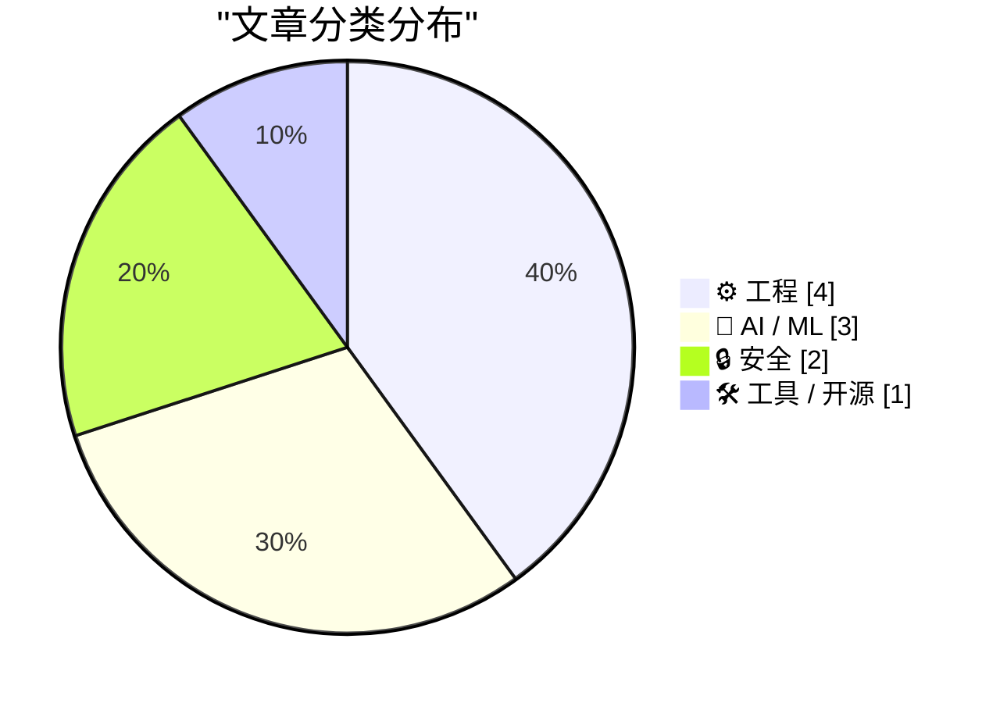
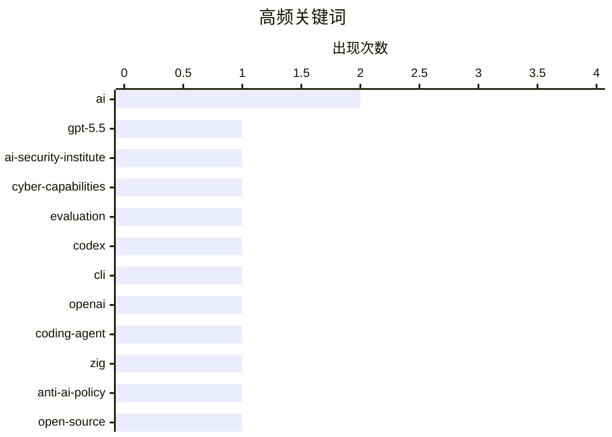

今日技术圈聚焦三大趋势：AI安全与伦理争议持续升温，OpenAI GPT-5.5网络能力评估引关注，同时Zig项目明确反对AI贡献代码，行业对AI生成代码质量与可信度的讨论也在深化；AI编程工具持续迭代，Codex CLI新增goal功能，反映开发者对AI辅助编程效率的更高期待；此外，英国NHS与开源的对抗、巴西ISP遭DDoS攻击等事件，也反映出技术实践与行业监管间的深层矛盾。

<!--more-->


> 来自 Karpathy 推荐的 92 个顶级技术博客，AI 精选 Top 10

## 🏆 今日必读

🥇 **Our evaluation of OpenAI's GPT-5.5 cyber capabilities**

[Our evaluation of OpenAI's GPT-5.5 cyber capabilities](https://simonwillison.net/2026/Apr/30/gpt-55-cyber-capabilities/#atom-everything) — simonwillison.net · 23 小时前 · 🔒 安全

> Our evaluation of OpenAI's GPT-5.5 cyber capabilities

🏷️ GPT-5.5, AI-Security-Institute, cyber-capabilities, evaluation

🥈 **Codex CLI 0.128.0 adds /goal**

[Codex CLI 0.128.0 adds /goal](https://simonwillison.net/2026/Apr/30/codex-goals/#atom-everything) — simonwillison.net · 22 小时前 · 🤖 AI / ML

> Codex CLI 0.128.0 adds /goal

🏷️ Codex, CLI, OpenAI, coding-agent

🥉 **The Zig project's rationale for their firm anti-AI contribution policy**

[The Zig project's rationale for their firm anti-AI contribution policy](https://simonwillison.net/2026/Apr/30/zig-anti-ai/#atom-everything) — simonwillison.net · 1 天前 · ⚙️ 工程

> The Zig project's rationale for their firm anti-AI contribution policy

🏷️ Zig, anti-AI-policy, open-source, contribution

---

## 📊 数据概览

| 扫描源 | 抓取文章 | 时间范围 | 精选 |
|:---:|:---:|:---:|:---:|
| 88/92 | 2537 篇 → 41 篇 | 48h | **10 篇** |

### 分类分布



### 高频关键词



<details>
<summary>📈 纯文本关键词图（终端友好）</summary>

```
ai                    │ ████████████████████ 2
gpt-5.5               │ ██████████░░░░░░░░░░ 1
ai-security-institute │ ██████████░░░░░░░░░░ 1
cyber-capabilities    │ ██████████░░░░░░░░░░ 1
evaluation            │ ██████████░░░░░░░░░░ 1
codex                 │ ██████████░░░░░░░░░░ 1
cli                   │ ██████████░░░░░░░░░░ 1
openai                │ ██████████░░░░░░░░░░ 1
coding-agent          │ ██████████░░░░░░░░░░ 1
zig                   │ ██████████░░░░░░░░░░ 1
```

</details>

### 🏷️ 话题标签

**ai**(2) · **gpt-5.5**(1) · **ai-security-institute**(1) · cyber-capabilities(1) · evaluation(1) · codex(1) · cli(1) · openai(1) · coding-agent(1) · zig(1) · anti-ai-policy(1) · open-source(1) · contribution(1) · llm(1) · sqlite(1) · bug-fix(1) · release(1) · ddos(1) · botnet(1) · brazil(1)

---

## ⚙️ 工程

### 1. The Zig project's rationale for their firm anti-AI contribution policy

[The Zig project's rationale for their firm anti-AI contribution policy](https://simonwillison.net/2026/Apr/30/zig-anti-ai/#atom-everything) — **simonwillison.net** · 1 天前 · ⭐ 24/30

> The Zig project's rationale for their firm anti-AI contribution policy

🏷️ Zig, anti-AI-policy, open-source, contribution

---

### 2. NHS Goes To War Against Open Source

[NHS Goes To War Against Open Source](https://shkspr.mobi/blog/2026/05/nhs-goes-to-war-against-open-source/) — **shkspr.mobi** · 10 小时前 · ⭐ 23/30

> NHS Goes To War Against Open Source

🏷️ NHS, Open Source, UK Government

---

### 3. Thoughts on WebAssembly as a stack machine

[Thoughts on WebAssembly as a stack machine](https://eli.thegreenplace.net/2026/thoughts-on-webassembly-as-a-stack-machine/) — **eli.thegreenplace.net** · 1 天前 · ⭐ 22/30

> Thoughts on WebAssembly as a stack machine

🏷️ WebAssembly, WASM, stack-machine

---

### 4. ★ On the Future of Apple’s Vision Platform

[★ On the Future of Apple’s Vision Platform](https://daringfireball.net/2026/04/on_the_future_of_apples_vision_platform) — **daringfireball.net** · 22 小时前 · ⭐ 21/30

> ★ On the Future of Apple’s Vision Platform

🏷️ Apple Vision, AR/VR, Platform

---

## 🤖 AI / ML

### 5. Codex CLI 0.128.0 adds /goal

[Codex CLI 0.128.0 adds /goal](https://simonwillison.net/2026/Apr/30/codex-goals/#atom-everything) — **simonwillison.net** · 22 小时前 · ⭐ 24/30

> Codex CLI 0.128.0 adds /goal

🏷️ Codex, CLI, OpenAI, coding-agent

---

### 6. “A model that produces code which compiles and passes the tests it was given is not the same as a model that produces correct, secure, maintainable, well-architected software”

[“A model that produces code which compiles and passes the tests it was given is not the same as a model that produces correct, secure, maintainable, well-architected software”](https://garymarcus.substack.com/p/a-model-that-produces-code-which) — **garymarcus.substack.com** · 2 小时前 · ⭐ 23/30

> “A model that produces code which compiles and passes the tests it was given is not the same as a model that produces correct, secure, maintainable, well-architected software”

🏷️ AI, code generation, software engineering

---

### 7. The greatest capital misallocation in history?

[The greatest capital misallocation in history?](https://garymarcus.substack.com/p/the-greatest-capital-misallocation) — **garymarcus.substack.com** · 1 天前 · ⭐ 22/30

> The greatest capital misallocation in history?

🏷️ AI, investment, capital allocation

---

## 🔒 安全

### 8. Our evaluation of OpenAI's GPT-5.5 cyber capabilities

[Our evaluation of OpenAI's GPT-5.5 cyber capabilities](https://simonwillison.net/2026/Apr/30/gpt-55-cyber-capabilities/#atom-everything) — **simonwillison.net** · 23 小时前 · ⭐ 25/30

> Our evaluation of OpenAI's GPT-5.5 cyber capabilities

🏷️ GPT-5.5, AI-Security-Institute, cyber-capabilities, evaluation

---

### 9. Anti-DDoS Firm Heaped Attacks on Brazilian ISPs

[Anti-DDoS Firm Heaped Attacks on Brazilian ISPs](https://krebsonsecurity.com/2026/04/anti-ddos-firm-heaped-attacks-on-brazilian-isps/) — **krebsonsecurity.com** · 1 天前 · ⭐ 23/30

> Anti-DDoS Firm Heaped Attacks on Brazilian ISPs

🏷️ DDoS, botnet, Brazil, cybersecurity

---

## 🛠 工具 / 开源

### 10. llm 0.32a1

[llm 0.32a1](https://simonwillison.net/2026/Apr/29/llm-3/#atom-everything) — **simonwillison.net** · 1 天前 · ⭐ 23/30

> llm 0.32a1

🏷️ llm, SQLite, bug-fix, release

---

*生成于 2026-05-02 22:18 | 扫描 88 源 → 获取 2537 篇 → 精选 10 篇*
*基于 [Hacker News Popularity Contest 2025](https://refactoringenglish.com/tools/hn-popularity/) RSS 源列表，由 [Andrej Karpathy](https://x.com/karpathy) 推荐*
*由「懂点儿AI」制作，欢迎关注同名微信公众号获取更多 AI 实用技巧 💡*
