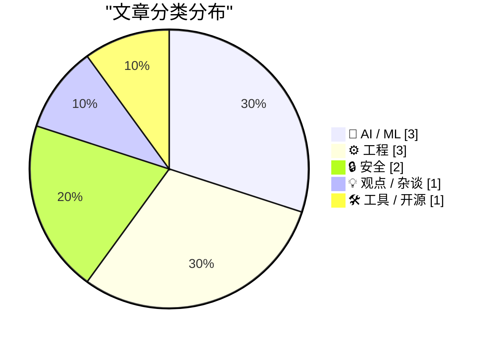
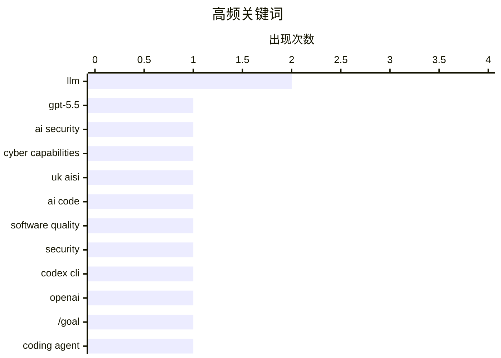

今日技术圈呈现三大趋势：一是AI安全与隐私治理持续引发关注，UK AI安全研究所评估GPT-5.5网络安全能力与Claude Mythos相当，同时Meta智能眼镜隐私丑闻曝光后公司已终止与肯尼亚承包商合同，暴露AI“自动化”背后的人工审查现实；二是AI代码质量与开发工具呈现分化态势——Codex CLI 0.128.0引入goal目标循环功能推动编程效率提升，但AI生成的能通过测试的代码并不等于高质量软件，安全性和可维护性仍是明显短板；三是企业开源策略出现调整信号，英国NHS计划关闭几乎所有开源仓库，与政府一贯的开源开放政策背道而驰。

<!--more-->


> 来自 Karpathy 推荐的 92 个顶级技术博客，AI 精选 Top 10

## 🏆 今日必读

🥇 **英国AI安全研究所评估OpenAI GPT-5.5网络安全能力**

[Our evaluation of OpenAI's GPT-5.5 cyber capabilities](https://simonwillison.net/2026/Apr/30/gpt-55-cyber-capabilities/#atom-everything) — simonwillison.net · 1 天前 · 🔒 安全

> UK AI Security Institute对OpenAI GPT-5.5查找安全漏洞的能力进行了评估。评估结果显示GPT-5.5在网络安全能力上与Anthropic的Claude Mythos相当。两者都能有效识别安全漏洞，但关键区别在于GPT-5.5目前已经公开发布，而Mythos仍处于预览阶段。这意味着开发者现在就可以使用GPT-5.5进行安全漏洞检测工作。

💡 **为什么值得读**: 对于关注AI安全研究的开发者和安全工程师，这篇提供了当前最强可用的AI漏洞检测工具的直接对比数据。

🏷️ GPT-5.5, AI security, cyber capabilities, UK AISI

🥈 **AI生成的能通过测试的代码不等于高质量软件**

[“A model that produces code which compiles and passes the tests it was given is not the same as a model that produces correct, secure, maintainable, well-architected software”](https://garymarcus.substack.com/p/a-model-that-produces-code-which) — garymarcus.substack.com · 1 天前 · 🤖 AI / ML

> Gary Marcus指出一个关键问题：能够编译并通过测试的代码，与正确、安全、可维护且架构良好的软件存在本质区别。当前大量代码由AI生成，但业界对这种代码质量的评估标准过于简化。AI编程工具擅长生成语法正确的代码，但在安全性、长期可维护性和架构设计方面存在明显短板。

💡 **为什么值得读**: 对于依赖AI辅助编程的开发者，这篇文章提供了反思AI代码质量边界的深刻视角。

🏷️ AI code, software quality, LLM, security

🥉 **Codex CLI 0.128.0引入/goal目标循环功能**

[Codex CLI 0.128.0 adds /goal](https://simonwillison.net/2026/Apr/30/codex-goals/#atom-everything) — simonwillison.net · 1 天前 · 🤖 AI / ML

> OpenAI Codex CLI 0.128.0版本新增了/goal功能，实现了类似Ralph loop的目标导向循环机制。用户可以通过/goal命令设定具体目标，Codex会自动持续执行并评估目标是否达成。该功能通过goals/continuation.md和goals/budget_limit.md两个提示模板实现，会在每轮结束时自动注入。如果目标未达成但token预算已耗尽，循环会自动终止。

💡 **为什么值得读**: 对于使用Codex CLI的开发者，新功能提供了更可控的自动化编程代理体验。

🏷️ Codex CLI, OpenAI, /goal, coding agent

---

## 📊 数据概览

| 扫描源 | 抓取文章 | 时间范围 | 精选 |
|:---:|:---:|:---:|:---:|
| 88/92 | 2537 篇 → 29 篇 | 48h | **10 篇** |

### 分类分布



### 高频关键词



<details>
<summary>📈 纯文本关键词图（终端友好）</summary>

```
llm                │ ████████████████████ 2
gpt-5.5            │ ██████████░░░░░░░░░░ 1
ai security        │ ██████████░░░░░░░░░░ 1
cyber capabilities │ ██████████░░░░░░░░░░ 1
uk aisi            │ ██████████░░░░░░░░░░ 1
ai code            │ ██████████░░░░░░░░░░ 1
software quality   │ ██████████░░░░░░░░░░ 1
security           │ ██████████░░░░░░░░░░ 1
codex cli          │ ██████████░░░░░░░░░░ 1
openai             │ ██████████░░░░░░░░░░ 1
```

</details>

### 🏷️ 话题标签

**llm**(2) · **gpt-5.5**(1) · **ai security**(1) · cyber capabilities(1) · uk aisi(1) · ai code(1) · software quality(1) · security(1) · codex cli(1) · openai(1) · /goal(1) · coding agent(1) · nhs(1) · open source(1) · uk government(1) · repositories(1) · reader/writer lock(1) · cross-process(1) · synchronization(1) · windows(1)

---

## 🤖 AI / ML

### 1. AI生成的能通过测试的代码不等于高质量软件

[“A model that produces code which compiles and passes the tests it was given is not the same as a model that produces correct, secure, maintainable, well-architected software”](https://garymarcus.substack.com/p/a-model-that-produces-code-which) — **garymarcus.substack.com** · 1 天前 · ⭐ 26/30

> Gary Marcus指出一个关键问题：能够编译并通过测试的代码，与正确、安全、可维护且架构良好的软件存在本质区别。当前大量代码由AI生成，但业界对这种代码质量的评估标准过于简化。AI编程工具擅长生成语法正确的代码，但在安全性、长期可维护性和架构设计方面存在明显短板。

🏷️ AI code, software quality, LLM, security

---

### 2. Codex CLI 0.128.0引入/goal目标循环功能

[Codex CLI 0.128.0 adds /goal](https://simonwillison.net/2026/Apr/30/codex-goals/#atom-everything) — **simonwillison.net** · 1 天前 · ⭐ 24/30

> OpenAI Codex CLI 0.128.0版本新增了/goal功能，实现了类似Ralph loop的目标导向循环机制。用户可以通过/goal命令设定具体目标，Codex会自动持续执行并评估目标是否达成。该功能通过goals/continuation.md和goals/budget_limit.md两个提示模板实现，会在每轮结束时自动注入。如果目标未达成但token预算已耗尽，循环会自动终止。

🏷️ Codex CLI, OpenAI, /goal, coding agent

---

### 3. 编辑AI辅助撰写的文章

[Editing my LLM assisted Articles](https://idiallo.com/byte-size/editing-llm-assisted-articles?src=feed) — **idiallo.com** · 19 小时前 · ⭐ 20/30

> 作者反思了使用AI辅助写作的问题：AI生成的文章与作者实际想表达的内容存在偏差，每次回读都会感到尴尬。作者开始重写这些AI辅助文章，目的是恢复自己的声音和真正想表达的思想。文章展示了从原始提示词到最终修改的完整过程，包括如何将AI生成的重写为自己风格。

🏷️ LLM, AI writing, editing, content

---

## ⚙️ 工程

### 4. 英国NHS计划关闭几乎所有开源仓库

[NHS Goes To War Against Open Source](https://shkspr.mobi/blog/2026/05/nhs-goes-to-war-against-open-source/) — **shkspr.mobi** · 1 天前 · ⭐ 22/30

> 英国国家医疗服务系统（NHS）正在准备关闭几乎所有的开源仓库。这是一个令人失望的转变，因为作者曾在政府多个部门（包括GDS、NHSX、i.AI）长期倡导开源理念，并编写了至今仍在使用的开源指导方针，向部长们简报开源的重要性。NHS的这一决定背离了英国政府一贯的开源开放政策。

🏷️ NHS, open source, UK government, repositories

---

### 5. 开发跨进程读写锁系列文章第四部分：放弃处理

[Developing a cross-process reader/writer lock with limited readers, part 4: Abandonment](https://devblogs.microsoft.com/oldnewthing/20260501-00/?p=112291) — **devblogs.microsoft.com/oldnewthing** · 1 天前 · ⭐ 22/30

> 这是Raymond Chen关于开发有限读者跨进程读写锁的系列文章的第四部分，主题是处理所有者放弃（abandonment）场景。当锁的所有者进程意外终止时，如何恢复锁的状态并保护读者/写者的正确性。Raymond Chen详细分析了这种情况下的恢复机制和实现策略。

🏷️ reader/writer lock, cross-process, synchronization, Windows

---

### 6. 论Apple Vision平台的未来

[★ On the Future of Apple’s Vision Platform](https://daringfireball.net/2026/04/on_the_future_of_apples_vision_platform) — **daringfireball.net** · 1 天前 · ⭐ 21/30

> 关于Apple Vision Pro平台的未来发展存在不确定性，但这种情况并非突然发生。如果Vision平台最终失败，也不会是一个毫无预兆的故事。MacRumors的报道可能并非最终定论，Apple仍在持续推进这一平台的开发。

🏷️ Apple Vision, AR/VR, platform, future

---

## 🔒 安全

### 7. 英国AI安全研究所评估OpenAI GPT-5.5网络安全能力

[Our evaluation of OpenAI's GPT-5.5 cyber capabilities](https://simonwillison.net/2026/Apr/30/gpt-55-cyber-capabilities/#atom-everything) — **simonwillison.net** · 1 天前 · ⭐ 27/30

> UK AI Security Institute对OpenAI GPT-5.5查找安全漏洞的能力进行了评估。评估结果显示GPT-5.5在网络安全能力上与Anthropic的Claude Mythos相当。两者都能有效识别安全漏洞，但关键区别在于GPT-5.5目前已经公开发布，而Mythos仍处于预览阶段。这意味着开发者现在就可以使用GPT-5.5进行安全漏洞检测工作。

🏷️ GPT-5.5, AI security, cyber capabilities, UK AISI

---

### 8. Meta解决肯尼亚承包商观看智能眼镜用户隐私视频问题

[Meta Solved Their Problem With Kenyan Contractors Seeing Footage of AI Glasses Wearers on the Toilet](https://www.bbc.com/news/articles/c5y7yvgy0w6o) — **daringfireball.net** · 1 天前 · ⭐ 21/30

> Meta此前被曝光其聘请的肯尼亚承包商Sama员工需要审查Meta智能眼镜拍摄的用户隐私视频，包括用户脱衣、性行为和如厕场景。两个月后，Meta已终止与该公司的合同。这一事件暴露了所谓"AI自动处理"背后往往存在真人审查的现实，也引发了公众对智能眼镜隐私保护机制的质疑。

🏷️ Meta, AI glasses, privacy, human review

---

## 💡 观点 / 杂谈

### 9. The Talk Show节目：Food and Beverage Director

[The Talk Show: ‘Food and Beverage Director’](https://daringfireball.net/thetalkshow/2026/04/30/ep-446) — **daringfireball.net** · 1 天前 · ⭐ 20/30

> MG Siegler重返播客节目，讨论Apple宣布Tim Cook将转任执行董事长、John Ternus将接任CEO的重大管理层变动。John Ternus此前负责Apple的产品工程工作，这次交接标志着Apple领导层的世代更替。

🏷️ Apple, Tim Cook, CEO transition, John Ternus

---

## 🛠 工具 / 开源

### 10. 使用TranslateGemma和Ollama实现离线命令行翻译

[Offline command line translation with TranslateGemma + Ollama](https://evanhahn.com/offline-cli-translation-with-translategemma-and-ollama/) — **evanhahn.com** · 1 天前 · ⭐ 19/30

> 作者编写了一个完全离线运行命令行翻译脚本，使用Echo传递西班牙语问题到TranslateGemma模型，模型返回英语翻译结果"How are you?"。该方案结合了Google的TranslateGemma（专门用于翻译的特殊用途语言模型）、Ollama（本地运行语言模型的工具）和Efficient Language Detector（语言检测库），实现了无需网络连接的命令行翻译功能。

🏷️ TranslateGemma, Ollama, offline, CLI

---

*生成于 2026-05-03 22:18 | 扫描 88 源 → 获取 2537 篇 → 精选 10 篇*
*基于 [Hacker News Popularity Contest 2025](https://refactoringenglish.com/tools/hn-popularity/) RSS 源列表，由 [Andrej Karpathy](https://x.com/karpathy) 推荐*
*由「懂点儿AI」制作，欢迎关注同名微信公众号获取更多 AI 实用技巧 💡*
