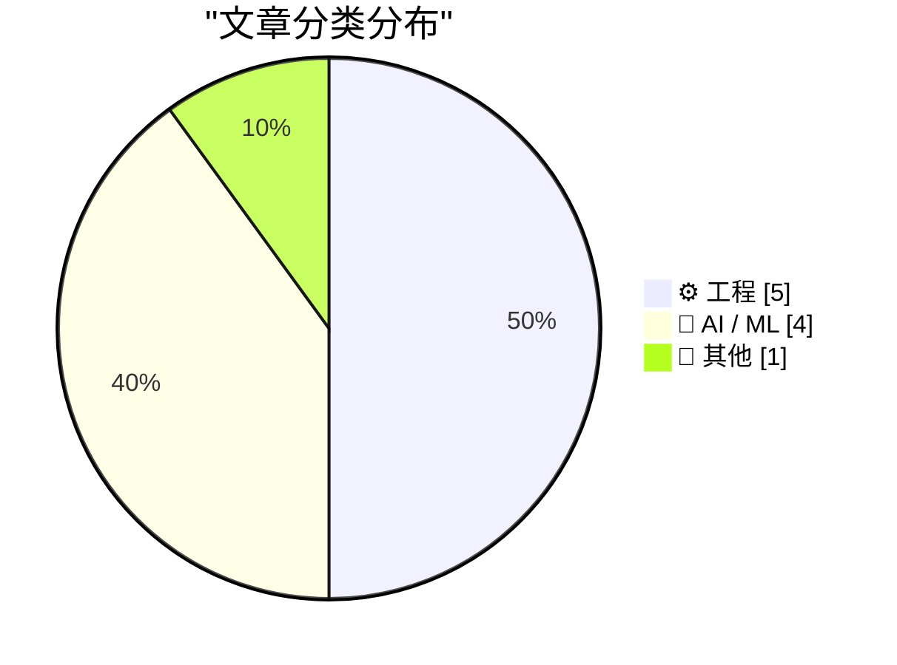
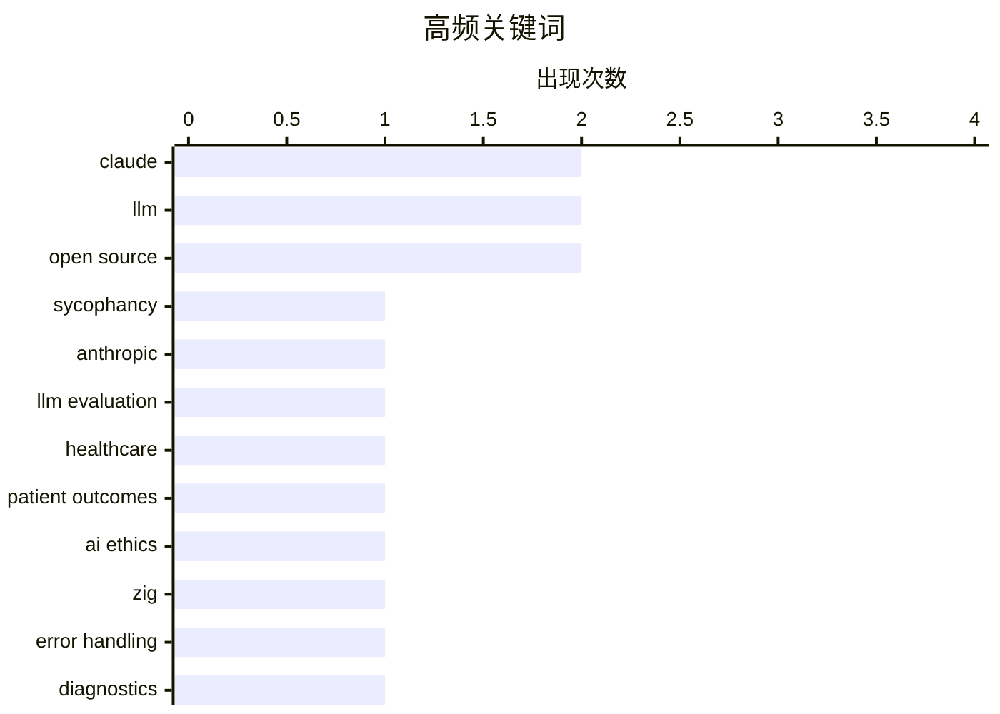

今日技术圈关注两大方向：一是AI/LLM的深度反思与应用复盘，从患者预后效果到AI辅助写作的实用性均有讨论，同时对大语言模型的局限性出现更多批判性思考；二是工程实践层面持续探索，涵盖Zig语言错误处理、调用图分析工具等技术细节，以及对工程师职业角色的反思。开源领域也有亮点，Microsoft开源86-DOS为历史软件保护提供新思路。

<!--more-->


> 来自 Karpathy 推荐的 92 个顶级技术博客，AI 精选 Top 10

## 🏆 今日必读

🥇 **Quoting Anthropic**

[Quoting Anthropic](https://simonwillison.net/2026/May/3/anthropic/#atom-everything) — simonwillison.net · 7 小时前 · 🤖 AI / ML

> Quoting Anthropic

🏷️ Claude, sycophancy, Anthropic, LLM evaluation

🥈 **Have LLMs improved patient outcomes?**

[Have LLMs improved patient outcomes?](https://garymarcus.substack.com/p/have-llms-improved-patient-outcomes) — garymarcus.substack.com · 2 小时前 · 🤖 AI / ML

> Have LLMs improved patient outcomes?

🏷️ LLM, healthcare, patient outcomes, AI ethics

🥉 **Minimal Viable Zig Error Contexts**

[Minimal Viable Zig Error Contexts](https://matklad.github.io/2026/05/03/zig-error-context.html) — matklad.github.io · 22 小时前 · ⚙️ 工程

> Minimal Viable Zig Error Contexts

🏷️ Zig, error handling, diagnostics

---

## 📊 数据概览

| 扫描源 | 抓取文章 | 时间范围 | 精选 |
|:---:|:---:|:---:|:---:|
| 88/92 | 2519 篇 → 22 篇 | 48h | **10 篇** |

### 分类分布



### 高频关键词



<details>
<summary>📈 纯文本关键词图（终端友好）</summary>

```
claude           │ ████████████████████ 2
llm              │ ████████████████████ 2
open source      │ ████████████████████ 2
sycophancy       │ ██████████░░░░░░░░░░ 1
anthropic        │ ██████████░░░░░░░░░░ 1
llm evaluation   │ ██████████░░░░░░░░░░ 1
healthcare       │ ██████████░░░░░░░░░░ 1
patient outcomes │ ██████████░░░░░░░░░░ 1
ai ethics        │ ██████████░░░░░░░░░░ 1
zig              │ ██████████░░░░░░░░░░ 1
```

</details>

### 🏷️ 话题标签

**claude**(2) · **llm**(2) · **open source**(2) · sycophancy(1) · anthropic(1) · llm evaluation(1) · healthcare(1) · patient outcomes(1) · ai ethics(1) · zig(1) · error handling(1) · diagnostics(1) · rust(1) · lints(1) · callgraph(1) · staff engineer(1) · career growth(1) · tech roles(1) · archetypes(1) · 86-dos(1)

---

## ⚙️ 工程

### 1. Minimal Viable Zig Error Contexts

[Minimal Viable Zig Error Contexts](https://matklad.github.io/2026/05/03/zig-error-context.html) — **matklad.github.io** · 22 小时前 · ⭐ 21/30

> Minimal Viable Zig Error Contexts

🏷️ Zig, error handling, diagnostics

---

### 2. callgraph analysis

[callgraph analysis](https://jyn.dev/callgraph-analysis/) — **jyn.dev** · 22 小时前 · ⭐ 21/30

> callgraph analysis

🏷️ Rust, lints, callgraph

---

### 3. Why I don't like the "staff engineer archetypes"

[Why I don't like the "staff engineer archetypes"](https://seangoedecke.com/staff-engineer-archetypes/) — **seangoedecke.com** · 22 小时前 · ⭐ 20/30

> Why I don't like the "staff engineer archetypes"

🏷️ staff engineer, career growth, tech roles, archetypes

---

### 4. Scaling, stretching and shifting sinusoids

[Scaling, stretching and shifting sinusoids](https://eli.thegreenplace.net/2026/scaling-stretching-and-shifting-sinusoids/) — **eli.thegreenplace.net** · 1 天前 · ⭐ 19/30

> Scaling, stretching and shifting sinusoids

🏷️ Math, Sinusoid, Signal Processing

---

### 5. A GitHub for maintainers

[A GitHub for maintainers](https://nesbitt.io/2026/05/02/a-github-for-maintainers.html) — **nesbitt.io** · 1 天前 · ⭐ 18/30

> A GitHub for maintainers

🏷️ open source, dependencies, maintenance

---

## 🤖 AI / ML

### 6. Quoting Anthropic

[Quoting Anthropic](https://simonwillison.net/2026/May/3/anthropic/#atom-everything) — **simonwillison.net** · 7 小时前 · ⭐ 25/30

> Quoting Anthropic

🏷️ Claude, sycophancy, Anthropic, LLM evaluation

---

### 7. Have LLMs improved patient outcomes?

[Have LLMs improved patient outcomes?](https://garymarcus.substack.com/p/have-llms-improved-patient-outcomes) — **garymarcus.substack.com** · 2 小时前 · ⭐ 21/30

> Have LLMs improved patient outcomes?

🏷️ LLM, healthcare, patient outcomes, AI ethics

---

### 8. Editing my LLM assisted Articles

[Editing my LLM assisted Articles](https://idiallo.com/byte-size/editing-llm-assisted-articles?src=feed) — **idiallo.com** · 1 天前 · ⭐ 19/30

> Editing my LLM assisted Articles

🏷️ LLM writing, AI assistance, content authenticity, personal voice

---

### 9. Richard Dawkins and The Claude Delusion

[Richard Dawkins and The Claude Delusion](https://garymarcus.substack.com/p/richard-dawkins-and-the-claude-delusion) — **garymarcus.substack.com** · 1 天前 · ⭐ 18/30

> Richard Dawkins and The Claude Delusion

🏷️ LLM, Claude, Richard Dawkins, skeptic

---

## 📝 其他

### 10. Microsoft’s open sourcing of 86-DOS and what it means

[Microsoft’s open sourcing of 86-DOS and what it means](https://dfarq.homeip.net/microsofts-open-sourcing-of-86-dos-and-what-it-means/?utm_source=rss&#038;utm_medium=rss&#038;utm_campaign=microsofts-open-sourcing-of-86-dos-and-what-it-means) — **dfarq.homeip.net** · 4 小时前 · ⭐ 20/30

> Microsoft’s open sourcing of 86-DOS and what it means

🏷️ 86-DOS, Microsoft, open source

---

*生成于 2026-05-04 22:18 | 扫描 88 源 → 获取 2519 篇 → 精选 10 篇*
*基于 [Hacker News Popularity Contest 2025](https://refactoringenglish.com/tools/hn-popularity/) RSS 源列表，由 [Andrej Karpathy](https://x.com/karpathy) 推荐*
*由「懂点儿AI」制作，欢迎关注同名微信公众号获取更多 AI 实用技巧 💡*
