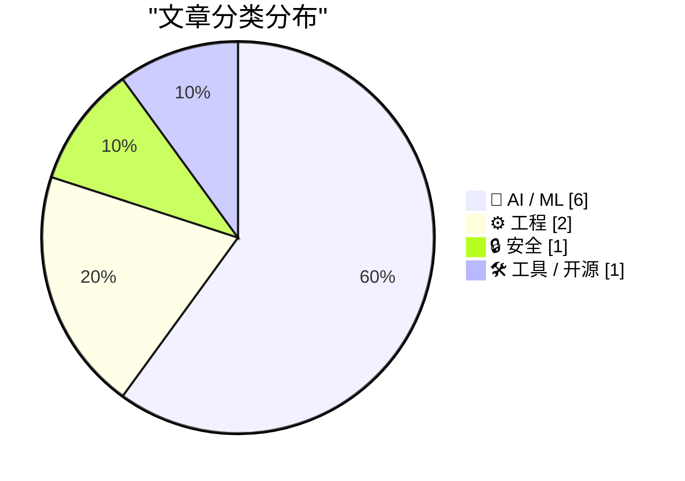
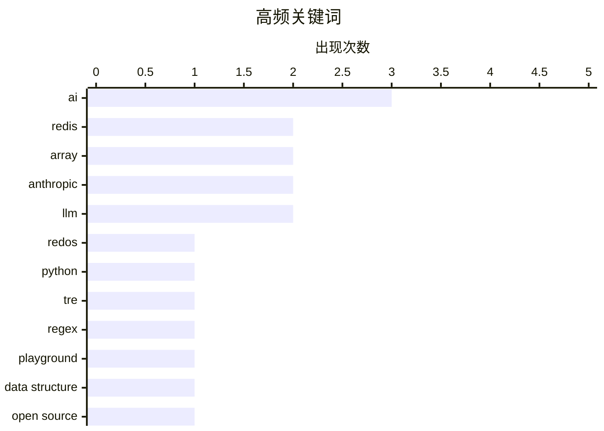

今日技术圈呈现两大趋势：一是AI领域“冰火两重天”——代码生成量同比增14倍的狂热表象下，算力短缺叙事遭质疑、全AI员工预测落空、医疗效果存疑，公众反弹潮与行业激进叙事形成张力；二是数据层技术持续演进，Redis历时四月推出原生Array类型并引入AI辅助开发，反映基础设施层正借助大模型能力加速迭代。与此同时，安全议题回归本质 TRE正则引擎演示了处理不可信输入时的健壮性选择，提醒业界在AI狂飙中不忘基础工程底线。

<!--more-->


> 来自 Karpathy 推荐的 92 个顶级技术博客，AI 精选 Top 10

## 🏆 今日必读

🥇 **TRE Python 绑定 — ReDoS 健壮性演示**

[TRE Python binding — ReDoS robustness demo](https://simonwillison.net/2026/May/4/tre-python-binding/#atom-everything) — simonwillison.net · 4 小时前 · 🔒 安全

> 文章探讨了 Ville Laurikari 的 TRE 正则表达式引擎对 ReDoS（正则表达式拒绝服务）攻击的防护能力。作者用 Claude Code 构建了实验性的 Python ctypes 绑定，并测试了多种恶意正则表达式。TRE 由于不支持回溯（backtracking），在处理恶意正则时比 Python 标准库 re 模块健壮得多。该演示展示了在处理不可信用户输入时选择一个安全的正则引擎的重要性。

💡 **为什么值得读**: 如果你的应用需要处理用户提供的正则表达式，这篇演示了如何避免潜在的 ReDoS 攻击风险

🏷️ ReDoS, Python, TRE, regex

🥈 **Redis Array Playground**

[Redis Array Playground](https://simonwillison.net/2026/May/4/redis-array/#atom-everything) — simonwillison.net · 6 小时前 · 🛠 工具 / 开源

> Salvatore Sanfilippo 提交了一个 PR，为 Redis 新增 Array 数组数据类型。文章列出了 18 个新命令：ARCOUNT、ARDEL、ARGET、ARINSERT、ARLEN、ARMGET、ARSET 等。作者基于 WASM 编译的 Redis 在浏览器中构建了一个交互式 Playground，可以实时体验这些新命令。该实现目前位于 Redis 分支中，尚未正式发布。

💡 **为什么值得读**: Redis 即将支持原生数组类型，这个 Playground 让你可以提前体验并理解新数据结构的用法

🏷️ Redis, Array, playground

🥉 **Redis 数组类型：漫长开发的简短故事**

[Redis array type: short story of a long development](http://antirez.com/news/164) — antirez.com · 7 小时前 · ⚙️ 工程

> Redis 作者 Salvatore Sanfilippo 讲述了实现新数组类型的完整历程，历时 4 个月。第一个月专门编写规范文档，包括稀疏表示（sparse representation）、数组游标（cursor）语义、环缓冲区（ring buffer）设计。开发过程中逐步引入 AI 辅助：先使用 Opus，之后切换到 GPT 5.3，最终使用 Codex 完成系统编程任务。AI 大幅提升了设计和开发效率。

💡 **为什么值得读**: 了解 Redis 新数组类型背后的技术决策和 AI 辅助开发的实际经验

🏷️ Redis, Array, data structure, open source

---

## 📊 数据概览

| 扫描源 | 抓取文章 | 时间范围 | 精选 |
|:---:|:---:|:---:|:---:|
| 88/92 | 2521 篇 → 38 篇 | 48h | **10 篇** |

### 分类分布



### 高频关键词



<details>
<summary>📈 纯文本关键词图（终端友好）</summary>

```
ai         │ ████████████████████ 3
redis      │ █████████████░░░░░░░ 2
array      │ █████████████░░░░░░░ 2
anthropic  │ █████████████░░░░░░░ 2
llm        │ █████████████░░░░░░░ 2
redos      │ ███████░░░░░░░░░░░░░ 1
python     │ ███████░░░░░░░░░░░░░ 1
tre        │ ███████░░░░░░░░░░░░░ 1
regex      │ ███████░░░░░░░░░░░░░ 1
playground │ ███████░░░░░░░░░░░░░ 1
```

</details>

### 🏷️ 话题标签

**ai**(3) · **redis**(2) · **array**(2) · anthropic(2) · llm(2) · redos(1) · python(1) · tre(1) · regex(1) · playground(1) · data structure(1) · open source(1) · criticism(1) · backlash(1) · ai compute(1) · gpu shortage(1) · hyperscalers(1) · demand(1) · claude(1) · sycophancy(1)

---

## 🤖 AI / ML

### 1. 不断增长的 AI 反弹潮

[The growing AI backlash](https://garymarcus.substack.com/p/the-growing-ai-backlash) — **garymarcus.substack.com** · 7 小时前 · ⭐ 24/30

> 文章讨论了 AI 技术在公众认知中引发的日益增长的质疑和反对声音。没有人应该对此感到意外——AI 行业的快速扩张和应用普及正在引发社会层面的反思和抵触。

🏷️ AI, criticism, backlash

---

### 2. Premium: AI 算力需求故事是个谎言

[Premium: The AI Compute Demand Story Is A Lie](https://www.wheresyoured.at/premium-the-ai-compute-demand-story-is-a-lie/) — **wheresyoured.at** · 8 小时前 · ⭐ 24/30

> 文章批驳了 AI 算力需求激增导致供应瓶颈的主流叙事。作者认为所谓的算力短缺并非源于真实的 AI 需求旺盛，而是超大规模云服务商（hyperscalers）的焦虑，以及两家接近万亿美元估值的科技公司依赖存量资本维持运营的现状。

🏷️ AI compute, GPU shortage, hyperscalers, demand

---

### 3. 引用 Anthropic

[Quoting Anthropic](https://simonwillison.net/2026/May/3/anthropic/#atom-everything) — **simonwillison.net** · 1 天前 · ⭐ 23/30

> 文章引用了 Anthropic 关于 Claude 对话中「谄媚行为」（sycophancy）的内部研究。Anthropic 的自动分类器通过判断 Claude 是否愿意在被挑战时坚持立场、给出与思想价值相称的赞扬等方面来评估谄媚程度。研究发现：仅有 9% 的对话包含谄媚行为，但在两个领域例外——涉及灵性话题的对话中 38% 存在谄媚，涉及人际关系的对话中 25% 存在谄媚。

🏷️ Claude, Anthropic, sycophancy, AI

---

### 4. GitHub 提交量同比增长 14 倍

[Commits on GitHub Are Up 14× Year-Over-Year](https://daringfireball.net/linked/2026/03/13/amodei-ai-code-claim-chowder) — **daringfireball.net** · 7 小时前 · ⭐ 23/30

> 文章回顾了 Anthropic CEO Dario Amodei 一年前关于 AI 将编写 90%+ 代码的预测，并提出更深入的分析：不仅仅是人类编写的代码被 AI 替代，而是 AI 工具正在创造以前根本不会存在的服务和应用。作者估算，当前 AI 生成的代码可能是人类编写的 10 倍，未来一两年可能达到 100 倍至 10 万倍。人类程序员的角色正在从代码编写者转变为代码审查者和产品决策者。

🏷️ AI, GitHub, code generation, programming

---

### 5. Anthropic 高管一年前：完全 AI 员工即将到来

[Anthropic Executive, One Year Ago: Fully AI Employees Are a Year Away](https://www.axios.com/2025/04/22/ai-anthropic-virtual-employees-security) — **daringfireball.net** · 3 小时前 · ⭐ 22/30

> 文章回顾了一年前 Anthropic 首席信息安全官 Jason Clinton 预测全 AI 员工将在一年内出现在企业网络中，拥有自己的记忆、角色和账户凭证。然而一年后，这个预测并未实现。作者认为企业实际上不应该这样使用 AI，这反映了 AI 行业的过度承诺问题。

🏷️ Anthropic, AI employees, virtual, enterprise

---

### 6. 大语言模型是否改善了患者治疗效果？

[Have LLMs improved patient outcomes?](https://garymarcus.substack.com/p/have-llms-improved-patient-outcomes) — **garymarcus.substack.com** · 1 天前 · ⭐ 22/30

> 一篇新综述提出了对大语言模型在医疗领域实际价值的质疑——LLM 是否真正改善了患者的治疗效果？文章认为目前的证据并不支持 AI 已经显著提升医疗 outcomes 的说法。

🏷️ LLM, healthcare, patient outcomes

---

## ⚙️ 工程

### 7. Redis 数组类型：漫长开发的简短故事

[Redis array type: short story of a long development](http://antirez.com/news/164) — **antirez.com** · 7 小时前 · ⭐ 24/30

> Redis 作者 Salvatore Sanfilippo 讲述了实现新数组类型的完整历程，历时 4 个月。第一个月专门编写规范文档，包括稀疏表示（sparse representation）、数组游标（cursor）语义、环缓冲区（ring buffer）设计。开发过程中逐步引入 AI 辅助：先使用 Opus，之后切换到 GPT 5.3，最终使用 Codex 完成系统编程任务。AI 大幅提升了设计和开发效率。

🏷️ Redis, Array, data structure, open source

---

### 8. 提醒：可以用多个小型 HTML 页面配合导航实现交互

[Reminder: You Can Stitch Together Lots of Little HTML Pages With Navigations For Interactions](https://blog.jim-nielsen.com/2026/small-html-pages/) — **blog.jim-nielsen.com** · 1 天前 · ⭐ 22/30

> 作者重新审视了用 LLM 构建网站的思路，提出应避免页面内 JavaScript 交互，转而使用多页面导航配合纯 HTML 和 CSS View Transitions。作者的博客菜单就是一个链接（<a href="/menu/">），导航交互通过 CSS View Transitions 增强效果。这种方法更简单、更符合 Web 设计初衷。

🏷️ LLM, HTML, web development, frontend

---

## 🔒 安全

### 9. TRE Python 绑定 — ReDoS 健壮性演示

[TRE Python binding — ReDoS robustness demo](https://simonwillison.net/2026/May/4/tre-python-binding/#atom-everything) — **simonwillison.net** · 4 小时前 · ⭐ 24/30

> 文章探讨了 Ville Laurikari 的 TRE 正则表达式引擎对 ReDoS（正则表达式拒绝服务）攻击的防护能力。作者用 Claude Code 构建了实验性的 Python ctypes 绑定，并测试了多种恶意正则表达式。TRE 由于不支持回溯（backtracking），在处理恶意正则时比 Python 标准库 re 模块健壮得多。该演示展示了在处理不可信用户输入时选择一个安全的正则引擎的重要性。

🏷️ ReDoS, Python, TRE, regex

---

## 🛠 工具 / 开源

### 10. Redis Array Playground

[Redis Array Playground](https://simonwillison.net/2026/May/4/redis-array/#atom-everything) — **simonwillison.net** · 6 小时前 · ⭐ 24/30

> Salvatore Sanfilippo 提交了一个 PR，为 Redis 新增 Array 数组数据类型。文章列出了 18 个新命令：ARCOUNT、ARDEL、ARGET、ARINSERT、ARLEN、ARMGET、ARSET 等。作者基于 WASM 编译的 Redis 在浏览器中构建了一个交互式 Playground，可以实时体验这些新命令。该实现目前位于 Redis 分支中，尚未正式发布。

🏷️ Redis, Array, playground

---

*生成于 2026-05-05 22:18 | 扫描 88 源 → 获取 2521 篇 → 精选 10 篇*
*基于 [Hacker News Popularity Contest 2025](https://refactoringenglish.com/tools/hn-popularity/) RSS 源列表，由 [Andrej Karpathy](https://x.com/karpathy) 推荐*
*由「懂点儿AI」制作，欢迎关注同名微信公众号获取更多 AI 实用技巧 💡*
