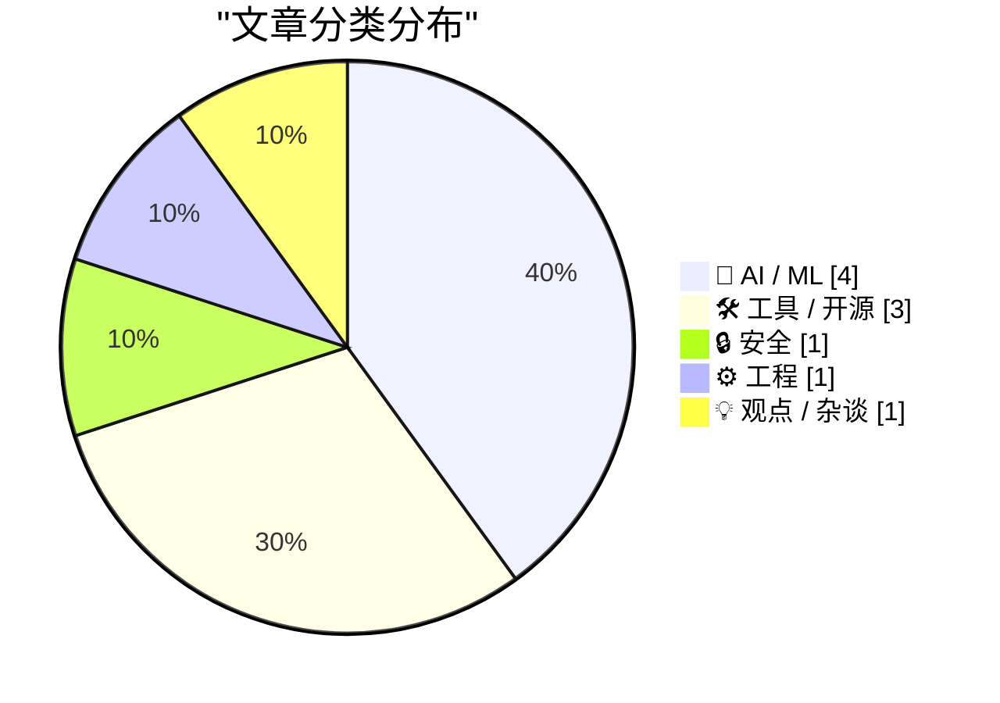
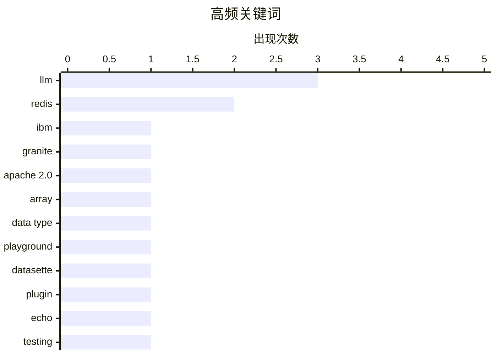

今日技术圈聚焦三大方向：AI模型层面，IBM发布Granite 4.1系列开源大模型，提供3B到30B多种参数规模，方便本地部署量化版本；开源工具层面，Redis历经四个月开发推出全新Array数据类型，整合19个新命令并支持稀疏表示和环缓冲特性，同时配套WASM浏览器游乐场提升开发者体验。争议与反思层面，AI算力短缺被指存在利益驱动下的夸大成分，Y Combinator与OpenAI的潜在利益关联引发透明度质疑，而Cursor数据库误删事件则暴露出AI agent安全设计的深层隐患，责任更多在于架构设计缺陷而非AI本身。

<!--more-->


> 来自 Karpathy 推荐的 92 个顶级技术博客，AI 精选 Top 10

## 🏆 今日必读

🥇 **Granite 4.1 3B 模型 SVG 鹈鹕骑自行车测试**

[Granite 4.1 3B SVG Pelican Gallery](https://simonwillison.net/2026/May/4/granite-41-3b-svg-pelican-gallery/#atom-everything) — simonwillison.net · 22 小时前 · 🤖 AI / ML

> IBM 发布了 Granite 4.1 系列大语言模型，包含 3B、8B 和 30B 三种参数规模，采用 Apache 2.0 开源许可证。Unsloth 随后发布了 21 个 GGUF 量化版本，文件大小从 1.2GB 到 6.34GB 不等，总计 51.3GB。作者通过向不同量化版本的 3B 模型输入「生成一张鹈鹕骑自行车的 SVG」提示词进行实验，观察模型规模对输出质量的影响。

💡 **为什么值得读**: 展示了大模型量化后在不同参数规模下的实际表现差异，是有趣的 LLM 玩法演示。

🏷️ IBM, Granite, LLM, Apache 2.0

🥈 **Redis Array 类型的交互式游乐场**

[Redis Array Playground](https://simonwillison.net/2026/May/4/redis-array/#atom-everything) — simonwillison.net · 1 天前 · 🛠 工具 / 开源

> Redis 正在开发新的 Array（数组）数据类型，包含 ARCOUNT、ARDEL、ARGET、ARINSERT、ARLEN 等 19 个新命令，支持稀疏表示、环缓冲区和游标等特性。Salvatore Sanfilippo 提交了 PR，作者基于 WASM 在浏览器中构建了一个可在本地运行的 Redis  Playground，方便开发者提前体验和测试新命令。

💡 **为什么值得读**: 如果你关心 Redis 新特性的演进，这是首个可交互体验 Array 类型的方式。

🏷️ Redis, array, data type, playground

🥉 **datasette-llm 0.1a7 发布：支持配置模型默认选项**

[datasette-llm 0.1a7](https://simonwillison.net/2026/May/5/datasette-llm/#atom-everything) — simonwillison.net · 20 小时前 · 🛠 工具 / 开源

> Datasette 插件 datasette-llm 发布 0.1a7 版本，新增可针对特定模型配置默认选项的机制。例如可设置所有 enrichment 操作默认使用某个模型，并将 temperature 设为 0.5。

💡 **为什么值得读**: 简化了 Datasette 插件使用 LLM 时的配置流程，适合需要管理多个模型的用户。

🏷️ datasette, LLM, plugin

---

## 📊 数据概览

| 扫描源 | 抓取文章 | 时间范围 | 精选 |
|:---:|:---:|:---:|:---:|
| 88/92 | 2522 篇 → 49 篇 | 48h | **10 篇** |

### 分类分布



### 高频关键词



<details>
<summary>📈 纯文本关键词图（终端友好）</summary>

```
llm        │ ████████████████████ 3
redis      │ █████████████░░░░░░░ 2
ibm        │ ███████░░░░░░░░░░░░░ 1
granite    │ ███████░░░░░░░░░░░░░ 1
apache 2.0 │ ███████░░░░░░░░░░░░░ 1
array      │ ███████░░░░░░░░░░░░░ 1
data type  │ ███████░░░░░░░░░░░░░ 1
playground │ ███████░░░░░░░░░░░░░ 1
datasette  │ ███████░░░░░░░░░░░░░ 1
plugin     │ ███████░░░░░░░░░░░░░ 1
```

</details>

### 🏷️ 话题标签

**llm**(3) · **redis**(2) · **ibm**(1) · granite(1) · apache 2.0(1) · array(1) · data type(1) · playground(1) · datasette(1) · plugin(1) · echo(1) · testing(1) · ai agent(1) · database(1) · cursor(1) · array type(1) · data structure(1) · ai backlash(1) · generative ai(1) · industry(1)

---

## 🤖 AI / ML

### 1. Granite 4.1 3B 模型 SVG 鹈鹕骑自行车测试

[Granite 4.1 3B SVG Pelican Gallery](https://simonwillison.net/2026/May/4/granite-41-3b-svg-pelican-gallery/#atom-everything) — **simonwillison.net** · 22 小时前 · ⭐ 26/30

> IBM 发布了 Granite 4.1 系列大语言模型，包含 3B、8B 和 30B 三种参数规模，采用 Apache 2.0 开源许可证。Unsloth 随后发布了 21 个 GGUF 量化版本，文件大小从 1.2GB 到 6.34GB 不等，总计 51.3GB。作者通过向不同量化版本的 3B 模型输入「生成一张鹈鹕骑自行车的 SVG」提示词进行实验，观察模型规模对输出质量的影响。

🏷️ IBM, Granite, LLM, Apache 2.0

---

### 2. 日益增长的 AI 反感浪潮

[The growing AI backlash](https://garymarcus.substack.com/p/the-growing-ai-backlash) — **garymarcus.substack.com** · 1 天前 · ⭐ 22/30

> Gary Marcus 撰文分析当前日益增长的 AI  backlash（反对浪潮），认为这是意料之中的必然反应。

🏷️ AI backlash, generative AI, industry, criticism

---

### 3. AI 算力需求故事是个谎言

[Premium: The AI Compute Demand Story Is A Lie](https://www.wheresyoured.at/premium-the-ai-compute-demand-story-is-a-lie/) — **wheresyoured.at** · 1 天前 · ⭐ 22/30

> 作者认为业界所谓的 AI 算力短缺并非源于真实需求，而是大型云服务商（hyperscalers）的焦虑以及两家准万亿美元公司依赖政府补贴生存的结果。

🏷️ AI compute, demand, hyperscalers, capacity

---

### 4. Y Combinator 在 OpenAI 的利益关联

[★ Y Combinator’s Stake in OpenAI](https://daringfireball.net/2026/05/y_combinators_stake_in_openai) — **daringfireball.net** · 23 小时前 · ⭐ 21/30

> Paul Graham 个人在 OpenAI 拥有数十亿美元的利益，但在公开场合为 Sam Altman 的诚信和领导力背书时并未披露这一关联。作者认为这存在潜在的利益冲突问题。

🏷️ Y Combinator, OpenAI, Sam Altman, Paul Graham

---

## 🛠 工具 / 开源

### 5. Redis Array 类型的交互式游乐场

[Redis Array Playground](https://simonwillison.net/2026/May/4/redis-array/#atom-everything) — **simonwillison.net** · 1 天前 · ⭐ 25/30

> Redis 正在开发新的 Array（数组）数据类型，包含 ARCOUNT、ARDEL、ARGET、ARINSERT、ARLEN 等 19 个新命令，支持稀疏表示、环缓冲区和游标等特性。Salvatore Sanfilippo 提交了 PR，作者基于 WASM 在浏览器中构建了一个可在本地运行的 Redis  Playground，方便开发者提前体验和测试新命令。

🏷️ Redis, array, data type, playground

---

### 6. datasette-llm 0.1a7 发布：支持配置模型默认选项

[datasette-llm 0.1a7](https://simonwillison.net/2026/May/5/datasette-llm/#atom-everything) — **simonwillison.net** · 20 小时前 · ⭐ 24/30

> Datasette 插件 datasette-llm 发布 0.1a7 版本，新增可针对特定模型配置默认选项的机制。例如可设置所有 enrichment 操作默认使用某个模型，并将 temperature 设为 0.5。

🏷️ datasette, LLM, plugin

---

### 7. llm-echo 0.5a0 发布：支持 thinking 参数模拟

[llm-echo 0.5a0](https://simonwillison.net/2026/May/5/llm-echo/#atom-everything) — **simonwillison.net** · 20 小时前 · ⭐ 24/30

> llm-echo 插件发布 0.5a0 版本，新增 `-o thinking 1` 选项以支持 LLM 0.32a0 及更高版本的 reasoning block 模拟。该插件提供一个名为「echo」的虚拟模型，不运行真实 LLM，仅将输入反弹为 JSON 输出，非常适合自动化测试。

🏷️ LLM, echo, testing

---

## 🔒 安全

### 8. AI 没有删除你的数据库，是你自己的错

[AI didn't delete your database, you did](https://idiallo.com/blog/ai-didnt-delete-your-database-you-did?src=feed) — **idiallo.com** · 23 小时前 · ⭐ 24/30

> 近日有开发者发帖称 Cursor/Claude agent 删除了其生产数据库，引发热议。作者认为真正的问题在于该公司竟然暴露了一个可删除整个生产数据库的 API 端点，这是架构设计缺陷而非 AI 的过错。责任应归咎于允许危险操作暴露给 AI agent 的团队，而非工具本身。

🏷️ AI agent, database, Cursor

---

## ⚙️ 工程

### 9. Redis Array 类型：四个月开发的故事

[Redis array type: short story of a long development](http://antirez.com/news/164) — **antirez.com** · 1 天前 · ⭐ 23/30

> Redis 作者 Salvatore Sanfilippo 分享了 Array 数据类型的开发历程，历时四个月（兼职开发）。期间使用了 AI 辅助工具：先用 Opus 设计规范，后切换到 GPT 5.3 进行架构开发，最终使用 Codex 完成系统编程任务。AI 极大地加速了规范迭代和代码实现的效率。

🏷️ Redis, Array type, data structure

---

## 💡 观点 / 杂谈

### 10. Photoshop 的「现代界面」很糟糕

[Photoshop’s ‘Modern User Interface’ Sucks (and Doesn’t Feel Modern)](https://unsung.aresluna.org/photoshops-challenges-with-focus-pt-2/) — **daringfireball.net** · 1 天前 · ⭐ 21/30

> 长期使用 Photoshop 的用户指出，新版界面移除诸多好用的功能，导致软件体验不稳定且日益恶化。这些问题本是可以解决的老问题，并非什么难以破解的设计难题。

🏷️ Photoshop, UI/UX, Adobe, user experience

---

*生成于 2026-05-06 22:18 | 扫描 88 源 → 获取 2522 篇 → 精选 10 篇*
*基于 [Hacker News Popularity Contest 2025](https://refactoringenglish.com/tools/hn-popularity/) RSS 源列表，由 [Andrej Karpathy](https://x.com/karpathy) 推荐*
*由「懂点儿AI」制作，欢迎关注同名微信公众号获取更多 AI 实用技巧 💡*
