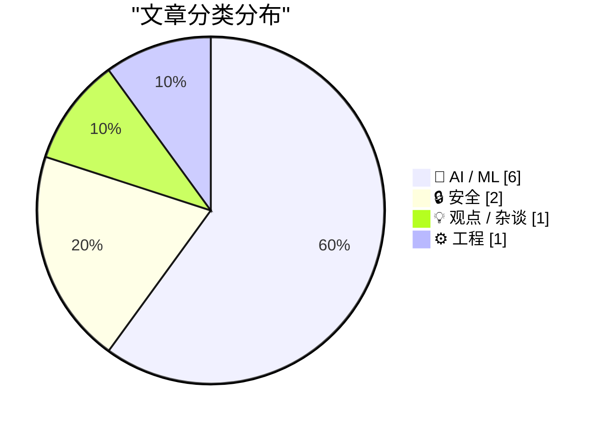
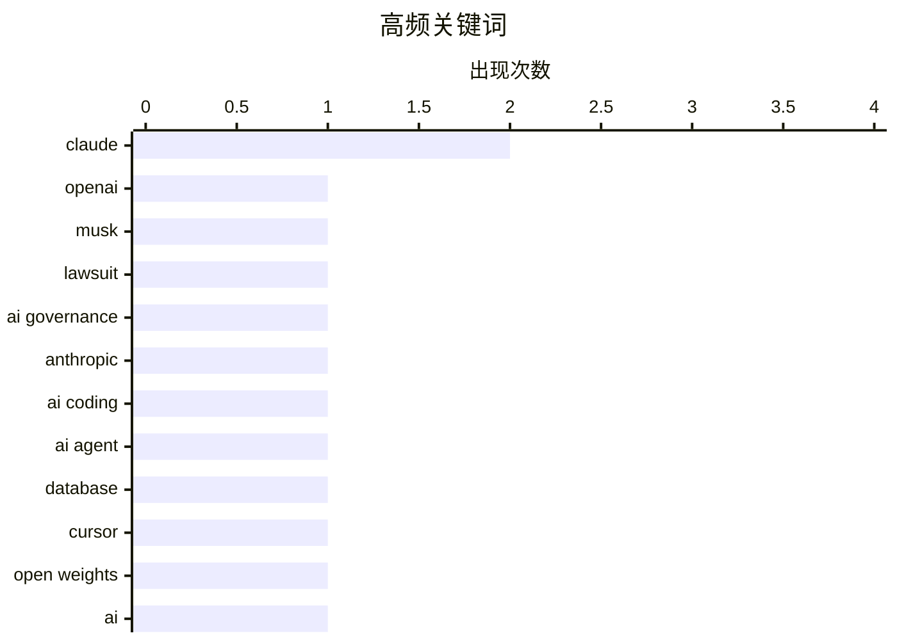

今日技术圈聚焦三大趋势：AI安全与治理问题持续发酵，从_open weights逐渐封闭到自主Agent被质疑为"混乱"，反映出行业对AI失控风险的深层担忧；与此同时，AI编程工具加速演进，Claude等AI伴侣正向开发流程深度渗透，vibe coding与agentic工程化路径的争论浮出水面；法律层面，马斯克起诉OpenAI一案也将其商业化路径与开源承诺的矛盾推至台前。

<!--more-->


> 来自 Karpathy 推荐的 92 个顶级技术博客，AI 精选 Top 10

## 🏆 今日必读

🥇 **What matters (or should matter), at the Musk-OpenAI trial**

[What matters (or should matter), at the Musk-OpenAI trial](https://garymarcus.substack.com/p/what-matters-or-should-matter-at) — garymarcus.substack.com · 1 天前 · 🤖 AI / ML

> What matters (or should matter), at the Musk-OpenAI trial

🏷️ OpenAI, Musk, lawsuit, AI governance

🥈 **Live blog: Code w/ Claude 2026**

[Live blog: Code w/ Claude 2026](https://simonwillison.net/2026/May/6/code-w-claude-2026/#atom-everything) — simonwillison.net · 6 小时前 · 🤖 AI / ML

> Live blog: Code w/ Claude 2026

🏷️ Claude, Anthropic, AI coding

🥉 **AI didn't delete your database, you did**

[AI didn't delete your database, you did](https://idiallo.com/blog/ai-didnt-delete-your-database-you-did?src=feed) — idiallo.com · 1 天前 · 🔒 安全

> AI didn't delete your database, you did

🏷️ AI agent, database, Cursor, Claude

---

## 📊 数据概览

| 扫描源 | 抓取文章 | 时间范围 | 精选 |
|:---:|:---:|:---:|:---:|
| 88/92 | 2523 篇 → 48 篇 | 48h | **10 篇** |

### 分类分布



### 高频关键词



<details>
<summary>📈 纯文本关键词图（终端友好）</summary>

```
claude        │ ████████████████████ 2
openai        │ ██████████░░░░░░░░░░ 1
musk          │ ██████████░░░░░░░░░░ 1
lawsuit       │ ██████████░░░░░░░░░░ 1
ai governance │ ██████████░░░░░░░░░░ 1
anthropic     │ ██████████░░░░░░░░░░ 1
ai coding     │ ██████████░░░░░░░░░░ 1
ai agent      │ ██████████░░░░░░░░░░ 1
database      │ ██████████░░░░░░░░░░ 1
cursor        │ ██████████░░░░░░░░░░ 1
```

</details>

### 🏷️ 话题标签

**claude**(2) · **openai**(1) · **musk**(1) · lawsuit(1) · ai governance(1) · anthropic(1) · ai coding(1) · ai agent(1) · database(1) · cursor(1) · open weights(1) · ai(1) · frontier labs(1) · vibe coding(1) · agentic engineering(1) · ai tools(1) · ibm(1) · granite(1) · llm(1) · package manager(1)

---

## 🤖 AI / ML

### 1. What matters (or should matter), at the Musk-OpenAI trial

[What matters (or should matter), at the Musk-OpenAI trial](https://garymarcus.substack.com/p/what-matters-or-should-matter-at) — **garymarcus.substack.com** · 1 天前 · ⭐ 25/30

> What matters (or should matter), at the Musk-OpenAI trial

🏷️ OpenAI, Musk, lawsuit, AI governance

---

### 2. Live blog: Code w/ Claude 2026

[Live blog: Code w/ Claude 2026](https://simonwillison.net/2026/May/6/code-w-claude-2026/#atom-everything) — **simonwillison.net** · 6 小时前 · ⭐ 24/30

> Live blog: Code w/ Claude 2026

🏷️ Claude, Anthropic, AI coding

---

### 3. Open weights are quietly closing up - and that's a problem

[Open weights are quietly closing up - and that's a problem](https://martinalderson.com/posts/open-weights-are-quietly-closing-up/?utm_source=rss&amp;utm_medium=rss&amp;utm_campaign=feed) — **martinalderson.com** · 22 小时前 · ⭐ 24/30

> Open weights are quietly closing up - and that's a problem

🏷️ open weights, AI, frontier labs

---

### 4. Vibe coding and agentic engineering are getting closer than I'd like

[Vibe coding and agentic engineering are getting closer than I'd like](https://simonwillison.net/2026/May/6/vibe-coding-and-agentic-engineering/#atom-everything) — **simonwillison.net** · 7 小时前 · ⭐ 23/30

> Vibe coding and agentic engineering are getting closer than I'd like

🏷️ vibe coding, agentic engineering, AI tools

---

### 5. Granite 4.1 3B SVG Pelican Gallery

[Granite 4.1 3B SVG Pelican Gallery](https://simonwillison.net/2026/May/4/granite-41-3b-svg-pelican-gallery/#atom-everything) — **simonwillison.net** · 1 天前 · ⭐ 23/30

> Granite 4.1 3B SVG Pelican Gallery

🏷️ IBM, Granite, LLM

---

### 6. Breaking: Autonomous Agents are a Shitshow

[Breaking: Autonomous Agents are a Shitshow](https://garymarcus.substack.com/p/breaking-autonomous-agents-are-a) — **garymarcus.substack.com** · 1 天前 · ⭐ 21/30

> Breaking: Autonomous Agents are a Shitshow

🏷️ autonomous agents, AI development, software architecture

---

## 🔒 安全

### 7. AI didn't delete your database, you did

[AI didn't delete your database, you did](https://idiallo.com/blog/ai-didnt-delete-your-database-you-did?src=feed) — **idiallo.com** · 1 天前 · ⭐ 24/30

> AI didn't delete your database, you did

🏷️ AI agent, database, Cursor, Claude

---

### 8. Package Manager Threat Models

[Package Manager Threat Models](https://nesbitt.io/2026/05/05/package-manager-threat-models.html) — **nesbitt.io** · 1 天前 · ⭐ 23/30

> Package Manager Threat Models

🏷️ package manager, threat model, supply chain

---

## 💡 观点 / 杂谈

### 9. ★ Software as the Product of Obsession Times Voice

[★ Software as the Product of Obsession Times Voice](https://daringfireball.net/2026/05/software_as_the_product_of_obsession_times_voice) — **daringfireball.net** · 1 天前 · ⭐ 21/30

> ★ Software as the Product of Obsession Times Voice

🏷️ software, craft, design, obsession

---

## ⚙️ 工程

### 10. SQLAlchemy 2 In Practice - Chapter 7: Asynchronous SQLAlchemy

[SQLAlchemy 2 In Practice - Chapter 7: Asynchronous SQLAlchemy](https://blog.miguelgrinberg.com/post/sqlalchemy-2-in-practice---chapter-7-asynchronous-sqlalchemy) — **miguelgrinberg.com** · 28 分钟前 · ⭐ 21/30

> SQLAlchemy 2 In Practice - Chapter 7: Asynchronous SQLAlchemy

🏷️ SQLAlchemy, asynchronous, Python

---

*生成于 2026-05-07 22:18 | 扫描 88 源 → 获取 2523 篇 → 精选 10 篇*
*基于 [Hacker News Popularity Contest 2025](https://refactoringenglish.com/tools/hn-popularity/) RSS 源列表，由 [Andrej Karpathy](https://x.com/karpathy) 推荐*
*由「懂点儿AI」制作，欢迎关注同名微信公众号获取更多 AI 实用技巧 💡*
