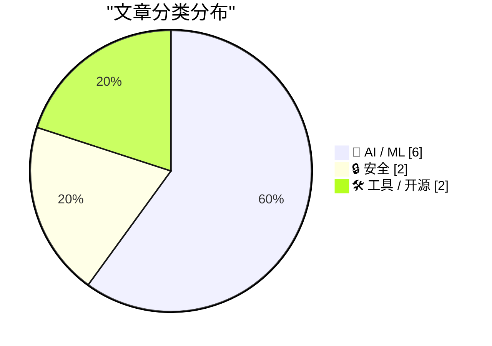
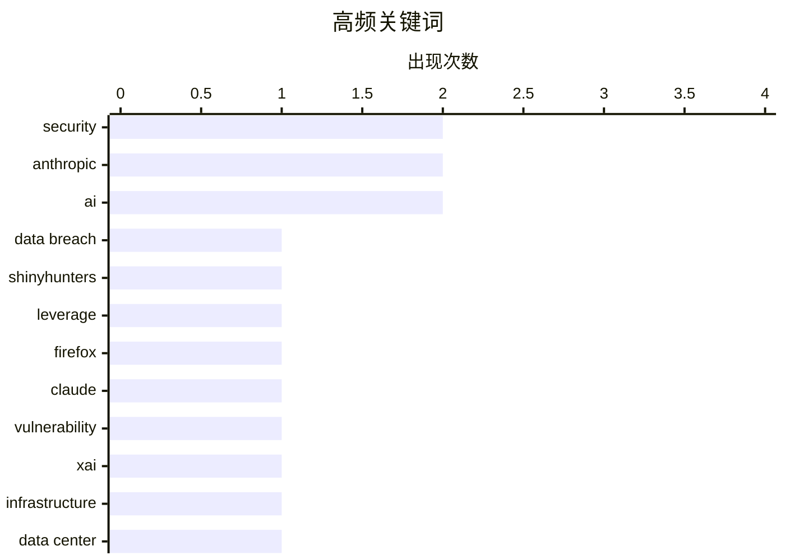

今日技术圈呈现三大核心趋势：一是AI驱动的安全范式正在转变，Mozilla利用Claude模型大幅提升漏洞修复效率，但同时青少年黑客组织带来的新型网络威胁也暴露了执法框架的滞后性；二是AI行业面临生态整合压力，xAI数据中心的环境争议与开源权重模型的关闭风险，标志着行业发展进入成本与责任并重的新阶段；三是人机协作模式持续演变，vibe coding与agentic工程正在融合，监管与创新的速度差距也在扩大。

<!--more-->


> 来自 Karpathy 推荐的 92 个顶级技术博客，AI 精选 Top 10

## 🏆 今日必读

🥇 **502周度更新：ShinyHunters组织展示的网络安全威胁**

[Weekly Update 502](https://www.troyhunt.com/weekly-update-502/) — troyhunt.com · 1 天前 · 🔒 安全

> ShinyHunters是一个以青少年（十几岁到二十出头）为主的黑客组织，他们资源有限但却能持续入侵大型品牌的数据系统。这种威胁并非仅靠技术手段，而是体现了攻击者如何利用未成年人身份作为法律保护的幌子。Troy Hunt指出需要重新审视未成年人网络犯罪的法律后果，因为当前的执法框架存在明显漏洞。

💡 **为什么值得读**: 暴露了未成年人作为网络攻击者的新趋势及其对传统安全防御的挑战

🏷️ data breach, ShinyHunters, security, leverage

🥈 **深入解析：Mozilla如何利用Claude Mythos预览版加固Firefox**

[Behind the Scenes Hardening Firefox with Claude Mythos Preview](https://simonwillison.net/2026/May/7/firefox-claude-mythos/#atom-everything) — simonwillison.net · 4 小时前 · 🔒 安全

> Mozilla使用Claude AI模型的预览权限发现并修复了Firefox中的数百个安全漏洞。AI生成的安全漏洞报告曾被视为无价值的「垃圾」，但随着模型能力大幅提升，报告质量也显著提高。Mozilla改进了利用AI模型的技术手段，使AI能够快速定位问题并生成有效的修复建议。这种转变彻底改变了项目维护者处理AI报告的成本平衡。

💡 **为什么值得读**: 展示了AI安全审计从「垃圾」到「高效工具」的实际演进案例

🏷️ Firefox, security, Claude, vulnerability

🥉 **xAI与Anthropic数据中心合作分析**

[Notes on the xAI/Anthropic data center deal](https://simonwillison.net/2026/May/7/xai-anthropic/#atom-everything) — simonwillison.net · 5 小时前 · 🤖 AI / ML

> Anthropic与SpaceX/xAI达成协议，使用Colossus数据中心的全部容量。这个数据中心因环境问题备受争议，其燃气涡轮机最初在未获得清洁空气法许可证的情况下运行，被归类为「临时」设施。相关报告指出该设施与空气质量下降导致的入院率增加有关。Anthropic选择与这家数据中心合作引发了关于AI行业环境责任的讨论。

💡 **为什么值得读**: 揭示了AI行业快速发展背后被忽视的环境代价

🏷️ Anthropic, xAI, infrastructure, data center

---

## 📊 数据概览

| 扫描源 | 抓取文章 | 时间范围 | 精选 |
|:---:|:---:|:---:|:---:|
| 88/92 | 2523 篇 → 44 篇 | 48h | **10 篇** |

### 分类分布



### 高频关键词



<details>
<summary>📈 纯文本关键词图（终端友好）</summary>

```
security      │ ████████████████████ 2
anthropic     │ ████████████████████ 2
ai            │ ████████████████████ 2
data breach   │ ██████████░░░░░░░░░░ 1
shinyhunters  │ ██████████░░░░░░░░░░ 1
leverage      │ ██████████░░░░░░░░░░ 1
firefox       │ ██████████░░░░░░░░░░ 1
claude        │ ██████████░░░░░░░░░░ 1
vulnerability │ ██████████░░░░░░░░░░ 1
xai           │ ██████████░░░░░░░░░░ 1
```

</details>

### 🏷️ 话题标签

**security**(2) · **anthropic**(2) · **ai**(2) · data breach(1) · shinyhunters(1) · leverage(1) · firefox(1) · claude(1) · vulnerability(1) · xai(1) · infrastructure(1) · data center(1) · training(1) · scaling(1) · research(1) · open weights(1) · ai market(1) · oligopoly(1) · open source(1) · vibe coding(1)

---

## 🤖 AI / ML

### 1. xAI与Anthropic数据中心合作分析

[Notes on the xAI/Anthropic data center deal](https://simonwillison.net/2026/May/7/xai-anthropic/#atom-everything) — **simonwillison.net** · 5 小时前 · ⭐ 25/30

> Anthropic与SpaceX/xAI达成协议，使用Colossus数据中心的全部容量。这个数据中心因环境问题备受争议，其燃气涡轮机最初在未获得清洁空气法许可证的情况下运行，被归类为「临时」设施。相关报告指出该设施与空气质量下降导致的入院率增加有关。Anthropic选择与这家数据中心合作引发了关于AI行业环境责任的讨论。

🏷️ Anthropic, xAI, infrastructure, data center

---

### 2. 为什么更长horizon的训练没有显著减缓AI进步？

[Why hasn't longer-horizon training slowed AI progress?](https://seangoedecke.com/why-hasnt-longer-horizon-training-slowed-ai-progress/) — **seangoedecke.com** · 22 小时前 · ⭐ 25/30

> 文章探讨了按理说会更慢但实际没有显著减速的AI训练趋势。Dwarkesh Patel提出疑问：随着模型变强、任务变难，模型需要更多FLOPs完成训练，理论上训练更强大的模型应该耗时更长。作者认为AI发展并未如预期般放缓，主要原因包括：算力规模化快速推进、数据效率提升、以及算法创新的持续突破等多重因素的叠加效应。

🏷️ AI, training, scaling, research

---

### 3. 开源权重模型正在悄然关闭——这是一个问题

[Open weights are quietly closing up - and that's a problem](https://martinalderson.com/posts/open-weights-are-quietly-closing-up/?utm_source=rss&amp;utm_medium=rss&amp;utm_campaign=feed) — **martinalderson.com** · 1 天前 · ⭐ 25/30

> 开源权重模型是保持前沿实验室价格诚实的关键力量。如果开源模型消失，市场将只剩下少数寡头垄断者来榨取消费者剩余。当前开源模型社区正面临关闭风险，这可能导致AI模型价格大幅上涨和选择权受限。作者强调了开源权重模型对整个AI生态系统健康发展的重要性。

🏷️ open weights, AI market, oligopoly, open source

---

### 4. Vibe coding与agentic工程正在融合

[Vibe coding and agentic engineering are getting closer than I'd like](https://simonwillison.net/2026/May/6/vibe-coding-and-agentic-engineering/#atom-everything) — **simonwillison.net** · 1 天前 · ⭐ 24/30

> Simon Willison在谈论AI编程工具时发现了一个令人不安的现象： vibe coding（凭感觉编程）与agentic工程（智能体工程）这两种看似不同的方法在他的工作中开始融合。Vibe coding强调让AI自己 figuring out实现细节，而agentic工程则强调对AI行为的精确控制。这两种范式的融合意味着AI编程的边界正在变得模糊，开发者需要重新思考人机协作的模式。

🏷️ vibe coding, agentic, AI tools, podcast

---

### 5. 快速与合法的战争已经到来

[The war between fast and legitimate is here](https://www.joanwestenberg.com/the-war-between-fast-and-legitimate-is-here/) — **joanwestenberg.com** · 21 小时前 · ⭐ 24/30

> 欧盟花费四年起草AI Act，而OpenAI仅用两个月就将GPT-4推向一亿用户。当布鲁塞尔最终确定「高风险」系统的定义时，相关系统已经多次升级演变。监管机构既没有快速响应的能力，也没有足够的技术理解来有效监管。监管与创新的速度差距正在扩大，合规成本可能成为小公司进入AI领域的障碍，而大公司则有资源应对复杂的监管要求。

🏷️ AI regulation, EU AI Act, governance, technology

---

### 6. Code w/ Claude 2026现场博客

[Live blog: Code w/ Claude 2026](https://simonwillison.net/2026/May/6/code-w-claude-2026/#atom-everything) — **simonwillison.net** · 1 天前 · ⭐ 23/30

> Simon Willison在Anthropic的Code w/ Claude 2026活动现场的实时博客记录。展示了Anthropic最新发布的技术内容和 Claude Code的相关功能，包括新的AI编程工具特性和企业级应用场景。这是了解Anthropic最新产品方向和AI编程未来的重要窗口。

🏷️ Anthropic, conference, live blog, AI

---

## 🔒 安全

### 7. 502周度更新：ShinyHunters组织展示的网络安全威胁

[Weekly Update 502](https://www.troyhunt.com/weekly-update-502/) — **troyhunt.com** · 1 天前 · ⭐ 26/30

> ShinyHunters是一个以青少年（十几岁到二十出头）为主的黑客组织，他们资源有限但却能持续入侵大型品牌的数据系统。这种威胁并非仅靠技术手段，而是体现了攻击者如何利用未成年人身份作为法律保护的幌子。Troy Hunt指出需要重新审视未成年人网络犯罪的法律后果，因为当前的执法框架存在明显漏洞。

🏷️ data breach, ShinyHunters, security, leverage

---

### 8. 深入解析：Mozilla如何利用Claude Mythos预览版加固Firefox

[Behind the Scenes Hardening Firefox with Claude Mythos Preview](https://simonwillison.net/2026/May/7/firefox-claude-mythos/#atom-everything) — **simonwillison.net** · 4 小时前 · ⭐ 25/30

> Mozilla使用Claude AI模型的预览权限发现并修复了Firefox中的数百个安全漏洞。AI生成的安全漏洞报告曾被视为无价值的「垃圾」，但随着模型能力大幅提升，报告质量也显著提高。Mozilla改进了利用AI模型的技术手段，使AI能够快速定位问题并生成有效的修复建议。这种转变彻底改变了项目维护者处理AI报告的成本平衡。

🏷️ Firefox, security, Claude, vulnerability

---

## 🛠 工具 / 开源

### 9. llm-gemini 0.31版本发布

[llm-gemini 0.31](https://simonwillison.net/2026/May/7/llm-gemini/#atom-everything) — **simonwillison.net** · 2 小时前 · ⭐ 23/30

> llm-gemini插件发布0.31版本，gemini-3.1-flash-lite正式脱离预览版变为正式可用模型。这个版本是继今年3月发布的预览版之后的稳定版本更新。gemini-3.1-flash-lite是Google轻量级AI模型，主打快速响应和较低的资源消耗，适合需要高效处理的开发者使用。

🏷️ LLM, Gemini, API, plugin

---

### 10. 程序员的逻辑学（Newsletter未来）

[New Logic for Programmers (and the future of this newsletter)](https://buttondown.com/hillelwayne/archive/new-logic-for-programmers-and-the-future-of-this/) — **buttondown.com/hillelwayne** · 1 天前 · ⭐ 23/30

> Hillel Wayne发布了Logic for Programmers 0.14版本，这是面向程序员的逻辑学入门书籍的新更新。这次更新主要包括排版、编辑和技术校对工作，已经开始样书印刷。书籍已进入最后准备阶段，需要修复一些图表、进行格式调整和校对，目标是6月底前实现印刷版可购买。

🏷️ logic, programming, book

---

*生成于 2026-05-08 22:18 | 扫描 88 源 → 获取 2523 篇 → 精选 10 篇*
*基于 [Hacker News Popularity Contest 2025](https://refactoringenglish.com/tools/hn-popularity/) RSS 源列表，由 [Andrej Karpathy](https://x.com/karpathy) 推荐*
*由「懂点儿AI」制作，欢迎关注同名微信公众号获取更多 AI 实用技巧 💡*
