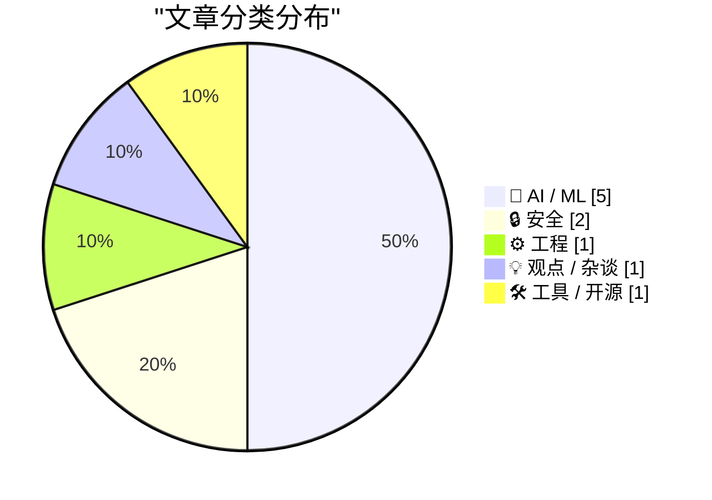
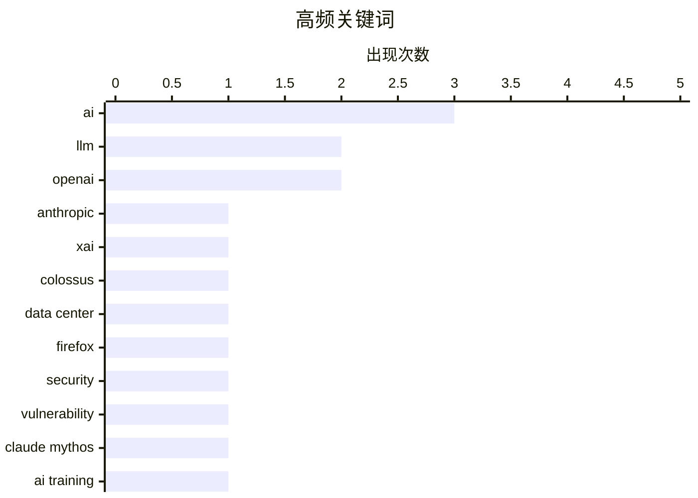

今日AI领域呈现三大趋势：一是AI安全能力取得实质性突破，Mozilla通过AI审计修复Firefox数百漏洞，证明AI在代码安全审计方面已从“垃圾”变为实用工具；二是监管与技术发展的速度差距进一步拉大，欧盟四年起草的AI Act还未落地，相关系统已迭代多次，数据中心与环保的矛盾也日益凸显；三是AI正在改变软件工程的传统范式，包括HTML格式复兴、本地模型工程化加速，以及AI缩小了强弱工程师之间的产出差距。

<!--more-->


> 来自 Karpathy 推荐的 92 个顶级技术博客，AI 精选 Top 10

## 🏆 今日必读

🥇 **xAI/Anthropic 数据中心交易笔记**

[Notes on the xAI/Anthropic data center deal](https://simonwillison.net/2026/May/7/xai-anthropic/#atom-everything) — simonwillison.net · 1 天前 · 🤖 AI / ML

> Anthropic在Code w/ Claude大会上宣布与SpaceX/xAI达成协议，将使用其Colossus数据中心的全部容量。 该数据中心因gas turbines（燃气轮机）曾未取得《清洁空气法》许可和污染控制设备而被归类为"临时"设施，引发环保争议。 有可信报告将该设施与空气质量下降导致的住院率上升联系起来。 此次合作是AI行业数据中心需求快速增长的典型案例，凸显能源供给与环保之间的张力。

💡 **为什么值得读**: 了解AI巨头如何应对算力需求井喷及其背后的环境争议代价。

🏷️ Anthropic, xAI, Colossus, data center

🥈 **Firefox 安全加固幕后：使用 Claude Mythos 预览版**

[Behind the Scenes Hardening Firefox with Claude Mythos Preview](https://simonwillison.net/2026/May/7/firefox-claude-mythos/#atom-everything) — simonwillison.net · 1 天前 · 🔒 安全

> Mozilla通过Claude Mythos预览版定位并修复了Firefox中的数百个安全漏洞，展示了AI安全审计的范式转变。 此前AI生成的漏洞报告多为"slop"（垃圾），维护者需花费大量时间甄别假阳性，收益成本不对称。 随着模型能力提升和提示工程技术改进，AI发现真实漏洞的效率大幅提高。 Mozilla的实践表明，当前顶尖AI模型已能在代码安全审计中产生实际价值。

💡 **为什么值得读**: 学习如何有效利用AI进行大规模安全漏洞挖掘的真实案例。

🏷️ Firefox, security, vulnerability, Claude Mythos

🥉 **为什么更长的训练没有明显减缓AI进步？**

[Why hasn't longer-horizon training slowed AI progress?](https://seangoedecke.com/why-hasnt-longer-horizon-training-slowed-ai-progress/) — seangoedecke.com · 1 天前 · 🤖 AI / ML

> 文章探讨为何强化学习训练难度增加没有显著减缓AI能力提升。 作者认为虽然更难任务需要更多FLOPs，但通过预训练 Scaling、架构创新和后训练技巧的组合，模型仍能持续快速进步。 关键洞察是"长horizon RL"（长视野强化学习）的难度被高估，因为评估任务好坏的信号（reward）比预训练更灵活。 AI能力提升仍是指数级而非线性，Scaling laws仍在生效。

💡 **为什么值得读**: 澄清关于AI发展瓶颈的常见误解，理解模型能力持续提升的真正驱动因素。

🏷️ AI training, scaling, LLM, horizon

---

## 📊 数据概览

| 扫描源 | 抓取文章 | 时间范围 | 精选 |
|:---:|:---:|:---:|:---:|
| 87/92 | 2516 篇 → 42 篇 | 48h | **10 篇** |

### 分类分布



### 高频关键词



<details>
<summary>📈 纯文本关键词图（终端友好）</summary>

```
ai            │ ████████████████████ 3
llm           │ █████████████░░░░░░░ 2
openai        │ █████████████░░░░░░░ 2
anthropic     │ ███████░░░░░░░░░░░░░ 1
xai           │ ███████░░░░░░░░░░░░░ 1
colossus      │ ███████░░░░░░░░░░░░░ 1
data center   │ ███████░░░░░░░░░░░░░ 1
firefox       │ ███████░░░░░░░░░░░░░ 1
security      │ ███████░░░░░░░░░░░░░ 1
vulnerability │ ███████░░░░░░░░░░░░░ 1
```

</details>

### 🏷️ 话题标签

**ai**(3) · **llm**(2) · **openai**(2) · anthropic(1) · xai(1) · colossus(1) · data center(1) · firefox(1) · security(1) · vulnerability(1) · claude mythos(1) · ai training(1) · scaling(1) · horizon(1) · data breach(1) · education technology(1) · canvas(1) · ransomware(1) · html(1) · claude code(1)

---

## 🤖 AI / ML

### 1. xAI/Anthropic 数据中心交易笔记

[Notes on the xAI/Anthropic data center deal](https://simonwillison.net/2026/May/7/xai-anthropic/#atom-everything) — **simonwillison.net** · 1 天前 · ⭐ 27/30

> Anthropic在Code w/ Claude大会上宣布与SpaceX/xAI达成协议，将使用其Colossus数据中心的全部容量。 该数据中心因gas turbines（燃气轮机）曾未取得《清洁空气法》许可和污染控制设备而被归类为"临时"设施，引发环保争议。 有可信报告将该设施与空气质量下降导致的住院率上升联系起来。 此次合作是AI行业数据中心需求快速增长的典型案例，凸显能源供给与环保之间的张力。

🏷️ Anthropic, xAI, Colossus, data center

---

### 2. 为什么更长的训练没有明显减缓AI进步？

[Why hasn't longer-horizon training slowed AI progress?](https://seangoedecke.com/why-hasnt-longer-horizon-training-slowed-ai-progress/) — **seangoedecke.com** · 1 天前 · ⭐ 25/30

> 文章探讨为何强化学习训练难度增加没有显著减缓AI能力提升。 作者认为虽然更难任务需要更多FLOPs，但通过预训练 Scaling、架构创新和后训练技巧的组合，模型仍能持续快速进步。 关键洞察是"长horizon RL"（长视野强化学习）的难度被高估，因为评估任务好坏的信号（reward）比预训练更灵活。 AI能力提升仍是指数级而非线性，Scaling laws仍在生效。

🏷️ AI training, scaling, LLM, horizon

---

### 3. 推动本地模型：专注与打磨

[Pushing Local Models With Focus And Polish](https://lucumr.pocoo.org/2026/5/8/local-models/) — **lucumr.pocoo.org** · 22 小时前 · ⭐ 24/30

> 作者希望本地模型能达到可用水平，使开发者能直接使用本地模型而非云端API，但目前面临的困难主要不在模型质量，而在于生态系统和工具链的不完善。 虽然有出色的量化工作、快速内核等开源项目，但配置API key、集成coding agent等体验仍远未顺畅。 呼吁社区改进本地推理的工程化体验，降低普通开发者的使用门槛。

🏷️ local models, AI, coding agent, LLM

---

### 4. Breaking news: "他们还没想好OpenAI怎么付钱"

[Breaking news: “they hadn’t figured out how OpenAI would pay for it”](https://garymarcus.substack.com/p/breaking-news-they-hadnt-figured) — **garymarcus.substack.com** · 1 天前 · ⭐ 23/30

> 简短标题党和新闻，暗示OpenAI面临"他们还没想好如何支付"的财务困境，借用经典电影台词传达潜在的资金问题信号。

🏷️ OpenAI, business model, funding, AI

---

### 5. 快速与合法的战争已经到来

[The war between fast and legitimate is here](https://www.joanwestenberg.com/the-war-between-fast-and-legitimate-is-here/) — **joanwestenberg.com** · 1 天前 · ⭐ 22/30

> 欧盟耗时四年起草AI Act，而OpenAI仅用两个月就将GPT-4推向一亿用户，监管速度与技术发展严重脱节。 当布鲁塞尔最终定稿"高风险"系统定义时，相关系统早已迭代多次并长出新的功能分支。 技术迭代周期与立法周期的巨大错位，使监管面临根本性挑战。

🏷️ AI regulation, EU AI Act, policy, OpenAI

---

## 🔒 安全

### 6. Firefox 安全加固幕后：使用 Claude Mythos 预览版

[Behind the Scenes Hardening Firefox with Claude Mythos Preview](https://simonwillison.net/2026/May/7/firefox-claude-mythos/#atom-everything) — **simonwillison.net** · 1 天前 · ⭐ 26/30

> Mozilla通过Claude Mythos预览版定位并修复了Firefox中的数百个安全漏洞，展示了AI安全审计的范式转变。 此前AI生成的漏洞报告多为"slop"（垃圾），维护者需花费大量时间甄别假阳性，收益成本不对称。 随着模型能力提升和提示工程技术改进，AI发现真实漏洞的效率大幅提高。 Mozilla的实践表明，当前顶尖AI模型已能在代码安全审计中产生实际价值。

🏷️ Firefox, security, vulnerability, Claude Mythos

---

### 7. Canvas 数据泄露攻击致全美学校停课

[Canvas Breach Disrupts Schools & Colleges Nationwide](https://krebsonsecurity.com/2026/05/canvas-breach-disrupts-schools-colleges-nationwide/) — **krebsonsecurity.com** · 19 小时前 · ⭐ 25/30

> 一个网络犯罪组织对广泛使用的教育技术平台Canvas发起数据勒索攻击，篡改登录页面并威胁泄露近9000所教育机构的2.75亿学生和教职员工数据。 攻击导致全美多地学校和大学的课程教学被迫中断。 这是针对教育领域的重大数据安全事件，凸显EdTech平台的安全防护薄弱。

🏷️ data breach, education technology, Canvas, ransomware

---

## ⚙️ 工程

### 8. 使用 Claude Code：HTML 出人意料的有效性

[Using Claude Code: The Unreasonable Effectiveness of HTML](https://simonwillison.net/2026/May/8/unreasonable-effectiveness-of-html/#atom-everything) — **simonwillison.net** · 1 小时前 · ⭐ 24/30

> Anthropic的Thariq Shihipar倡导在Claude Code中使用HTML替代Markdown作为输出格式，并提供了丰富的实践示例。 HTML可通过内联注释、颜色编码严重程度等实现更丰富的信息呈现，如代码审查时可直接渲染diff并标注问题。 虽然此前受限于GPT-4的8K token限制，Markdown的token效率优势明显，但这一限制现已基本消除。

🏷️ HTML, Claude Code, Markdown, AI agents

---

## 💡 观点 / 杂谈

### 9. AI 使弱工程师的危害降低

[AI makes weak engineers less harmful](https://seangoedecke.com/ai-makes-weak-engineers-less-harmful/) — **seangoedecke.com** · -93 分钟前 · ⭐ 23/30

> 软件工程能力呈"重尾分布"，最强工程师产出远高于平均，而最弱工程师常产生负向价值。 AI降低了这种能力差异的天花板和地板，使初级工程师从"可能有害"变为"相对安全"。 这可能改变技术公司的招聘策略，减少对极端高绩效人才的依赖。 AI不是取代强者，而是减少了弱者造成的伤害。

🏷️ AI, software engineering, productivity

---

## 🛠 工具 / 开源

### 10. llm-gemini 0.31 发布

[llm-gemini 0.31](https://simonwillison.net/2026/May/7/llm-gemini/#atom-everything) — **simonwillison.net** · 1 天前 · ⭐ 21/30

> llm-gemini插件发布0.31版本，主要更新是gemini-3.1-flash-lite结束预览阶段转为正式可用。 这是Google Gemini API的LLM插件更新，属于工具链的例行版本迭代。

🏷️ llm-gemini, Google Gemini, LLM plugin

---

*生成于 2026-05-09 22:27 | 扫描 87 源 → 获取 2516 篇 → 精选 10 篇*
*基于 [Hacker News Popularity Contest 2025](https://refactoringenglish.com/tools/hn-popularity/) RSS 源列表，由 [Andrej Karpathy](https://x.com/karpathy) 推荐*
*由「懂点儿AI」制作，欢迎关注同名微信公众号获取更多 AI 实用技巧 💡*
