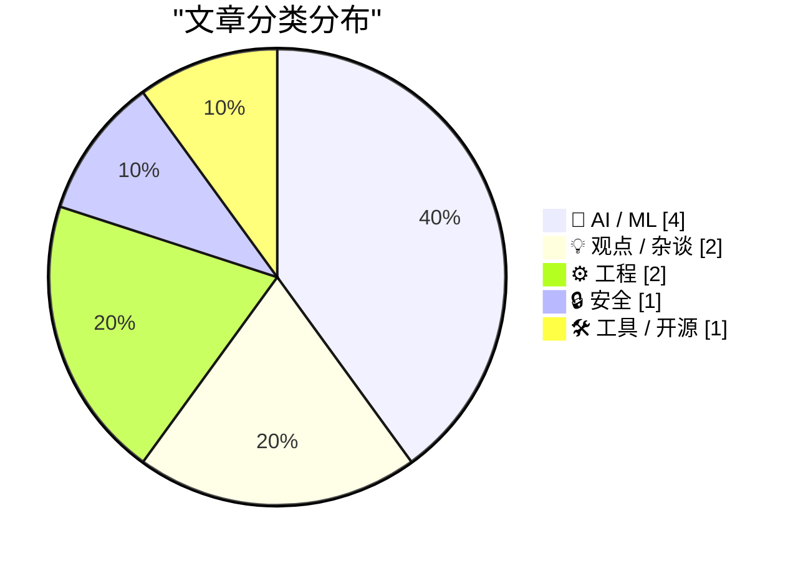
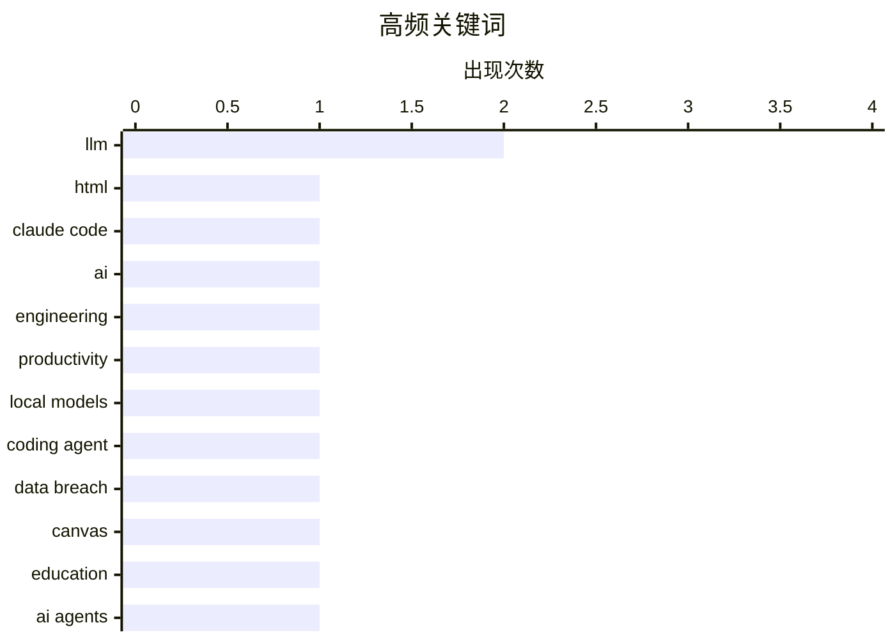

**今日看点：** AI 正在从模型竞赛转向工程落地实战，工程师们开始关注 HTML artifact 输出、本地模型简化部署等实际应用问题，而非单纯追逐更大更强的模型。与之并行的是 AI 对团队结构的深层影响——MIT 研究质疑 AI 投资的真实回报，与此同时 AI 工具提升弱工程师生产力的讨论也在持续。与此同时，Canvas 数据泄露事件敲响安全警钟，教育行业成为大规模网络攻击的最新目标。

<!--more-->


> 来自 Karpathy 推荐的 92 个顶级技术博客，AI 精选 Top 10

## 🏆 今日必读

🥇 **使用 Claude Code 揭示 HTML 的不合理有效性**

[Using Claude Code: The Unreasonable Effectiveness of HTML](https://simonwillison.net/2026/May/8/unreasonable-effectiveness-of-html/#atom-everything) — simonwillison.net · 1 天前 · 🤖 AI / ML

> Anthropic 工程师 Thariq Shihipar 提出应优先要求 Claude 生成 HTML 而非 Markdown 作为输出格式。HTML 支持富组件渲染、交互式元素和样式控制，比纯文本 Markdown 包含更多信息。作者收集了大量示例网站展示 HTML 输出效果，例如使用 HTML artifact 呈现 PR diff 并标注严重程度。GPT-4 时代因 token 限制倾向 Markdown，但随着上下文窗口增大，HTML 的信息密度优势明显。文章提供了多个示例 prompt 指导如何请求 HTML 格式输出。

💡 **为什么值得读**: 为使用 Claude Codex 的开发者提供了一种更高效获取结构化输出的实用方法。

🏷️ LLM, HTML, Claude Code

🥈 **AI 如何削弱弱工程师的危害**

[AI makes weak engineers less harmful](https://seangoedecke.com/ai-makes-weak-engineers-less-harmful/) — seangoedecke.com · 22 小时前 · 💡 观点 / 杂谈

> 软件工程能力呈厚尾分布，最强工程师产出远超平均水平，而最弱工程师往往净产生负面影响。AI 工具能显著提升弱工程师的生产力下限，使其不再成为团队的负担。通过 AI 辅助，能力较弱的工程师可以产出之前无法独立完成的工作，减少对高级工程师的依赖。许多科技公司倾向组建小而精的高薪团队，而非大团队，但现在 AI 可能改变这一局面，让更多普通工程师也能产生价值。

💡 **为什么值得读**: 提供了一个有争议但值得思考的视角：AI 如何重新定义工程团队的价值结构。

🏷️ AI, engineering, productivity

🥉 **推动本地模型聚焦与打磨**

[Pushing Local Models With Focus And Polish](https://lucumr.pocoo.org/2026/5/8/local-models/) — lucumr.pocoo.org · 1 天前 · 🤖 AI / ML

> 作者渴望本地模型能真正实用，使 coding agent 不再在几分钟后切回托管 API。本地推理技术已有进展，包括量化、快速内核等项目，但实际使用体验仍很差。主要障碍不是模型质量，而是工程整合的复杂性：配置 API key、安装依赖、处理 CUDA 环境等步骤过于繁琐。作者认为应当简化这些流程，让平均开发者也能轻松使用本地 AI 能力，而非将 experimentation 锁在专业开发者手中。

💡 **为什么值得读**: 为对本地部署 AI 模型有兴趣的开发者提供了真实的痛点分析和改进方向。

🏷️ local models, LLM, coding agent

---

## 📊 数据概览

| 扫描源 | 抓取文章 | 时间范围 | 精选 |
|:---:|:---:|:---:|:---:|
| 88/92 | 2527 篇 → 28 篇 | 48h | **10 篇** |

### 分类分布



### 高频关键词



<details>
<summary>📈 纯文本关键词图（终端友好）</summary>

```
llm          │ ████████████████████ 2
html         │ ██████████░░░░░░░░░░ 1
claude code  │ ██████████░░░░░░░░░░ 1
ai           │ ██████████░░░░░░░░░░ 1
engineering  │ ██████████░░░░░░░░░░ 1
productivity │ ██████████░░░░░░░░░░ 1
local models │ ██████████░░░░░░░░░░ 1
coding agent │ ██████████░░░░░░░░░░ 1
data breach  │ ██████████░░░░░░░░░░ 1
canvas       │ ██████████░░░░░░░░░░ 1
```

</details>

### 🏷️ 话题标签

**llm**(2) · **html**(1) · **claude code**(1) · ai(1) · engineering(1) · productivity(1) · local models(1) · coding agent(1) · data breach(1) · canvas(1) · education(1) · ai agents(1) · roi(1) · generative ai(1) · ai economy(1) · anthropic(1) · circular economy(1) · cloud costs(1) · zig(1) · code formatter(1)

---

## 🤖 AI / ML

### 1. 使用 Claude Code 揭示 HTML 的不合理有效性

[Using Claude Code: The Unreasonable Effectiveness of HTML](https://simonwillison.net/2026/May/8/unreasonable-effectiveness-of-html/#atom-everything) — **simonwillison.net** · 1 天前 · ⭐ 25/30

> Anthropic 工程师 Thariq Shihipar 提出应优先要求 Claude 生成 HTML 而非 Markdown 作为输出格式。HTML 支持富组件渲染、交互式元素和样式控制，比纯文本 Markdown 包含更多信息。作者收集了大量示例网站展示 HTML 输出效果，例如使用 HTML artifact 呈现 PR diff 并标注严重程度。GPT-4 时代因 token 限制倾向 Markdown，但随着上下文窗口增大，HTML 的信息密度优势明显。文章提供了多个示例 prompt 指导如何请求 HTML 格式输出。

🏷️ LLM, HTML, Claude Code

---

### 2. 推动本地模型聚焦与打磨

[Pushing Local Models With Focus And Polish](https://lucumr.pocoo.org/2026/5/8/local-models/) — **lucumr.pocoo.org** · 1 天前 · ⭐ 25/30

> 作者渴望本地模型能真正实用，使 coding agent 不再在几分钟后切回托管 API。本地推理技术已有进展，包括量化、快速内核等项目，但实际使用体验仍很差。主要障碍不是模型质量，而是工程整合的复杂性：配置 API key、安装依赖、处理 CUDA 环境等步骤过于繁琐。作者认为应当简化这些流程，让平均开发者也能轻松使用本地 AI 能力，而非将 experimentation 锁在专业开发者手中。

🏷️ local models, LLM, coding agent

---

### 3. 代理与投资回报率

[Agents and ROI](https://garymarcus.substack.com/p/agents-and-roi) — **garymarcus.substack.com** · 1 天前 · ⭐ 22/30

> MIT 研究显示生成式 AI 对大多数企业来说 ROI 并不存在。这与当前 AI 代理热潮形成矛盾——如果投资 AI 难以获得回报，企业为何还要投入？作者质疑 AI 代理能否打破这一困境，还是会加剧问题。

🏷️ AI agents, ROI, generative AI

---

### 4. AI 的循环性精神病

[Premium: AI's Circular Psychosis](https://www.wheresyoured.at/premium-ais-circular-psychosis/) — **wheresyoured.at** · 1 天前 · ⭐ 22/30

> Anthropic 需要大量云计算费用，但自身无足够资金，因为公司成本超过收入。解决方式是依靠其他公司使用其 API 来支付账单。这形成了 AI 经济体的循环：云服务商收费，AI 公司支付，羊毛出在羊身上——一个自我循环的系统。

🏷️ AI economy, Anthropic, circular economy, cloud costs

---

## 💡 观点 / 杂谈

### 5. AI 如何削弱弱工程师的危害

[AI makes weak engineers less harmful](https://seangoedecke.com/ai-makes-weak-engineers-less-harmful/) — **seangoedecke.com** · 22 小时前 · ⭐ 25/30

> 软件工程能力呈厚尾分布，最强工程师产出远超平均水平，而最弱工程师往往净产生负面影响。AI 工具能显著提升弱工程师的生产力下限，使其不再成为团队的负担。通过 AI 辅助，能力较弱的工程师可以产出之前无法独立完成的工作，减少对高级工程师的依赖。许多科技公司倾向组建小而精的高薪团队，而非大团队，但现在 AI 可能改变这一局面，让更多普通工程师也能产生价值。

🏷️ AI, engineering, productivity

---

### 6. 开源的误判

[The Mismeasure of Open Source](https://nesbitt.io/2026/05/09/the-mismeasure-of-open-source.html) — **nesbitt.io** · 12 小时前 · ⭐ 19/30

> 项目健康评分的路灯效应——人们往往只衡量容易测量的指标，而非真正重要的东西。就像在路灯下找钥匙，只因为那里有光。

🏷️ open source, metrics, project health

---

## ⚙️ 工程

### 7. 通过 ReadDirectoryChangesW 追踪重命名增强自信

[Developing more confidence when tracking renames via Read­Directory­ChangesW](https://devblogs.microsoft.com/oldnewthing/20260508-00/?p=112310) — **devblogs.microsoft.com/oldnewthing** · 1 天前 · ⭐ 20/30

> 可以通过追踪文件 ID 来追踪重命名。此技术用于 Windows 文件系统变更监控。

🏷️ Windows, file API, ReadDirectoryChangesW

---

### 8. 引用 Luke Curley

[Quoting Luke Curley](https://simonwillison.net/2026/May/9/luke-curley/#atom-everything) — **simonwillison.net** · 21 小时前 · ⭐ 19/30

> WebRTC 设计为在网络不佳时为保持低延迟而主动丢弃音频包，但用户更愿意等待额外 200ms 以获得准确的 AI 响应。当前 WebRTC 实现无法重传丢包，无法满足异步 AI 对话需求。

🏷️ WebRTC, real-time communication, networking

---

## 🔒 安全

### 9. Canvas 数据泄露攻击影响全国学校

[Canvas Breach Disrupts Schools & Colleges Nationwide](https://krebsonsecurity.com/2026/05/canvas-breach-disrupts-schools-colleges-nationwide/) — **krebsonsecurity.com** · 1 天前 · ⭐ 24/30

> 针对教育技术平台 Canvas 的大规模数据勒索攻击持续进行，波及美国各地学区和企业。犯罪组织篡改登录页面并索要赎金，威胁泄露近 9000 所教育机构的 2.75 亿学生和教职员工数据。攻击导致课堂和课程作业被迫中断，企业正在应对这一安全事件。

🏷️ data breach, Canvas, education

---

## 🛠 工具 / 开源

### 10. 驾驭 Zig Fmt 技巧

[Steering Zig Fmt](https://matklad.github.io/2026/05/08/steering-zig-fmt.html) — **matklad.github.io** · 1 天前 · ⭐ 21/30

> 提供两条有效使用 zig fmt 的技巧。Zig 语言内置代码格式化工具，阅读本文适合正在使用 Zig 或实现代码格式化器的开发者。

🏷️ Zig, code formatter, fmt

---

*生成于 2026-05-10 22:18 | 扫描 88 源 → 获取 2527 篇 → 精选 10 篇*
*基于 [Hacker News Popularity Contest 2025](https://refactoringenglish.com/tools/hn-popularity/) RSS 源列表，由 [Andrej Karpathy](https://x.com/karpathy) 推荐*
*由「懂点儿AI」制作，欢迎关注同名微信公众号获取更多 AI 实用技巧 💡*
