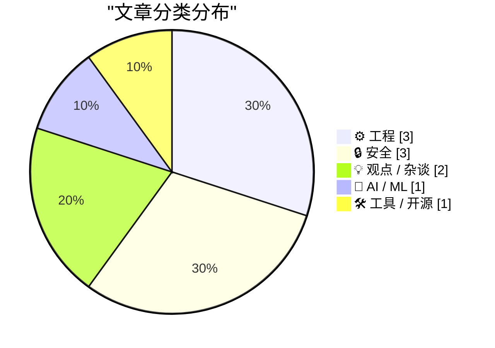
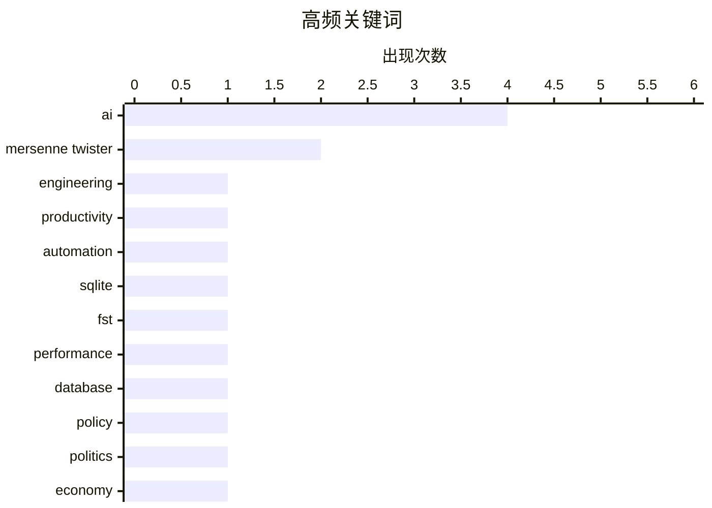

今日技术圈呈现三大趋势：一是AI正从工具层面深度介入软件工程，不仅能降低弱工程师的输出危害、提升代码质量，还引发关于AI发展是否过度恐慌的理性讨论；二是安全领域再起波澜，Meta被曝用员工鼠标数据训练AI模型，同时Mersenne Twister伪随机数生成器被指存在可逆攻击风险；三是工程实践层面的反思在持续发酵——从适度"重新造轮子"的专业成长价值，到WebRTC为保实时性而牺牲数据准确性的设计取舍，体现技术社区对工程本质的深层追问。

<!--more-->


> 来自 Karpathy 推荐的 92 个顶级技术博客，AI 精选 Top 10

## 🏆 今日必读

🥇 **AI如何降低弱工程师的危害**

[AI makes weak engineers less harmful](https://seangoedecke.com/ai-makes-weak-engineers-less-harmful/) — seangoedecke.com · 1 天前 · 💡 观点 / 杂谈

> 软件工程能力呈典型的长尾分布，最强工程师的产出远超平均水平，而最弱的工程师往往实际上是在帮倒忙——他们创建的问题需要同事花时间解决。大型科技公司通过精小的超高薪团队策略来规避这一现象。AI工具的出现大幅降低了弱工程师的伤害能力边界，通过代码审查、自动补全和Bug预防等功能，将他们的输出质量提升到可接受水平。核心论点是企业应该关注如何通过AI放大工程师能力，而非单纯追求人才密度。

💡 **为什么值得读**: 为技术管理者和HR提供如何利用AI提升团队整体效能的新视角

🏷️ AI, engineering, productivity, automation

🥈 **引用Andrew Quinn：重新造轮子的智慧**

[Quoting Andrew Quinn](https://simonwillison.net/2026/May/10/andrew-quinn/#atom-everything) — simonwillison.net · 7 小时前 · ⚙️ 工程

> 文章引用Andrew Quinn关于程序员心理陷阱的思考：很多人因担心现有工具已更好而愧疚不敢动手写代码，这其实是一个思维陷阱。作者认为需要重新造4-5个轮子才能真正理解轮子的制造艺术，但这不是一个或一千个。计算机科学领域可能需要二十到三十个。这种适度重复造轮子的实践能帮助工程师突破「已存在更好方案」的焦虑，获得真正的专业认知。

💡 **为什么值得读**: 帮助陷入「不是我的发明」综合症的开发者找到实践勇气

🏷️ SQLite, fst, performance, database

🥉 **左翼的AI辩护论**

[The left-wing case for AI](https://seangoedecke.com/the-left-wing-case-for-ai/) — seangoedecke.com · 22 小时前 · 💡 观点 / 杂谈

> 作者认为左翼对AI的反对情绪部分源于2022年加密货币热潮和2024年科技CEO支持特朗普的两次偶发事件。文章提出左翼支持AI的核心论点是：AI作为残障辅助工具的潜力巨大，可帮助盲人、聋人、读写障碍者等大幅提升生活与工作能力。左翼应在AI辅助技术议题上发挥积极作用，而非简单拒绝AI技术。

💡 **为什么值得读**: 为关心AI社会影响和政治立场的读者提供辩证思考材料

🏷️ AI, policy, politics, economy

---

## 📊 数据概览

| 扫描源 | 抓取文章 | 时间范围 | 精选 |
|:---:|:---:|:---:|:---:|
| 88/92 | 2527 篇 → 18 篇 | 48h | **10 篇** |

### 分类分布



### 高频关键词



<details>
<summary>📈 纯文本关键词图（终端友好）</summary>

```
ai               │ ████████████████████ 4
mersenne twister │ ██████████░░░░░░░░░░ 2
engineering      │ █████░░░░░░░░░░░░░░░ 1
productivity     │ █████░░░░░░░░░░░░░░░ 1
automation       │ █████░░░░░░░░░░░░░░░ 1
sqlite           │ █████░░░░░░░░░░░░░░░ 1
fst              │ █████░░░░░░░░░░░░░░░ 1
performance      │ █████░░░░░░░░░░░░░░░ 1
database         │ █████░░░░░░░░░░░░░░░ 1
policy           │ █████░░░░░░░░░░░░░░░ 1
```

</details>

### 🏷️ 话题标签

**ai**(4) · **mersenne twister**(2) · **engineering**(1) · productivity(1) · automation(1) · sqlite(1) · fst(1) · performance(1) · database(1) · policy(1) · politics(1) · economy(1) · meta(1) · privacy(1) · surveillance(1) · reverse engineering(1) · prng(1) · state recovery(1) · progress(1) · metr(1)

---

## ⚙️ 工程

### 1. 引用Andrew Quinn：重新造轮子的智慧

[Quoting Andrew Quinn](https://simonwillison.net/2026/May/10/andrew-quinn/#atom-everything) — **simonwillison.net** · 7 小时前 · ⭐ 24/30

> 文章引用Andrew Quinn关于程序员心理陷阱的思考：很多人因担心现有工具已更好而愧疚不敢动手写代码，这其实是一个思维陷阱。作者认为需要重新造4-5个轮子才能真正理解轮子的制造艺术，但这不是一个或一千个。计算机科学领域可能需要二十到三十个。这种适度重复造轮子的实践能帮助工程师突破「已存在更好方案」的焦虑，获得真正的专业认知。

🏷️ SQLite, fst, performance, database

---

### 2. 引用Luke Curley：WebRTC是问题所在

[Quoting Luke Curley](https://simonwillison.net/2026/May/9/luke-curley/#atom-everything) — **simonwillison.net** · 1 天前 · ⭐ 20/30

> 文章引用Luke Curley对WebRTC的批评：WebRTC设计为在网络条件差时主动丢弃数据包以保持低延迟，这导致会议通话中出现声音失真。WebRTC优先考虑实时性而非准确性，但用户往往宁愿等待200毫秒获得准确响应，而非收到垃圾数据。这种实时优先的实现已被硬编码，在浏览器中几乎不可能重传WebRTC音频数据包。

🏷️ WebRTC, audio, latency, networking

---

### 3. 我不在URL中添加查询字符串

[I Will Not Add Query Strings to Your URLs](https://susam.net/no-query-strings.html) — **susam.net** · 1 天前 · ⭐ 20/30

> Chris Morgan认为URL中的查询字符串(?后参数)污染了URL美感，应避免使用。查询字符串是Web架构中的错误——它们破坏URL的持久性，使缓存失效更难，影响URL分享体验。更好的做法是使用路径参数、文件后缀或服务端路由来处理动态内容，保持URL简洁可持续。

🏷️ URL, query strings, web development

---

## 🔒 安全

### 4. Meta将捕获员工鼠标移动和按键用于AI训练

[Meta to Start Capturing Employee Mouse Movements, Keystrokes for AI Training Data](https://www.reuters.com/sustainability/boards-policy-regulation/meta-start-capturing-employee-mouse-movements-keystrokes-ai-training-data-2026-04-21/) — **daringfireball.net** · 8 小时前 · ⭐ 24/30

> Reuters报道Meta正在员工电脑上安装名为Model Capability Initiative (MCI)的新追踪软件，用于捕获鼠标移动、点击和按键数据，用于训练其AI模型。该工具将运行在工作相关的应用和网站上，并偶尔截取员工屏幕内容。这是Meta构建自主AI代理宏伟计划的一部分，目标是为企业打造能执行工作任务的AI代理。

🏷️ Meta, privacy, AI, surveillance

---

### 5. 用线性代数逆向Mersenne Twister随机数生成器

[Reverse engineering Mersenne Twister with Linear Algebra](https://www.johndcook.com/blog/2026/05/10/reverse-mersenne-twister/) — **johndcook.com** · 4 小时前 · ⭐ 24/30

> Mersenne Twister (MT)是一种统计特性优良但加密特性较差的伪随机数生成器(PRNG)而非加密安全随机数生成器(CSPRNG)。本文展示如何从MT输出恢复其内部状态，采用的方法是线性代数——将比特操作序列建模为模2矩阵乘法。这为攻击基于MT的随机数系统提供了理论依据。

🏷️ Mersenne Twister, reverse engineering, PRNG, state recovery

---

### 6. 比特操作的线性代数

[The linear algebra of bit twiddling](https://www.johndcook.com/blog/2026/05/10/the-linear-algebra-of-bit-twiddling/) — **johndcook.com** · 3 小时前 · ⭐ 23/30

> 前一篇帖子回顾了Mersenne Twister的tempering步骤，将比特操作序列建模为模2乘法。本文深入探讨了这些分量的细节，证明线性代数定理在标量域之外同样成立，通常使用实数域或复数域，但模2域同样适用。

🏷️ linear algebra, Mersenne Twister, bit manipulation, cryptography

---

## 💡 观点 / 杂谈

### 7. AI如何降低弱工程师的危害

[AI makes weak engineers less harmful](https://seangoedecke.com/ai-makes-weak-engineers-less-harmful/) — **seangoedecke.com** · 1 天前 · ⭐ 26/30

> 软件工程能力呈典型的长尾分布，最强工程师的产出远超平均水平，而最弱的工程师往往实际上是在帮倒忙——他们创建的问题需要同事花时间解决。大型科技公司通过精小的超高薪团队策略来规避这一现象。AI工具的出现大幅降低了弱工程师的伤害能力边界，通过代码审查、自动补全和Bug预防等功能，将他们的输出质量提升到可接受水平。核心论点是企业应该关注如何通过AI放大工程师能力，而非单纯追求人才密度。

🏷️ AI, engineering, productivity, automation

---

### 8. 左翼的AI辩护论

[The left-wing case for AI](https://seangoedecke.com/the-left-wing-case-for-ai/) — **seangoedecke.com** · 22 小时前 · ⭐ 24/30

> 作者认为左翼对AI的反对情绪部分源于2022年加密货币热潮和2024年科技CEO支持特朗普的两次偶发事件。文章提出左翼支持AI的核心论点是：AI作为残障辅助工具的潜力巨大，可帮助盲人、聋人、读写障碍者等大幅提升生活与工作能力。左翼应在AI辅助技术议题上发挥积极作用，而非简单拒绝AI技术。

🏷️ AI, policy, politics, economy

---

## 🤖 AI / ML

### 9. 对AI进步的过度恐慌是错误的

[Misplaced panic over AI progress](https://garymarcus.substack.com/p/misplaced-panic-over-ai-progress) — **garymarcus.substack.com** · 2 小时前 · ⭐ 23/30

> Gary Marcus分析了METR最新发布的「时间 horizon」图表，指出公众对其含义存在严重误解。该图表并不像媒体报道的那样表明AI能力将很快超越人类，而是展现了一个更为复杂和渐进的发展轨迹。Marcus认为当前AI恐慌很多是基于对技术发展速度的误判，实际进步是可控的。

🏷️ AI, progress, METR, benchmark

---

## 🛠 工具 / 开源

### 10. WorkOS:企业-ready身份认证 APIs

[WorkOS](https://workos.com/?utm_source=daringfireball&amp;utm_medium=newsletter&amp;utm_campaign=q22026) — **daringfireball.net** · 8 小时前 · ⭐ 18/30

> WorkOS是一个面向B2B SaaS的enterprise身份认证平台，提供生产级可用的SSO、SCIM和审计日志 APIs，帮助开发者快速集成企业身份功能而无需自研。平台已获得超过2000家企业信任，包括OpenAI、Anthropic、Cursor和Vercel等，让开发团队专注于产品差异化而非基础设施。

🏷️ WorkOS, enterprise, SaaS, SSO

---

*生成于 2026-05-11 22:18 | 扫描 88 源 → 获取 2527 篇 → 精选 10 篇*
*基于 [Hacker News Popularity Contest 2025](https://refactoringenglish.com/tools/hn-popularity/) RSS 源列表，由 [Andrej Karpathy](https://x.com/karpathy) 推荐*
*由「懂点儿AI」制作，欢迎关注同名微信公众号获取更多 AI 实用技巧 💡*
