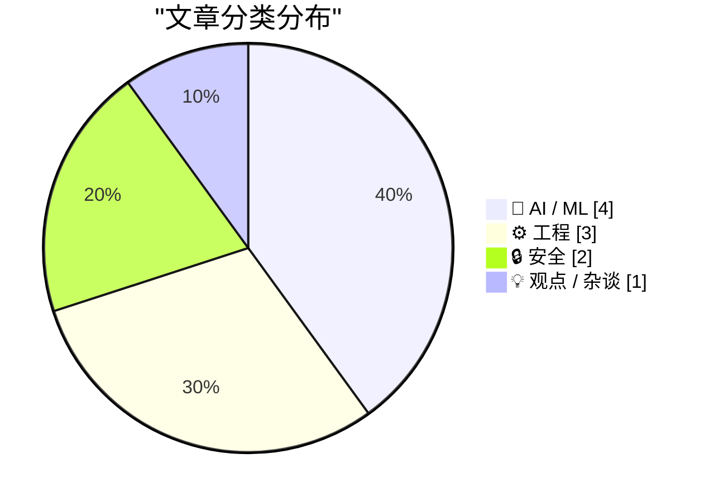
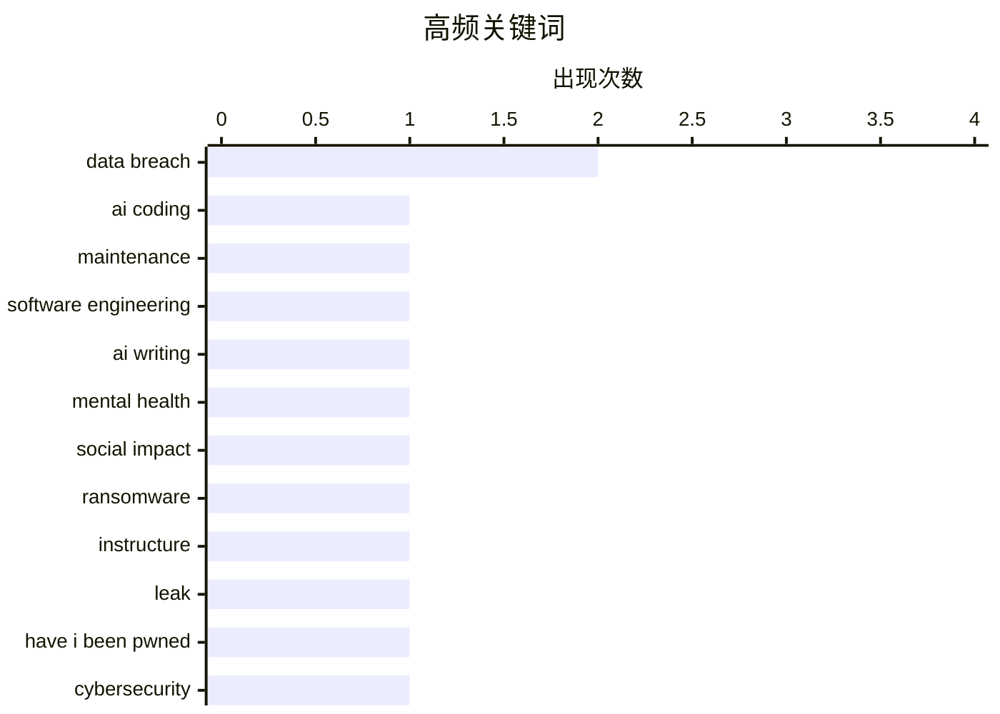

今日AI圈集中爆发信任危机：Meta被曝用员工操作数据训练AI、《纽约时报》严肃澄清AI生成假引言事故，同时“僵尸互联网”概念引发对AI内容泛滥的精神消耗担忧。另一方面，工程界重新审视AI编码工具价值——James Shore指出若不能同步降低维护成本，单纯提产只会增加长期负担；Shopify则尝试以完全透明的“教学工坊”模式对抗AI黑箱。安全层面，Instructure数据泄露倒计时与哥斯达黎加政府加入HIBP监控形成对照。

<!--more-->


> 来自 Karpathy 推荐的 92 个顶级技术博客，AI 精选 Top 10

## 🏆 今日必读

🥇 **AI编码工具必须降低维护成本**

[Quoting James Shore](https://simonwillison.net/2026/May/11/james-shore/#atom-everything) — simonwillison.net · 2 小时前 · ⚙️ 工程

> James Shore指出，AI编码工具的核心价值不在于提升写代码的速度，而在于降低代码维护成本。他提出一条关键原则：写代码速度提升多少倍，维护成本就必须降低多少倍，否则就是在用临时速度提升换取永久的维护负担。这个数学逻辑只有在大模型能够降低维护成本时才成立——降低幅度必须与代码产出增量成反比。例如产能翻倍但维护成本不变，实际总成本仍会增加一倍。

💡 **为什么值得读**: 所有使用AI编码助手的人都应该思考的核心问题：这笔账到底划不划算？

🏷️ AI coding, maintenance, software engineering

🥈 **Zombie Internet正在摧毁我的大脑**

[Your AI Use Is Breaking My Brain](https://simonwillison.net/2026/May/11/zombie-internet/#atom-everything) — simonwillison.net · 2 小时前 · 💡 观点 / 杂谈

> Jason Koebler提出「僵尸互联网」（Zombie Internet）概念，描述AI生成内容现在已经无处不在的现实。与「死亡互联网」仅是 bot 对 bot 不同，僵尸互联网是人机混合交互——人用AI与人对话、人用AI回复他人、还有所谓「AI网红」在教导如何创造AI网红。这种现象导致过滤AI内容变得精神疲惫，甚至开始扭曲真人写作风格。

💡 **为什么值得读**: 对每个在网上阅读和写作的人来说都是警醒：你能分辨出正在阅读的是真人还是AI吗？

🏷️ AI writing, mental health, social impact

🥉 **Instructure「支付或泄露」倒计时**

[Weekly Update 503](https://www.troyhunt.com/weekly-update-503/) — troyhunt.com · 22 小时前 · 🔒 安全

> 文章提及Instructure公司数据泄露事件的截止日期即将到来，但公司尚未公开任何声明。文章内容较短，未提供足够背景信息。

💡 **为什么值得读**: 作为安全事件跟踪，了解数据泄露事件发展脉络。

🏷️ data breach, ransomware, Instructure, leak

---

## 📊 数据概览

| 扫描源 | 抓取文章 | 时间范围 | 精选 |
|:---:|:---:|:---:|:---:|
| 86/92 | 2488 篇 → 31 篇 | 48h | **10 篇** |

### 分类分布



### 高频关键词



<details>
<summary>📈 纯文本关键词图（终端友好）</summary>

```
data breach          │ ████████████████████ 2
ai coding            │ ██████████░░░░░░░░░░ 1
maintenance          │ ██████████░░░░░░░░░░ 1
software engineering │ ██████████░░░░░░░░░░ 1
ai writing           │ ██████████░░░░░░░░░░ 1
mental health        │ ██████████░░░░░░░░░░ 1
social impact        │ ██████████░░░░░░░░░░ 1
ransomware           │ ██████████░░░░░░░░░░ 1
instructure          │ ██████████░░░░░░░░░░ 1
leak                 │ ██████████░░░░░░░░░░ 1
```

</details>

### 🏷️ 话题标签

**data breach**(2) · **ai coding**(1) · **maintenance**(1) · software engineering(1) · ai writing(1) · mental health(1) · social impact(1) · ransomware(1) · instructure(1) · leak(1) · have i been pwned(1) · cybersecurity(1) · government(1) · ai summary(1) · misinformation(1) · journalism(1) · meta(1) · ai training(1) · data collection(1) · employee monitoring(1)

---

## 🤖 AI / ML

### 1. 纽约时报编辑说明：AI生成的假引言

[Quoting New York Times Editors’ Note](https://simonwillison.net/2026/May/10/new-york-times-editors-note/#atom-everything) — **simonwillison.net** · 22 小时前 · ⭐ 22/30

> 纽约时报发布编辑说明，承认一篇关于加拿大选举的文章中有一段被标注为Pierre Poilievre的引言实际上是AI对其政治观点的摘要，被错误地当作直接引语。记者应当核实AI工具返回的内容准确性。该文章后经修正，准确引用了Poilievre四月的实际演讲内容。

🏷️ AI summary, misinformation, journalism

---

### 2. Meta用员工鼠标 movements训练AI

[Meta to Start Capturing Employee Mouse Movements, Keystrokes for AI Training Data](https://www.reuters.com/sustainability/boards-policy-regulation/meta-start-capturing-employee-mouse-movements-keystrokes-ai-training-data-2026-04-21/) — **daringfireball.net** · 1 天前 · ⭐ 22/30

> Meta正在美国员工电脑上安装名为「Model Capability Initiative」（MCI）的追踪软件，捕获员工在工作相关应用和网站上的鼠标移动、点击和键盘输入，用于训练AI模型。该工具还会偶尔截取屏幕内容，属于Meta构建自主AI代理人大战略的一部分。

🏷️ Meta, AI training, data collection, employee monitoring

---

### 3. 对AI进展的过度担忧

[Misplaced panic over AI progress](https://garymarcus.substack.com/p/misplaced-panic-over-ai-progress) — **garymarcus.substack.com** · 1 天前 · ⭐ 22/30

> Gary Marcus详细分析了METR最新发布的「时间地平线」图表，解读这项研究实际展示了什么以及没有展示什么，讨论当前AI领域是否存在虚假恐慌。

🏷️ AI progress, METR, time horizon, AI safety

---

### 4. Shopify的River：代码教学工坊

[Learning on the Shop floor](https://simonwillison.net/2026/May/11/learning-on-the-shop-floor/#atom-everything) — **simonwillison.net** · 6 小时前 · ⭐ 21/30

> Shopify联合创始人Tobias Lütke介绍了内部AI编码助手River的运作方式：完全在公开Slack频道中工作，任何人都可以围观、加入讨论、添加上下文和进行代码审查。他用德语词「Lehrwerkstatt」（教学工坊）来形容这种模式——整个车间都是教室，人们通过接近工作来学习。

🏷️ Shopify, AI agent, Slack

---

## ⚙️ 工程

### 5. AI编码工具必须降低维护成本

[Quoting James Shore](https://simonwillison.net/2026/May/11/james-shore/#atom-everything) — **simonwillison.net** · 2 小时前 · ⭐ 24/30

> James Shore指出，AI编码工具的核心价值不在于提升写代码的速度，而在于降低代码维护成本。他提出一条关键原则：写代码速度提升多少倍，维护成本就必须降低多少倍，否则就是在用临时速度提升换取永久的维护负担。这个数学逻辑只有在大模型能够降低维护成本时才成立——降低幅度必须与代码产出增量成反比。例如产能翻倍但维护成本不变，实际总成本仍会增加一倍。

🏷️ AI coding, maintenance, software engineering

---

### 6. 控制CreateProcess继承的句柄

[Additional notes on controlling which handles are inherited by Create­Process](https://devblogs.microsoft.com/oldnewthing/20260511-00/?p=112313) — **devblogs.microsoft.com/oldnewthing** · 8 小时前 · ⭐ 20/30

> 文章讨论如何将句柄放入私有容器中以控制哪些句柄被CreateProcess继承。这是一篇技术性文章，涉及Windows系统编程的具体实现细节。

🏷️ Windows, CreateProcess, handle inheritance, Win32 API

---

### 7. 随机二进制矩阵可逆的概率

[Probability that a random binary matrix is invertible](https://www.johndcook.com/blog/2026/05/11/random-binary-matrices/) — **johndcook.com** · 8 小时前 · ⭐ 20/30

> 文章探讨随机生成的n×n二进制矩阵（元素仅为0和1）可逆的概率问题。讨论了两种计算这种概率的方法，涉及矩阵行列式和相关数学原理。

🏷️ linear algebra, matrix, invertible, probability

---

## 🔒 安全

### 8. Instructure「支付或泄露」倒计时

[Weekly Update 503](https://www.troyhunt.com/weekly-update-503/) — **troyhunt.com** · 22 小时前 · ⭐ 24/30

> 文章提及Instructure公司数据泄露事件的截止日期即将到来，但公司尚未公开任何声明。文章内容较短，未提供足够背景信息。

🏷️ data breach, ransomware, Instructure, leak

---

### 9. 哥斯达黎加政府加入Have I Been Pwned

[Welcoming the Costa Rican Government to Have I Been Pwned](https://www.troyhunt.com/welcoming-the-costa-rican-government-to-have-i-been-pwned/) — **troyhunt.com** · 21 小时前 · ⭐ 23/30

> 哥斯达黎加政府成为Have I Been Pwned免费政府服务的第42个合作方。哥斯达黎加政府的CSIRT（网络安全事件响应团队）现在可以监控政府域名是否出现在数据泄露事件中，及时识别暴露情况。

🏷️ Have I Been Pwned, data breach, cybersecurity, government

---

## 💡 观点 / 杂谈

### 10. Zombie Internet正在摧毁我的大脑

[Your AI Use Is Breaking My Brain](https://simonwillison.net/2026/May/11/zombie-internet/#atom-everything) — **simonwillison.net** · 2 小时前 · ⭐ 24/30

> Jason Koebler提出「僵尸互联网」（Zombie Internet）概念，描述AI生成内容现在已经无处不在的现实。与「死亡互联网」仅是 bot 对 bot 不同，僵尸互联网是人机混合交互——人用AI与人对话、人用AI回复他人、还有所谓「AI网红」在教导如何创造AI网红。这种现象导致过滤AI内容变得精神疲惫，甚至开始扭曲真人写作风格。

🏷️ AI writing, mental health, social impact

---

*生成于 2026-05-12 22:18 | 扫描 86 源 → 获取 2488 篇 → 精选 10 篇*
*基于 [Hacker News Popularity Contest 2025](https://refactoringenglish.com/tools/hn-popularity/) RSS 源列表，由 [Andrej Karpathy](https://x.com/karpathy) 推荐*
*由「懂点儿AI」制作，欢迎关注同名微信公众号获取更多 AI 实用技巧 💡*
