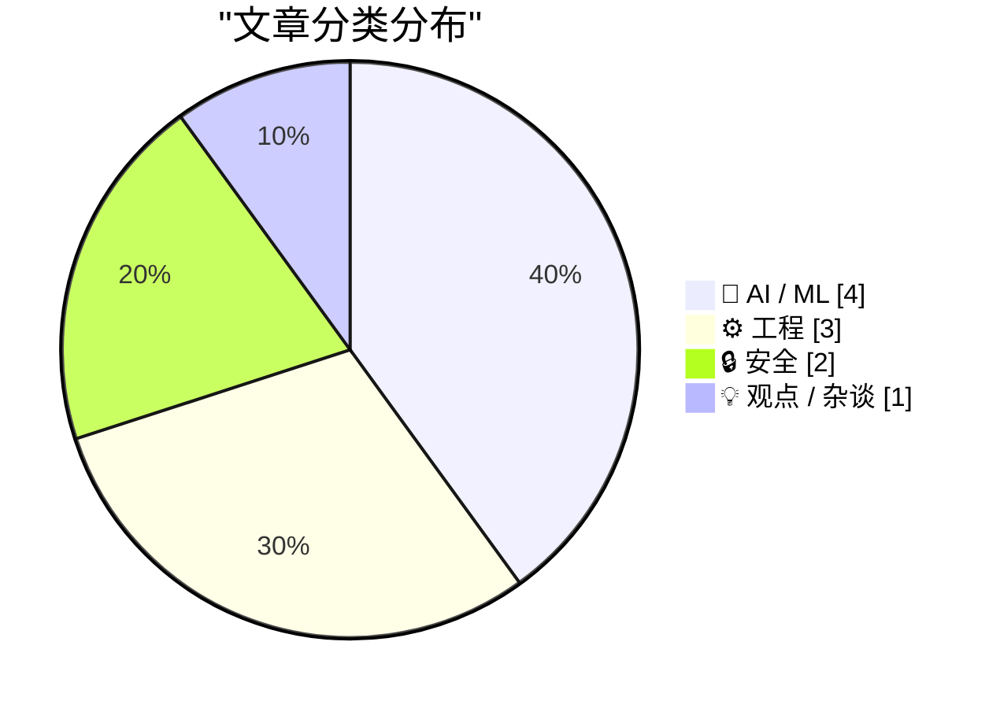
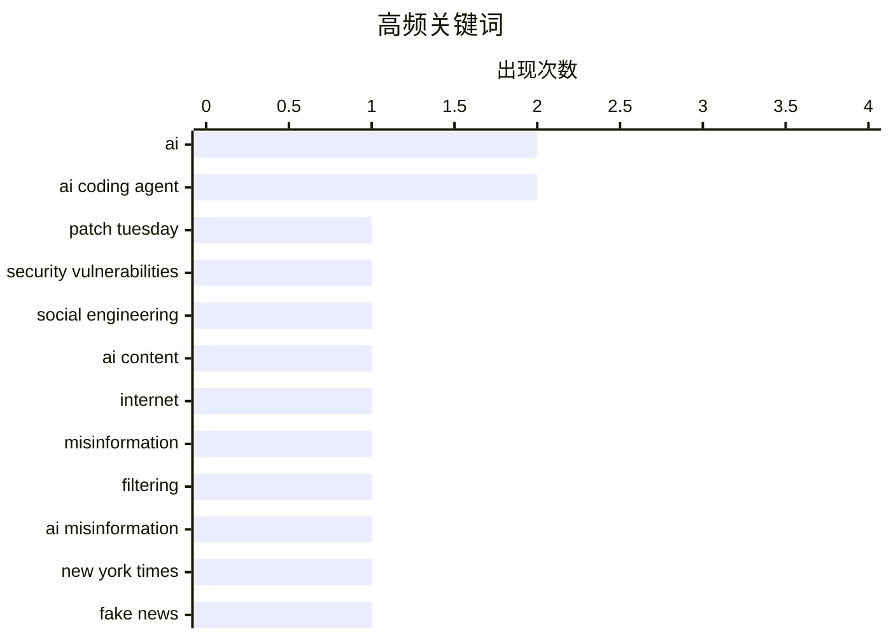

今日技术圈呈现三大趋势：AI安全的双刃剑效应凸显——AI在代码漏洞发现上表现卓越的同时，也因生成虚假引用、扭曲人类写作能力而引发信任危机；AI工程实践进入深水区，ShopierRiver的“教学工坊”模式和Thinking Machines的交互模型，显示行业从单纯追逐模型能力转向关注真实协作与实时交互；与此同时，科技企业正加速战略调整，GitLab因应AI代理时代重组，iOS开放第三方设备接口以应对欧盟监管，硬币的另一面是合规成本与市场压力的同步上升。

<!--more-->


> 来自 Karpathy 推荐的 92 个顶级技术博客，AI 精选 Top 10

## 🏆 今日必读

🥇 **2026年5月补丁星期二：AI在代码安全漏洞发现方面表现优异**

[Patch Tuesday, May 2026 Edition](https://krebsonsecurity.com/2026/05/patch-tuesday-may-2026-edition/) — krebsonsecurity.com · 31 分钟前 · 🔒 安全

> 主流软件厂商（Apple、Google、Microsoft、Mozilla、Oracle）在5月修复了接近创纪录数量的安全漏洞。AI平台虽与社会工程攻击同样脆弱，但在发现人类编写的代码安全漏洞方面表现卓越。各厂商不仅加快补丁发布节奏，还大幅提升了漏洞修复数量。

💡 **为什么值得读**: 安全从业者必读，了解AI驱动的代码审计趋势和当前软件生态的安全现状。

🏷️ Patch Tuesday, security vulnerabilities, AI, social engineering

🥈 **你的AI使用正在摧毁我的大脑**

[Your AI Use Is Breaking My Brain](https://simonwillison.net/2026/May/11/zombie-internet/#atom-everything) — simonwillison.net · 1 天前 · 💡 观点 / 杂谈

> AI写作已无处不在，过滤AI生成内容成为一项精神消耗极大的任务。作者提出「僵尸网络」（Zombie Internet）概念，区别于「死亡网络」（仅机器人对话），它涵盖人机混合交互、人指挥AI代理互动等多种形态。更令人担忧的是，AI正在扭曲正常人类的写作风格。

💡 **为什么值得读**: 对AI影响网络内容生态有担忧的读者必读，深刻揭示人机混合时代的互联网变革。

🏷️ AI content, internet, misinformation, filtering

🥉 **纽约时报编辑说明：AI生成的虚假引用**

[Quoting New York Times Editors’ Note](https://simonwillison.net/2026/May/10/new-york-times-editors-note/#atom-everything) — simonwillison.net · 1 天前 · 🔒 安全

> 纽约时报撤回并更正了一篇关于加拿大选举的文章，原因是AI工具将Pierre Poilievre的政治观点生成了虚假引用。记者未核实AI返回内容的准确性，导致报道失实。记者现引用了Poilievre四月的实际演讲内容。

💡 **为什么值得读**: 新闻从业者和AI用户必读，了解AI幻觉对新闻报道的真实危害。

🏷️ AI misinformation, New York Times, fake news

---

## 📊 数据概览

| 扫描源 | 抓取文章 | 时间范围 | 精选 |
|:---:|:---:|:---:|:---:|
| 88/92 | 2528 篇 → 47 篇 | 48h | **10 篇** |

### 分类分布



### 高频关键词



<details>
<summary>📈 纯文本关键词图（终端友好）</summary>

```
ai                       │ ████████████████████ 2
ai coding agent          │ ████████████████████ 2
patch tuesday            │ ██████████░░░░░░░░░░ 1
security vulnerabilities │ ██████████░░░░░░░░░░ 1
social engineering       │ ██████████░░░░░░░░░░ 1
ai content               │ ██████████░░░░░░░░░░ 1
internet                 │ ██████████░░░░░░░░░░ 1
misinformation           │ ██████████░░░░░░░░░░ 1
filtering                │ ██████████░░░░░░░░░░ 1
ai misinformation        │ ██████████░░░░░░░░░░ 1
```

</details>

### 🏷️ 话题标签

**ai**(2) · **ai coding agent**(2) · **patch tuesday**(1) · security vulnerabilities(1) · social engineering(1) · ai content(1) · internet(1) · misinformation(1) · filtering(1) · ai misinformation(1) · new york times(1) · fake news(1) · gitlab(1) · workforce reduction(1) · agentic era(1) · maintenance costs(1) · software development(1) · shopify(1) · river(1) · internal tool(1)

---

## 🤖 AI / ML

### 1. 你需要能降低维护成本的AI

[Quoting James Shore](https://simonwillison.net/2026/May/11/james-shore/#atom-everything) — **simonwillison.net** · 1 天前 · ⭐ 23/30

> AI编码工具必须降低代码维护成本，而非仅仅提升开发速度。如果产出翻倍但维护成本也翻倍，总体成本实际增加了4倍。开发者用临时速度提升换取的是永久的维护负担，数学逻辑要求LLM将维护成本降低到与代码产出增加成反比的比例。

🏷️ AI coding agent, maintenance costs, software development

---

### 2. 车间学习

[Learning on the Shop floor](https://simonwillison.net/2026/May/11/learning-on-the-shop-floor/#atom-everything) — **simonwillison.net** · 1 天前 · ⭐ 23/30

> Shopify内部AI编码工具River完全在公共Slack频道中运行，任何人可围观、参与和学习。River拒绝私信，要求在公开频道协作。Tobias Lütke称这种模式为「Lehrwerkstatt」（教学工坊），整个车间都是教室，学习者通过接近实际工作来学习。

🏷️ Shopify, River, AI coding agent, internal tool

---

### 3. Thinking Machines与交互模型

[Thinking Machines and interaction models](https://seangoedecke.com/interaction-models/) — **seangoedecke.com** · 22 小时前 · ⭐ 23/30

> Thinking Machines发布首个交互模型产品，耗时一年、投入20亿美元非前沿模型，不与OpenAI、Anthropic竞争。全双工语音模型实现真正的实时对话，支持随时打断。交互模型在某些方面代表真正的技术进步，解决了大模型实时的交互延迟问题。

🏷️ Thinking Machines, Interaction Models, AI model

---

### 4. 数据中心都在哪里？

[Where Are All The Data Centers?](https://www.wheresyoured.at/where-are-all-the-data-centers/) — **wheresyoured.at** · 6 小时前 · ⭐ 23/30

> 文章探讨AI基础设施中数据中心的现状，涉及NVIDIA、Anthropic和OpenAI的计算资源布局。订阅费每周5,000-18,000字，包含深度分析。

🏷️ data centers, AI infrastructure, NVIDIA

---

## ⚙️ 工程

### 5. GitLab的裁员与战略决策

[Thoughts on GitLab's workforce reduction" and "structural and strategic decisions"](https://simonwillison.net/2026/May/11/gitlab-act-2/#atom-everything) — **simonwillison.net** · 22 小时前 · ⭐ 23/30

> GitLab宣布进行大规模重组，计划将运营国家数量减少近30%（从约60个国家缩减）。与此同时，公司正调整战略以应对AI代理时代。GitLab曾公开其员工分布在18个国家的薪酬工作流程，但已于2023年停止发布。

🏷️ GitLab, workforce reduction, agentic era, AI

---

### 6. 控制CreateProcess继承句柄的附加说明

[Additional notes on controlling which handles are inherited by Create­Process](https://devblogs.microsoft.com/oldnewthing/20260511-00/?p=112313) — **devblogs.microsoft.com/oldnewthing** · 1 天前 · ⭐ 23/30

> 通过将句柄放入私有容器来实现CreateProcess的句柄继承控制。这是Windows开发中关于进程句柄管理的专业技术文章。

🏷️ Windows, CreateProcess, Win32

---

### 7. iOS 26.5欧盟DMA合规新特性

[New DMA Compliance Features for EU Users in iOS 26.5 (and Perhaps the EU Has Finally Come to Their Senses on Tech Regulation)](https://www.macrumors.com/2026/05/11/ios-26-5-eu-third-party-wearable-changes/) — **daringfireball.net** · 3 小时前 · ⭐ 22/30

> iOS 26.5为符合欧盟数字市场法案，允许第三方可穿戴设备使用更多原局限于Apple Watch/AirPods的功能：邻近配对（earbuds一键配对）、iPhone通知收发（此前第三方只能显示只读通知）。每次仅可转发到一个设备，开启第三方 wearable 会关闭 Apple Watch 通知。

🏷️ iOS 26.5, DMA, Apple, third-party wearables

---

## 🔒 安全

### 8. 2026年5月补丁星期二：AI在代码安全漏洞发现方面表现优异

[Patch Tuesday, May 2026 Edition](https://krebsonsecurity.com/2026/05/patch-tuesday-may-2026-edition/) — **krebsonsecurity.com** · 31 分钟前 · ⭐ 25/30

> 主流软件厂商（Apple、Google、Microsoft、Mozilla、Oracle）在5月修复了接近创纪录数量的安全漏洞。AI平台虽与社会工程攻击同样脆弱，但在发现人类编写的代码安全漏洞方面表现卓越。各厂商不仅加快补丁发布节奏，还大幅提升了漏洞修复数量。

🏷️ Patch Tuesday, security vulnerabilities, AI, social engineering

---

### 9. 纽约时报编辑说明：AI生成的虚假引用

[Quoting New York Times Editors’ Note](https://simonwillison.net/2026/May/10/new-york-times-editors-note/#atom-everything) — **simonwillison.net** · 1 天前 · ⭐ 24/30

> 纽约时报撤回并更正了一篇关于加拿大选举的文章，原因是AI工具将Pierre Poilievre的政治观点生成了虚假引用。记者未核实AI返回内容的准确性，导致报道失实。记者现引用了Poilievre四月的实际演讲内容。

🏷️ AI misinformation, New York Times, fake news

---

## 💡 观点 / 杂谈

### 10. 你的AI使用正在摧毁我的大脑

[Your AI Use Is Breaking My Brain](https://simonwillison.net/2026/May/11/zombie-internet/#atom-everything) — **simonwillison.net** · 1 天前 · ⭐ 24/30

> AI写作已无处不在，过滤AI生成内容成为一项精神消耗极大的任务。作者提出「僵尸网络」（Zombie Internet）概念，区别于「死亡网络」（仅机器人对话），它涵盖人机混合交互、人指挥AI代理互动等多种形态。更令人担忧的是，AI正在扭曲正常人类的写作风格。

🏷️ AI content, internet, misinformation, filtering

---

*生成于 2026-05-13 22:18 | 扫描 88 源 → 获取 2528 篇 → 精选 10 篇*
*基于 [Hacker News Popularity Contest 2025](https://refactoringenglish.com/tools/hn-popularity/) RSS 源列表，由 [Andrej Karpathy](https://x.com/karpathy) 推荐*
*由「懂点儿AI」制作，欢迎关注同名微信公众号获取更多 AI 实用技巧 💡*
