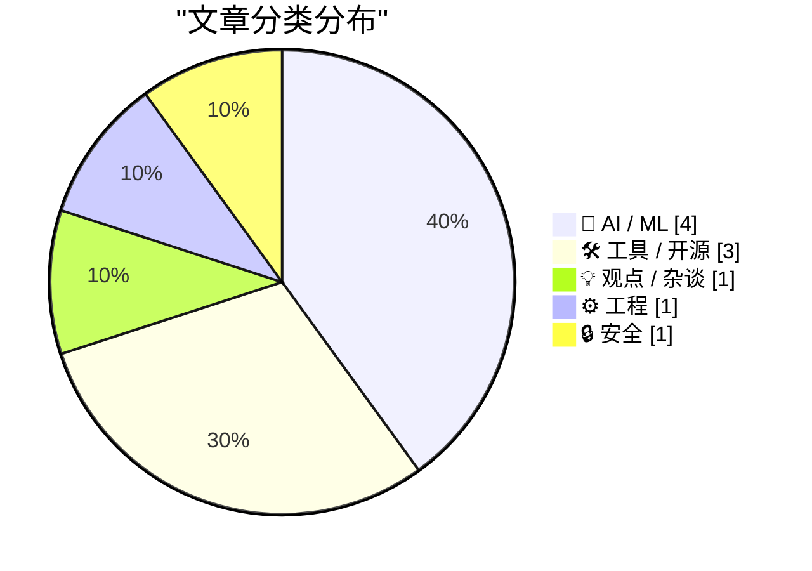
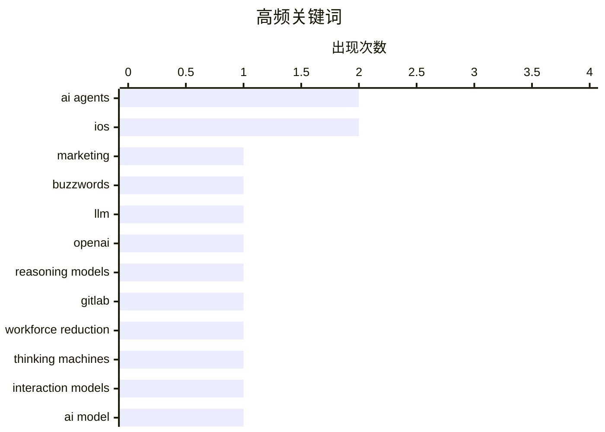

今日技术圈呈现三大趋势：一是AI代理正从概念泡沫走向实际冲击，Boris Mann批判“AI代理”术语被滥用为营销词汇，GitLab已启动大规模组织调整以应对自动化开发带来的变革；二是AI辅助代码审计能力获得突破性验证，五月多家厂商安全漏洞修复数量接近历史纪录；三是数据中心的能源与散热问题催生创新方案，太空数据中心因真空散热优势进入可行性讨论阶段。iOS meanwhile也在推进跨平台加密消息与欧盟DMA合规。

<!--more-->


> 来自 Karpathy 推荐的 92 个顶级技术博客，AI 精选 Top 10

## 🏆 今日必读

🥇 **Boris Mann 论「11个AI代理」并无实质意义**

[Quoting Boris Mann](https://simonwillison.net/2026/May/13/boris-mann/#atom-everything) — simonwillison.net · 6 小时前 · 💡 观点 / 杂谈

> 「11个AI代理」作为一个术语缺乏实际意义。Boris Mann指出，说「我有11个电子表格」或「11个浏览器标签」工作，与声称拥有11个AI代理，本质上传达的是同样的信息量——数量本身并不代表能力或复杂性。这一观点直指当前AI行业中滥用「agent」作为营销buzzword的问题。

💡 **为什么值得读**: 一句话点破AI行业当前最火热概念之一的泡沫本质，值得所有AI从业者思考。

🏷️ AI agents, marketing, buzzwords

🥈 **LLM 0.32a2 发布：支持 OpenAI 推理模型新 API**

[llm 0.32a2](https://simonwillison.net/2026/May/12/llm/#atom-everything) — simonwillison.net · 1 天前 · 🤖 AI / ML

> LLM 0.32a2 版本发布，最重要的更新是支持 OpenAI 推理模型的新 /v1/responses API（而非传统的 /v1/chat/completions）。新API使得GPT-5类模型能在工具调用期间展示交错推理过程。用户运行提示时会看到以不同颜色显示的推理token摘要，也可使用 -R 或 --hide-reasoning 标志隐藏。

💡 **为什么值得读**: 首个支持OpenAI推理模型新API的工具版本，对需要观察模型思维过程的研究者意义重大。

🏷️ llm, openai, reasoning models

🥉 **GitLab Act 2：面向代理时代的组织架构调整与裁员**

[Thoughts on GitLab's workforce reduction" and "structural and strategic decisions"](https://simonwillison.net/2026/May/11/gitlab-act-2/#atom-everything) — simonwillison.net · 1 天前 · ⚙️ 工程

> GitLab发布Act 2公告，宣布进行大规模 workforce reduction 和结构性战略调整以应对AI代理时代。核心措施包括削减约30%员工规模较小的国家数量（目前在近60个国家运营但仅18个有员工名录）。作为全员远程办公的标杆企业，GitLab此次调整反映了AI时代软件开发组织面对自动化冲击的主动求变。

💡 **为什么值得读**: GitLab作为全球最大全远程办公企业的战略转向，对科技行业的组织调整具有风向标意义。

🏷️ gitlab, workforce reduction, AI agents

---

## 📊 数据概览

| 扫描源 | 抓取文章 | 时间范围 | 精选 |
|:---:|:---:|:---:|:---:|
| 88/92 | 2529 篇 → 43 篇 | 48h | **10 篇** |

### 分类分布



### 高频关键词



<details>
<summary>📈 纯文本关键词图（终端友好）</summary>

```
ai agents           │ ████████████████████ 2
ios                 │ ████████████████████ 2
marketing           │ ██████████░░░░░░░░░░ 1
buzzwords           │ ██████████░░░░░░░░░░ 1
llm                 │ ██████████░░░░░░░░░░ 1
openai              │ ██████████░░░░░░░░░░ 1
reasoning models    │ ██████████░░░░░░░░░░ 1
gitlab              │ ██████████░░░░░░░░░░ 1
workforce reduction │ ██████████░░░░░░░░░░ 1
thinking machines   │ ██████████░░░░░░░░░░ 1
```

</details>

### 🏷️ 话题标签

**ai agents**(2) · **ios**(2) · **marketing**(1) · buzzwords(1) · llm(1) · openai(1) · reasoning models(1) · gitlab(1) · workforce reduction(1) · thinking machines(1) · interaction models(1) · ai model(1) · ai(1) · security vulnerability(1) · patching(1) · dma(1) · third-party wearables(1) · rcs(1) · end-to-end encryption(1) · data centers(1)

---

## 🤖 AI / ML

### 1. LLM 0.32a2 发布：支持 OpenAI 推理模型新 API

[llm 0.32a2](https://simonwillison.net/2026/May/12/llm/#atom-everything) — **simonwillison.net** · 1 天前 · ⭐ 24/30

> LLM 0.32a2 版本发布，最重要的更新是支持 OpenAI 推理模型的新 /v1/responses API（而非传统的 /v1/chat/completions）。新API使得GPT-5类模型能在工具调用期间展示交错推理过程。用户运行提示时会看到以不同颜色显示的推理token摘要，也可使用 -R 或 --hide-reasoning 标志隐藏。

🏷️ llm, openai, reasoning models

---

### 2. Thinking Machines 交互模型评析

[Thinking Machines and interaction models](https://seangoedecke.com/interaction-models/) — **seangoedecke.com** · 1 天前 · ⭐ 24/30

> Thinking Machines发布首个AI模型产品「Interaction Models」，历时一年、投入20亿美元。核心创新是全双工语音模式（Full-duplex voice），解决ChatGPT音频模式中用户说话后模型响应的巨大延迟问题。该模型定位为非前沿模型，不与OpenAI/Anthropic/Google竞争，而是聚焦实时交互这一细分场景。评测显示部分技术为创新，部分存在争议的benchmark优化，存在真正进步也有营销成分。

🏷️ Thinking Machines, interaction models, AI model

---

### 3. 数据中心的去向

[Where Are All The Data Centers?](https://www.wheresyoured.at/where-are-all-the-data-centers/) — **wheresyoured.at** · 1 天前 · ⭐ 24/30

> 文章探讨当前AI数据中心建设热潮背后的选址与能源问题，分析为何传统数据中心选址面临挑战，以及为何科技巨头开始探索Space-based data center等创新方案。

🏷️ data centers, NVIDIA, AI infrastructure

---

### 4. 太空AI数据中心没有散热问题

[AI datacenters in space do not have a cooling problem](https://seangoedecke.com/space-ai-datacenters-do-not-have-a-cooling-problem/) — **seangoedecke.com** · 22 小时前 · ⭐ 23/30

> 分析SpaceX计划在太空建设AI数据中心的可行性。针对「AI数据中心不能建在太空，因为散热困难」的常见反驳，作者指出这过于简单——如同「数据中心不需要水冷」一样，如果事实一目了然就不会有争议。文章从热力学角度分析太空散热的独特优势（真空环境对流散热vs地球上的水冷系统），以及面临的真正挑战（发射成本、可靠性、维护），认为太空数据中心在技术层面确实可行且有独特优势。

🏷️ AI datacenter, space, cooling

---

## 🛠 工具 / 开源

### 5. iOS 26.5 为欧盟用户推出新 DMA 合规功能

[New DMA Compliance Features for EU Users in iOS 26.5 (and Perhaps the EU Has Finally Come to Their Senses on Tech Regulation)](https://www.macrumors.com/2026/05/11/ios-26-5-eu-third-party-wearable-changes/) — **daringfireball.net** · 1 天前 · ⭐ 24/30

> iOS 26.5为符合欧盟数字市场法案（DMA），向第三方可穿戴设备开放原本仅限Apple Watch/AirPods的功能： proximity pairing（近场配对）允许第三方耳塞一键配对流程与AirPods相同；iPhone通知可转发至单一第三方设备（智能手表等），但开启后Apple Watch通知自动失效。

🏷️ iOS, DMA, third-party wearables

---

### 6. iOS 26.5 测试版推出端到端加密 RCS 消息

[iOS 26.5 Includes Beta Support for End-to-End Encrypted RCS Messaging](https://www.apple.com/newsroom/2026/05/end-to-end-encrypted-rcs-messaging-begins-rolling-out-today-in-beta/) — **daringfireball.net** · 1 天前 · ⭐ 24/30

> iOS 26.5测试版为iPhone用户和Google Messages用户（Android）推出端到端加密（E2EE）RCS消息功能。加密默认开启，对话中显示新锁图标表示加密状态。但E2EE依赖双方运营商和设备软件支持，当前列表仍不包含Google Fi。用户需查看聊天元数据才能确认是否加密。

🏷️ RCS, end-to-end encryption, iOS

---

### 7. Datasette 1.0a29 发布

[datasette 1.0a29](https://simonwillison.net/2026/May/12/datasette/#atom-everything) — **simonwillison.net** · 22 小时前 · ⭐ 23/30

> Datasette 1.0a29版本发布，主要更新：新增TokenRestrictions.abbreviated()工具方法用于创建「_r」权限字典；空表也能显示表头和列选项；修复Mobile Safari上列操作对话框显示bug；修复Datasette.close()与Database.close()竞态导致测试崩溃的segfault问题。

🏷️ datasette, python, release

---

## 💡 观点 / 杂谈

### 8. Boris Mann 论「11个AI代理」并无实质意义

[Quoting Boris Mann](https://simonwillison.net/2026/May/13/boris-mann/#atom-everything) — **simonwillison.net** · 6 小时前 · ⭐ 24/30

> 「11个AI代理」作为一个术语缺乏实际意义。Boris Mann指出，说「我有11个电子表格」或「11个浏览器标签」工作，与声称拥有11个AI代理，本质上传达的是同样的信息量——数量本身并不代表能力或复杂性。这一观点直指当前AI行业中滥用「agent」作为营销buzzword的问题。

🏷️ AI agents, marketing, buzzwords

---

## ⚙️ 工程

### 9. GitLab Act 2：面向代理时代的组织架构调整与裁员

[Thoughts on GitLab's workforce reduction" and "structural and strategic decisions"](https://simonwillison.net/2026/May/11/gitlab-act-2/#atom-everything) — **simonwillison.net** · 1 天前 · ⭐ 24/30

> GitLab发布Act 2公告，宣布进行大规模 workforce reduction 和结构性战略调整以应对AI代理时代。核心措施包括削减约30%员工规模较小的国家数量（目前在近60个国家运营但仅18个有员工名录）。作为全员远程办公的标杆企业，GitLab此次调整反映了AI时代软件开发组织面对自动化冲击的主动求变。

🏷️ gitlab, workforce reduction, AI agents

---

## 🔒 安全

### 10. 2026年5月补丁Tuesday安全更新

[Patch Tuesday, May 2026 Edition](https://krebsonsecurity.com/2026/05/patch-tuesday-may-2026-edition/) — **krebsonsecurity.com** · 1 天前 · ⭐ 24/30

> 2026年5月安全更新：AI平台在社会工程学方面与人类同样脆弱，但在发现人类编写的代码安全漏洞方面表现优异。本月多家主流厂商（Apple、Google、Microsoft、Mozilla、Oracle）修复的安全漏洞数量接近历史纪录，或加快了补丁发布节奏。AI辅助代码审计正在成为安全领域的重要力量。

🏷️ AI, security vulnerability, patching

---

*生成于 2026-05-14 22:18 | 扫描 88 源 → 获取 2529 篇 → 精选 10 篇*
*基于 [Hacker News Popularity Contest 2025](https://refactoringenglish.com/tools/hn-popularity/) RSS 源列表，由 [Andrej Karpathy](https://x.com/karpathy) 推荐*
*由「懂点儿AI」制作，欢迎关注同名微信公众号获取更多 AI 实用技巧 💡*
