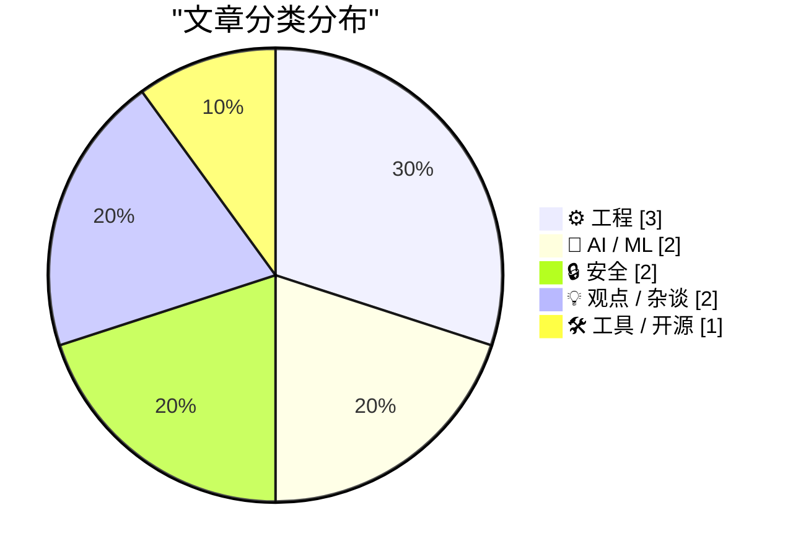
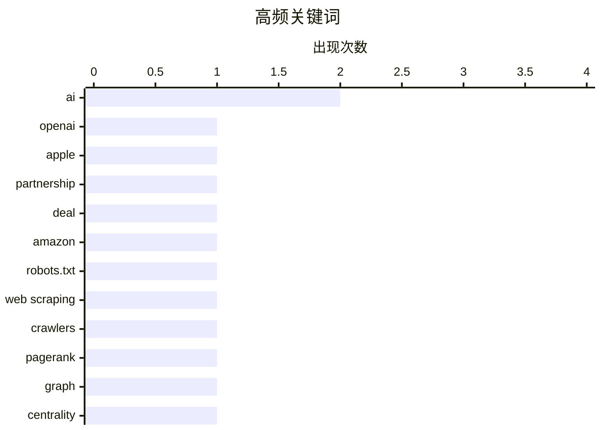

今日技术圈关注三大趋势：AI领域出现合作摩擦，OpenAI与苹果的整合承诺未能兑现或引发法律纠纷，同时Cory Doctorow等从业者开始通过无DRM方式挑战AI版权既有秩序；安全层面传来正面信号，Amazonbot终于尊重robots.txt协议，Have I Been Pwned服务也扩展至巴哈马政府，体现数据泄露监控体系的逐步完善；工程实践领域回归基础认知，业界呼吁不应将PageRank中心性等同于系统活力，并涌现出常数空间线性时间等精巧算法方案，显示出技术社区对过度依赖单一指标的反思。

<!--more-->


> 来自 Karpathy 推荐的 92 个顶级技术博客，AI 精选 Top 10

## 🏆 今日必读

🥇 **Gurman报道OpenAI对苹果合作不满意**

[Gurman Reports that OpenAI Is Unhappy With Apple Deal](https://www.bloomberg.com/news/articles/2026-05-14/openai-apple-partnership-frays-setting-up-possible-legal-fight?srnd=undefined&amp;embedded-checkout=true) — daringfireball.net · 3 小时前 · 🤖 AI / ML

> OpenAI与苹果的合作关系出现裂痕，OpenAI聘请外部律所准备对苹果采取法律行动，可能包括发送违约通知而非直接起诉。OpenAI原本预计将ChatGPT整合到苹果软件后会吸引更多用户订阅，并希望在更多苹果应用中获得深度集成和Siri的优先展示位置。苹果方面同样期望获得更深的整合但目前也未完全实现。文章指出OpenAI可能主张的合同违约具体理由在报道中并未明确说明。

💡 **为什么值得读**: 如果你是科技行业从业者或关注AI大厂动态，这篇报道揭示了OpenAI与苹果合作的现状及潜在法律纠纷，是了解科技巨头间合作问题的窗口。

🏷️ OpenAI, Apple, partnership, deal

🥈 **感谢Amazonbot终于尊重robots.txt**

[Amazonbot is finally respecting robots.txt](https://xeiaso.net/notes/2026/amazonbot-respecting-robots-txt/) — xeiaso.net · 22 小时前 · 🔒 安全

> 博主对Amazonbot终于开始尊重robots.txt表示感激，认为这为一个可行的商业模式提供了可能性。文章极为简短，仅传达了谢意。

💡 **为什么值得读**: 简短但记录了搜索引擎爬虫行为的重要转变，对关注SEO和爬虫伦理的人有参考价值。

🏷️ Amazon, robots.txt, web scraping, crawlers

🥉 **中心性不是活力**

[Centrality is not vitality](https://nesbitt.io/2026/05/14/centrality-is-not-vitality.html) — nesbitt.io · 12 小时前 · ⚙️ 工程

> 作者呼吁不要自动依赖PageRank作为依赖图的唯一重要指标，指出中心性（centrality）只是评估节点重要性的一个维度，不能等同于系统的活力（vitality）或整体健康度。

💡 **为什么值得读**: 对需要理解网络分析、依赖图或推荐系统的技术人员有帮助，能避免过度依赖单一指标。

🏷️ PageRank, graph, centrality, dependencies

---

## 📊 数据概览

| 扫描源 | 抓取文章 | 时间范围 | 精选 |
|:---:|:---:|:---:|:---:|
| 88/92 | 2531 篇 → 39 篇 | 48h | **10 篇** |

### 分类分布



### 高频关键词



<details>
<summary>📈 纯文本关键词图（终端友好）</summary>

```
ai           │ ████████████████████ 2
openai       │ ██████████░░░░░░░░░░ 1
apple        │ ██████████░░░░░░░░░░ 1
partnership  │ ██████████░░░░░░░░░░ 1
deal         │ ██████████░░░░░░░░░░ 1
amazon       │ ██████████░░░░░░░░░░ 1
robots.txt   │ ██████████░░░░░░░░░░ 1
web scraping │ ██████████░░░░░░░░░░ 1
crawlers     │ ██████████░░░░░░░░░░ 1
pagerank     │ ██████████░░░░░░░░░░ 1
```

</details>

### 🏷️ 话题标签

**ai**(2) · **openai**(1) · **apple**(1) · partnership(1) · deal(1) · amazon(1) · robots.txt(1) · web scraping(1) · crawlers(1) · pagerank(1) · graph(1) · centrality(1) · dependencies(1) · benchmark(1) · python(1) · ecosystem(1) · open source(1) · criticism(1) · opinion(1) · book(1)

---

## ⚙️ 工程

### 1. 中心性不是活力

[Centrality is not vitality](https://nesbitt.io/2026/05/14/centrality-is-not-vitality.html) — **nesbitt.io** · 12 小时前 · ⭐ 22/30

> 作者呼吁不要自动依赖PageRank作为依赖图的唯一重要指标，指出中心性（centrality）只是评估节点重要性的一个维度，不能等同于系统的活力（vitality）或整体健康度。

🏷️ PageRank, graph, centrality, dependencies

---

### 2. 常数值空间线性时间算法：删除目录中除最近10个文件外的所有文件

[A constant-space linear-time algorithm for deleting all but the 10 most recent files in a directory](https://devblogs.microsoft.com/oldnewthing/20260514-00/?p=112322) — **devblogs.microsoft.com/oldnewthing** · 8 小时前 · ⭐ 21/30

> 作者提出一个在常量空间和线性时间内删除目录中除最近N个文件外所有文件的算法。该方案只需维护10个指针，遍历时通过翻转链表方向即可实现，核心在于利用已有的数据结构知识。

🏷️ algorithm, filesystem, efficiency, data structures

---

### 3. 抓住主分支上的不稳定性测试

[Catch Flakes On Main](https://matklad.github.io/2026/05/14/catch-flakes-on-main.html) — **matklad.github.io** · 22 小时前 · ⭐ 21/30

> 文章极为简短，标题为"抓住主分支上的不稳定性测试"，内容不完整，无法提取有意义的信息。

🏷️ testing, CI, flakes, automation

---

## 🤖 AI / ML

### 4. Gurman报道OpenAI对苹果合作不满意

[Gurman Reports that OpenAI Is Unhappy With Apple Deal](https://www.bloomberg.com/news/articles/2026-05-14/openai-apple-partnership-frays-setting-up-possible-legal-fight?srnd=undefined&amp;embedded-checkout=true) — **daringfireball.net** · 3 小时前 · ⭐ 23/30

> OpenAI与苹果的合作关系出现裂痕，OpenAI聘请外部律所准备对苹果采取法律行动，可能包括发送违约通知而非直接起诉。OpenAI原本预计将ChatGPT整合到苹果软件后会吸引更多用户订阅，并希望在更多苹果应用中获得深度集成和Siri的优先展示位置。苹果方面同样期望获得更深的整合但目前也未完全实现。文章指出OpenAI可能主张的合同违约具体理由在报道中并未明确说明。

🏷️ OpenAI, Apple, partnership, deal

---

### 5. 启动《逆半人马的生活指南：AI之后的人生》

[Pluralistic: Kickstarting "The Reverse Centaur's Guide to Life After AI" (14 May 2026)](https://pluralistic.net/2026/05/14/who-it-does-it-for/) — **pluralistic.net** · 11 小时前 · ⭐ 21/30

> 作者Cory Doctorow宣布新书《逆半人马的生活指南：AI之后的人生》将在约一个月后出版，将通过Kickstarter进行预售，涵盖有声书、电子书和印刷版。亚马逊的有声书平台再次拒绝上架该书，因此作者选择 DRM-free 方式直接销售，以此证明无数字版权管理不仅是接触读者的正确方式，也是最佳方式。

🏷️ AI, criticism, opinion, book

---

## 🔒 安全

### 6. 感谢Amazonbot终于尊重robots.txt

[Amazonbot is finally respecting robots.txt](https://xeiaso.net/notes/2026/amazonbot-respecting-robots-txt/) — **xeiaso.net** · 22 小时前 · ⭐ 23/30

> 博主对Amazonbot终于开始尊重robots.txt表示感激，认为这为一个可行的商业模式提供了可能性。文章极为简短，仅传达了谢意。

🏷️ Amazon, robots.txt, web scraping, crawlers

---

### 7. 欢迎巴哈马政府加入Have I Been Pwned

[Welcoming the Bahamian Government to Have I Been Pwned](https://www.troyhunt.com/welcoming-the-bahamian-government-to-have-i-been-pwned/) — **troyhunt.com** · 18 小时前 · ⭐ 21/30

> Troy Hunt宣布欢迎巴哈马政府加入Have I Been Pwned的免费政府服务，巴哈马国家计算机事件响应团队（CIRT-BS）现可监控政府域名是否出现于数据泄露事件中。这是HIBP接入的第44个政府。

🏷️ Have I Been Pwned, government, data breach

---

## 💡 观点 / 杂谈

### 8. 富豪的自我中心、独裁的自我中心、AI与法西斯范式

[Pluralistic: Billionaire solipsism, dictator solipsism, AI, and the fascist paradigm (13 May 2026)](https://pluralistic.net/2026/05/13/vibe-governance/) — **pluralistic.net** · 1 天前 · ⭐ 21/30

> 作者Cory Doctorow论述权力与自我中心的关系：权力越大对他人的掌控越强，他们在你眼中就越不真实，变得更像统计数字和达成目的的工具。作者引用《碟形世界》中 Granny Weatherwax 的观点称这是万恶之源——将人视为达到目的的手段而非目的本身。

🏷️ AI, fascism, society, technology

---

### 9. 第一次民主科技联盟大会

[The First Democratic Tech Alliance Assembly](https://berthub.eu/articles/posts/democratic-tech-alliance-may-2026/) — **berthub.eu** · 8 小时前 · ⭐ 21/30

> 作者参加了在欧盟议会举行的民主科技联盟（DTA）首次大会。联盟成员包括欧洲多个政治团体如绿党/自由联盟、复兴欧洲（自由派/中间偏右）、欧洲人民党（基督教民主派、保守派和自由保守派）以及社会党民主党进步联盟。作者认为这是一个广泛、相当理智且令人印象深刻的政治团体集合，带来了一些希望。

🏷️ Democratic Tech Alliance, European Parliament, tech policy

---

## 🛠 工具 / 开源

### 10. 展示我们的工作

[Showing Our Work](https://nesbitt.io/2026/05/13/showing-our-work.html) — **nesbitt.io** · 1 天前 · ⭐ 22/30

> 这是一篇关于ecosyste.ms Python基金的独立基准测试报告。文章内容不完整，标题意为"展示我们的工作"。

🏷️ benchmark, Python, ecosystem, open source

---

*生成于 2026-05-15 22:18 | 扫描 88 源 → 获取 2531 篇 → 精选 10 篇*
*基于 [Hacker News Popularity Contest 2025](https://refactoringenglish.com/tools/hn-popularity/) RSS 源列表，由 [Andrej Karpathy](https://x.com/karpathy) 推荐*
*由「懂点儿AI」制作，欢迎关注同名微信公众号获取更多 AI 实用技巧 💡*
